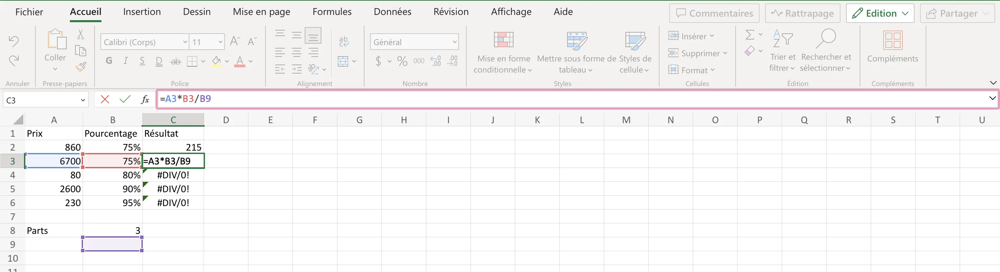
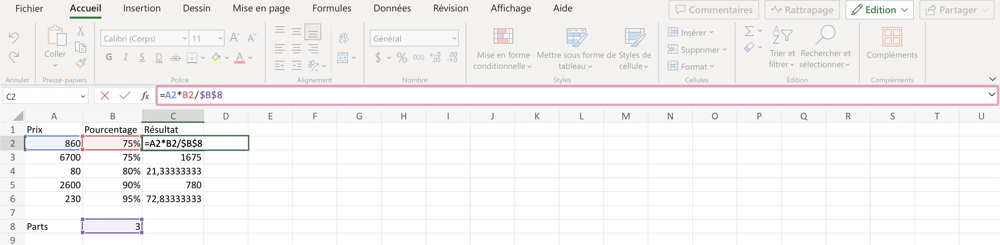
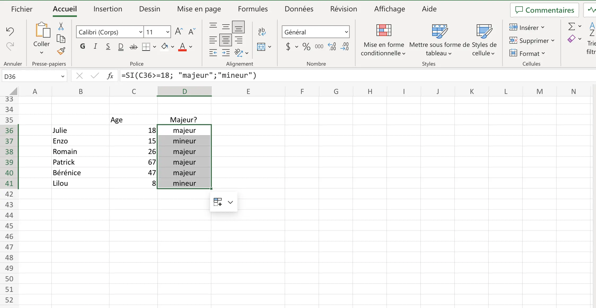
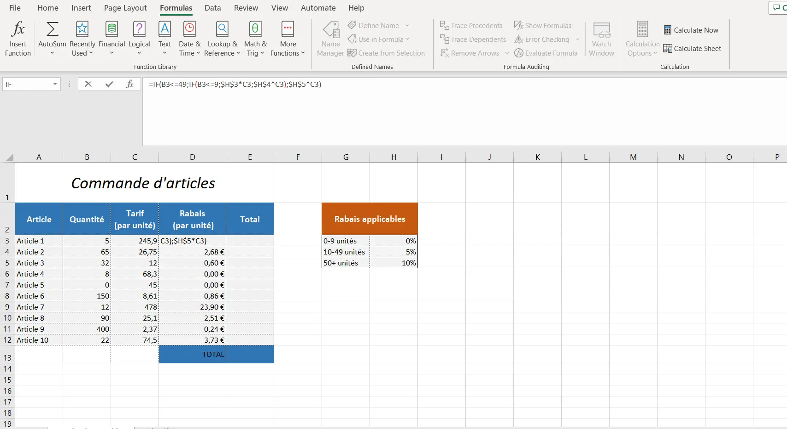
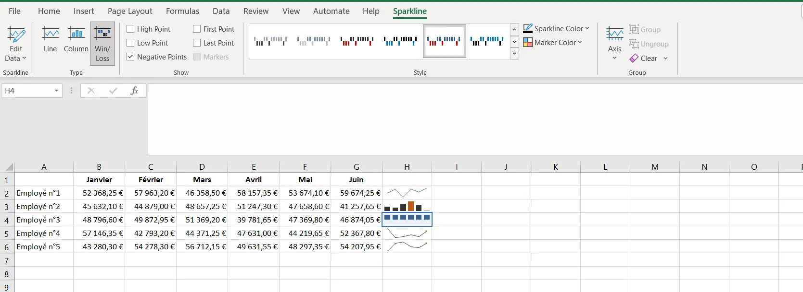
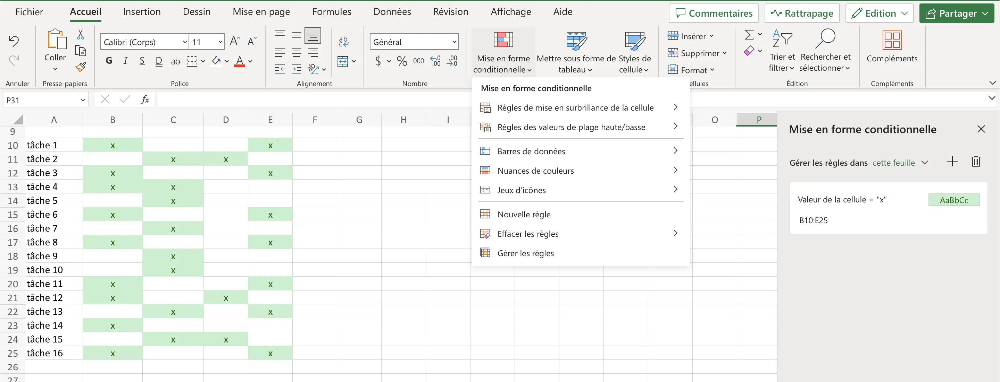
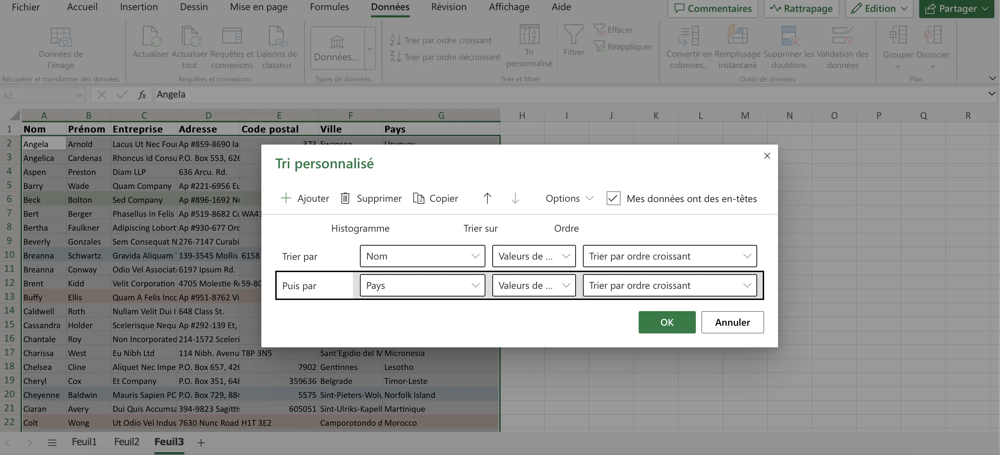
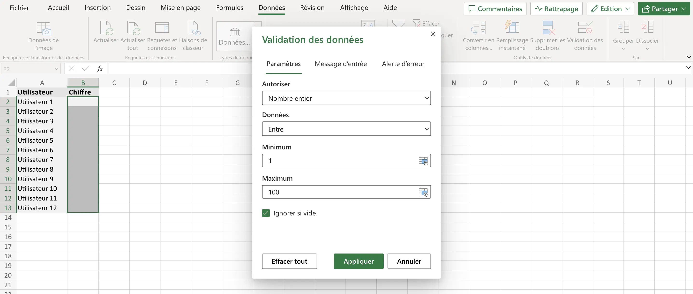
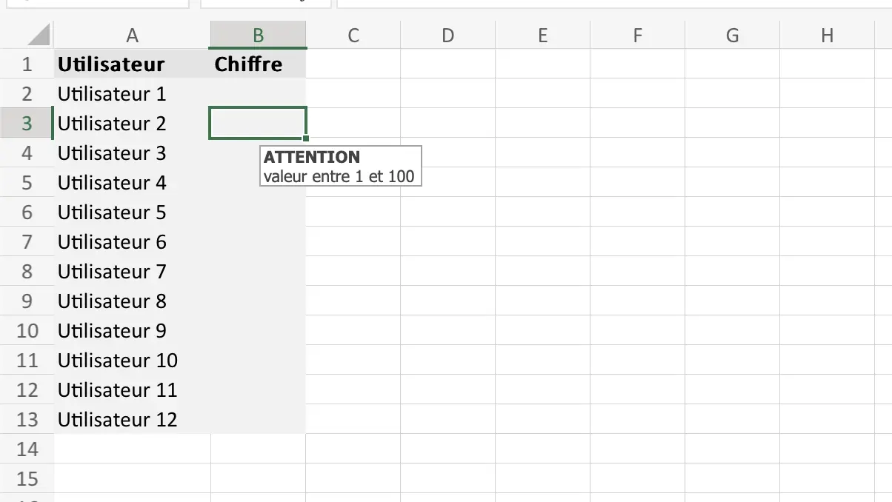

  


Mes objectifs pour ce deuxième MON sont de (re)découvrir les bases d'excel. En effet, lors de mes derniers stages, j'ai été amenée a utiliser excel mais je me suis souvent retrouvée en difficulté dans la manipulation des données. C'est pourquoi je repars du début afin d'être capable de les maîtriser convenablement et d'en apprendre d'avantage dans le cadre d'un futur stage en entreprise. Je souhaiterai également poursuivre avec l'apprentissage du VBA.

### Méthodologie

Pour recommencer une formation sur excel a partir de zéro, j'ai suivi le cours excel sur excel-pratique.com. Le cours Excel se divise en 11 parties synthétiques :

1. Les bases
2. Les tableaux
3. Les formats
4. Insertions d'objets
5. Recopie incrémentée
6. Formules et fonctions
7. Les graphiques
8. Mise en forme conditionnelle
9. Tri et filtres
10. Validations de données
11. Tableau croisé dynamique

J'ai réalisé les exercices proposés tout au long de la formation puis les exercices proposés par un membre de ma famille, cadre dans une grande entreprise.

### Chapitres 1 à 7 - revoir les bases

Dans cette première partie, j'ai revu les bases d'excel que je connaissais mais qui avait besoin d'être étudiées à nouveau. Pour cela, je vais simplement faire une fiche méthode à utiliser la prochaine fois que j'aurai besoin d'excel. La formation sur excel.pratique.com étant très synthétique, je vais juste énumérer les points importants pour moi.

- L'utilisation du `$` permet de fixer une cellule/colonne/ligne lorsque nous utilisons des formules, par exemple :
  
  Dans cette exemple, on divise par la valeur **3**, qui apparaît dans la cellule **B8**. Seulement on veut pouvoir diviser à chaque fois par cette **même valeur** de cellule **B8** lors de la recopie. Corrigeons:
  
  Pour cela; le premier `$` de `$B$8` fixe la **colonne** lors de la recopie et le second `$` fixe la **ligne**. Ici, on aurait pu simplement fixer la ligne
- L'opérarteur **<>** signifie est **différent de**
- L'opérateur **<=** signifie est **inférieur ou égal à**
- L'opérateur **>=** signifie est **supérieur ou égal à**


N'ayant pas la version payante d'excel sur mon ordinateur, une partie de la formation a été réalisée sur un autre ordinateur avec excel en anglais (utile pour avoir le vocabulaire en anglais également).


#### Les formules SI, ET, OU

- La **fonction SI** ou **IF** en anglais : **=SI(test logique, valeur si vrai, valeur si faux)**
  Elle permet de retourner une valeur ou une autre en fonction d'une condition et nécessite 3 arguments.
  Prenons l'exemple suivant, dans lequel on se demande si les personnes sont majeures selon leur âge :
  
  Il suffit de rentrer dans la cellule D36: **=SI(C36>=18 (qui explique la condition); "majeur";"mineur")** et de faire une recopie sur les cellules souhaitées.
  Si on essaye dans un cas plus complexe, comme dans cet exercice proposé par la formation:
  

  Ici, on souhaite calculer dans la cellule **D3** la valeur du _rabais_ en fonction de la _quantité d'article_. Pour cela il faut **imbriquer** une fonction SI dans une autre.
  Dans ce cas, on demande d'abort si la quantité est inférieure à 50:

  1. Si **Vrai** alors on demande si elle est inférieur à 10:
     1. Si **vrai** on renvoie le prix **C3** multiplié par le rabais **H3** sans oublier de fixer **H3** avec des '$'.
     2. Si **Faux** on revoie le prix **C3** multiplié par le rabais **H4** sans oublier de fixer **H3** avec des '$'
  2. Si **Faux** on revoie le prix **C3** multiplié par le rabais **H5** sans oublier de fixer **H3** avec des '$'
     Cela donne la formule suivante, non unique:
     

- Les **fonctions ET** et **OU**
  1. La fonction ET renvoie VRAI si **tous** les tests sont VRAI: **=ET(test_1; test_2; ...)**
  2. La fonction OU renvoie VRAI si **au moins** un des tests est VRAI : **=OU(test_1; test_2; ...)**

#### Les graphiques Sparkline

Le **graphique sparkline** (non disponible sur la version en ligne) est un graphique miniature qui apparaît directement dans une cellule et apporte une représentation visuelle des données d'une ligne (ou d'une colonne) sous forme de graphique.
Pour l'insérer il suffit de faire :

**insertion > graphique sparkline > choisir** entre _courbe_, _histogramme_ et _conclusion et perte_ **> choisir la ligne ou colonne de données à utiliser > recopie possible > personnalisation possible.**
Cela donne par exemple:

### Chapitres 8 à 11 - Apprendre

Dans cette deuxième partie de formation, j'ai simplement appris à utiliser des fonctionnalités basiques d'excel que je ne connaissais pas. J'ai ici réalisé une nouvelle fiche méthode encore plus synthétique que la formation suivie, qui me sera probablement utile plus tard.

#### La mise en forme conditionnelle

La mise en forme conditionnelle (ou MFC) est une mise en forme qui s'applique aux cellules sous condition et permet de modifier :

- Couleur de fond des cellules
- Mise en forme du texte
- Bordures
- Format des données

L'outil de MFC ést assez intuitif, pour appliquer une MFC à un fichier excel, il faut :
**sélectionner la plage de cellules contenant les données > accueil > Mise en forme conditionnelle**
On pourra ensuite faire:

- règle de mise en surbrillance > supérieur à > remplissage vert avec texte vert foncé
- créer nouvelle règle > Valeur de la cellule égale à ="x" > remplissage vert avec texte vert foncé

Cela donne le résultat suivant :

Pour gérer/modifier les MFC ajoutées il faut :

**Mise en forme conditionnelle > gérer mes règles** - comme c'est affiché sur la photo ci-dessus.
Le gestionnaire affiché à droite permet de :

- Ajouter/supprimer de nouvelles règles
- Changer l'ordre des règles
- Modifier la plage de cellules et la mise en forme de chaque règle

Il existe également des MFC **prêtes à l'emploi** dans ce même menu déroulant:

- Barres de données
- Nuances de données
- Jeux d'icônes

#### Tri, filtres et validations de données

La fonctionnalité **Trier** permet de **trier** une plage de cellules par ordre alphabétique, par valeur, etc. Cette fonctionnalité se trouve dans l'onglet **données**

- Le tri _"AZ"_ réalisera un tri rapide par ordre alphabétique croissant
- Un tri en fonction de plusieurs colonnes ou d'une colonne qui n'est pas forcément la première se fera par de la manière : **sélectionner la plage de cellule à trier > tri personnalisé > remplir** la fenêtre qui s'affiche.

Il est également possible d'ajouter des niveaux de tri à partir de cette fenêtre, par exemple :

La fonctionnalité **filtrer des données** permet **d'afficher** les données en fonction d'un ou de plusieurs critères, pour cela il faut : **onglet données > filtre > remplir** la fenêtre qui s'affiche.

La fonctionnalité **validation de données** s'assure de la **validité** des données entrées et affiche un message d'erreur et refuse l'entrée si les données ne sont pas valides, pour cela :

**Sélectionner la plage qui contiendra les données valides > onglet données > Validation des données > remplir** la fenêtre qui s'affiche.
Par exemple, on souhaite pourvoir entrer seulement des nombres entiers entre 1 et 100

Cette fenêtre permet aussi de valider selon d'autres critères (liste, date, heure, etc.) et de personnaliser le message d'entrée, par exemple :

#### Tableaux croisés dynamiques

Les *pivot table* (en anglais) permettent de structurer des informations à partir d'un tableau brut de données, pour analyser, présenter ou resumer.

Pour insérer un tableau dynamique, il faut : **sélectionner les données/tableau > insertion > tableau croisé dynamique > valeurs par défaut > ok > cocher les champs à intégrer au tableau > les glisser dans 1 des 4 onglets souhaité** parmi *lignes*, *colonnes*, *valeurs* et *lignes* **> modifier si nécessaire**

Pour m'exercer sur les tableaux croisés dynamiques, j'ai réalisé des exercices avec des donnés privées que je ne peux partager.

### Conclusion

La réalisation de ce MON sur excel m'a permis de revoir et de solidifier mes bases sur l'utilisation de cet outil. J'ai également appris de nouvelle fonctionnalités comme les MFC, les tris et les tableaux croisés dynamiques. J'ai pu mettre en pratique ces connaissances tout au long de la formation en réalisant les exercices proposés. Je peux maintenant commencer à étudier le VBA.
