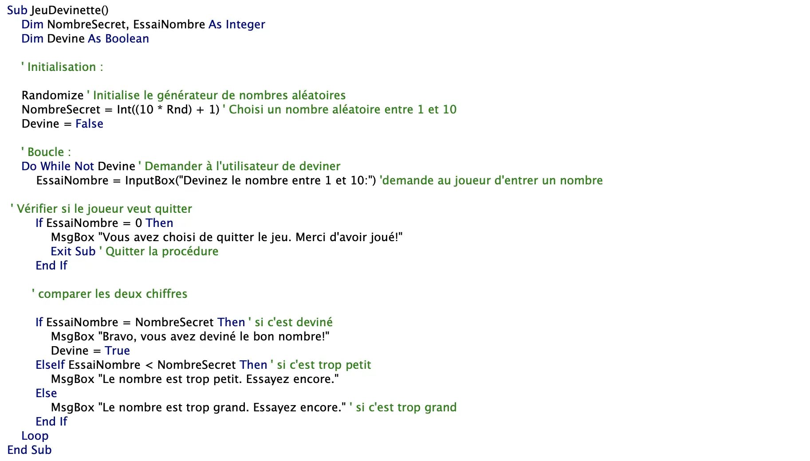
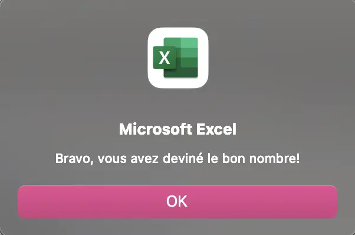
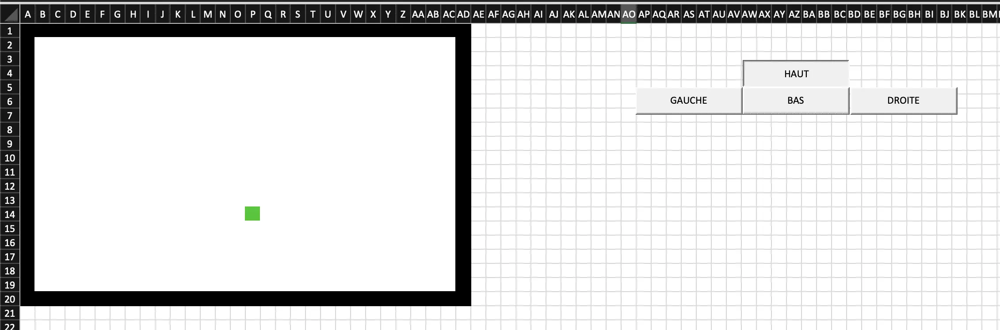

  


Ce premier MON du temps 2 sera consacré à l'apprentissage du langage VBA et fait suite au mon précédent sur les bases d'excel.
Pour ce mon, j'ai décidé de suivre une formation vidéo sur YouTube, la playlist apprendre VBA sur <https://www.youtube.com/@BrainFormation-ExcelAuTravail/playlists> complémentée par la formation excel-pratique.com, utilisée pour les MON VBA l'année précédente. Pour finir, je vais réaliser au moins 1 jeu à faire sur VBA.

## Sommaire

1. Introduction
2. Tutoriel YouTube et exercice
3. Formation excel pratique
4. Réalisation d'un jeu sur excel avec VBA

### Introduction

VBA est un langage de programmation intégré dans Excel permettant d'automatiser des tâches et de créer des fonctionnalités personnalisées. La formation au VBA sur excel-pratique.com fait parfaitement suite à mon [MON](https://francoisbrucker.github.io/do-it/promos/2023-2024/Lola-Bourdon/mon/temps-1.2/) précédent sur les bases d'excel, réalisé grâce au même site. Toutefois, plusieurs MONs ont deja été réalisés à ce sujet et grâce à ce site. La première étape a été de les lire. Puis, n'étant pas très à l'aise avec le code de manière générale j'ai voulu commencer par une formation vidéo, plus explicative à mon sens. J'ai trouvé une playlist sur YouTube. J'ai complémenté cette formation par la formation sur excel-pratique.com. Pour finir, j'ai réalisé des petits jeux grâce à VBA, unique partie que je vais détailler dans ce MON pour éviter les redondances avec les MONs précédents.

### Tutoriel YouTube et exercices

Les vidéos suivies sont réparties comme suit et durent en moyenne 6 min : 

1. VBA Qu’est ce que c’est
2. Enregistrer et lire une macro
3. Première macro pas à pas
4. Nommer une cellule
5. Les variables
6. Identifier les dernières ligne et colonne d’un tableau
7. Utiliser et adapter les tris
8. Les commentaires
9. Les fonctions Excel
10. Lancer une macro avec un bouton
11. La boucle logique IF
12. La boucle FOR
13. Une boucle IF imbriquée dans une boucle FOR
14. Des variables dans des formules
15. Msgbox et Inputbok : communiquer avec Excel
16. Utiliser des fonctions direct dans VBA
17. Déroger vos macros avec les outils VBA

Il m'a fallu 2h30 pour regarder les 17 vidéos et faire les exercices proposés.
 A retenir :

- Range("A1") est remplacé par cells(1,1) de manière générale
- Une variable **stocke** une information numérique ou textuelle
- On ne peut pas stocker une action dans une variable
- Le type de variable est +- lourde

### Excel pratique

j'ai complété ma formation vidéo par les formation excel-pratique. com.  j'ai pu revoir certaines notions de base comme les variables, macro , boucles, MsgBox etc. et en apprendre de nouvelles comme les fonctions par exemple. La formation de excel pratique et détaillé dans le [MON de Louise](https://francoisbrucker.github.io/do-it/promos/2022-2023/Gacoin-Louise/mon/MON5/)

Après avoir réalisé les exercices proposés, j'ai décidé de réaliser un jeu simple en vba.

### Réalisation d'un jeu sur excel avec VBA

Pour commencer je vais réaliser un jeu de devinette. l'objectif est qu'excel génère un nombre au hasard entre 1 et 10 et que l'utilisateur essaye de deviner en ayant des indices *plus haut* ou *plus bas*. 
Pour cela j'aurai besoin que d'une seule macro **JeuDevinette** et de 3 variables; **Devine, EssaiNombre et NombreSecret** qui traduisent respectivement l'état de la devinette, le nombre proposé et le nombre qu'il faut trouver.
le code du jeu est le suivant :

L'utilisateur entre un nombre :

Une fois que le chiffre est trouvé, on obtient :

L'apprentissage de vba au travers d'un jeu étant assez ludique pour moi, j'ai décidé de poursuivre avec le jeu Snake autrement dit le serpent qui grandit en mangeant des pommes et meurt en se mordant la queue. C'est pas aussi simple que prévu.
J'ai commencé par programer l'interface du jeu à l'aide du code suivant :

On obtient :

Le carré vert représente la tête du serpent en debut de partie. En suite j'ai affecté a chaque bouton haut, Bas, droite, gauche, une macro correspondant à la direction. L'objectif et de faire avancer/grandir/mourir le serpent en fonction de la couleur de la case suivante et de générer à chaque mouvement une case rouge pour la pomme. Malheureusement cette partie de code n'est pas encore au point et je rencontre beaucoup de difficulté dans la correction de mes erreurs.

### Conclusion

Ce MON m'aura permis de faire mes premiers pas sur VBA et de programmer un petit jeu de devinette. J'ai également commencer a programmer le jeu du Snake, que je compte poursuivre pour continuer à me former (cadre scolaire ou non). C'est une manière assez ludique d'apprendre. Je ne pensais pas passer autant de temps sur la correction de mes erreurs, sur les 2 jeux.