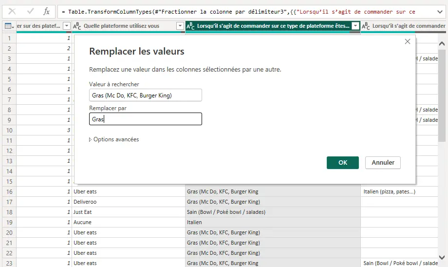
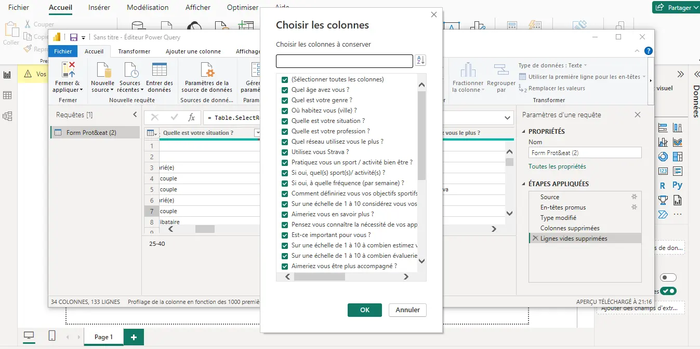
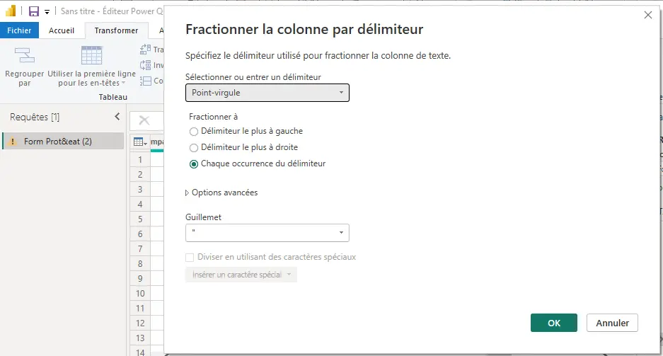
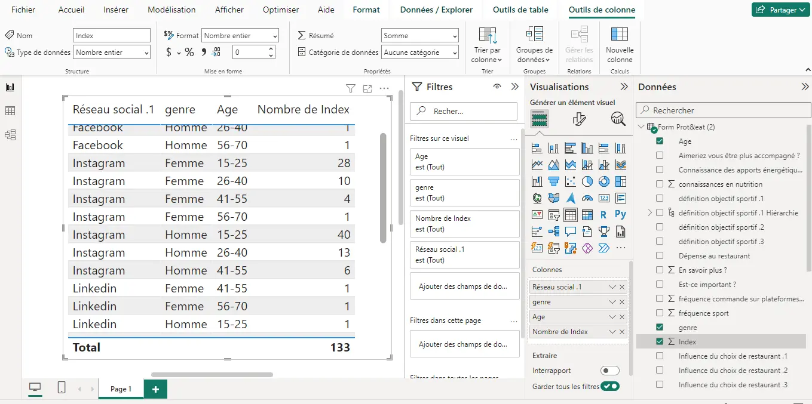
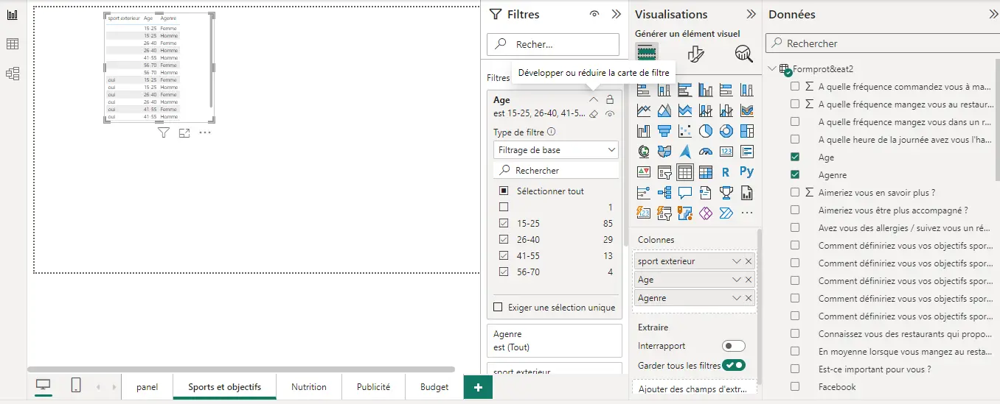
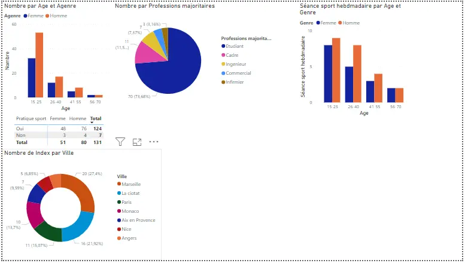
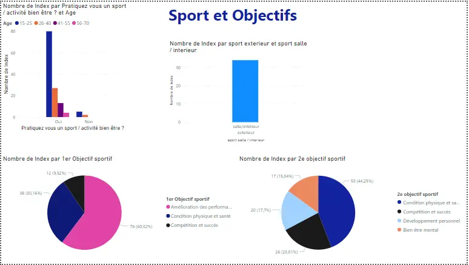
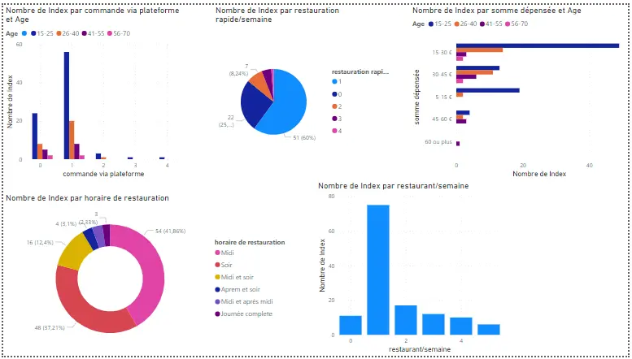

  


Ce second MON du temps 2 sera consacré à l'analyse de données d'un google form avec et excel et l'apprentissage de power BI.
Pour ce MON, j'ai décidé de suivre la formation proposée par learn.microsoft.com complémentée par le visionnage de plusieurs vidéos sur youtube.com. 

## Sommaire 

1. Introduction
2. Généralités sur PowerBI
3. Analyse de données
4. Conclusion

### Introduction

Avec la filière Entrepreneuriat, je participe aux entrep', un programme d’entraînement à l'entrepreneuriat. Dans ce cadre, je travaille sur un projet de restauration rapide. Afin de trouver notre public et définir nos personas, nous avons réalisé un google form de 32 questions qui a obtenu plus de 140 réponses. Le problème? traiter toutes les données obtenues : l'occasion idéale d'utiliser Power BI.

## Généralités sur Power BI

Power BI est une suite d'outils logiciels de Microsoft dédiée à l'analyse et à la visualisation de données. Elle permet de transformer des sources de données variées en analyses visuelles interactives. Que les données proviennent d'Excel ou d'entrepôts hybrides, Power BI offre une interface pour explorer, analyser et partager des insights de manière sélective ou publique.

Méthodologie de l'exercice : 

1. Collecter
2. Transformer
3. modéliser
4. Analyser
5. Visualiser

## Analyse de données 

Afin de traiter le google form, la première étape est de récupérer les données au format csv ou xlsv en allant dans les réponses>télécharger au format.

Maintenant démarrons Power BI.

### Collecter 

Afin de collecter les données sur Power BI nous utilisons POwer Query.
Power Query est un outil d'EAI (Enterprise Application Integration) de Microsoft utilisé pour collecter, transformer et charger (ETL) des données à partir de différentes sources. Il est souvent intégré à Microsoft Excel et Power BI, mais peut également être utilisé de manière indépendante.

J'utilise Power Query pour la :

- Collecte de Données : Power Query permet de se connecter à diverses sources de données, qu'elles soient locales ou dans le cloud, telles que des bases de données, des fichiers Excel, des services en ligne, etc.
- Transformation de Données : Il offre des outils conviviaux pour nettoyer, filtrer, remodeler et transformer les données selon les besoins. Cela permet d'obtenir des données prêtes à l'emploi pour l'analyse.

collecte de donnée> sélection du fichier csv.

### Transformer

J'ai tenté de faire une première transformation de données en utilisant seulement Power Query mais cela m'a prit énormément de temps alors j'ai décidé de repasser sur excel, que je maîtrise mieux pour les mêmes fonctionnalités grâce à mon précédent [MON](https://francoisbrucker.github.io/do-it/promos/2023-2024/Lola-Bourdon/mon/temps-1.2/). 

J'ai commencé par filtrer les données, supprimer les lignes trop incomplètes et inexploitables, homogénéiser l'orthographe, etc.

Cela étant fait il restait des transformations a faire sur Power Query, notamment :

- remplacement de valeur pour alléger

- supprimer les colonnes inexploitables (trop peu de valeurs, etc.)

- fractionner les colonnes (permet d'ajouter une une colonne pour les réponses à choix multiples, inexploitable par Power BI)
  

Une fois que la transformation de données est terminée, on peut revenir a Power BI en cliquant sur *Fermer&appliquer*.

### Modéliser et Analyser

Lorsqu'on revient sur power BI on a un tableau vierge avec toutes nos données à droite qu'il est possible de faire glisser sur le tableau de travail. On y trouve également les onglets visualiser et filtrer. Plusieurs éléments visuels sont disponibles pour traiter nos données dans l'onglet visualiser.

  

L'onglet filtrer permet d'afficher les données pertinentes à chaque élément visuel.

 

### Visualiser
Dans Power BI il est possible d'avoir plusieurs pages (comme les feuilles excel) ce qui me permet d'organiser les différents graphiques par thèmes.
Après avoir modéliser et analyser une partie des données, voici ce que j'obtient : 

La visualisation n'est pas encore optimale, les tableaux ne sont pas homogènes mais j'arrive a avoir un premier visuel des données de mon formulaire et les résultats sont intéressants pour l'équipe. Toutefois, le travail n'est pas encore terminé pour l'analyse de ce form, beaucoup de données sont encore à exploiter, et certains visuels pourraient être réétudier.

### Conclusion

Ce MON m'a permis de mettre en pratique certaines notions d'excel vu précédemment et de découvrir Power BI. C'est un outil très intéressant dans le cadre de mon analyse de formulaire que je vais poursuivre. Je ne pensais pas passer autant de temps sur la transformation des données mais c'est une étape cruciale pour simplifier la suite de l'exercice. Je peux maintenant analyser le google form de Défensio.

| Travail effectué |  Temps | 
| -------- | -------- |-------- |
| Visionnage vidéo total YouTube et lecture site microsoft | 2h |
| Collecter et transformer | 4h|
| Modéliser et Analyser | 3h |
| Visualiser | 1h| 

### Source 

- app.powerbi.co
- <https://www.youtube.com/watch?v=hnztFw7ID4w&list=PL-7Ue_1Wto-ZdrFKOxcUalrqc3-CxezU_>
- <https://www.youtube.com/watch?v=2jfS8hYrpzU&list=PL1aYsXmhJ1WcRPx3gotG36pu-lb7YdmOa>
- <https://www.youtube.com/watch?v=jSuL7hJ76kE&t=1542s>
  