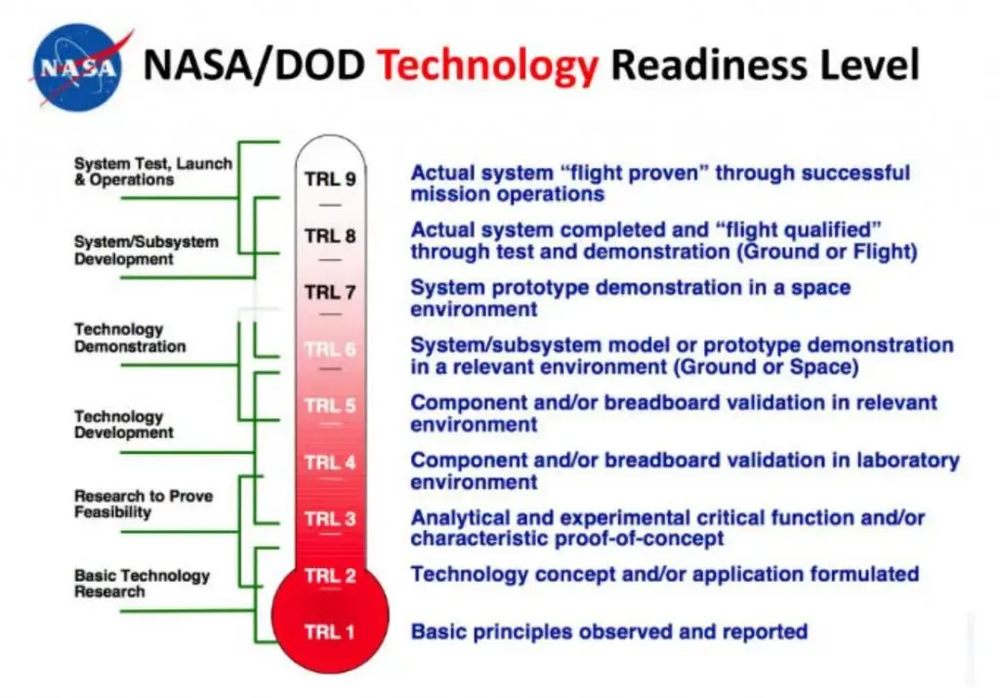

L'objectif de ce MON est de faire suite au [MON de Soline](https://francoisbrucker.github.io/do-it/promos/2023-2024/de-Miribel-Soline/mon/temps-3.1/) sur le management de l'innovation. Pour cela, je vais revenir plus en détail sur certaines notions et faire des études de cas représentatives.

## Sommaire

1. Rappel
2. Les outils du management de l’innovation
   1. La méthode CK
   2. La méthode du TRL
   3. Le crowdsourcing
3. Etude de cas 1
4. Etude de cas 2
5. Etude de cas 3
6. Etude de cas 4
7. Conclusion
8. Sources

## Rappel

Le management de l'innovation est une discipline qui vise à gérer le processus de création, de développement et de mise en œuvre de nouvelles idées, produits, services ou processus au sein d'une organisation. Il englobe la gestion de toutes les étapes du cycle d'innovation, de la génération des idées à leur commercialisation réussie.

Une invention est la création d'une nouvelle idée ou technologie, tandis que l'innovation est le processus de mise en œuvre réussie de cette idée ou technologie pour créer de la valeur. Le management de l'innovation vise à faciliter ce processus en fournissant un cadre et des méthodologies pour générer, développer et exploiter efficacement les idées nouvelles et créatives.

## Les outils du management de l'innovation

Il existe de nombreux outils de management de l'innovation comme le mentionne [Soline](https://francoisbrucker.github.io/do-it/promos/2023-2024/de-Miribel-Soline/mon/temps-3.1/). Je vais donc expliquer plus en profondeur les méthodes C-K, TRL et crowdsourcing qui sont pour moi les plus intéressantes.

### La méthode C-K

La théorie C-K ou "Concept-Knowledge", est un cadre théorique majeur dans le domaine de la gestion de l'innovation et de la créativité. Son développement, initié dans les années 1990 par Armand Hatchuel, Benoît Weil, et leur équipe de recherche, a été une révélation dans la compréhension des processus de conception innovante. Avant cela, la génération d'idées et d'inventions était souvent perçue comme un phénomène mystérieux, relevant davantage de l'intuition que de la méthode. Cependant, les travaux de Hatchuel, Weil et leurs collègues ont permis de mettre en lumière la nature de ces activités créatives, qu'ils ont nommées "conception innovante".

La théorie C-K repose sur une interaction complexe entre deux espaces mentaux fondamentaux : l'espace des Concepts (C) et l'espace des Connaissances (K). L'espace C représente l'univers des possibilités conceptuelles, où les idées, les propositions et les solutions nouvelles prennent forme. Contrairement à ce que l'on pourrait penser, cet espace est hautement structuré, organisé sous forme d'un arbre des concepts qui permet d'explorer et d'articuler les idées de manière systématique.

En parallèle, l'espace K est la réserve de connaissances, d'informations et de données sur lesquelles le concepteur s'appuie pour développer et évaluer les concepts proposés. Ces connaissances proviennent de diverses sources telles que la recherche académique, l'expérience pratique, les compétences techniques, et sont essentielles pour guider le processus de conception.

Le processus C-K consiste à naviguer entre ces deux espaces, en explorant de nouvelles idées dans l'espace C tout en utilisant les connaissances disponibles dans l'espace K pour les évaluer et les enrichir. Cette démarche itérative favorise la créativité en permettant aux concepteurs de générer des concepts originaux tout en s'appuyant sur une base de connaissances solide.

L'application de la théorie C-K s'étend à divers domaines, de la conception de produits et de services à la gestion de projets complexes et à la recherche et développement. Elle offre aux équipes un cadre structuré pour stimuler l'innovation, en combinant exploration créative et exploitation stratégique des connaissances existantes.

Dans un contexte où les entreprises sont confrontées à des transformations majeures et à des bouleversements constants, la théorie C-K joue un rôle crucial en aidant les organisations à repenser leurs approches de l'innovation. Elle permet de développer des produits et des services radicalement nouveaux, nécessaires pour s'adapter à un environnement en évolution rapide et pour rester compétitif sur le marché.

### La méthode TRL

La méthode du TRL (Technological Readiness Level), également connue sous le nom de Niveau de Maturité Technologique, est un cadre d'évaluation largement utilisé dans le domaine de la gestion de l'innovation et du développement technologique. Cette méthode fournit une échelle de mesure permettant d'évaluer le degré de préparation et de développement d'une technologie spécifique, en la situant sur une échelle allant de niveaux bas (TRL 1) à des niveaux élevés (TRL 9). 

Développée à l'origine par des organisations gouvernementales américaines telles que la NASA et l'US Air Force, l'échelle TRL a été conçue pour aider à mesurer et à évaluer la maturité des technologies émergentes. Elle est devenue un outil essentiel dans le domaine de la recherche et développement, ainsi que dans l'évaluation des projets innovants.

Les Technology Readiness Levels (TRL) sont définis comme un ensemble de neuf niveaux, chacun représentant un stade spécifique dans le cycle de développement d'une technologie. Voici une brève description de chaque niveau :

1. TRL 1 : Recherche fondamentale
   - À ce stade, il s'agit de recherches théoriques et conceptuelles visant à explorer les bases scientifiques d'une technologie.

2. TRL 2 : Concept formulé
   - Le concept de la technologie est formulé, et des preuves conceptuelles sont rassemblées pour soutenir sa viabilité.

3. TRL 3 : Preuve de concept
   - La faisabilité de la technologie est démontrée à petite échelle, souvent en laboratoire.

4. TRL 4 : Validation en laboratoire
   - La technologie est validée en laboratoire dans des conditions contrôlées, et les composants clés sont intégrés pour tester leur fonctionnement ensemble.

5. TRL 5 : Validation en environnement simulé
   - La technologie est testée dans un environnement simulé pour évaluer sa performance et sa fiabilité dans des conditions proches de la réalité.

6. TRL 6 : Prototype démontré
   - Un prototype fonctionnel est construit et testé dans des conditions représentatives de son utilisation prévue.

7. TRL 7 : Démonstration en environnement opérationnel
   - Un prototype fonctionnel est démontré dans un environnement opérationnel, montrant sa capacité à fonctionner dans des conditions réelles.

8. TRL 8 : Système complet et qualifié
   - Le système complet est achevé et qualifié par des essais et des démonstrations, prêt à être mis en service.

9. TRL 9 : Mise en service réussie
   - La technologie est entièrement développée, testée et mise en service avec succès dans son environnement opérationnel.

L'échelle TRL est largement utilisée dans les processus de financement public, tels que les concours d'innovation i-Lab et i-Nov en France, ainsi que dans le cadre du programme Horizon Europe de l'Union Européenne. Les projets sont souvent évalués en fonction de leur niveau de maturité technologique, et les financements sont attribués en conséquence.

En résumé, l'échelle TRL est un outil précieux pour évaluer et gérer le développement technologique, en permettant aux équipes de projet de suivre leur progression, d'identifier les lacunes et les opportunités, et de prendre des décisions stratégiques en conséquence. Elle fournit un langage commun pour évaluer la maturité des technologies émergentes et permet aux décideurs de mieux apprécier les risques et les opportunités associés à un projet.

### Le crowdsourcing

Le crowdsourcing est une pratique qui consiste à externaliser des tâches, des idées ou des services à un grand groupe de personnes, généralement via Internet. Ce terme est une combinaison des mots "crowd" (foule) et "outsourcing" (externalisation). Le principe fondamental du crowdsourcing est de solliciter la contribution d'un grand nombre de personnes, souvent non spécialisées, pour résoudre un problème, réaliser une tâche ou générer des idées.

Il existe plusieurs formes de crowdsourcing, notamment :

1. **Crowdsourcing de connaissances :** Il s'agit de solliciter l'expertise collective d'un groupe de personnes pour résoudre des problèmes ou répondre à des questions spécifiques. Des plateformes telles que Quora ou Stack Overflow permettent aux utilisateurs de poser des questions et d'obtenir des réponses de la part de la communauté.

2. **Crowdsourcing de financement :** Cette forme de crowdsourcing implique de solliciter des fonds auprès d'un grand nombre de personnes pour financer un projet, une entreprise ou une cause. Les plateformes de financement participatif (crowdfunding) telles que Kickstarter, Indiegogo et GoFundMe permettent aux individus de collecter des fonds pour des projets artistiques, des innovations technologiques, des œuvres caritatives, etc.

3. **Crowdsourcing de création :** Il s'agit de solliciter des idées, des designs ou des contenus créatifs auprès d'une communauté en ligne. Des entreprises comme Threadless (pour les designs de t-shirts) ou Lego Ideas (pour les nouvelles idées de produits Lego) utilisent cette forme de crowdsourcing pour impliquer les clients dans le processus de création de produits.

4. **Crowdsourcing de données :** Cette forme implique de solliciter la contribution des utilisateurs pour collecter, analyser ou vérifier des données. Des projets tels que OpenStreetMap (cartographie collaborative) ou Wikipedia (encyclopédie en ligne) reposent sur la contribution volontaire des utilisateurs pour enrichir et maintenir les données.

Le crowdsourcing présente plusieurs avantages, notamment l'accès à une diversité d'expertise, la réduction des coûts, l'accélération de l'innovation et l'engagement de la communauté. Cependant, il peut également présenter des défis tels que la gestion de la qualité des contributions, la protection de la propriété intellectuelle et la gestion des attentes des participants. En général, le succès du crowdsourcing dépend de la manière dont il est conçu, géré et mis en œuvre pour répondre aux besoins spécifiques du projet ou de l'organisation.

### Etude de cas 1 - dilemme de l'innovateur

Cette première étude cas détaille l'exemple fourni par [Soline](https://francoisbrucker.github.io/do-it/promos/2023-2024/de-Miribel-Soline/mon/temps-3.1/) sur le dilemme de l'innovateur.

#### Introduction et Contexte

Nous étudions le dilemme de l'innovateur au sein d'une entreprise de fabrication d'imprimantes, confrontée à la nécessité d'introduire une innovation de rupture dans un marché établi. Cette étude explore les défis rencontrés par l'entreprise dans l'adoption de nouvelles technologies et propose des solutions organisationnelles pour surmonter ces défis.

On s’intéresse à une entreprise de fabrication d'imprimantes, leader sur son marché dans les années 1990. Cette entreprise propose des imprimantes laser haut de gamme, vendues à des entreprises à un prix élevé via une force de vente directe spécialisée. Son modèle d'affaires repose sur la vente de ces imprimantes avec des coûts d'impression très bas, ce qui constitue un avantage concurrentiel majeur.

#### Le dilemme de l'innovateur

Le dilemme de l'innovateur se manifeste lorsque le directeur de la R&D propose une innovation de rupture sous la forme d'une imprimante à jet d'encre abordable. Cependant, cette innovation est confrontée à plusieurs défis :

**1. Réponse du marché actuel :**

- Les clients existants ne sont pas intéressés par le nouveau produit en raison de son coût d'impression plus élevé.
- Le produit ne répond pas aux attentes de réduction continue des coûts d'impression des clients actuels.

**2. Identification du nouveau marché :**

- Il est difficile d'identifier les nouveaux segments de marché pour le nouveau produit.
- Même si un marché potentiel est identifié, il faudrait développer une nouvelle structure de vente et de marketing pour atteindre ces nouveaux clients.

**3. Motivation du personnel :**

- La force de vente actuelle est motivée par la vente d'imprimantes haut de gamme avec des marges élevées.
- Vendre un produit à faible marge ne présente aucun intérêt pour eux.

#### Impact du modèle d'affaires existant

Le modèle d'affaires existant de l'entreprise, axé sur des marges élevées et une force de vente spécialisée, crée des obstacles au lancement du nouveau produit. Les ressources, processus et valeurs (RPV) de l'entreprise sont alignés sur ce modèle, rendant difficile l'adoption d'une nouvelle stratégie.

#### Réponse organisationnelle

Pour surmonter ces défis, l'entreprise doit envisager une réponse organisationnelle appropriée :

**1. Séparation de l'innovation :**

- Créer une nouvelle entité dédiée à l'innovation de rupture, isolée de l'entreprise principale, pour explorer de nouveaux modèles d'affaires et de nouveaux marchés.

**2. Équipe dédiée :**

- Constituer une équipe avec des profils entrepreneuriaux capables de mener à bien l'innovation de rupture, avec une autonomie suffisante pour explorer de nouvelles opportunités.

**3. Gestion des liens avec l'entreprise mère :**

- Maintenir des liens avec l'entreprise principale pour bénéficier de son expérience et de ses ressources, tout en garantissant une certaine autonomie pour favoriser l'innovation.

**Résultats attendus :**

En adoptant cette approche, l'entreprise peut espérer surmonter les défis liés au dilemme de l'innovateur et exploiter de nouveaux marchés grâce à une innovation de rupture. La nouvelle entité dédiée peut se concentrer sur le développement d'un nouveau modèle d'affaires adapté au nouveau produit, tout en bénéficiant de la structure et des ressources de l'entreprise mère. Cela permettrait à l'entreprise de rester compétitive et de maintenir sa position de leader sur le marché de l'impression, tout en explorant de nouveaux domaines de croissance.

### Etude de cas 2 - La méthode TRL

Prenons l'exemple fictif du développement d'une technologie de stockage d'énergie éolienne

#### Contexte

Une entreprise souhaite développer une technologie de stockage d'énergie éolienne pour améliorer la fiabilité et la rentabilité des parcs éoliens. Actuellement, l'intermittence de la production éolienne pose des défis pour l'intégration de l'énergie éolienne dans le réseau électrique.

**Niveau TRL Initial : Niveau 1 - Concept de base formulé:**

L'entreprise commence par définir le concept de base de sa technologie de stockage d'énergie éolienne. L'idée est de développer un système de stockage capable de stocker l'énergie excédentaire produite par les éoliennes lorsqu'il y a peu de demande, puis de la restituer lorsque la demande est élevée ou lorsque le vent est faible.

**Niveau TRL 2 - Concept technologique formulé :**

L'entreprise procède à une analyse approfondie des différentes technologies de stockage disponibles, telles que les batteries lithium-ion, les systèmes de stockage par air comprimé et les volants d'inertie. Elle choisit ensuite la technologie la plus prometteuse, les batteries lithium-ion, en raison de leur efficacité, de leur durabilité et de leur disponibilité sur le marché.

**Niveau TRL 3 - Analyse conceptuelle et validation en laboratoire :**

L'entreprise effectue des tests en laboratoire pour valider le concept de stockage d'énergie éolienne. Ces tests comprennent des simulations informatiques, des analyses de performance et des essais de prototype à petite échelle pour évaluer la faisabilité technique du projet.

**Niveau TRL 4 - Validation en laboratoire étendue :**

L'entreprise réalise des tests en laboratoire plus poussés pour affiner la conception du système de stockage d'énergie éolienne. Elle effectue des tests de longue durée pour évaluer la durabilité des composants, la fiabilité du système et sa capacité à fonctionner dans des conditions variables.

**Niveau TRL 5 - Validation en environnement représentatif :**

L'entreprise installe un prototype de son système de stockage d'énergie éolienne sur un site pilote. Ce site représente les conditions réelles d'un parc éolien, ce qui permet à l'entreprise de tester le système dans des conditions environnementales réalistes.

**Niveau TRL 6 - Validation en environnement opérationnel :**

L'entreprise déploie son système de stockage d'énergie éolienne dans un parc éolien commercial. Elle surveille de près les performances du système, collecte des données opérationnelles et effectue des ajustements si nécessaire pour optimiser son fonctionnement.

**Niveau TRL 7 - Système prêt pour la commercialisation :**

L'entreprise obtient des résultats positifs de son déploiement commercial et décide de mettre son système de stockage d'énergie éolienne sur le marché. Elle élabore des plans de commercialisation, établit des partenariats avec des entreprises du secteur de l'énergie et prépare le lancement officiel du produit.

**Niveau TRL 8 - Technologie démontrée dans un environnement opérationnel :**

Le système de stockage d'énergie éolienne est largement déployé dans plusieurs parcs éoliens à travers le monde. Il a fait ses preuves en termes de performance, de fiabilité et de rentabilité, et est largement accepté par l'industrie de l'énergie renouvelable.

**Niveau TRL 9 - Technologie pleinement intégrée et éprouvée :**

La technologie de stockage d'énergie éolienne est désormais pleinement intégrée dans l'infrastructure énergétique mondiale. Elle est devenue une norme de l'industrie pour maximiser l'utilisation de l'énergie éolienne et stabiliser les réseaux électriques.

#### Résultats:

Cette étude de cas illustre comment la méthode TRL peut être utilisée pour évaluer le développement d'une nouvelle technologie, en suivant sa progression depuis le stade conceptuel jusqu'à sa pleine intégration dans l'industrie.

---

### Étude de Cas 3 - La méthode C-K

#### Contexte:

Prenons l'exemple fictif d'une entreprise automobile qui cherche à développer une nouvelle génération de voitures électriques autonomes pour répondre à la demande croissante de véhicules écologiques et autonomes sur le marché.

#### Étape 1 : Exploration du Concept (C-K Concept):

- **Objectif Principal :** Concevoir une voiture électrique autonome innovante qui offre une expérience de conduite sûre, confortable et durable.

- **Contraintes :**
  - Respecter les réglementations en matière de sécurité et d'émissions.
  - Assurer une autonomie suffisante pour répondre aux besoins des conducteurs.
  
- **Opportunités :**
  - Saisir la demande croissante pour les véhicules électriques et autonomes.
  - Créer un avantage concurrentiel en proposant des fonctionnalités innovantes et une expérience utilisateur exceptionnelle.

#### Étape 2 : Recherche de Connaissances (C-K Knowledge):

- **Expertise Interne :**
  - Ingénieurs spécialisés en intelligence artificielle et conception automobile.
  - Équipe de conception expérimentée ayant une connaissance approfondie du marché et des tendances de l'industrie.

- **Recherche Externe :**
  - Analyse des technologies émergentes dans le domaine de la conduite autonome, des batteries et des matériaux légers et durables.
  - Consultation d'experts en mobilité urbaine et en durabilité.

#### Étape 3 : Processus d'Innovation:

- **Génération de Concepts (C-K Concept) :**
  - Utilisation de l'expertise interne et des connaissances externes pour générer des concepts de véhicule électrique autonome, y compris des designs futuristes, des systèmes de recharge innovants et des fonctionnalités avancées de conduite autonome.

- **Évaluation et Sélection des Concepts :**
  - Évaluation des concepts en fonction de critères tels que l'efficacité énergétique, la sécurité, le confort et l'esthétique.
  - Sélection du concept le plus prometteur basé sur des analyses quantitatives et qualitatives.

#### Étape 4 : Développement et Mise en Œuvre:

- **Prototypage et Tests :**
  - Développement de prototypes basés sur le concept sélectionné, en utilisant des technologies de pointe pour la propulsion électrique, la connectivité et l'automatisation.
  - Tests approfondis en conditions réelles pour évaluer les performances, la sécurité et la fiabilité du prototype.

- **Optimisation et Amélioration :**
  - Réajustement du design et des fonctionnalités en fonction des retours des tests et des simulations.
  - Collaboration avec des partenaires technologiques pour intégrer les dernières avancées dans le domaine de l'électromobilité et de l'intelligence artificielle.

#### Étape 5 : Commercialisation et Diffusion :

- **Stratégie de Commercialisation :**
  - Élaboration d'une stratégie de lancement pour présenter la nouvelle voiture électrique autonome sur le marché.
  - Campagnes de marketing ciblées pour sensibiliser les consommateurs aux avantages de la conduite autonome et de l'électromobilité.

- **Formation et Support :**
  - Formation des concessionnaires et du personnel sur les caractéristiques et les avantages du nouveau véhicule.
  - Fourniture d'un support clientèle dédié pour répondre aux questions et aux préoccupations des propriétaires de voitures électriques autonomes.

#### Résultats

Grâce à l'approche C-K, l'entreprise a réussi à développer une voiture électrique autonome innovante qui a suscité un fort intérêt sur le marché. Le nouveau véhicule a été largement acclamé pour ses performances, sa sécurité et sa durabilité, renforçant ainsi la position de l'entreprise en tant que leader de l'innovation dans l'industrie automobile.

---

### Étude de Cas 4 - Le crowdsourcing

#### Contexte

Prenons l'exemple fictif d'une entreprise de technologie qui souhaite développer une nouvelle plateforme de crowdsourcing pour stimuler l'innovation et la collaboration au sein de l'entreprise ainsi qu'avec des partenaires externes.

#### Étape 1 : Planification de la Plateforme de Crowdsourcing

- **Objectif Principal :** Créer une plateforme conviviale et efficace pour recueillir des idées innovantes et mobiliser les ressources internes et externes.
  
- **Contraintes :**
  - Respecter les normes de sécurité et de confidentialité des données.
  - Assurer la participation active des employés et des parties prenantes externes.
  
- **Opportunités :**
  - Favoriser la créativité et l'engagement des employés.
  - Encourager la collaboration ouverte et la diversité des idées.

#### Étape 2 : Développement de la Plateforme

- **Conception de l'Interface Utilisateur :**
  - Collaboration avec des concepteurs UX/UI pour créer une interface conviviale et intuitive.
  - Intégration de fonctionnalités telles que la soumission d'idées, le vote, les commentaires et les discussions.

- **Développement Technique :**
  - Équipe de développement logiciel pour concevoir et construire la plateforme en utilisant les dernières technologies.
  - Tests rigoureux pour assurer la fiabilité et la sécurité de la plateforme.

#### Étape 3 : Lancement et Promotion

- **Communication Interne :**
  - Campagne de sensibilisation pour informer les employés sur la plateforme et encourager leur participation.
  - Formation sur l'utilisation de la plateforme et les meilleures pratiques du crowdsourcing.

- **Marketing Externe :**
  - Promotion de la plateforme auprès des partenaires externes, des clients et de la communauté en ligne.
  - Utilisation des médias sociaux, des newsletters et des événements pour accroître la visibilité de la plateforme.

#### Étape 4 : Gestion et Suivi

- **Modération et Animation :**
  - Équipe dédiée pour modérer les contributions, encourager les interactions et stimuler l'engagement.
  - Réponse rapide aux questions et aux commentaires des utilisateurs pour maintenir un environnement positif.

- **Évaluation et Suivi :**
  - Suivi des performances de la plateforme à l'aide de données analytiques pour évaluer l'engagement et l'efficacité.
  - Révisions régulières pour améliorer la plateforme en fonction des retours d'expérience et des suggestions des utilisateurs.

#### Résultats

La nouvelle plateforme de crowdsourcing a connu un succès significatif, avec une forte participation des employés et des parties prenantes externes. Grâce à cette plateforme, l'entreprise a pu recueillir un grand nombre d'idées novatrices provenant de diverses sources. Ces idées ont été soigneusement évaluées et mises en œuvre, ce qui a conduit à plusieurs innovations réussies, renforçant ainsi la position de l'entreprise en tant que pionnière dans son domaine. De plus, la plateforme a favorisé un sentiment de communauté et de collaboration au sein de l'entreprise, renforçant la culture de l'innovation et l'engagement des employés. En fin de compte, le crowdsourcing a permis à l'entreprise d'accélérer son processus d'innovation, de répondre de manière agile aux défis du marché et de maintenir sa compétitivité à long terme.

## Conclusion

Ce MON m'aura permis d'acquérir plus de connaissances dans le domaine du management de l'innovation qui est un domaine qui me plait beaucoup. Je n'avais jamais entendu parler des méthodes de crouwdsourcing et TRL et j'ai trouvé ça très intéressant. J'ai ainsi pu compléter le [MON de Soline](https://francoisbrucker.github.io/do-it/promos/2023-2024/de-Miribel-Soline/mon/temps-3.1/) avec des études de cas plus approfondies.

### Horodateur

| Date | Travail effectué | Temps |
| -------- | -------- |-------- |
| 12/03 | 30min  | Lecture MON Soline |
| 12/02 | 2h | Méthode CK et TRL |
| 13/02 | 1h| Le crowdsourcing |
| 13/02 | 2h | Etude de cas 1|
| 16/02 | 2h30 | Etude de cas 2|
| 18/02 | 1h | Etude de cas 3|
| 19/02 | 1h | Etude de cas 4|

### Sources

<https://www.grenoble-inp.fr/fr/recherche-valorisation/trl-a-quoi-ca-sert>
<https://uved.univ-perp.fr/module4/res/Parcs-eoliens_Etude-de-cas.pdf>
<https://www.cairn.info/revue-management-et-avenir-2011-1-page-254.htm#:~:text=Le%20crowdsourcing%20est%20une%20forme,Pisano%20et%20Verganti%2C%202008).>
<https://www.cairn.info/revue-entreprendre-et-innover-2016-1-page-38.htm>
<https://www.cercle-editeurs.fr/logiciels-metiers/quelles-sont-les-approches-et-les-outils-adaptes-pour-reussir-a-innover/>
<https://www.ck-theory.org/la-theorie-ck/>
<https://www.finovup.fr/blog/lechelle-trl-technology-readiness-level-mesurer-la-maturite-dune-technologie/>
<https://www.cea.fr/multimedia/Documents/infographies/Defis-du-CEA-infographie-echelle-trl.pdf>
<https://exed.polytechnique.edu/formations/innovation/innovation-rupture-methode-c-k>