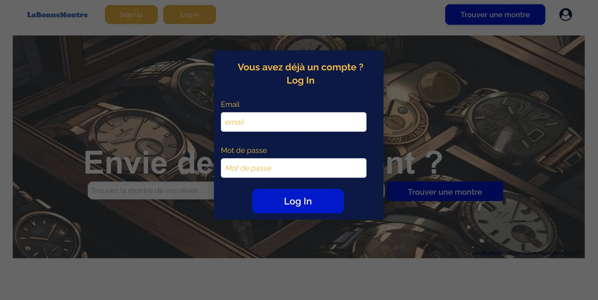

  


### Objectif : créer une application avec bubble.io/

Pour la réalisation de ce premier POK, j'aimerai utiliser les connaissances que j'ai appris pendant le cours de *no code* pour développer seule une application sur bubble.io. J'ai pris la décision de faire mon application sur bubble car à mon sens je ne la maîtrise pas encore assez bien pour apprendre à en utiliser une nouvelle. C'est donc l'occasion de solidifier mes premières connaissances sur la plateforme et d'en développer de nouvelles.

## Plan et idée de l'application

- Définir clairement le sujet du l'application
- Continuer de se former sur l'utilisation de bubble.io/
- Déterminer un logo
- Énumérer les fonctionnalités nécessaires et les fonctionnalités souhaitables
- Établir structure du site
- Faire la page d'accueil
- Remplir la base de donnée
- Styliser les différentes pages
- Faire le lien entre les pages et les fonctionnalités

### Etat des lieux du sprint 1

- Définir clairement le sujet du l'application [ok]
- Continuer de se former sur l'utilisation de bubble.io/ [en cours]
- Déterminer un logo [moyen]
- Enumérer les fonctionnalités nécessaires et les fonctionnalités souhaitables [ok]
- Faire la page d'accueil [en cours]
- Remplir la base de donnée [ok]
- Établir la structure du site web [non]
- Styliser les différentes pages[non]
- Faire le lien entre les pages et les fonctionnalités [non]

**Sujet et fonctionnaliés de l'application :**
Idée : proposer une application où les utilisateurs pourraient acheter une ou plusieurs montres (du moins les mettre au panier) et/ou proposer à la plateforme de vendre leurs montres : La bonne Montre

Fonctionnalités nécessaires :

1. Log in/ sign Up et déconnexion
2. ajouter/modifier son profil
3. publier les fiches des montres à vendre
4. proposer une montre à la plateforme
5. ajouter au panier

Fonctionnalités possibles :

1. visualiser et retirer du panier
2. ajout d'un chatbot plateforme/acheteur/vendeur
3. ajouter des montres en favoris et les visualiser

### Remarques

Mauvaise gestion du temps + tâches cachées : J'ai sous estimé le temps nécessaire à la poursuite de ma formation sur bubble.io/ étant donné que je n'ai pas touché à tout pendant le projet du cours de no code. J'aurais du être capable de proposer une premiere version de la page d'accueil et de la structure de l'application mais cette dernière ne me convient pas du tout à l'heure actuelle, je dois la retravailler. J'ai également mis du temps a prendre en main VSCode et github, ce qui diminué le temps que j'avais a consacrer à ce POK jusqu'au premier sprint.

### Objectifs sprint 2

Maintenant que ce POK est plus clair, je dois :

1. Mieux gérer mon temps
2. Terminer de me former à bubble.io/
3. Terminer la page d'accueil, les différentes pages et la structure
4. Commencer les liens entre les pages et les fonctionnalités

## Sprint 2

Les objectifs techniques du sprint 2 sont :

1. Terminer de me former à bubble.io/ [ok]
2. Terminer la page d'accueil, les différentes pages et la structure [ok]
3. Faire les liens entre les pages et les fonctionnalités [ok]

### Méthodologie

Pour ce second sprint j'ai avancé par phases : 

1. Premier design de l'application web
2. Terminer la base de donnée
3. Workflow entre les différentes pages et fonctions
4. Design final
5. test de la plateforme

### Premier Design de LaBonneMontre

L'architecture du site se compose comme suit :

- Page d’accueil (index)
- Page Sign Up
- Page avec la liste des montres à vendre (liste_montre)
- Page avec formulaire pour proposer une montre à la vente (vendre_montre)
- Page avec validation de la proposition de la montre ajoutée (montre_ajoutée)
- Page pour visualiser le panier (visualiser_panier)
- Page pour visualiser/modifier son profil (user_profil)
- reset password
- erreur 404
- pop up log in
- group focus menu déroulant

Design de la d'accueil (je ne vais pas détailler tous les étapes de design de chaque page au risque d'être trop redondant):

 J'ai commencé par faire l'entête avec le logo  à gauche et un menu à droite.

Puis j'ai ajouté un lien cliquable et ai donné un premier visage à la page de garde.

J'ai ajouté deux boutons cliquables pour se connecter/enregistrer et un menu déroulant. Puis, l'idée principale de mon application web étant de trouver un montre, j'ai modifié l'esprit de la page pour donner le résultat suivant : (en terme de design)

Design de la page listant les montres :
En ce qui concerne la page où l'utilisateur peut visualiser les montres, le premier design assez simple est fonctionnel mais vraiment pas très esthétique.

Pour la page sign In, Bubble propose un composant déjà prêt que j'ai utilisé :

Ce composant est pratique mais pas très esthétique, je vais l'améliorer et le compléter par la suite.

### La Base de donnée

Pour la base de donnée de ce projet, je vais avoir besoin de trois *"Data types"* : les Utilisateur "**User** (par défaut)", les **montres** et les **paniers**, avec pour chacun différents *"files"* (nom, prénom, modèle, année de fabrication, etc.) :

- La page **Sign Up** permet d'implémenter la base de donnée **user**
- la page **Vendre_montre** implémente la base de donnée **montre** ainsi que la page **vendre_montre**.
- La base de donnée **panier** est implémentée par le bouton **"ajouter au panier"** de la page liste_montre, détaillé plus tard.

Dans l'onglet Data > App Data, on peut voir les éléments de chaque *"Data types"* déjà implémentés ou ajoutés manuellement.

### Workflow 

Un workflow représente une série d'actions automatisées qui se déclenchent en réponse à un événement donné, comme un clic sur un bouton.
Par exemple, sur la page d'accueil, il y a 5 boutons cliquables (sign up, log in, icône personnel et trouver sa montre deux fois). L'idée est que ces boutons envoient vers d'autres pages ou pop up. Cela représente des workflow simples.
Le design de la page d'accueil finale est le suivant :

##### Header

L'entête de toutes les pages du site offre les disponibilités suivantes :

* **Log In** j'ai décidé que le bouton log in afficherai un *popup*, cela donne le résultat suivant:

* **Sign Up** envoie à la page Sign_up, capable elle même d'afficher le pop up log In

* Les deux boutons **Trouver Montre** envoient directement à la page liste_montre

* **Icon personnel** renvoie quant à lui un menu déroulant à l'aide d'un *GroupFocus* qui permet d'accéder à son profil, ses favoris, son panier et donnera la possibilité de proposer une montre à la plateforme ou bien de se déconnecter.

Actuellement, je n'ai pas donné suite aux boutons panier et favoris. 

##### Accès aux autres pages

La page **Mon profil** affiche les données de l'utilisateur connecté et permet de modifier certaines informations. Pour cela, il faut utiliser des *Dynamic data* dans le design comme suit : 

ce qui donne le résultat suivant sur le site :

Les informations peuvent être modifiées en temps réel sur le site lorsque l'utilisateur entre la donnée à modifier puis clique sur **Actualiser**.
La page **Vendre une montre** affiche un formulaire qui permet de renseigner une montre que l'on souhaite vendre. On y entre diverses informations et une photo, qui vont directement implémenter la base de donnée **montre** et la page liste_montre après avoir cliqué sur le bouton **soumettre**.

L'action de cliquer sur le bouton **soumettre** qui ajoute une montre à la base de donnée est traduite par le workflow suivant : 

Une fois le formulaire rempli, le bouton **soumettre** amène a la page suivante, avec  des boutons fonctionnels : 

Sur la page Liste_montre, l'utilisateur a la possibilité d'ajouter au panier en cliquant sur le bouton correspondant. Cela apporte une alerte *Ajouté au panier* et  implémente la base de donnée **panier**. 

Malheureusement, je ne trouve actuellement pas la solution pour afficher le panier.

### Remarques sprint 2

Lors de ce second sprint, j'ai réussi à mieux m'organiser et répartir les tâches à réaliser. L'état actuel de mon application web répond aux fonctionnalités nécessaires, à savoir :

1. Log in/ sign Up et déconnexion
2. ajouter/modifier son profil
3. publier les fiches des montres à vendre
4. proposer une montre à la plateforme
5. ajouter au panier

J'ai aussi passé beaucoup de temps à gérer les workflow et à comprendre mes erreurs. Actuellement le design n'est pas le plus idéal mais je ne souhaitais pas y passer trop de temps, préférant me concentrer sur les workflow.

### Conclusion générale

Ce POK m'a permis de mettre en pratique mes connaissances sur Bubble au moyen d'une application WEB. Même si l'application n'est pas parfaite et montre encore quelques erreurs, j'ai pu réaliser les fonctionnalités nécessaires souhaitées. En revanche, j'ai passé beaucoup de temps à gérer les workflow et mes erreurs sur les workflow, notamment liées au header, ce qui ne m'a pas permis d'ajouter plus de fonctionnalités à mon application.
