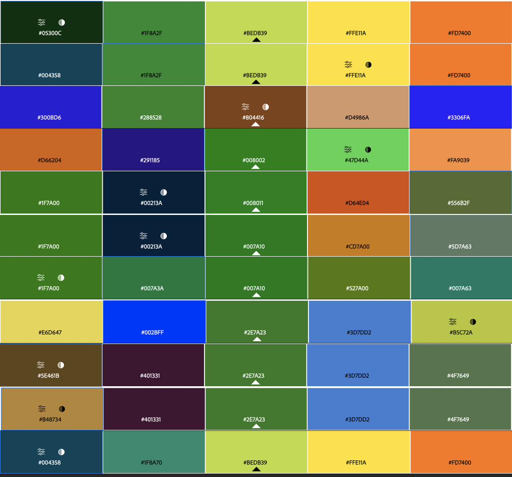

  


### Objectif : créer la maquette intéractive d'une site internet en utilisant Figma

#### Objectif Sprint 1

1. Visionner une vidéo récapitulative sur figma (1h ok)
2. Déterminer la charte graphique (2h estimé ok )
3. réaliser le logo (1h30 estimé -> 2h)
4. Réaliser le design simple des premieres pages simples (5h30 estimé -> temps restant )

## Introduction 

L'objectif de ce POK est de réaliser le site internet du projet sur lequel je travaille pour les Entrep', un programme d'entrainement à l’entrepreneuriat, avec la filière métier. Mon projet est un fast food healthy. Je travaille avec deux autres personnes dessus et c'est l'idée d'un d'entre eux. Même si nous avons commencé assez récemment, j'ai eu l'idée de commencer a faire une première maquette car c'est un bon moyen d'approfondir mes connaissances en design, tout en ayant de réelles contraintes fixées par l'équipe. Figma est un éditeur de graphiques vectoriels et un outil de prototypage apprécié des web designers.

### Charte graphique

Pour commencer ce travail de design, il est important de fixer une charte graphique. La réunion à ce sujet  vec l'équipe du projet a donné les résultats suivants :  

- couleurs : le vert, le orange et le jaune
- Le vert est une couleur indispensable à nos yeux
- visiter les sites internet de concepts similaires (père&fish, hello fresh, protein house)
- faire un site simple et chaleureux
- police en Questrial pour les titres/logo (ouvert au changement)
- logo avec du vert 
- 
Pour les couleurs, j'ai utilisé adobe color, (personnalisé, triade, monochrome, etc), voyons quelles combinaisons sont retenues: 

(image a refaire). Je préfère les suivantes :

Comme j'apprecie plusieurs configurations et que je ne suis pas la seule sur le projet, je vais faire les mêmes designs mais avec différentes combinaisons afin qu'on puisse comparer au mieux

### Le logo

Pour réaliser le logo, j'ai utilise l'application Canva que j'ai appris à utiliser pour l'occasion. Je suis partie de l'idée de faire un logo simple, avec du vert. j'ai fait les logos suivants :

je pense surement faire d'autres logo à l'avenir, au fur et à mesure que je prends en main l'application Canva.