  


### Objectif : créer la maquette d'une site internet en utilisant Figma

#### Objectif Sprint 1

1. Visionner une vidéo récapitulative sur figma (1h)
2. Déterminer la charte graphique (2h )
3. réaliser le logo (1h30 )
4. Réaliser le design simple des premieres pages simples ( temps restant )

## Introduction 

L'objectif de ce POK est de réaliser le site internet du projet sur lequel je travaille pour les Entrep', un programme d’entraînement à l’entrepreneuriat, avec la filière métier. Mon projet est un fast food healthy. Je travaille avec deux autres personnes dessus et c'est l'idée d'un d'entre eux. Même si nous avons commencé assez récemment, j'ai eu l'idée de commencer a faire une première maquette car c'est un bon moyen d'approfondir mes connaissances en design, tout en ayant de réelles contraintes fixées par l'équipe. Figma est un éditeur de graphiques vectoriels et un outil de prototypage apprécié des web designers.

### Charte graphique

Pour commencer ce travail de design, il est important de fixer une charte graphique. La réunion à ce sujet  vec l'équipe du projet a donné les résultats suivants :  

- couleurs : le vert, le orange et le jaune
- Le vert est une couleur indispensable à nos yeux
- visiter les sites internet de concepts similaires (père&fish, hello fresh, protein house)
- faire un site simple et chaleureux
- police en Questrial pour les titres/logo (ouvert au changement)
- logo avec du vert
  
Pour les couleurs, j'ai utilisé adobe color, (personnalisé, triade, monochrome, etc), voyons quelles combinaisons sont retenues: 

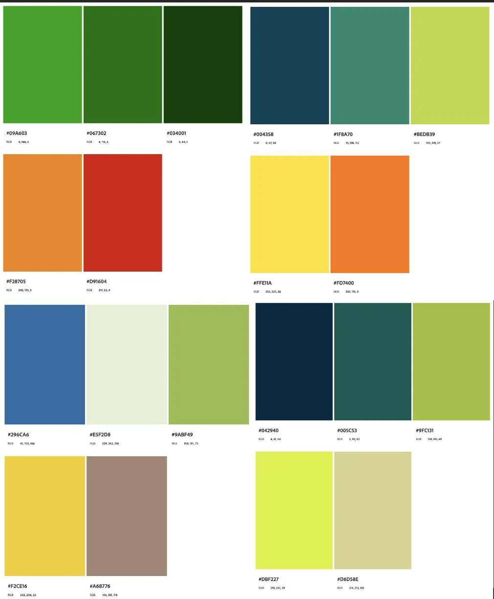

Comme j'apprécie plusieurs configurations et que je ne suis pas la seule sur le projet, je vais faire les mêmes designs mais avec différentes combinaisons afin qu'on puisse comparer au mieux.

### Le logo

Pour réaliser le logo, j'ai appris à utiliser (plus ou moins) l'application Canva. j'ai commencé par regarder une vidéo de 25 min sur la création de logo canva sur YouTube. Je suis partie de l'idée de faire un logo simple, avec du vert. j'ai fait les logos suivants :

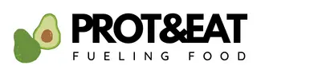
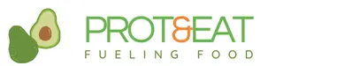

Pour l'instant je ne suis pas très convaincue mais je ne maitrise pas assez l'application. Je pense faire d'autres logo à l'avenir, au fur et à mesure que je prends en main l'application Canva.

### La barre d'outils 

Maintenant que j'ai un logo, un code couleur et la police souhaitée, je vais passer au premier design de la page de garde du site web.
Pour commencer, j'ai visité de nombreux sites de vente en ligne de nourriture ou de site web de restaurants et fast food. Certains sont très développés mais la plupart des sites web visités sont assez peu intuitifs ou très classique. 

J'ai ensuite commencé par faire le design de la barre d'outils, qui sera la même sur toutes les pages (quand je l'aurai choisie):

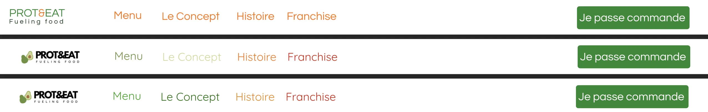

### Premières maquettes 

Puis j'ai fait une première maquette simple de la page principale et d'une autre page avant de les mettre en forme. Je me suis rendue compte que la police d'écriture fixée par le porteur de projet n'était pas adéquat pour la totalité de la page. J'ai donc  essayé différents designs et police d'écriture dont certains résultats sont ci-dessous

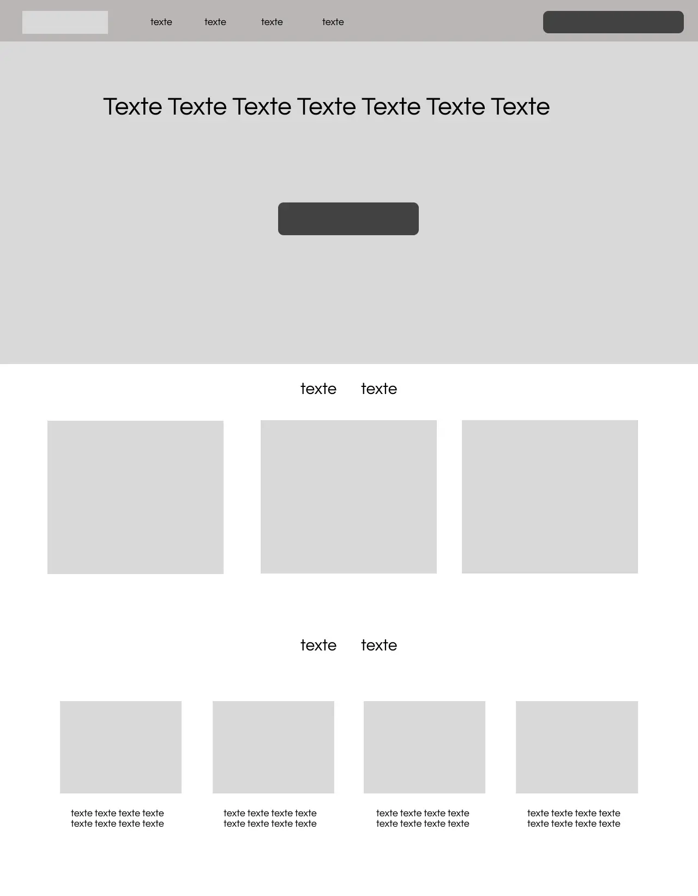

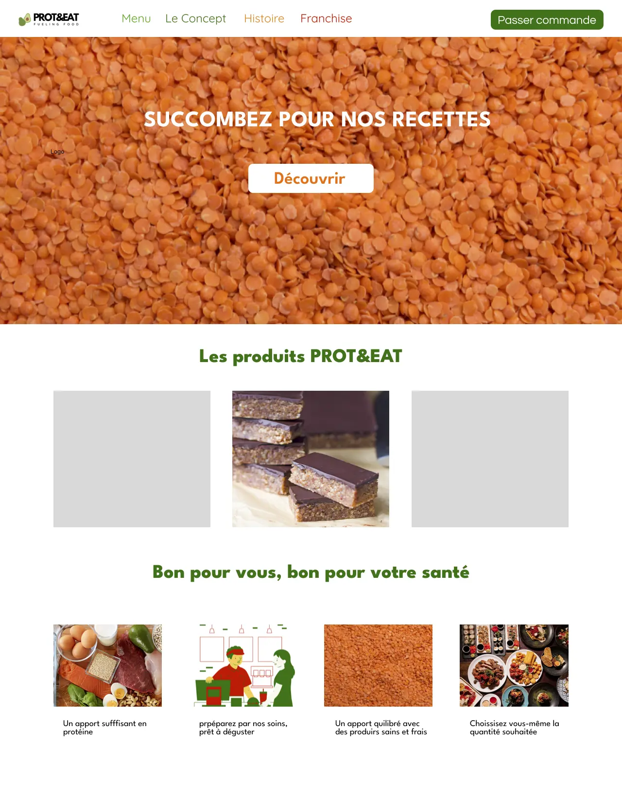

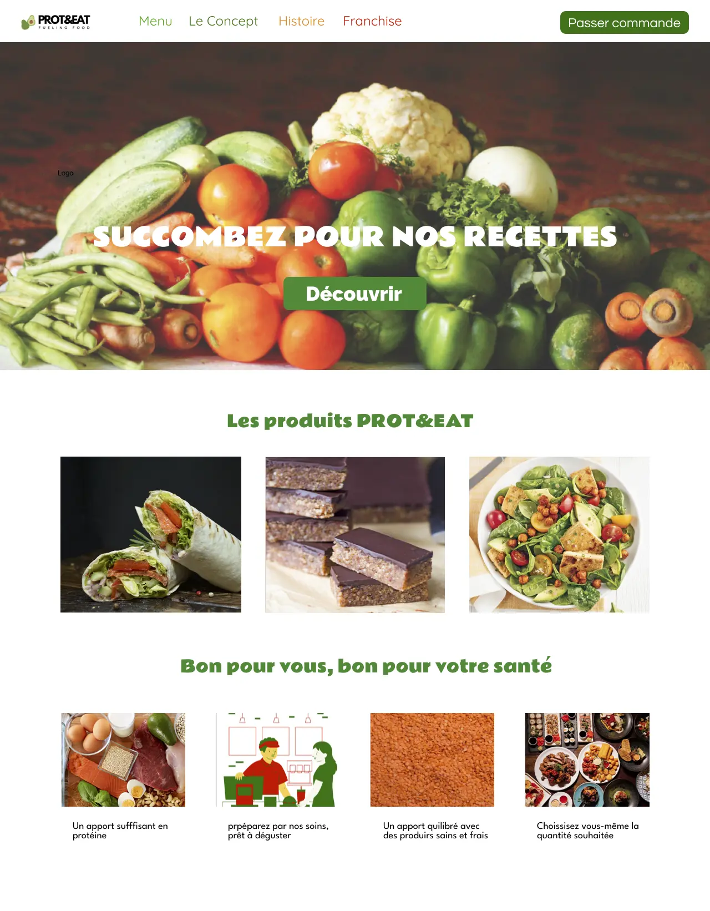

J'ai également fait varier le code couleur 

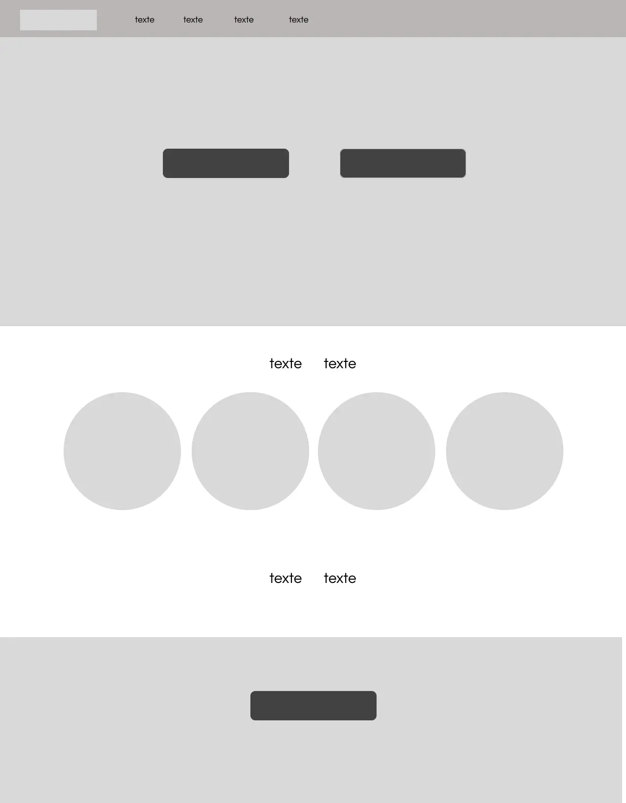

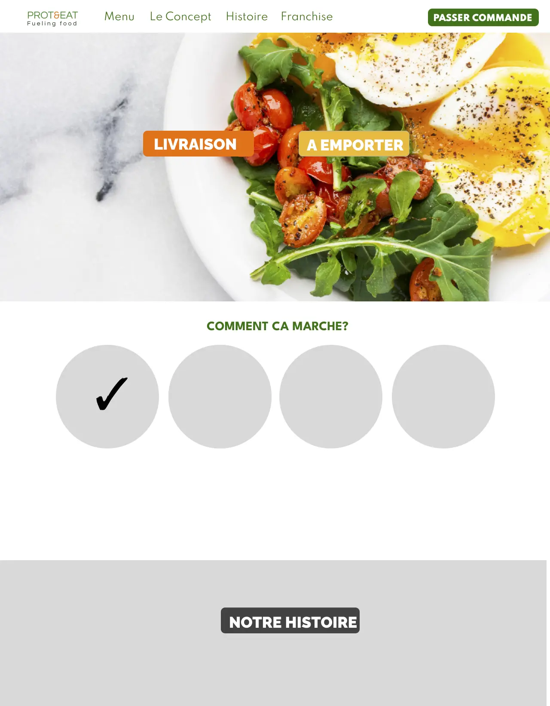

Je ne suis pas emballée par les images (trouvées sur internet) mais je sais qu'à l'avenir nous utiliserons nos propres photos et plats. 
l'idée était quand meme de rester dans les tons de vert jaune rouge orange.

### Conclusion sprint 1

Regardons le détail du travail effectué : 

| Travail effectué |  Temps | 
| -------- | -------- |-------- |
| Visionnage vidéo Figma YouTube  | 1h |
| Benchmarking et adobe Color  | 2h|
| Visionnage vidéo Canva YouTube et réalisation des logos | 2h |
| Réalisation de plusieurs versions de la barre d’outils  | 1h |
| Réalisation des maquettes simples | 1h30 |
| Recherches d’images et de nouvelles polices d’écriture  | 1h| 
| Design détaillé des pages et améliorations| 1h 30| 

Par rapport au temps estimé des tâches, je n'avais pas du tout pensé au temps que me prendrait les logos et j'avais grandement sous-estimé la recherche d'images et de police d'écriture adéquat, ce qui a diminué le temps consacré au design des pages. J'ai aussi passé beaucoup de temps sur adobe color mais je pense que je n'arrive juste pas à me décider ..

### Objectif sprint 2

Mes objectifs pour le sprint 2 sont : 

- Maquettes simples des pages de la barre d'outils (1h30)
- Maquettes détaillées des 3 pages de la barre d'outil (2h)
- Améliorer et fixer la typographie (1h)
- améliorer et fixer le logo  (1h) 
- continuer le maquettage (2h30)
- Améliorations (2h) 
  
J'ai une réunion d'équipe le 14 décembre ce qui me permettra d'avoir un avis d'équipe et d'avancer ensemble sur le logo et la typographie afin, je l'espère, de fixer la typographie, le code couleur et le logo.

## Sprint 2 

### Typographie, logo et barre d'outils 

##### Typographie

L'objectif de ce second sprint était de retravailler et fixer la police d'écriture. Au final, j'utilise : 

- Spartan pour la barre d'outils, les textes et les boutons cliquables (souvent en gras)
- League Spartan pour les titres 
- j'ai donc revu mes variants : 

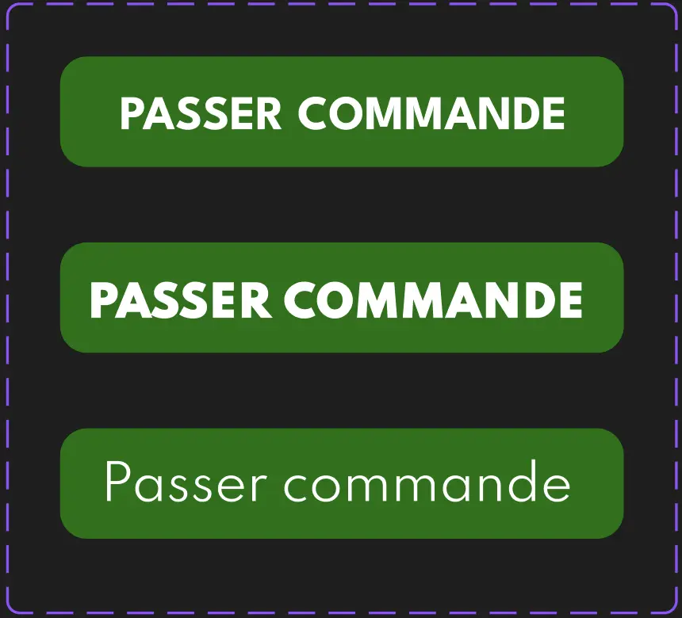

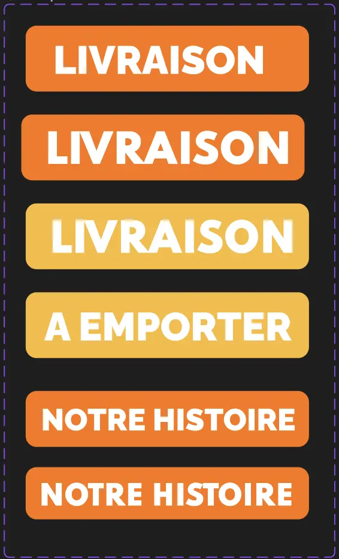

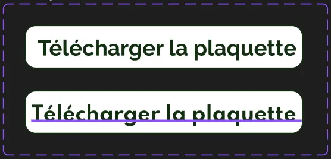

##### Logo 

Pour ce qui est du logo, après de nouveaux essais j'ai préféré revenir sur une de mes premieres idées : 

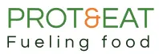
  
##### La barre d'outils 

Pour finir avec la barre d'outils, j'ai réalisé d'autres essais et ajouté la bonne typographie ce qui donne le résulat suivant : 

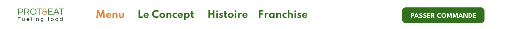

### Suite du maquettage 

Pour ce second sprint, j'ai continué le maquettage simple et détaillé des différentes pages que l'on trouve sur la barre d'outils.J'ai également fixer le code couleur. Par exemple, les pages franchise et menu ont les résultats suivants : 

`

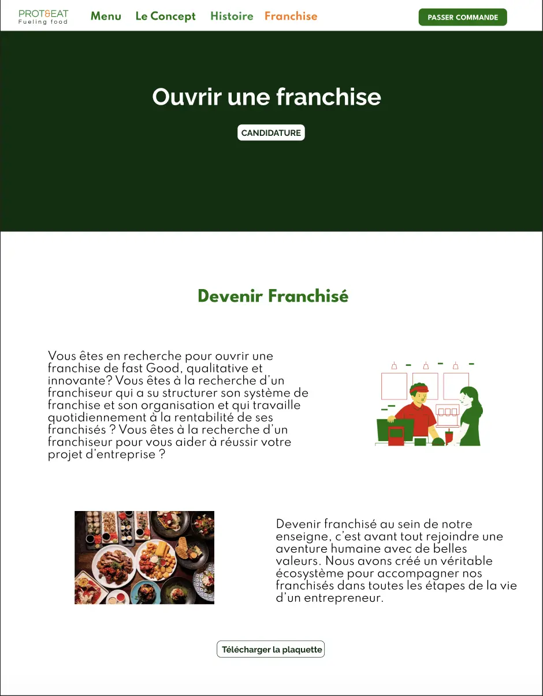

Il faut noter que j'ai volontairement utilisé les mêmes photos en plusieurs fois car a terme nous utiliserons nos photos. Qui plus est, je n'ai pas trouvé les photos que je souhaitais sur internet.
Par la suite j'ai continué le maquettage en faisant notamment le composant de bas de page : 

Avec tous les éléments réunis, j'ai commencé à rendre la maquette interactive a l'aide des variants. Sur figma, la fonctionnalité prototype permet de visualiser le site et les différentes pages et de donner suite aux boutons cliquables.

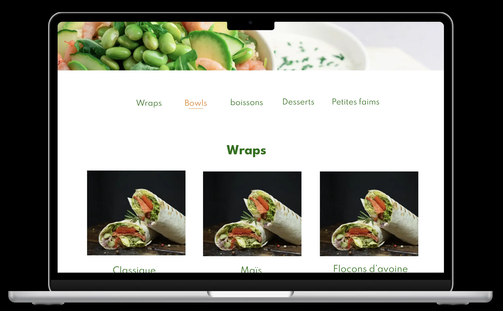

j'ai ensuite apporté des modifications aux différentes pages et composants.

### Remarque Sprint 2

Par rapport au temps estimé des tâches, j'ai plutôt respecté la répartition des objectifs mais je manque encore d'efficacité sur l'application. Qui plus est, comme au sprint 1, je mets trop de temps à prendre des décisions, en terme de couleurs, de typographie et de design. Au final je ne suis toujours pas satisfaite du design mais je suis quand même bien plus à l'aise sur Figma, notamment avec les composants et les variants.

### Conclusion générale 

Ce POK m'a permis de revoir et mettre en pratique mes connaissances de l'application Figma au moyen du maquettage d'un site web. Au final, je ne suis toujours pas satisfaite du design mais je suis quand même bien plus à l'aise sur Figma, notamment avec les composants et les variants.

| Travail effectué |  Temps | 
| -------- | -------- |-------- |
| Améliorer et fixer la typographie et les variants  | 2h |
| Améliorer et fixer le logo et la barre d'outils | 1h30 |
| Maquettes simples et détaillées des pages de la barre d'outils | 3h |
| Continuer le maquettage   | 1h30|
| Améliorations | 1h|
| Maquette interactive | 1h|

### Sources et images

<needpix.com>
<yummix.fr>
<pratico-pratiques.com>
<passeportsante.net>
<freepik.com>
<eatingwell.com>
<https://www.youtube.com/watch?v=_QzP8mLrCbY>
