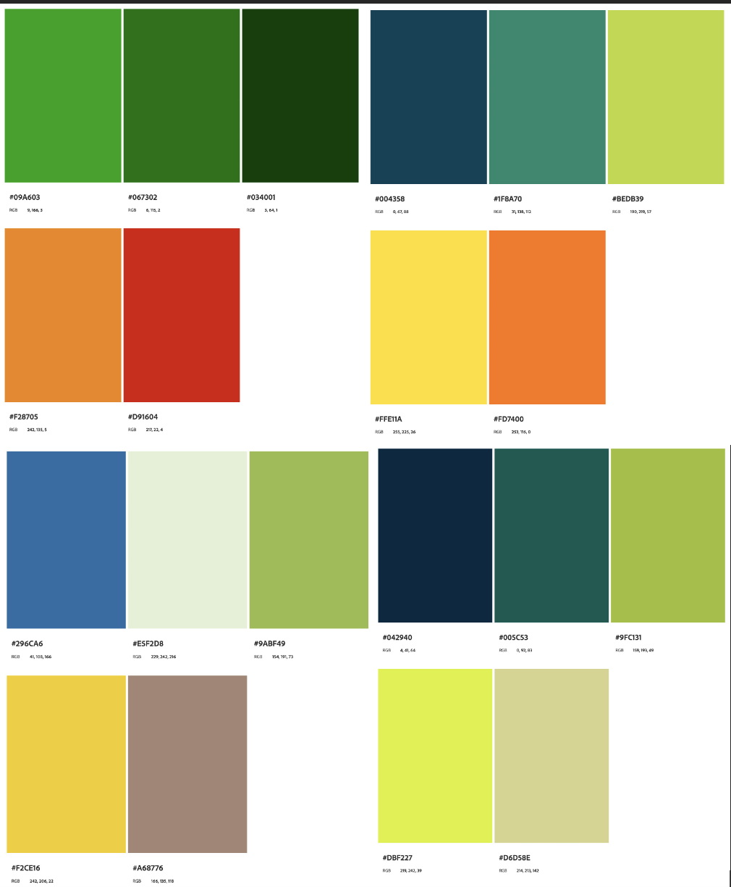

  


### Objectif : créer la maquette intéractive d'une site internet en utilisant Figma

#### Objectif Sprint 1

1. Visionner une vidéo récapitulative sur figma (1h ok)
2. Déterminer la charte graphique (2h estimé ok )
3. réaliser le logo (1h30 estimé -> 2h)
4. Réaliser le design simple des premieres pages simples (5h30 estimé -> temps restant )

### Charte graphique 

Pour commencer ce travail de design, il est important de fixer une charte graphique. Commencons par les couleurs.
Le thème étant la nourriture saine et protéinée, les couleurs venant à l'esprit sont le vert, le orange et le jaune. Le vert est une couleur indispensable à nos yeux Après plusieurs tests sur adobe color, (personnalisé, triade, monochrome, etc), voyons quelles combinaisons sont retenues: 

### Le logo 

Pour réaliser