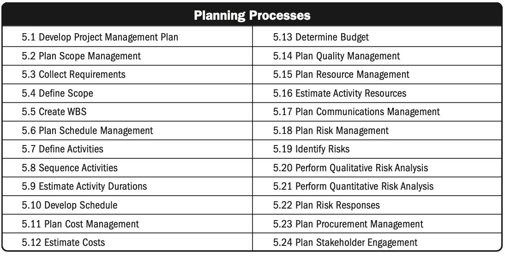

  


Afin  de bien préparer mon stage de fin d'étude en tant qu'assistante chef de projet, je vais pour ce POK étudier le PMI - Project Management Institut. Une partie du POK sera donc de synthétiser tout le savoir du PMI, et de le rendre transferable.
Ensuite, la deuxième partie sera une caractérisation des process du PMI dans ma mission ; comment les suivre,sur les phases de cadrage et de planification.

### Sommaire

1. Objectif Sprint 1
2. Introduction
3. Rôle du chef de projet
4. Initiating Process Group
5. Planning Process Group
6. Conclusion sprint 1
7. Objectif Srpint 2
8. Horodateur

### Objectif sprint 1

L'objectif de ce premier sprint est de lire le PMI et d'en faire un cours en résumé. L'idée est de se concentrer sur chacun des process.

### Introduction

 L'introduction du PMI fourni une vue approfondie des concepts clés du management de projet. Elle couvre l'importance du management de projet, les éléments fondamentaux, les processus de management de projet, le plan de management de projet et les mesures de succès.

1. Introduction au Management de Projet :
  
   - Le management de projet implique l'application de connaissances, de compétences, d'outils et de techniques pour répondre aux exigences du projet.
   - Les activités de gestion de projet incluent l'identification des besoins du projet, la gestion des parties prenantes, l'exécution du travail nécessaire pour livrer les résultats du projet, la gestion des ressources et l'équilibre entre les contraintes du projet.

2. Importance du Management de Projet :

   - Le management de projet permet aux organisations d'exécuter des projets efficacement et efficacement, répondant ainsi à divers objectifs commerciaux et attentes des parties prenantes.
   - Une gestion efficace des projets aide à atteindre les objectifs commerciaux, à satisfaire les attentes des parties prenantes, à augmenter les chances de succès, à résoudre les problèmes, à optimiser l'utilisation des ressources organisationnelles, à identifier et à gérer les projets en échec, à gérer les contraintes du projet et à s'adapter aux marchés changeants.

3. Éléments Fondamentaux :
   - Le projet : effort temporaire entrepris pour créer un produit, un service ou un résultat unique..
   - Le programme : des projets liés, des sous-programmes et des activités de programme gérés de manière coordonnée pour obtenir des avantages.
   - La gestion de programme : l'application de connaissances, de compétences et de principes à un programme pour atteindre ses objectifs.
   - Le portefeuille : des projets, des programmes, des portefeuilles subsidiaires et des opérations gérés en groupe pour atteindre des objectifs stratégiques.
   - La gestion de portefeuille : la gestion centralisée d'un ou de plusieurs portefeuilles pour atteindre des objectifs stratégiques.
   - Les relations entre la gestion de projet, de programme, de portefeuille et des opérations.

4. Cycle de Vie du Projet :
   - Un projet a un début et une fin définis.
   - La fin du projet est atteinte lorsque ses objectifs sont réalisés, qu'ils ne peuvent ou ne seront pas atteints, que le financement est épuisé, que le besoin du projet n'existe plus, que les ressources ne sont plus disponibles ou que le projet est résilié.
   - Les projets sont initiés pour répondre à des facteurs agissant sur les organisations, tels que la conformité réglementaire, les besoins des parties prenantes, l'amélioration ou la création de produits, processus ou services, et la mise en œuvre ou le changement de stratégies commerciales ou technologiques.

5. Processus de Management de Projet :
   - Un groupe de processus de management de projet pour atteindre des objectifs spécifiques.
   - Les processus sont regroupés en cinq groupes de processus de management de projet :
     - Initiation
     - Planification
     - Exécution
     - Surveillance et Contrôle
     - Clôture

6. Plan de Management de Projet :
   - Le plan qui décrit comment le projet sera exécuté, surveillé et contrôlé.
   - Intègre et consolide tous les plans de gestion et les référentiels subsidiaires, ainsi que d'autres informations essentielles pour la gestion du projet.
   - Comprend des plans de gestion subsidiaires (scope, coût, qualité, ressources, risques, communication, approvisionnement, parties prenantes), des référentiels de base (scope, calendrier, coûts), et d'autres composants comme le plan de management des changements, le plan de management de la configuration, le plan de gestion des parties prenantes, etc.

7. Mesures de Succès :
   - Déterminer si un projet est réussi est l'un des défis majeurs du management de projet.
   - Les mesures traditionnelles incluent le temps, le coût, le périmètre et la qualité, mais il est également important de considérer la réalisation des objectifs du projet.
   - Les objectifs de projet doivent être documentés et mesurables, alignés sur la stratégie organisationnelle et fournir de la valeur commerciale.
   - Le succès du projet peut inclure des critères supplémentaires liés à la stratégie organisationnelle, à la satisfaction des parties prenantes, à l'adoption des utilisateurs, à l'intégration des livrables, à la qualité de la livraison, etc.

### L’environnement du projet

La section sur l'environnement du projet met en avant l'impact des facteurs environnementaux sur les projets. Deux catégories principales de facteurs influencent les projets : 

- les facteurs environnementaux de l'entreprise (EEF)
  - Origine : Extérieure à l'organisation.
  - Influence : Peut être favorable ou défavorable.
  - Catégories :
    - Internes à l'organisation : Culture, infrastructure, ressources, etc.
    - Externes à l'organisation : Conditions du marché, influences sociales, contraintes légales, etc.
    - Impact : Sur les processus de gestion de projet, notamment la planification.
  
- les actifs de processus organisationnels (OPA)
  - Origine : Interne à l'organisation.
  - Composition : 
    - Plans, processus et documents standardisés 
    - Bases de connaissances, leçons apprises.
  - Utilisation : Influence la gestion et l'exécution du projet.
  - Mise à jour : Tout au long du projet selon les besoins.

La gouvernance joue également un rôle important dans le cycle de vie du projet, en établissant des politiques et des procédures pour guider les activités de gestion de projet.

Les EEF et les OPA sont des entrées essentielles pour de nombreux processus de gestion de projet, notamment pour la planification. Ils peuvent influencer positivement ou négativement le résultat du projet.

Les facteurs environnementaux internes à l'organisation incluent la culture organisationnelle, l'infrastructure, la disponibilité des ressources, etc. Ceux externes incluent les conditions du marché, les influences sociales et culturelles, les restrictions légales, etc.

Les OPA comprennent les plans, processus et documents de l'organisation, ainsi que les bases de connaissances. Ils sont utilisés pour exécuter ou gouverner le projet et sont mis à jour tout au long du projet.

La gouvernance organise la direction et le contrôle des projets, avec différents niveaux de gouvernance à l'échelle organisationnelle, de portefeuille, de programme et de projet.

Enfin, les bureaux de gestion de projet (PMO) sont des structures organisationnelles qui standardisent les processus de gouvernance liés au projet et facilitent le partage de ressources et de méthodologies. Ils peuvent être de types supportif, contrôlant ou directif, en fonction du degré de contrôle et d'influence qu'ils exercent sur les projets au sein de l'organisation.

### Rôle du chef de projet

Le chef de projet joue un rôle essentiel dans la direction d'une équipe de projet afin d'atteindre les objectifs. Dans certaines organisations, il peut être impliqué dans l'évaluation préalable du projet, la consultation des parties prenantes et la gestion des bénéfices. Son rôle peut varier et s'adapter à l'organisation, tout comme les processus de gestion de projet s'adaptent au projet lui-même. Dans tous les cas, il représente son équipe, en est responsable, et possède les compétences nécessaires pour mener à bien son projet. Il fournit à son équipe la direction, la planification et la coordination par le biais de la communication.

Le chef de projet dirige l'équipe de projet afin d'atteindre les objectifs du projet et de répondre aux attentes des parties prenantes. Il s'efforce de trouver un équilibre entre les contraintes concurrentes du projet et les ressources disponibles.
D'après plusieurs recherches, les meilleures chefs de projet possèdent les soft skills suivant parmi: 

- créer, maintenir et respecter les plans et les calendriers de communication
- communiquer de manière prévisible et cohérente 
- Chercher à comprendre les besoins en communication des parties prenantes du projet
- Faire en sorte que les communications soient concises, claires, complètes, simples, pertinentes et adaptées
- inclure les nouvelles importantes, positives et négatives
- Compétences relationnelles

Le chef de projet s'emploie également à :

- Démontrer la valeur de la gestion de projet,
- Accroître l'acceptation du management de projet dans l'organisation,
- Améliorer l'efficacité du PMO lorsqu'il existe dans l'organisation.

Il est essentiel pour les chefs de projet de maîtriser diverses méthodes de travail créatives pour réussir. Cela inclut l'adoption de méthodes prédictives, agiles, de la pensée design ou d'autres pratiques émergentes. De plus, développer un sens des affaires permet de prendre des décisions éclairées et rapides en comprenant les multiples facteurs d'influence au sein d'une organisation ou d'une industrie. Enfin, les compétences relationnelles, telles que le leadership collaboratif, la communication efficace et l'empathie, sont cruciales pour exercer une influence, inspirer le changement et construire des relations solides.

Le leadership et le management sont souvent confondus, mais ils diffèrent : le management consiste à diriger les autres vers un objectif avec des comportements attendus, tandis que le leadership implique de guider les autres à travers des discussions pour atteindre un but commun. Les chefs de projet doivent combiner les deux pour réussir, en adaptant leurs compétences et leur style de leadership à chaque situation. L'objectif final est de faire avancer les choses.

### Initiating Process Group

L'initiating process group regroupe les étapes d'initiation d'un projet, y compris le développement de la charte de projet et l'identification des parties prenantes. La charte de projet autorise formellement le projet et établit le lien entre le projet et les objectifs stratégiques de l'organisation. Elle donne également au chef de projet l'autorité nécessaire pour affecter les ressources aux activités du projet. L'identification des parties prenantes vise à analyser et documenter les informations pertinentes concernant leurs intérêts, leur implication et leur impact potentiel sur la réussite du projet. Ces processus sont cruciaux pour garantir le bon alignement du projet avec les objectifs de l'organisation et pour assurer l'engagement approprié des parties prenantes tout au long du projet.

### Planning Process Group

Le Planning process group établit la portée, les objectifs et le plan d'action du projet. Il utilise des boucles de rétroaction pour ajuster le plan en fonction des nouvelles informations et des changements. L'objectif principal est de définir la marche à suivre pour mener à bien le projet. L'implication des parties prenantes est encouragée pour élaborer le plan, qui devient une référence une fois approuvé.

Les différents process du Planning process group sont regroupés ci-dessous: 

1. **L'élaboration d'un plan de gestion de projet** consiste à définir, préparer et coordonner tous les éléments du plan et à les consolider dans un plan de gestion de projet intégré. Le principal avantage de ce processus est la production d'un document complet qui définit la base de tous les travaux du projet et la manière dont ils seront effectués. 
Le plan de gestion du projet définit les modalités d'exécution, de suivi, de contrôle et de clôture du projet. Son contenu varie en fonction du domaine d'application et de la complexité du projet.
Il est nécessaire de définir au moins les références du projet en matière de portée, de temps et de coût, afin que l'exécution du projet puisse être mesurée et comparée à ces références et que les performances puissent être gérées.
2. **La gestion du périmètre** implique la création d'un plan détaillant la définition, la validation et le contrôle du périmètre du projet. Son avantage principal est de fournir des orientations sur la gestion du périmètre tout au long du projet. Ce plan, intégré au plan de gestion du projet ou du programme, décrit comment le périmètre sera géré, contrôlé et validé. Son élaboration commence par l'analyse de diverses sources d'information, telles que la charte du projet, les plans précédents et les données historiques de l'organisation.
3. **La collecte des exigences** est le processus qui consiste à déterminer, documenter et gérer les besoins et les exigences des parties prenantes afin d'atteindre les objectifs. Le principal avantage de ce processus est qu'il sert de base à la définition de la portée du produit et de la portée du projet. Les exigences comprennent les besoins et les attentes quantifiés et documentés du commanditaire, du client et des autres parties prenantes. Ces exigences doivent être recueillies, analysées et enregistrées de manière suffisamment détaillée pour être incluses dans la base de référence du champ d'application et pour être mesurées une fois que l'exécution du projet commence.
4. **Définir le périmètre** est le processus qui consiste à élaborer une description détaillée du projet et du produit. Le principal avantage de ce processus est qu'il décrit les limites et les critères d'acceptation du produit, du service ou du résultat. Ce processus aboutit à la sélection des exigences finales du projet à partir de la documentation des exigences élaborée lors du processus de collecte des exigences.
5. **La création d'un WBS (Work Breakdown Structure)**  est le processus de subdivision des livrables et du travail d'un projet en éléments plus petits et plus faciles à gérer. L'avantage principal de ce processus est qu'il fournit un cadre de ce qui doit être livré. Le WBS (Work Breakdown Structure) découpe les travaux du projet en niveaux hiérarchiques pour atteindre ses objectifs. La SRT (Structure de Répartition du Travail) représente l'ensemble des travaux du projet définis dans l'énoncé de portée. Les travaux planifiés sont regroupés en lots pour faciliter leur gestion.
6. **La gestion du calendrier du projet**  consiste à établir les politiques, les procédures et la documentation nécessaires à la planification, au développement, à la gestion, à l'exécution et au contrôle du calendrier du projet. Le principal avantage de ce processus est qu'il fournit des conseils et des orientations sur la manière dont le calendrier du projet sera géré tout au long du projet.
7. **Définir les activités** consiste à identifier et à documenter les actions spécifiques à réaliser pour produire les éléments livrables du projet. Le principal avantage de ce processus est qu'il décompose les lots de travaux en activités de planification qui fournissent une base pour l'estimation, la planification, l'exécution, le suivi et le contrôle du travail du projet. 
8. **La séquence des activités** est le processus d'identification et de documentation des relations entre les activités du projet. Le principal avantage de ce processus est qu'il définit la séquence logique des travaux afin d'obtenir la plus grande efficacité possible compte tenu de toutes les contraintes du projet. Chaque activité, à l'exception de la première et de la dernière, doit être reliée à au moins une activité précédente et à au moins une activité suivante par une relation logique appropriée.
9. **L'estimation de la durée des activités** consiste à estimer le nombre de périodes de travail nécessaires pour mener à bien des activités individuelles avec des ressources estimées. Le principal avantage de ce processus est qu'il fournit le temps nécessaire à la réalisation de chaque activité. Estimer la durée des activités utilise des informations provenant du périmètre des travaux, des types de ressources nécessaires, des quantités estimées de ressources et des calendriers des ressources. D'autres facteurs peuvent influencer les estimations de durée comme les contraintes imposées, l'effort nécessaire et le type de ressources. Les estimations de durée progressent à mesure que les données d'entrée deviennent plus détaillées et précises. Le processus tient compte de la qualité et de la disponibilité des données d'entrée.
10. **L'élaboration du calendrier** est le processus d'analyse des séquences d'activités, des durées, des besoins en ressources et des contraintes de calendrier afin de créer un modèle de calendrier pour l'exécution, le suivi et le contrôle du projet. Le principal avantage de ce processus est qu'il génère un modèle de calendrier avec des dates prévues pour la réalisation des activités du projet. Les étapes clés comprennent la définition des étapes du projet, l'identification et l'enchaînement des activités, ainsi que l'estimation des durées. Une fois que les dates de début et de fin des activités ont été déterminées, il est courant de demander au personnel du projet affecté aux activités de passer en revue les activités qui leur ont été attribuées. 
11. **Le plan de gestion des coûts** consiste à définir la manière dont les coûts du projet seront estimés, budgétisés, gérés, suivis et contrôlés. Le principal avantage de ce processus est qu'il fournit des conseils et des orientations sur la manière dont les coûts seront gérés tout au long du projet. Il intervient dès le début de la planification du projet et définit le cadre de chacun des processus de gestion des coûts de manière à ce que l'exécution des processus soit efficace et coordonnée. C'est une composante du plan de gestion du projet.
12. **L'estimation des coûts** onsiste à développer une approximation du coût des ressources nécessaires à la réalisation d'un projet. Le principal avantage de ce processus est qu'il permet de déterminer les ressources monétaires nécessaires au projet. Il s'agit d'une prévision basée sur les informations connues à un moment donné. L'estimation des coûts comprend l'identification et l'examen des alternatives de coûts pour lancer et achever le projet. Les compromis en matière de coûts et les risques doivent être pris en compte, comme la fabrication par rapport à l'achat, l'achat par rapport à la location, et le partage des ressources afin d'obtenir des coûts optimaux pour le projet.
Les estimations de coûts doivent être revues et affinées au cours du projet pour tenir compte des détails supplémentaires disponibles et des hypothèses testées.
13. **La détermination du budget** est le processus d'agrégation des coûts estimés des activités individuelles ou des lots de travaux afin d'établir une base de référence des coûts autorisée. Le principal avantage de ce processus est qu'il détermine la base de référence des coûts par rapport à laquelle les performances du projet peuvent être suivies et contrôlées. Un budget de projet comprend tous les fonds autorisés pour exécuter le projet. La base de référence des coûts est la version approuvée du budget du projet échelonné dans le temps, qui inclut les réserves pour imprévus mais exclut les réserves de gestion.
14. **Le plan de gestion de la qualité** est le processus d'identification des exigences et/ou des normes de qualité pour le projet et ses produits livrables. Ce processus documente la manière dont le projet démontrera la conformité avec les exigences et/ou les normes de qualité. Le principal avantage de ce processus est qu'il fournit des conseils et des orientations sur la manière dont la qualité sera gérée et vérifiée tout au long du projet.
15. **Le plan de gestion des ressources** consiste à définir la manière d'estimer, d'acquérir, de gérer et d'utiliser les ressources matérielles et humaines. Le principal avantage de ce processus est qu'il établit l'approche et le niveau d'effort de gestion nécessaires pour gérer les ressources du projet en fonction du type et de la complexité du projet. La planification des ressources est utilisée pour déterminer et identifier une approche permettant de s'assurer que des ressources suffisantes sont disponibles pour mener à bien le projet.
16. **L'estimation des ressources de l'activité** est le processus d'estimation des ressources de l'équipe et du type et des quantités de matériaux, d'équipements et de fournitures nécessaires à l'exécution du travail du projet. Le principal avantage de ce processus est qu'il permet d'identifier le type, la quantité et les caractéristiques des ressources nécessaires pour mener à bien le projet.
17. **Le plan de gestion de la communication**  consiste à élaborer une approche et un plan appropriés pour les activités de communication du projet, en fonction des besoins d'information de chaque partie prenante ou groupe, des ressources organisationnelles disponibles et des besoins du projet. Le principal avantage de ce processus est une approche documentée permettant d'impliquer les parties prenantes de manière efficace et efficiente en présentant des informations pertinentes en temps opportun. Un plan de gestion des communications efficace est développé tôt dans le projet pour répondre aux divers besoins en information des parties prenantes. Il est régulièrement révisé pour s'adapter aux changements dans la communauté des parties prenantes ou aux nouvelles phases du projet. Les méthodes de distribution, de stockage et de révision des informations sont également prises en compte et documentées.
18. **Le plan de gestion des risques** consiste à définir la manière de mener les activités de gestion des risques pour un projet. Le principal avantage de ce processus est qu'il garantit que le degré, le type et la visibilité de la gestion des risques sont proportionnels aux risques et à l'importance du projet pour l'organisation et les autres parties prenantes.
19. **L'identification des risques** consiste à identifier les risques individuels d'un projet ainsi que les sources de risque global d'un projet et à documenter leurs caractéristiques. Il permet également de rassembler des informations afin que l'équipe de projet puisse répondre de manière appropriée aux risques identifiés. Identifier les risques implique de reconnaître les risques spécifiques au projet et leurs sources. Les participants clés incluent le chef de projet, les membres de l'équipe et les parties prenantes. 
20. **L'analyse qualitative des risques** consiste à classer par ordre de priorité les risques individuels d'un projet en vue d'une analyse ou d'une action plus poussée, en évaluant leur probabilité d'occurrence et leur impact ainsi que d'autres caractéristiques. Cela permet de concentrer les efforts sur les risques prioritaires. On identifie pour chaque risque un responsable qui sera chargé de planifier une réponse appropriée au risque et de veiller à ce qu'elle soit mise en œuvre.
21. **L'analyse quantitative des risques** consiste à analyser numériquement l'effet combiné des risques individuels identifiés et d'autres sources d'incertitude sur les objectifs globaux du projet. Cela quantifie l'exposition globale au risque du projet et peut également fournir des informations quantitatives supplémentaires sur le risque pour soutenir la planification de la réponse au risque. L'analyse quantitative des risques n'est pas nécessaire pour tous les projets. Elle dépend de la qualité des données disponibles et peut nécessiter des logiciels spécialisés et une expertise. Son utilisation est déterminée par le plan de gestion des risques et est généralement appropriée pour les projets complexes ou stratégiques.
22. **Planifier les réponses aux risques** consiste à élaborer des options, à sélectionner des stratégies et à convenir d'actions pour faire face à l'exposition aux risques globaux du projet et pour traiter les risques individuels du projet. Cela permet d'identifier les moyens appropriés pour faire face aux risques globaux et individuels du projet. Ce processus permet également d'allouer des ressources et d'insérer des activités dans les documents du projet et dans le plan de gestion du projet, le cas échéant. Des réponses efficaces aux risques minimisent les menaces et maximisent les opportunités. Les plans doivent être développés par le propriétaire de chaque risque important, et le gestionnaire de projet doit ajuster la réponse globale aux risques. Les réponses doivent être appropriées, rentables et réalistes.
23. **Le plan de gestion de l'approvisionnement** consiste à documenter les décisions d'approvisionnement du projet, à spécifier l'approche et à identifier les vendeurs potentiels. Le principal avantage de ce processus est qu'il permet de déterminer s'il faut acquérir des biens et des services en dehors du projet et, dans l'affirmative, ce qu'il faut acquérir ainsi que la manière et le moment de le faire. Les biens et services peuvent être acquis auprès d'autres parties de l'organisation exécutante ou de sources externes.
24. **Le plan d'engagement des parties prenantes** consiste à développer des approches pour impliquer les parties prenantes d'un projet en fonction de leurs besoins, de leurs attentes, de leurs intérêts et de leur impact potentiel sur le projet. Il fournit un plan d'action pour interagir efficacement avec les parties prenantes. Un plan de communication efficace est créé dès le début du projet pour répondre aux besoins d'information diversifiés des parties prenantes. Il est régulièrement révisé pour s'adapter aux changements dans les parties prenantes.

### Conclusion Sprint 1

Pour ce premier sprint j'ai pu lire presque entièrement le PMI, il me manque le dernier chapitre. J'ai besoin de relire certaines parties et je n'ai pas eu le temps de mettre toutes mes notes au propres sur la seconde partie du document.

### Objectif sprint 2

L'objectif pour la fin de ce POK est de finir le PMI et relire les parties nécessaires, finir de mettre au propre mes notes et mettre en application les connaissances acquises au servie de mon futur stage.

### Horodateur

| Date | Travail effectué |  Temps | 
| -------- | -------- |-------- | -------- |
| 17/02 | Lecture introduction et note | 1h |
| 18/02 | Lecture environment du projet et note | 1h |
| 21/02 | Lecture Role du chef de projet et note  | 1h30 |
| 24/02 | Lecture Iniciating process group et note | 0h30 |
| 25/02 | Lecture Planning Process group et note | 1h30|
| 26/02 | Lecture Executing Process group et note | 1h30|
| 27/02 | Lecture Monitoring and Controlling Process group et note | 1h|
| 28/02 | Lecture Closing Process group et Input et OUtput | 1h30|

