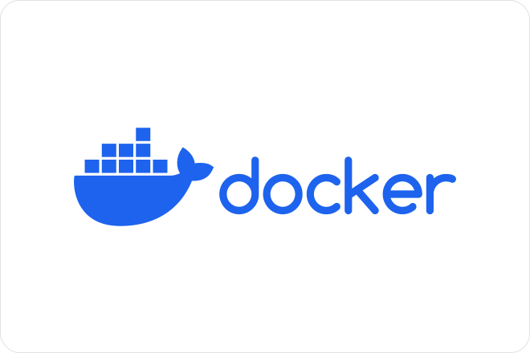

 

## Objectifs

L'objectif est avant tout de comprendre le rôle d'un orchestrateur dans le déploiement d'une application, en particulier web.

Ensuite, l'idée est de se familiariser avec Kubernetes. Si cela vous intéresse de découvrir comment sont déployées des applications (sites webs, APIs, bases de données dans le Cloud, etc.) de façon moderne : vous êtes au bon endroit !

## Prérequis

Des connaissances solides en Linux sont nécessaires pour aborder la pratique de ce MON. Autant que faire ce peut, je tâcherai de rendre compréhensible pour des néophytes les tâches exécutées. Aussi, je recommande vivement la lecture des différents MONs de Do_It à propos de Docker, auxquels je ferai régulièrement référence lors de cette restitution. En effet, nous allons déployer des applications que nous avons préalablement empaquetées avec cet outil.

## Autres MONs

Je renvoie à nouveau vers les différents MON sur Docker, puisque celui-ci sera la continuité de mon [MON 2.1](../temps-2.1).

Évidemment, je recommande toujours la lecture des différents MONs de Do_It, qui sont très bien faits et qui m'ont permis de monter en compétences sur ces sujets DevOps.
 - [Docker - Tunçay](../../../../2022-2023/Bilgi-Tuncay/mon/Docker/)
 - [Docker - Victor](../../../Victor-Ory/mon/Docker/)

## Objectifs du MON

L’objectif qui sera notre fil conducteur sera de comprendre comment déployer, par exemple, une application comprenant un Back-End, un Front-End et une belle base de données à l’aide d’un orchestrateur pour le rendre plus résilient aux erreurs et aux lenteurs qui peuvent survenir dans un projet informatique. Le but est de se former à des problématiques rencontrées en entreprise pour monter en compétences dans les domaines auxquels j’ai pu postuler et auxquels je postulerai à l’avenir.

Prêt ? Alors c’est parti : embarquons dans le monde merveilleux des orchestrateurs…

## Un orchestrateur, pourquoi faire ?

Un outil d’orchestration permet de gérer des applications conteneurisées. Pour rappel, un conteneur est une brique légère et autonome qui contient tout ce dont une application a besoin pour s'exécuter, y compris le code, les dépendances et les configurations. Les conteneurs sont portables, faciles à déployer et à mettre à l'échelle, et ils offrent un environnement isolé pour exécuter des applications.

L’intérêt majeur est la disponibilité : si un container tombe à l’intérieur d’un orchestrateur, l’application reste disponible. En effet, l’orchestrateur peut se charger de lancer plusieurs instances d’une même application (un back-end par exemple) et de relancer une instance qui aurait crashé.

Ensuite, celui-ci permet de régler des problématiques de mise à l’échelle. En effet, en fonction de la demande sur un site, la charge et le temps de réponse diffèrent. C’est pourquoi l’orchestrateur choisit de répartir la charge et de définir des règles qui augmentent la scalabilité (un anglicisme souvent employé dans le monde de la blockchain pour parler de mise à l’échelle) d’une application.

## Les bases de Kubernetes

### Cheat Sheet des commandes apprises au cours du MON

Je recommande vivement de lire le [cheat sheet](./cheat_sheet) que j'ai rédigé pour ce MON. Il contient les commandes de base pour utiliser Kubernetes.

### Notions du [tutoriel vidéo](https://www.youtube.com/watch?v=s_o8dwzRlu4)

La partie suivante comportera des éléments [du tutoriel de 3h](https://www.youtube.com/watch?v=X48VuDVv0do) de la [même chaîne YouTube](https://www.youtube.com/@TechWorldwithNana). En parcourant celui-ci, nous approfondissons la connaissance pendant la mise en pratique des concepts sur ma machine. Je vais joindre ici la prise de note effectuée avec les vidéos de cette chaîne.

Voici un schéma explicatif de l'architecture de Kubernetes (Source: https://wikipedia.org/wiki/kubernetes/) :

Voici ce que l'on retient des concepts du visionnage :

### Master Node

Le **Master Node** est un serveur comprend un serveur API, un `controller manager`, un `Scheduler`, et un `etcd`. Il est possible de mettre en place des Multiples Master Nodes garantissent la redondance pour l'accès aux worker nodes (ceux qui contiennent les Pods, les Services etc. vus ensuite). Pour les détails de chaque explication, je recommande vivement la vidéo qui l’explique bien.

### Node et Pod

Parmi les concepts les plus importants, un **[Node](https://kubernetes.io/docs/concepts/architecture/nodes/)** (noeud) est une machine physique ou virtuelle. Un **[Pod](https://kubernetes.io/docs/concepts/workloads/pods/)** est une abstraction d'un [container Docker](https://kubernetes.io/docs/concepts/containers/), souvent dédié à une seule application (je renvoie à mon précédent MON sur le sujet, à nouveau !). Pour résumer, on a aussi des notions de **[services](https://kubernetes.io/docs/concepts/services-networking/service/)** qui offrent des accès réseaux stables, et les **[ingress](https://kubernetes.io/docs/concepts/services-networking/ingress/)** résolvent les services externes.

### ConfigMap et Secrets

Les ConfigMap et secrets sont des notions utilisées dans les fichiers de configuration et permettent justement la configuration des services, tandis que la sécurisation des secrets est stockée à un endroit différent pour éviter des fuites de tokens ou de clés, par exemple.

### Persistance d'une base de données

L'attachement d'un **volume** aux services assure la persistance des données, que le stockage soit interne ou distant. Le plus gros problème avec les volumes est que leur redondance est plus complexe que de simples applications. En effet, cela renvoie à un dilemme connu en sciences informatiques concernant la confidentialité, l’intégrité et la disponibilité de l’information, nommé le triangle de la sécurité de l'information.

### Deployment et Statefulset

Le **[Deployment](https://kubernetes.io/docs/concepts/workloads/controllers/deployment/)** permet de définir la répartition entre les nœuds en cas de défaillance.

Ensuite, la réplication d'une base de données requiert la gestion de l'état et de la consistance, une tâche complexe comme nous l’avons abordé juste avant, c’est pour cela que l’on configure un Statefulset. Nous ne rentrerons pas en détail dans celui-ci.

### Configuration

Il existe trois méthodes pour interagir avec Kubernetes : l’UI (interface utilisateur), l’API ou la ligne de commande (kubectl), cette dernière étant plus courante. Les fichiers de configuration, au format yaml ou json, définissent les déploiements et services, avec des sections metadata, specifications, et status. Stocker ces fichiers sur un repo git est une bonne pratique, un peu à la manière des DockerFiles.

On retrouvera aussi un exemple de fichier de configuration dans la [cheat sheet](./cheat_sheet).

## Introduction à Helm

Après avoir établi les bases de Kubernetes, plongeons dans Helm, un outil qui facilite le déploiement d'applications sur des clusters Kubernetes.

Helm est souvent comparé à un gestionnaire de paquets pour Kubernetes. Il simplifie le processus de déploiement et de gestion des applications en encapsulant ces dernières dans des "charts", des paquets pré-configurés comprenant toutes les ressources nécessaires.

La façon dont j'ai appris à utiliser Helm est de l'utiliser pour déployer des applications qui ont déjà été empaquetées avec Docker. Il s'agissait de poster les images sur un repo Docker, puis de les déployer avec Helm.

La documentation explique bien les étapes de configuration de l'outil, et il s'avère très pratique pour la gestion des packages et le déploiement rapide d'applications. [5]

## Pratique

Pour la partique, j'ai commencé par configurer mon cluster Kubernetes avec minikube, puis j'ai déployé une application web très légère avec une base de données MongoDB.

Je voulais déployer une plus grosse application, celle du Barbu, développée en Projet Thématique de 2A avec un côté API/Front-End distinct qui se prêtait bien à l'exercice.  Cependant, cette tâche prévue initialement s'est avérée trop lourde pour être réalisée et je me suis contenté d'ajouter de simples petites applications Python avec Helm, en ajoutant des interactions réseau entre les images.

## Regard critique et ouverture

J'ai apprécié découvrir le monde vaste des orchestrateurs pour l'aspect professionnalisant qu'ils permettent d'apporter à un déploiement d'application.

Ce MON est évidemment un résumé beaucoup plus succint que les tutoriels suivis, mais je recommande leur visionnage car ceux là permettent d'appréhender plus serainement les concepts de Kubernetes.

Enfin, j'ai pu à la suite de ce MON, mettre en pratique les compétences acquises en entreprise.

## Bibliographie

[1] Exemple de déploiement d’une application réelle :

[YouTube - 95% des devs ne connaissent pas cette façon de déployer une application - Benjamin Code](https://youtu.be/10UU6umqqv8?si=RUJAD5NFs57oSnzK&t=496)

[2] Vidéo de référence pour débuter sur Kubernetes (1h) :

[YouTube - Kubernetes Crash Course for Absolute Beginners -](https://www.youtube.com/watch?v=s_o8dwzRlu4) [TechWorld with Nana](https://www.youtube.com/@TechWorldwithNana)
    
[3] Vidéo de référence pour débuter sur Kubernetes (3h) :

[YouTube - Kubernetes Tutorial for Beginners [FULL COURSE in 3 Hours] -](https://www.youtube.com/watch?v=X48VuDVv0do) [TechWorld with Nana](https://www.youtube.com/@TechWorldwithNana)

[4] Documentation officielle de Kubernetes :

[Documentation Kubernetes](https://kubernetes.io/docs/home/)

[5] Documentation officielle de Helm, introduction :

[Documentation Helm](https://docs.helm.sh/fr/docs/intro/quickstart/)
