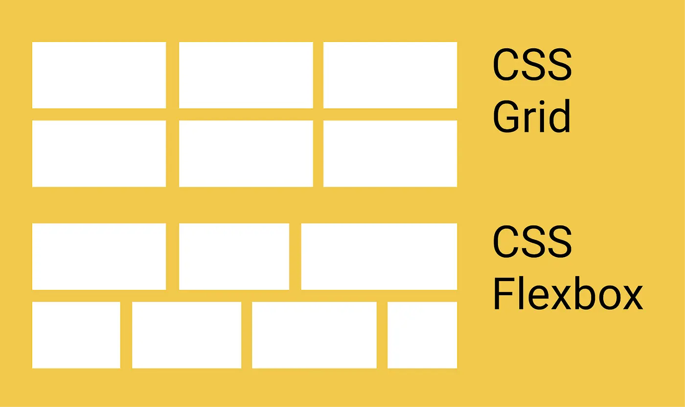

<div style="display:flex;flex-direction:row;">
    
    
</div>

## Prérequis

Il est préférable d’avoir fait un peu de CSS (voir Sass que nous approfondirons) et de développement Front-End pour suivre les parties de code. Quelques notions d’UI/UX Design seront nécessaires, comme le cours électif de Do_It sur le sujet, par exemple. Bonne lecture !

## Autres MONs

Le [MON de Lucie](https://francoisbrucker.github.io/do-it/promos/2023-2024/Lucie-Le-Boursicaud/mon/temps-2.2/) porte sur le sujet qui m’intéresse. Après avoir navigué dans ses notes, je décide de me lancer dans le visionnage du cours OpenClassrooms sans y passer les 15 heures préconisées et m’attarder sur les parties qui ont suscité mon intérêt pour la rédaction d’un tel MON.

J’ai aussi vu au cours de l’année au cours d’un MON de Benoit “**[HTML C'est Super Simple](https://francoisbrucker.github.io/do-it/promos/2023-2024/Beguier-Benoit/mon/temps-1.2/)**” un petit jeu nommé Flexbox Froggy que nous allons utiliser pour se remettre à niveau.

## Objectifs du MON

- Se remettre à niveau sur des bases non maitrisées de CSS
- Designer un animation
- Savoir porter un design Figma vers un code CSS
- Appliquer les designs au site portfolio fait en POK 1
- Tester les performances

## Revenir aux sources

Combien de fois me suis-je dit qu'il ne pourrait pas y avoir de bon projet sans fondation solide? Et combien de fois, malgré cela, me suis-je lancé dans un nouveau site sans revoir ces mêmes fondations…

En revenant à ces bases, je souhaite non seulement solidifier mes connaissances, mais aussi me donner les outils nécessaires pour résoudre efficacement les problèmes centrés sur le design qui pourrait se poser à moi à l'avenir.

### Les positionnements

**`How to center a div`** est probablement la recherche la plus tapée sur Google par nos amis développeurs débutants ou simplement Back-End. C’est parce que l’on revient rarement à des choses aussi élémentaires que de s’occuper de son jardin et de ses grenouilles. En témoigne le petit jeu [Flexbox Froggy](https://flexboxfroggy.com) qui nous rappelle de façon ludique comment placer des éléments grâce à `display: flex;`.

Rien à ajouter : jouez-y. En pratiquant régulièrement les concepts, il y a de fortes chances que la question initiale de cette section ne soit qu’un lointain souvenir. À la manière des serious games, le jeu pourrait même conférer des facilités de mémorisation sur le long terme [\[7\]](#bibliographie). Tout est en place pour acquérir et mémoriser les positionnements dans le web, pour de bon.


Tout… pas si sûr ! ☝🏼 Je crois avoir entendu parler de `display: grid;`, non ?


En effet ! Il m’est arrivé d’utiliser des grids pour aligner des éléments. Cela fait encore partie de la liste des basiques à avoir dans sa boîte à outils, mais pour autant je réalise qu’il me faut reprendre certains points.

Un peu à la manière des flexbox, les grids CSS offrent un système de positionnement puissant pour organiser les éléments sur une page web. En utilisant **`display: grid;`**, nous pouvons définir des grilles composées de lignes et de colonnes, permettant un contrôle précis sur la disposition des éléments enfants à l'intérieur du conteneur de grille. Avec les propriétés telles que **`grid-template-columns`**, **`grid-template-rows`** et **`grid-gap`**, nous pouvons définir la structure de la grille, spécifier la taille des colonnes et des lignes, ainsi que l'espacement entre elles. Les grids CSS offrent une alternative flexible et efficace pour créer des mises en page adaptatives, en offrant des fonctionnalités avancées pour l'alignement et le positionnement des éléments.

Sur inscription est aussi disponible un jeu du même auteur que Flexbox Froggy : [Grid Garden](https://codepip.com/games/grid-garden/).

Pour résumer, la grid doit être utilisée pour favoriser la **disposition de la page** tandis que le flex met l’accent sur les **différents contenus des éléments** [\[8\]](#bibliographie).


Source : [8]

## Une corde de plus a notre arc : les animations


Avant toute chose, un presque prérequis pour ce cours a déjà été abordé dans le cadre d’[un de mes POK](../../pok/temps-1/). En effet, il s’agit de Sass. Le cours est lisible sans connaitre cette technologie, mais nous reviendrons sur Sass dans ce MON et dans le cours OpenClassrooms auquel il fait référence.
 

#### Bonnes pratiques de design

Pour cette partie, nous pouvons pratiquer sur Figma pour tester des concepts étudiés.

Douze principes venant du cinéma d’animation régissent les règles d’animation. Nous allons utiliser Figma pour mettre en pratique ces principes.

Pour résumer, la vidéo [[2]](#bibliographie) donne une bonne idée de ces principes appliqués par les UI designers et Motion Designers pour donner vie aux sites web de façon naturelle. Pour l’implémentation, je recommande le visionnage de [[4]](#bibliographie) d’un excellent vidéaste français pour ce qui touche au design d’interface.

J’ai effectué quelques tests sur mon Figma et vous pouvez voir [le résultat ici](https://www.figma.com/proto/ZzfWiYmFJc8P5VVmpu05Gi/Animation-Presentation?type=design&node-id=1-2&t=C7OA6eEmvNZRs14l-1&scaling=min-zoom&page-id=0%3A1&starting-point-node-id=1%3A2&mode=design
).


*Source du logo: [Cours en Do_It, projet servant d’exemple et ancien projet étudiant](https://github.com/atordjmann/cours_ecm/blob/main/frontend/src/assets/images/logo_blue.svg)*


#### Quelques règles pour faire des transitions

C’est maintenant que nous plongeons tout droit dans le cours d’Openclassrooms [[1]](#bibliographie) suivi par Lucie. Je recommande la lecture de son MON pour se faire une idée et si cela vous intéresse, du cours tout entier. Voici ce que j’en retiens à ma manière :

#### Les propriétés à retenir

```scss
transition-property: transform; /* Propriété à modifier */
transform: scale(1) /* Valeur initiale */
transform: scale(1.2) /* Valeur finale (même propriété) */
transition-duration: 1ms, 1s, ...;
/* Événement déclencheur (pseudo-classe ou infini et répétitif) */
```

Il est possible de combiner ces propriétés en une seule, bien sûr. Par exemple :

```scss
transition: transform 100ms;
```

#### Complexifier ses transitions

On peut séparer les transitions par des virgules et plusieurs se produiront. On peut dès lors les espacer avec la propriété `transition-delay` à mettre après `transition-duration` dans `transition`. On a donc :

```scss
transition: transition-property transition-delay,
            transition-property transition-delay transition-duration;
```

Plus d’informations peuvent être trouvées sur l’excellente documentation de Mozilla [[5]](#bibliographie).

#### Performances

Arrêtons-nous quelques instants sur la partie performances du site avant d’y ajouter des animations supplémentaires. En se référant au chapitre qui traite des performances, on se rend compte qu’il ne faut animer que certaines propriétés pour que le navigateur rende le moins d’éléments possibles.

Ainsi, on n’animera pas les propriétés qui lancent le rendu de la mise en page (`render`) ou de la traduction en pixels (`paint`) par le navigateur, mais seulement l’étape suivante : la `composition`.

Typiquement, les propriétés CSS `width` ou `height` interviennent trop tôt dans le calcul de l’affichage de la page et obligent le navigateur à faire à nouveau toutes les étapes d’après, tandis que les propriétés `transform` et `opacity` se déroulent à la fin du rendu. On préfèrera alors les dernières évoquées.

Ceci étant dit, on peut inspecter et modifier ses animations avec l’inspecteur d’élément Chrome. Il convient donc de regarder si les animations ne sont pas trop gourmandes pour les ordinateurs les moins performants, et ajuster celles-ci le cas échéant. Google a développé de très bons outils d’inspection dans les Chrome DevTools, comme le montre l’article sur leur site [[6]](#bibliographie). On peut grâce à l’outil performances vérifier que nous ne ralentissons pas la page en la surchargeant d’effets.

#### Exemple : mon portfolio.

[Le portfolio](http://alouradou.perso.centrale-marseille.fr) que j’ai conçu durant mon premier POK contient des lignes animées qui bougent en arrière plan, et j’ai toujours pensé que ces animations seraient véritablement gourmandes en ressources. 

Pour vérifier cela, j'ai utilisé l'outil de performances de Chrome DevTools. Après avoir analysé les résultats, j'ai constaté que, bien que les animations soient quelque peu exigeantes, elles ne ralentissent pas considérablement la page. En effet, inspectons le code :


```scss
@import '../../scss/variables';

.background, .background::before {
  position: fixed;
  top: 0;
  left: 0;
  bottom: 0;
  right: 0;
  z-index: -1;
  overflow: hidden;
}

.background::before {
  content: '';
  background: $main-gradient;
  width: 200vw;
  height: 200vw;
  transform: rotate(-35deg);
  transform-origin: center left;
}

.line {
  width: calc(100vh + 100vw + 100%); // increase the size of the line so that it is always visible
  border-top: 2px solid white;
  position: relative;
  top: -20px;
  right: 0;
  opacity: 0;
  filter: blur(0px);
}

.line-left {
    transform-origin: left;
    transform: rotate(25deg);
    animation: move-left 10s linear infinite;
}

.line-right {
    transform-origin: right;
    transform: rotate(-25deg);
    animation: move-right 10s linear infinite;
}

.line-alternate {
  animation-direction: alternate;
}

/* -- Timings and durations -- */
.line:nth-child(1) {
  animation-duration: 25s;
  animation-delay: 6s;
}
.line:nth-child(2) {
  animation-duration: 13s;
  animation-delay: 8s;
}
.line:nth-child(3) {
  animation-duration: 18s;
  animation-direction: reverse;
}
/* ... */

/* -- Animations -- */
@keyframes move-left {
  0% {
    transform: translateX(-60%) rotate(25deg);
    opacity: 0;
    filter: blur(5px);

  }
  10% { opacity: 0; }
  70% { opacity: 1; }
  80% { filter: blur(0px); }
  90% { opacity: 0; }
  100% {
    transform: translateX(50%) rotate(25deg);
    opacity: 0;
    filter: blur(0px);
  }
}
@keyframes move-right {
  0% {
    transform: translateX(-10%) rotate(-25deg);
    opacity: 0;
    filter: blur(0px);
  }
  10% { opacity: 0; }
  20% { filter: blur(0px); }
  70% { opacity: 1; }
  90% { opacity: 0; }
  100% {
    transform: translateX(-100%) rotate(-25deg);
    opacity: 0;
    filter: blur(9px);
  }
}
/* --- */
```


On peut voir à la lecture de ce code que les animations sont effectivement réalisées avec des propriétés `transform` et `opacity`, ce qui respecte les recommandations pour une meilleure performance.

#### Les keyframes

La notion de keyframes est aussi abordée dans le cours pour mettre en place des animations plus complexes, c’est ce qui a été utilisé ici pour donner une impression aléatoire au mouvement.

## Sass

Comme je l'ai mentionné dès le début, Sass est l'une de mes belles découvertes de l'année en termes de production de code propre et maintenable à long terme. J’avais pu commencer le visionnage du cours OpenClassrooms [9] par le passé et avait été frappé par sa clareté.

Pour faire simple, Sass est un préprocesseur CSS, ce qui signifie que l’on écrit du code qui est ensuite compilé pour être lu par le navigateur, en CSS original.

## Ce que j’ai appris durant ce MON

Au cours de ce MON, j'ai appris à exprimer et à articuler des aspects de la conception et du développement CSS qui étaient précédemment passés sous silence ou réalisés de manière précipitée. Mon objectif était de prendre le temps de comprendre ces éléments en profondeur et de les expliquer de manière claire et détaillée. En effet, pour reprendre l’exemple de mon portfolio, j’avais pu réaliser par le passé des animations sans comprendre fondamentalement les enjeux de performance ou de décomposition de procédés complexes.

En somme, ce MON a été une occasion précieuse de renforcer mes compétences en CSS. Il m'a permis de mieux comprendre l'importance des performances et de la façon dont les animations peuvent améliorer l'expérience utilisateur. Enfin, il a souligné l'importance de toujours revenir aux bases et de continuer à apprendre, même dans des domaines que nous pensons maîtriser.

## Bibliographie { #bibliographie }

[1] OpenClassrooms - **Créez des animations CSS modernes**
https://openclassrooms.com/fr/courses/5919246-creez-des-animations-css-modernes

[2] AlanBeckerTutorials - **12 Principles of Animation (Official Full Series)**
https://www.youtube.com/watch?v=uDqjIdI4bF4

[3] Basti UI - **Animer ses design avec Figma**
https://www.youtube.com/watch?v=-zr_JzddTSk

[4] Basti UI - **Tuto Figma : créer une animation de switch**
https://www.youtube.com/watch?v=rk43LIeTsjc

[5] Mozilla - **Using CSS transitions**
https://developer.mozilla.org/en-US/docs/Web/CSS/CSS_Transitions/Using_CSS_transitions?ref=yon.fun

[6] Google Developers - **Animations in Chrome DevTools**
https://developer.chrome.com/docs/devtools/css/animations/

[7] Pascal Brassier, Patrick Ralet. **LA GAMIFICATION POUR APPRENDRE : PERCEPTIONS DES ACTEURS ET PISTES DE DÉVELOPPEMENT.** @GRH, 2021. [hal-03180445](https://uca.hal.science/hal-03180445)

[8] Berker Erol - **CSS Grid vs. CSS Flexbox — How and when to use them**
https://medium.com/css-grid-vs-css-flexbox-how-and-when-to-use-them/css-grid-vs-css-flexbox-how-and-when-to-use-them-80ed02188016

[9] OpenClassrooms - **Simplifiez-vous le CSS avec Sass**
https://openclassrooms.com/fr/courses/8069761-simplifiez-vous-le-css-avec-sass
