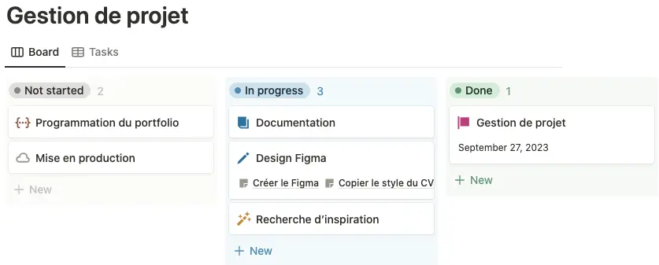
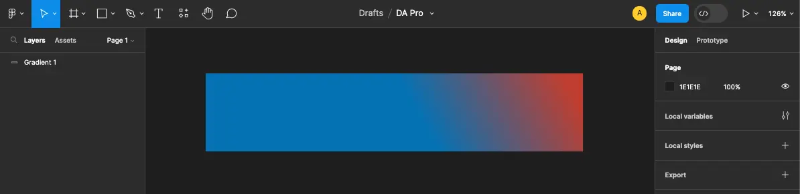
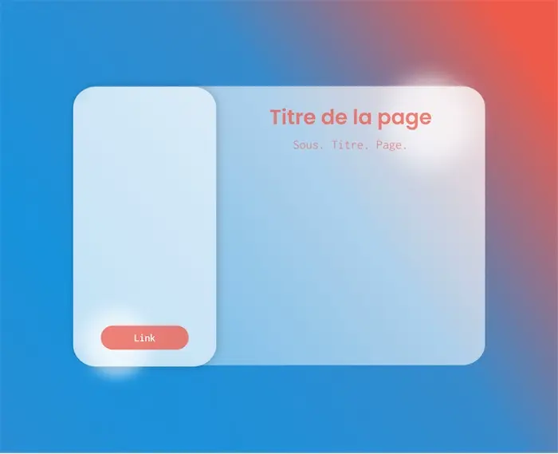
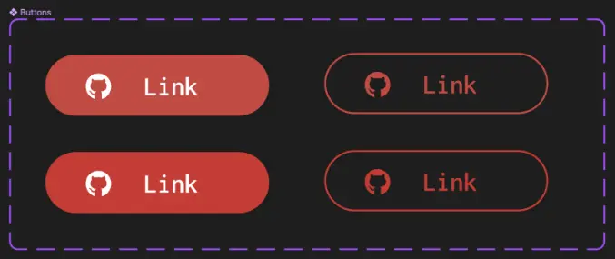
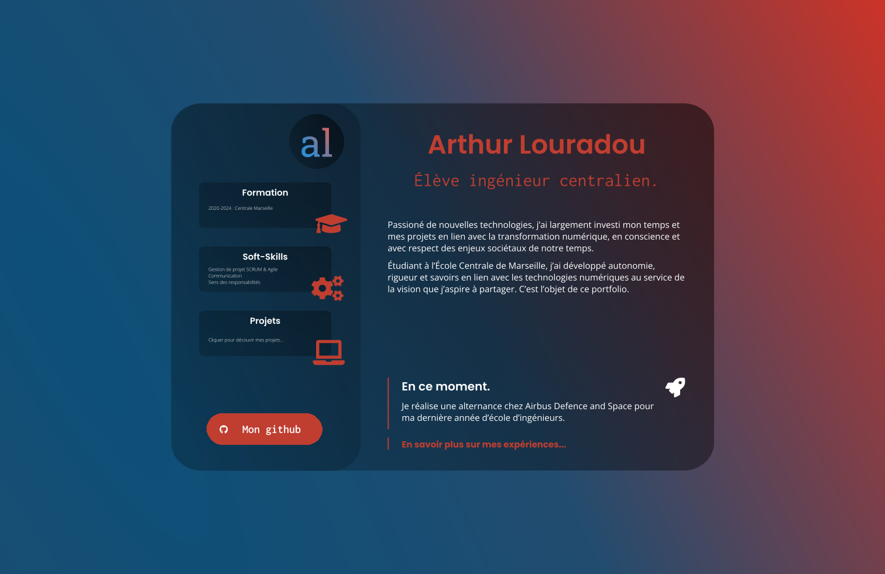

## Pourquoi lire ce POK ?

Trois compétences seront mises en pratique dans ce POK et pourraient vous inciter à le lire en tant qu’élève ✅

1. Design et UI/UX avec Figma : nous apprendrons des techniques avancées pour établir un design clair avec l’outil Figma, adapté au style glassmorphism.
2. Gestion de projet SCRUM : autant que faire ce peu, nous rapprocherons les étapes du projet à la gestion de projet agile.
3. Développement web et intégration Front-End.

## Introduction

Pour commencer, ce POK a une importance particulière puisqu’il servira deux fonctions principales. Premièrement, la mise en pratique de compétences techniques acquises ces dernières années et qu’il convient de combiner tout en s’assurant de la propreté du code, de l’architecture et de la gestion du projet mis en place. Ensuite, il permettra de prendre le temps de réfléchir à une stratégie de long terme pour la communication professionnelle, dans l’optique de fluidifier les démarches futures de recherche d’emploi ou de clients, tout en maintenant une qualité élevée dans l’image renvoyée aux interlocuteurs.

Ainsi, l’objectif initial était de réaliser un portfolio de projets et de mettre en ligne les différents projets présents sur mon Github, réalisés au cours de ma scolarité ou bien sur mon temps personnel. Après réflexion, l’objectif d’un tel exercice est de penser une plateforme cohérente et design pour améliorer sa visibilité et son « image de marque ». On préfèrera alors utiliser le terme de « Personal Branding ».

Alors, dans cette démarche, la recherche d’inspiration et le maquettage sont centraux et tous les supports de communication doivent être concernés, du site vitrine (portfolio) à lettre de motivation en passant par le CV.

## Expression du besoin

Pour illustrer le type d’évolution souhaitable dans un tel projet, voici le bandeau supérieur de mon CV actuel, qui est aussi ma photo de bannière Linkedin :


Un peu austère ? Le bleu n’est pas assez profond ? La police n’est pas adaptée ? Ces questions sont parfaitement subjectives mais me trottent dans la tête depuis un moment. Nous allons donc les adresser durant le projet.

## Gestion de projet

Pour la gestion de projet, j’ai choisi l’outil Notion que j’utilise depuis quelques années et qui intègre des templates de gestion de projet notamment en mode agile.

Une critique que l’on peut formuler à l’égard de l’utilisation de cette outil est que l’on perd dans un premier temps beaucoup de temps à mettre en place un environnement de travail stable et compréhensible. En revanche, une fois mis en place, la façon de structurer l’information est claire et limpide, ce qui permet de se concentrer sur le contenu du projet avec un suivi clair des tâches à effectuer.

Voilà par exemple comment se présente ma toute première vision du suivi des tâches :



Un dernier point extrêmement positif est que la prise de note dans l’application Notion s’effectue directement en Markdown, ce qui fluidifie énormément la mise en ligne sur le site internet de l’option sans avoir à rédiger toutes ces notes dans un IDE.

## Méthodologie de projet

### Product Backlog

Chaque élément du backlog sera détaillé, priorisé en fonction de son importance et prêt à être exécuté dans un Sprint. Pour la rédaction de mon backlog, je vais suivre une approche itérative en me basant sur les étapes fondamentales de la méthodologie SCRUM. Cette approche SCRUM aidera à maintenir un processus organisé et itératif tout au long du projet. À noter que le fait que le projet soit réalisé en individuel contrevient au principe même du développement SCRUM en équipe. Nous allons donc procéder par forte inspiration bien qu’il constituerais un abus de parler de cette méthode stricto sensu.


Je renvoie à ce propos au [MON de Louise](https://francoisbrucker.github.io/do-it/promos/2022-2023/Gacoin-Louise/mon/MON1/) qui compare les différentes méthodologies de projet agile. Vous en apprendrez ainsi plus sur le concept de méthodes agiles au cas où celui-ci ne soit pas déjà familier. Vous comprendrez aussi mieux la rigueur méthodologique dont je tâcherai de faire preuve durant ce POK.


Aussi, procéder de la sorte permettra de mettre en pratique les notions de méthodologie SCRUM agile expérimentées par le passé en césure durant mes cours et mon stage. La méthodologie de projet fera donc partie intégrante des acquis à présenter au cours du POK.

Le POK est l’occasion d’appliquer assez strictement les principes de cette méthode pour pousser au maximum l’intégration des concepts et les bons réflexes apportés par les méthodes agiles.

0. **Planification et gestion de projet Agile**
   0.1 Définition de l'Objectif du Projet
   0.2 Création du Product Backlog
   0.3 Planification du Sprint Initial
   0.4 Préparation des Outils et de l'Environnement

1. **Recherche de Références**
   1.1. Effectuer une recherche en ligne pour recueillir des références de design actuelles et à la mode.
   1.2. Créer une liste des tendances de design pertinentes et à mon goût à inclure dans le projet.

2. **Définition de la Charte Graphique**
   2.1. Définir la palette de couleurs principale en tenant compte des tendances identifiées.
   2.2. Sélectionner les polices de caractères appropriées pour le projet.
   2.3. Créer des directives pour l'utilisation des éléments visuels, tels que les icônes et les images.
   2.4. Établir des règles pour la mise en page et la structure des pages.

3. **Conception avec Figma**
   3.1. Configurer un projet Figma dédié pour le travail de conception.
   3.2. Créer des maquettes de la nouvelle interface en utilisant les éléments de la charte graphique définie.
   3.3. Collaborer avec des amis pour prendre des commentaires constructifs.
   3.4. Finaliser la maquette et la rendre prête pour le développement.

4. **Développement de l'Interface**
   4.1. Convertir les maquettes Figma en code HTML/CSS ou dans la technologie de développement pertinentes.
   4.2. Intégrer les éléments interactifs tels que les boutons, les formulaires, et les animations.

5. **Livraison**
   5.1. Mettre en ligne le projet sur un serveur de production.
   5.2. S'assurer que toutes les ressources nécessaires, telles que les fichiers source, sont accessibles et correctement sauvegardées.

Au travail ? :)

### Planification de la première itération (Sprint)

Minute ! Avant de se mettre au travail, parlons de la planification du premier Sprint.

Voilà les objectifs identifiés dans ce Sprint :

1. **Mettre en place les outils et la méthodologie de gestion de projet SCRUM Agile** (0.4 - Préparation des Outils et de l'Environnement) :
    - Sélectionner et configurer les outils de gestion de projet SCRUM, tels que Notion.
    - Relire les notes de cours sur la méthodologie SCRUM.
    - Demander des conseils à chatGPT sur la mise en place d’une telle méthodologie de projet et se conforter sur la façon d’exécuter la démarche de gestion de projet.
2. **Définir l'objectif du projet** (0.1 - Définition de l'Objectif du Projet & 0.2 - Création du Product Backlog & 0.3 - Planification du Sprint Initial) :
    - Commencer à lister les éléments du projet, en se concentrant initialement sur les tâches liées à la mise en place de la méthodologie SCRUM et des outils.
    - Prioriser ces éléments en fonction de leur importance pour le démarrage efficace du projet.
3. **Recherche bibliographique** (1.1 & 1.2) :
    - Rechercher les tendances de design actuelles et les hiérarchiser en fonction de mes préférences.
4. **Initialiser le projet Figma** (2.1 & 3.1)
    - Reproduire les éléments graphiques déjà utilisés dans mes productions (CV, lettre de motivation, réseaux professionnels)
    - Rechercher des couleurs agréables

Ces objectifs figurent dans une base de donnée de gestion de projet sur Notion comme présenté précédemment.

Ainsi, nous pouvons passer dès à présent aux tâches réalisées durant ce premier sprint.

## Documentation et lectures

N'étant pas designer de formation, il est donc nécessaire de trouver de l'inspiration. Mes lectures pendant ce POK m'ont conduit à m'intéresser aux tendances et aux courants actuels en matière de design.

Par conséquent, j’ai consulté des articles et des blogs spécialisés dans le design et la communication numérique pour enrichir mes connaissances et trouver des idées innovantes.

Parmi cette documentation, voici des liens intéressants à consulter.
- [4 tendances 3D en UI design en 2023 autour du morphisme](https://www.blogduwebdesign.com/blog/webdesign/tendances-ui-morphisme-3d.html)
- [Create Glassmorphism Personal Portfolio Website Using Html CSS & JS](https://www.youtube.com/watch?v=E2O03zTX2BY)
- [Glassmorphism in 5 Easy Steps](https://www.youtube.com/watch?v=AdNOcgK_6Bs)
- [Apple Glass Morphism Design](https://www.behance.net/gallery/111528505/Apple-Glass-Morphism-Design)
- [4 tendances 3D en UI design en 2023 autour du morphisme](https://www.blogduwebdesign.com/blog/webdesign/tendances-ui-morphisme-3d.html)
- [60-30-10 Color Rule](https://www.youtube.com/watch?v=UWwNIMHFdW4)
- [Glassmorphism in user interfaces](https://uxdesign.cc/glassmorphism-in-user-interfaces-1f39bb1308c9) (le plus utile de mes recherches !)
- [Inspiration parallax et scroll](https://marchantweb.com/) 


J’ai développé un gout assez poussé pour le **glass morphism**, courant utilisé par Apple ou Microsoft dans leurs différents OS par exemple. Je trouve ce courant élégant, épuré mais surtout dans l’air du temps<sup><a href="https://www.laculturegenerale.com/ere-du-temps-air-du-temps-orthographe/" style="text-decoration:none;">[!]</a></sup>. (Notez bien cette phrase pour plus tard, internet n’oubliant jamais rien, surtout pas les Skyblogs…)


### Comment faire du Glassmorphism ?

Source :
https://uxdesign.cc/glassmorphism-in-user-interfaces-1f39bb1308c9

1. Choisir un bon background
2. Mettre une fill opacité la plus forte possible à mesure qu’un objet doit apparaître loin.
3. Mettre une bordure de 1mm
4. Mettre une petite ombre discrète et estompée aux éléments à l’avant-plan

## Initialisation Figma et recueil des assets existants



<p style="text-align:center;font-style:italic;">Initialisation du Figma et test d'un gradient de couleurs.</p>

[//]: # ()
[//]: # (## Review Sprint 1)

[//]: # (Ce Sprint s'est déroulé très rapidement, en une semaine et demie. J'ai pu mettre en place les outils de gestion de projet et de documentation, et commencer à réfléchir à la charte graphique. J'ai aussi pu me familiariser avec Figma, qui est un outil très puissant et qui permet de gagner beaucoup de temps dans la conception de maquettes.)

[//]: # (J'ai défini le style graphique qui dominera. Il s'agit d'un style épuré, avec des couleurs pastels et un effet de verre &#40;glass morphism&#41;.)

[//]: # (En revanche, certains points sont encore à définir, notamment la façon de gérer les assets graphiques et les couleurs. Je vais donc me pencher sur ces points dans le prochain Sprint en tâchant de passer moins de temps que celui-ci sur la gestion de projet, maintenant qu'elle est en place.)


## Première version de la page, avec de nouvelles couleurs et des polices.

Le choix des polices s’est fait sur [Fontjoy](https://fontjoy.com/), un outil qui utilise du deep learning pour associer des polices de titre, sous titre et corps de texte. Un autre outil intéressant pour choisir des couleurs est [Coolors](https://coolors.co/).

Voici le résultat de la mise en application des principes cités précédemment. Pour les polices, nous utilisons ici Poppins avec une graisse de 600 pour le titre et Inconsolata Regular pour le sous-titre. J’ai par ailleurs aussi décliné ce design dans sa première version en mode sombre, plus professionnel à mon gout. Nous y reviendrons car c’est le premier que nous allons implémenter dans le site web.



<p style="text-align:center;font-style:italic;">Première version du design clair.</p>

# Initialisation du code du portfolio

J’utiliserai une stack technique assez simple pour initialiser ce projet, dans la mesure où j’aimerais apprendre le Sass en programmant ce portfolio. J’avais par le passé suivi [un cours en ligne](https://openclassrooms.com/fr/courses/8069761-simplifiez-vous-le-css-avec-sass) sur ce sujet mais jamais mis en application ses grands principes (nesting, mixins, etc.).

 
💄 Pour s’entrainer en Sass, je recommande l’outil [Sass Meister](https://www.sassmeister.com/), qui donne un résultat visuel immédiat de son code Sass compilé en CSS.


## Lien avec Figma : Fonctionnalité « Variant »

 
💡 Ce point intéressera mes camarades ayant choisi le cours UI/UX de Do_It.


Figma permet de créer des composants et d’en faire hériter les différentes occurrences au sein d’un design. C’est un outil très puissant, en particulier lorsque l’on a déjà programmé des composants en web. Par exemple, il est désormais intuitif de créer une forme de bouton et de l’utiliser à différents endroits pour ne modifier qu’une seul fois la couleur, la police, la taille, la disposition, etc. Je recommande d’utiliser ces fonctionnalités pour faciliter l’intégration web plus tard.

Ensuite, viennent les variants. Il s’agit d’alternatives à un composant . Il est donc désormais possible de choisir pour chaque occurrence du composant dans mon design si je souhaite le bouton sombre ou clair, par exemple. La façon de penser les composants a été spécialement pensé pour être plus proche du monde du développement.

Cette fonctionnalité est au plus proche de ce que l’on peut faire avec les mixins de Sass, ce qui rapproche naturellement le développeur du designer. Je renvoie à [ce lien](https://sass-lang.com/documentation/values/mixins/) pour comprendre en détail le principe des mixins Sass.

 
📖 La documentation associée aux variants Figma (avec une vidéo) :
https://help.figma.com/hc/en-us/articles/360056440594-Create-and-use-variants


Et voici comment j’ai créé un bouton dont on peut choisir le type et la couleur, comme on pourrait le faire en CSS avec des classes.




Voici finalement le rendu de la première version du design, achevant la partie Design du Backlog.



J’en suis satisfait car la version sombre correspond bien au style professionnel que j’avais en tête avec un design moderne auquel nous pourrions adresser quelques critiques comme la lisibilité de la police de titre en rouge. Nous verrons lors de l’intégration de cette maquette si nous pouvons résoudre simplement ces problèmes. Quoiqu’il en soit, il est désormais facile de passer au code puisque tout est fixé : couleurs, gradients, polices, disposition et même contraintes des éléments les uns par rapport aux autres. Nous pouvons passer Figma en mode développeur pour obtenir toutes ces informations et les intégrer au code. En particulier, Figma possède une option permettant de lire le css d’un élément.

## Intégration web

Pour intégrer ce design, je vais choisir de partir sur une base de React dans la mesure où ce framework javascript permettra de répliquer le comportement en composants que l’on a fixé dans Figma. Nous n’utiliseront pas des fonctionnalités très avancées dans le framework React.js : les connaissances que j’ai acquises jusqu’alors devraient donc suffire pour mettre en place des composants et les réutiliser.

Au travail !

```bash
npm install react react-dom
```

S’en suit la mise en place des composants dans une architecture de fichiers adaptés. Cela faisait un moment que je n’avais pas codé de React depuis un projet vierge, j’ai donc demandé conseil à chatGPT pour les conventions d’organisation de fichiers pour mon cas particulier de technologies React.js et Sass. Finalement, je demande au modèle de language les bonnes pratiques de code que vous pourrez retrouver à l’adresse suivante : https://github.com/alouradou/portfolio

Puis place au code, le résultat est à l’adresse suivante : [Mon site Perso](http://alouradou.perso.centrale-marseille.fr).

Pour rappel, [le fichier de design Figma se situe ici](https://www.figma.com/file/DaRPw2SeV8fWeZLXjHCGZk/DA-Pro?type=design&node-id=0%3A1&mode=design&t=Dyuu5VYIqHqT2OHL-1).

## Perspectives d’amélioration

Ce portfolio est loin d’être achevé. Mais il constitue un MVP (Minimum Viable Project) tout à fait satisfaisant à présenter à un client ou un recruteur. Je pourrai en tirer partie en allant chercher des ressources graphiques dans le Design Figma et en créant de nouvelles pages à mesure que j’aurai des projets à présenter et des expériences à partager.


Quelques idées me sont apparues comme celle de refaire mon CV uniquement en HTML, mais je garderai cela pour plus tard.


Quoiqu’il en soit, ce travail a été instructif tant sur la méthode de réalisation que sur les techniques approchées en Design et en Gestion de Projet. Le développement a été une mise en application des connaissances dans la philosophie des POKs de <span style="font-family: Consolas, sans-serif;">Do_<span style="color: #4a86e8">It</span></span> et constituait un point important du projet.
