 
Aucun prérequis si ce n'est avoir Excel ! 


## Introduction
Au sein de mon entreprise d'alternance beaucoup de fichiers Excel sont utilisés dans tous les services afin de faire du suivi de tâches, de réaliser des processus de relevé de prix ou encore d'analyser des données... Mon rôle en tant qu'alternante en digitalisation est de minimiser au maximum l'utilisation d'Excel en utilisant des applications collaboratives, nottament [Power BI](https://powerbi.microsoft.com/fr-fr/what-is-power-bi/) issus de la suite de Microsoft pour l'analyse des données. Je trouve donc pertinent de comprendre comment Excel fonctionne dans l'analyse de données afin de mieux comprendre l'utilisation d'Excel par les utilisateurs pour lesquels il m'arrive de créer des Power BI.

## Sommaire

1. Qu'est-ce qu'Excel ?
2. Création d'une base de données sur Excel
3. Nettoyage de données sur Excel
4. Analyse de données sur Excel
5. Visualisation de données
6. Mise en application par l'analyse complète d'un jeu de données

#### Ressources et Outils utilisés
+ [Découvrir Microsoft Excel](https://www.blogdumoderateur.com/tools/microsoft-excel/)
+ [Les bases de l'analyse de données sur Excel](https://cartong.pages.gitlab.cartong.org/learning-corner/assets/pdfs/trainings/220908-Module-formation-analyse-donnees-Excel_CartONG.pdf)

## 1. Qu'est-ce qu'Excel ?
<strong>Microsoft Excel</strong>, un logiciel de tableur faisant partie de la suite bureautique Office 365, présente des tableaux organisés en lignes et colonnes dans des onglets distincts appelés feuilles de calcul. Cette application intègre des fonctionnalités de calcul numérique, de représentation graphique, d'analyse de données, ainsi qu'une capacité de programmation grâce à son propre langage.

En tant qu'élément considéré comme le plus complexe au sein de la suite Office, Microsoft Excel offre une gamme variée de fonctionnalités, notamment :

+ Calculs à partir de formules mathématiques : Vous pouvez entrer des formules dans une cellule en utilisant le symbole « = » suivi de l'opération à effectuer.

+ Calculs à partir de fonctions Excel : Vous avez également la possibilité d'utiliser des fonctions prédéfinies telles que « SOMME », « MOYENNE », ou encore « MAINTENANT » pour afficher la date et l'heure actuelles dans une cellule désignée.

+ Formules matricielles : Certaines formules ont la particularité de générer des calculs pour une matrice entière.

+ Graphiques : Excel permet de créer des graphiques à partir de données contenues dans un tableau. Ces graphiques se mettent automatiquement à jour si les données sont modifiées.

+ Tableaux croisés dynamiques : Cet outil permet de regrouper des données selon un ou plusieurs critères et de les présenter sous forme de sommes, moyennes ou comptages.

+ Macros : Les macros Excel sont des séquences d'actions qui automatisent des tâches. Elles sont enregistrées en utilisant le langage de programmation Visual Basic pour applications.

Une autre caractéristique importante de Microsoft Excel est la possibilité de protéger une feuille de calcul avec <strong>un mot de passe</strong>, limitant ainsi l'accès non autorisé et les modifications indésirables.

Les fichiers générés par Excel sont généralement enregistrés aux formats .xls ou .xlsx pour les feuilles de calcul, et .csv ou .txt pour les fichiers contenant du texte.

## 2. Création d'une base de données sur Excel
Le plus souvent la base de données est <strong>le fichier Excel</strong> que les équipes utilisent pour <strong>suivre leurs données de programme</strong> mais elle peut aussi être sur papier, sous un format texte ou un format plus complexe. 
Une base de donnée est un élément indispensable pour trouver facilement et rapidement les données que l'on souhaite.

#### Comment créer une BDD sur Excel ?
Pour créer une BDD sur Excel on a besoin de 3 étapes :
+ Définir les lignes
+ Définir les colonnes
+ Designer les colonnes

<strong>Définir les lignes</strong>
Chaque ligne correspond à un enregistrement.
Le plus souvent cela correspond à un ensemble de réponses d'une collecte de données. Il est <strong>PRIMORDIALE</strong> que chaque enregistrement est un identifiant unique qui permette de remonter à la ligne en question. Le plus souvent on utilise une suite de nombre (1, 2, 3, 4,...).

<strong>Définir les colonnes</strong>
Chaque colonne correspond à une information. On indique en haut de chaque colonne de cellule le nom de la variable informative par exemple *auteur* , *date* , *durée* , *taille de la toile* , *type*,...

<strong>Designer les colonnes</strong>
La première colonne sera toujours l'ID de l'enregistrement. Les en-tête de colonnes sont uniques, courts et clairs. On peux rajouter si on le souhaite des en-tête supplémentaire pour définir des parties afin d'améliorer la lisibilité de la BDD.

Exemple : mini-BDD de peintures

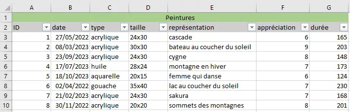

Grace à la fonctionnalité de filtre il sera plus simple de naviguer dans des BDD plus imposantes.

#### Principes de bases
+ <strong>La référence absolue</strong>
Lors de l'utilisation d'Excel on fait souvent référence à des cellules. Si l'on désire que la référence ne soit pas modifier lorsqu'on recopie sa formule il faut penser à rajouter le symbole <strong>$</strong>.

+ <strong>Nommer une plage de cellules</strong>
Nommer une plage de cellules permet de <strong>gagner du temps sur l'entrée et la lisibilité des formules</strong>.
Pour ce faire il suffit de sélectionner la plage des cellules à nommer et d'entrer le nom voulu dans la plage associée.

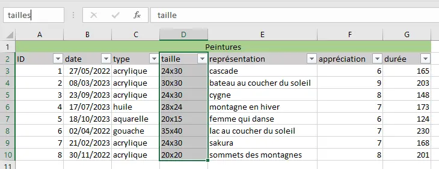

## 3. Nettoyage de données sur Excel
Maintenant que l'on sait créer une BDD sous Excel nous allons voir comment nettoyer des données c'est à dire à <strong>analyser la cohérence des données</strong> et à effectuer une <strong>triangulation</strong> avec d'autres informations.
Le nettoyage de données permet d'avoir une base de données à jour sans risquer des erreurs d'analyse.

Il y a trois grand principes aux nettoyages des données :
+ Vérification de la cohérence logique
+ Vérification de la fiabilité 
+ Correction des erreurs 
Alors, le but est de déceler : *les valeurs manquantes* , *celulles vides* , *fautes de frappes* , *doublons* , *valeurs extrêmes* , *textes en chiffres et inversement* , ...

<strong>Erreurs courantes faciles à rectifier</strong>
+ Nombres enregistrés sous forme de texte : 
  Il faut sélectionner toute la plage de données concernée faire un clic droit et choisir "Convertir en nombre"
+ Trouver un point au lieu d'une virgule pour les nombres :
  Il faut utiliser la fonction "Rechercher et remplacer" pour modifier les points par des virgules.
+ Les espaces inutiles :
  On utilise la formule <strong>SUPPRESPACE()</strong> qui permet de supprimeer les espaces du texte à l'exception des espaces simples entre les mots.
+ Doublons et valeurs extrêmes : 
Une valeur extrême est une valeur <strong>aberrante</strong> anormalement différente de la distribution d'une variable. Comme les doublons il est important de trouver ce type d'anomalie afin de ne pas induire d'erreur dans l'analyse.
Pour cela on peut utiliser l'outil de <strong>Mise en forme conditionelle</strong> dans l'onglet *Acceuil*.
On trouve alors facilement les valeur extrême en utilisant *Supérieur à ...* ou *Inférieur à...* et les doublons à l'aide de *Valeurs en double...*. 

Exemples : Nettoyage de la mini-BDD peintures avec des erreurs et des doublons intégrés exprès

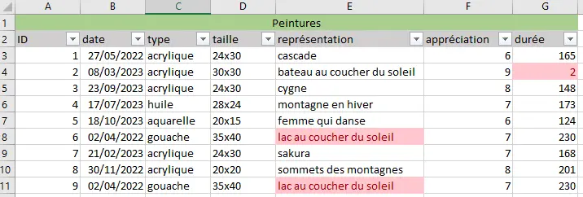

Sur cet exemple, pour toute la colonne durée j'ai demandé à ce que les cellules inférieures à 6à soit mis en rouge et pour toute la colonne représentation que les cellule en doublons soit mise en rouge.

Ces méthodes mettent en exerbe des comportements étrange sur les données néanmoins cela ne veut pas focément signifier qu'il y a une erreure. Il est tout à fait possible que deux peinture représente la même chose ou qu'une peinture soit bien plus longue à réaliser que la moyenne, il est important de <strong>garder un esprit critique</strong> lors du nettoyage des données.

Pour en savoir plus sur les outils disponibles pour le nettoyage des données : [Nettoyer ses données](https://cartong.pages.gitlab.cartong.org/learning-corner/fr/3_nettoyage_page).

## 4. Analyse de données sur Excel
#### Introduction 
L'analyse des données permet de donner une interprétation aux données que l'on a relevé.
Beaucoup de calculs sont possibles pour les variables de type nombre (*effectif*, *minimum et maximum*, *moyenne et médiane*, *écartype et variance*, *somme*,...) mais il faut choisir celles qui auront le plus de sens en fonction du cas que l'on étudie.

#### Statistique descriptives
On peut s'y pencher selon 3 axes : 
+ La *distribution* qui concerne la <strong>fréquence</strong> de chaque valeur.
+ La *tendance centrale* qui concerne les valeurs <strong>moyennes</strong>.
+ La *variabilité* qui concerne la <strong>distribution</strong> des valeurs.
  
#### Dénombrement, maximum et minimum
+ Dénombrement
L'objectif est de pouvoir compter l'effectif d'une donnée au sein d'une série statistique. La fonction *NB.SI* permet de compter le nombre de cellules qui répondent à un critère donné.

Exemple : *Nombre de peintures qui ont nécessités plus de 2H de travail*

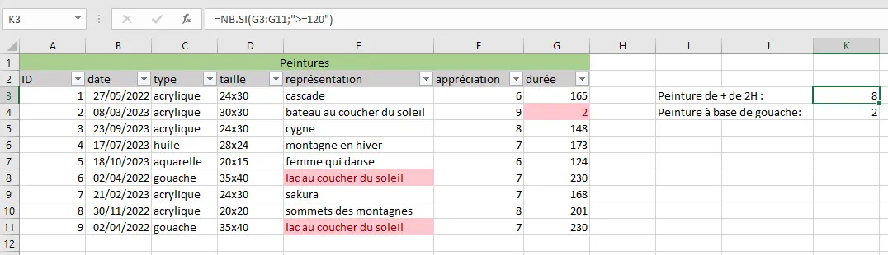

Avec cette fonction les données manquantes sont automatiquement exclues de l'anlyse. Pour savoir combien de données manquent on peut utiliser la fonction *NB* qui permet de compter le nombre de cellules remplies. Il suffira donc de soustraire ce nombre au nombre total d'enregistrement dans la base de données.

+ Maximum et minimum
L'objectif est ici d'obtenir la plus grande ou la plus peite valeur d'une plage de données. Pour ce faire on utilise les fonction *MIN* et *MAX*.

+ D'autres fonctions
On utilise aussi la moyenne afn d'obtenir la tendance centrale, ou encore la médiane. La grosse différence entre les deux c'est que la moyenne va être bien plus sensibles aux valeurs abbérantes que la médiane.

+ Mesures de variabilités
Elles permettent d'avoir une idée de la distribution des enregistrement de la BDD. Parmi elles on retrouve l'*étandue*, l'*écart-type*, la *variance*.

## 5. Visualisation de données
#### Introduction
Une fois différentes analyses menées il est toujours plus parlant de pouvoir les visualiser pour les interpréter. En fournissant une <strong>représentation visuelle</strong> notre cerveaux appréhende plus naturellement des données.
Afin d'utiliser une représentation adéquate il faut se poser deux questions:
+ <strong>Qu'est-ce que j'essaie de dire?</strong>
+ <strong>A qui j'essaie de le dire?</strong>

#### Comment représenter des données quantitatives?
Il existe une variété de représentations statistiques mais toutes ne sont pas adaptés à nos données. Voici les trois grandes catégories :

+ Modèle de comparaison 
+ Modèle de composition
+ Modèle de distribution

Dans chacune en fonction du type et du nombre de variables que l'on souhaite réalisée différents sous-modèle sont plus ou moins appropriés.

Exemples : *Il y a-t-il une corrélation entre le temps passé sur une peinture et son appréciation ?*

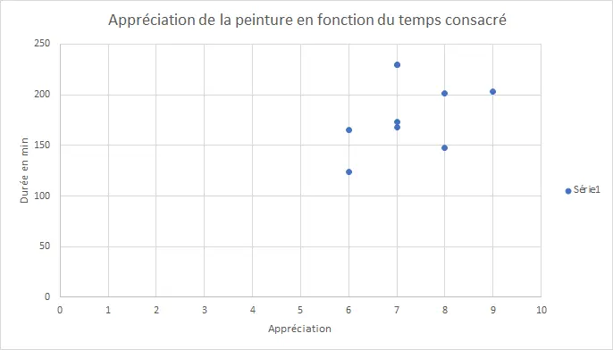

Pour déterminer si il y'a une corrélation entre les deux données on peut tracer le nuage de points d'une variable par rapport à l'autre. On se rend compte qu'il n'y a pas nécessairement de tendance mise en lumière mais comme il s'agit d'un tout petit échantillon de données c'est plutôt normal surtout que les données ont été inventé. Sur de vraie jeux de données il est très utile d'analyse ce genre de comportement.

## 6. Mise en application par l'analyse complète d'un jeu de données
Afin d'appliquer les différentes notions vu précédemment j'ai décidé de télécharger une base de données à partir du site [M DATA](https://data.ampmetropole.fr). Je me suis penchée sur une BDD sur la fréquentation des musées : [Fréquentation des musées](https://data.ampmetropole.fr/explore/dataset/mod-frequentation-des-musees-metropolitains/export/) que j'ai téléchargé en format Excel.

#### Etape 1 : Mise en forme des données
Lorsqu'on ouvre le fichier voici ce que l'on obtient : 

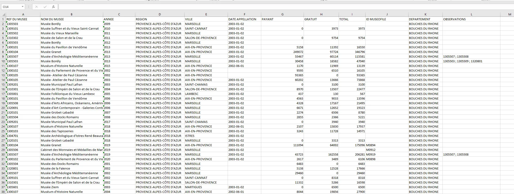

[Télécharger le fichier Excel](fréquentationsmusées.zip)

#### Etape 2 : Analyse des données 
J'ai travaillé sur plusieurs thématiques pour répondre aux questions suivantes : 
| Questions | Intitulé |
| -------- | -----|
| Q1 | Quelle est la plus grande fréquentation tout compris, le musée associé et l'année ? |
| Q2 | Quelle est la plus grande fréquentation gratuite, le musée associe et l'annnée ? |
| Q3 | Quelle est la plus faible fréquentation non nulle tout compris, le musée associé et l'année ? |
| Q4 | Quelle est la plus faible fréquentation non nulle gratuite, le musée associé et l'année ? |
| Q5 | Quel est le pourcentage de la fréquentation totale attribuable aux visiteurs payants pour chaque musée ? |
| Q6 | Quels musées ont eu une fréquentation gratuite supérieure à leur fréquentation payante en 2016 ? |
| Q7 | Quels musées ont enregistré une baisse de la fréquentation totale de l'année 2015 à 2016 ? |

On va utiliser les formules vues plus tôt afin d'analyser nos données.
La première chose que je trouve intéressante est de chercher l'enregistrement possédant la plus grande fréquentation toutes années comprises. Pour celà je savais déterminer le maximum mais comment récupérer l'ID du musée correspondant ainsi que son nom et l'année de l'enregistrement ? Je me suis donc renseigné pour trouver la formule <strong>=RECHERCHERV</strong>. Seulement cette formule ne fonctionne que si la valeur rechercher se trouve dans la première colonne ce qui n'est pas le cas ici. J'ai donc du utilisé deux formules pour séquencer mon travail : 
+ Trouver la ligne correspondante à la valeur cherchée
  J'utilise alors la formule <strong>=EQUIV</strong>
+ Trouver les informations d'une ligne 
  J'utilise alors la formule <strong>=INDEX</strong>

On obtient alors ce type de données pour les premières réponses : 

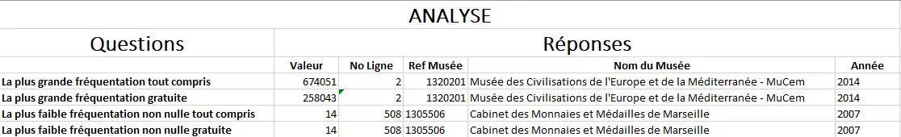

Pour les quatres questions j'ai utilisé des feuilles de calculs à part car il s'agit de renvoyer plusieurs lignes et non pas une seule. 

##### Q5 : Quel est le pourcentage de la fréquentation totale attribuable aux visiteurs payants pour chaque musée ?

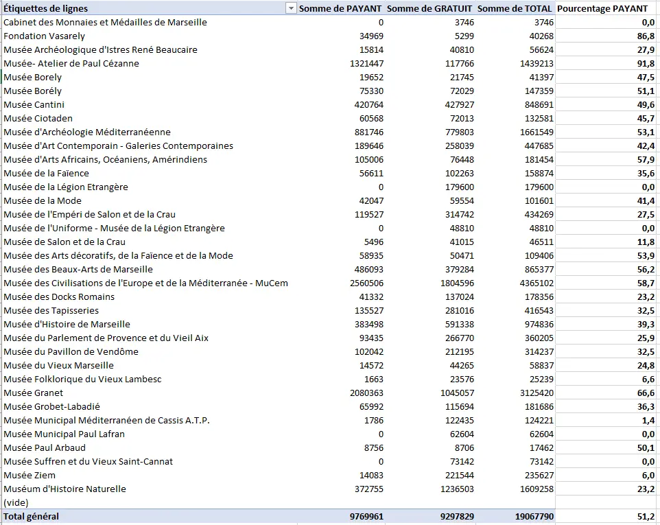

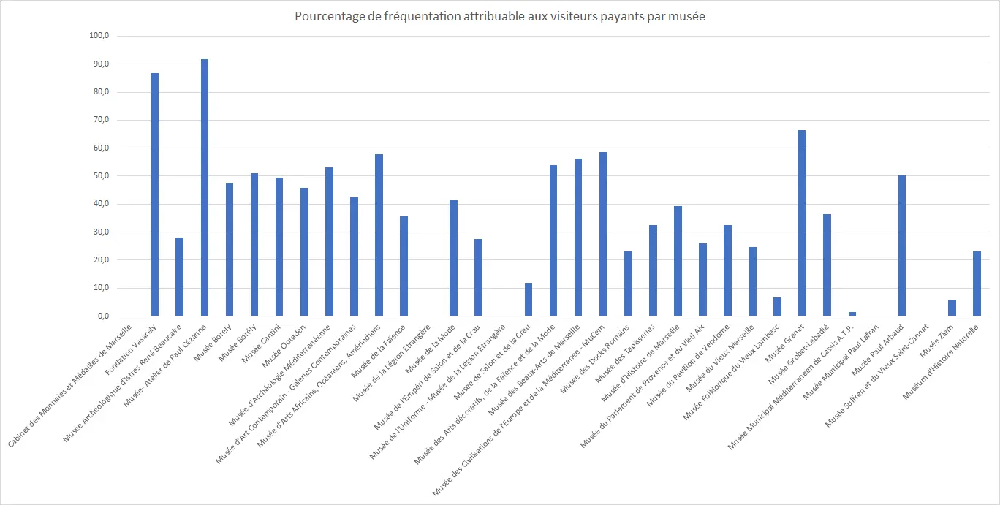

##### Q6 : Quels musées ont eu une fréquentation gratuite supérieure à leur fréquentation payante en 2006 ?

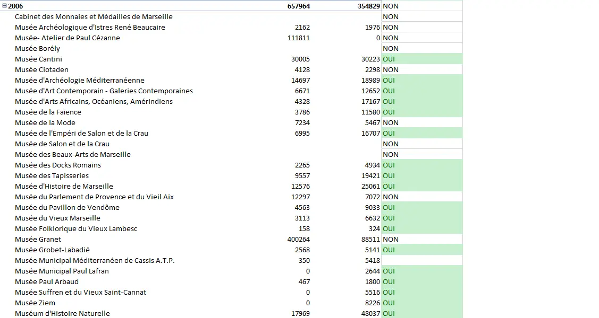

On peut visualiser l'évolution de cette variable au fil des années : 

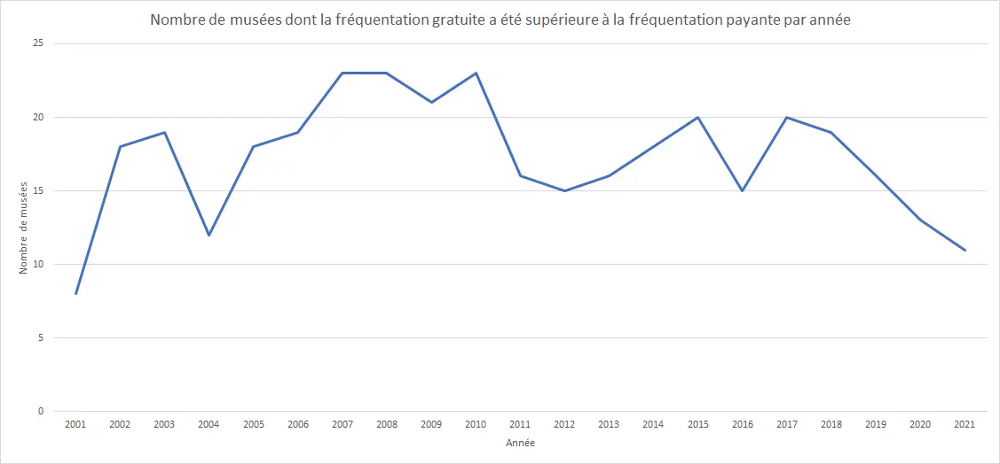

##### Q7 : Quels musées ont enregistré une baisse de la fréquentation totale de l'année 2015 à 2016 ?

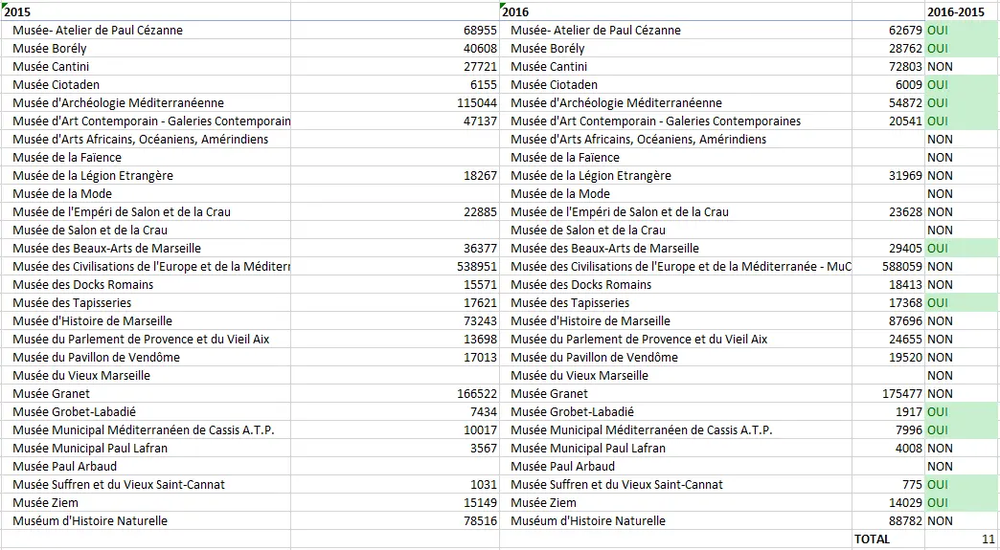

Je me suis demandé si on pouvait trouver les musées gratuits de la région en filtrant la colonne *PAYANT* sur la valeur 0. Et voici ce que j'ai obtenu : 

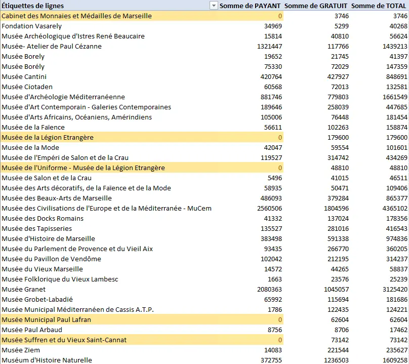

#### Etape 3 : Visualisation des données 
Maintenant j'ai envie de rendre mes données plus interprétables pour des personnes n'ayant pas travaillé sur la BDD. 

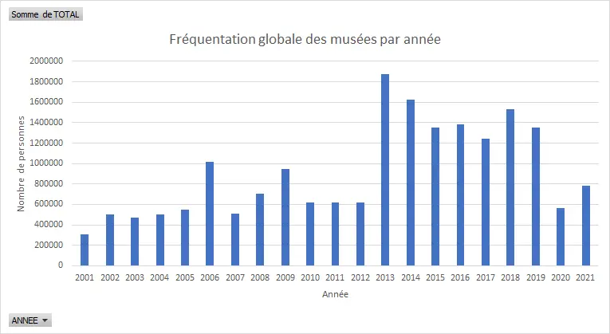

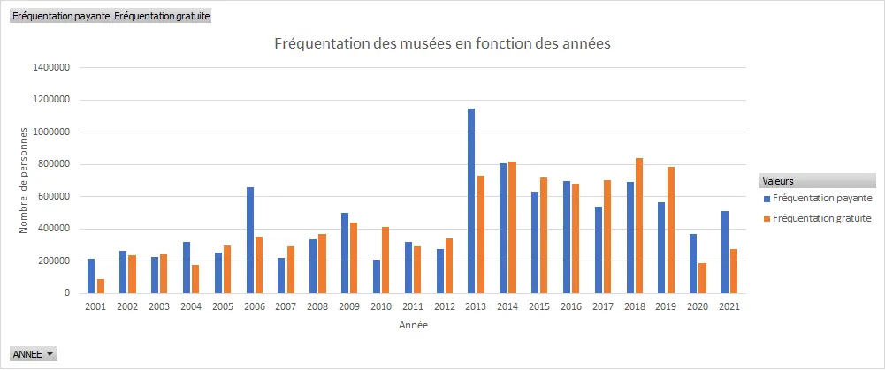

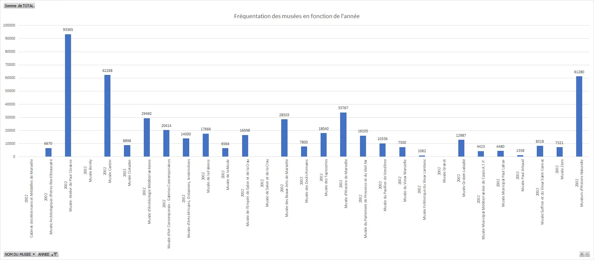

Grâce à ces visualisations on peut remarquer qu'il y a une une augmentation significative de la fréquentation des musées entre l'année 2012 et 2013 : elle a quasiment triplé ! J'ai voulu me renseigner pour savoir à quoi cela était dû et j'ai trouveé cet article du Figaro [Musées : un millésime 2013 riche en fréquentation](https://www.lefigaro.fr/arts-expositions/2014/01/02/03015-20140102ARTFIG00383-musees-un-millesime-2013-riche-en-frequentation). L'article parle d'une hausse de fréquentation dans toute la France et pas que dans les Bouches-Du-Rhônes. Un événément qui a sûrement permis de faire grimper les fréquentations cette année là c'est l'inauguration du MuCem à Marseille le 4 juin 2013. Comme le montre ce graphique, le MuCem était le musée le plus fréquenté cette année là et de loin:

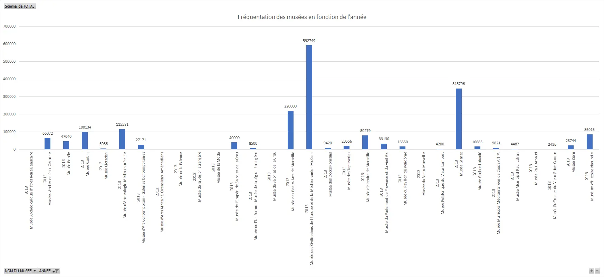

Il représente à lui tout seul 51,64% des fréquentations de l'année.

On peut aussi constater l'impact de la crise du COVID qui a engendré une brutale chute des fréquentations des musées à partir de 2020.

J'ai aussi voulu comprendre le pic de 2006. Et voilà le graphique de cette année là :

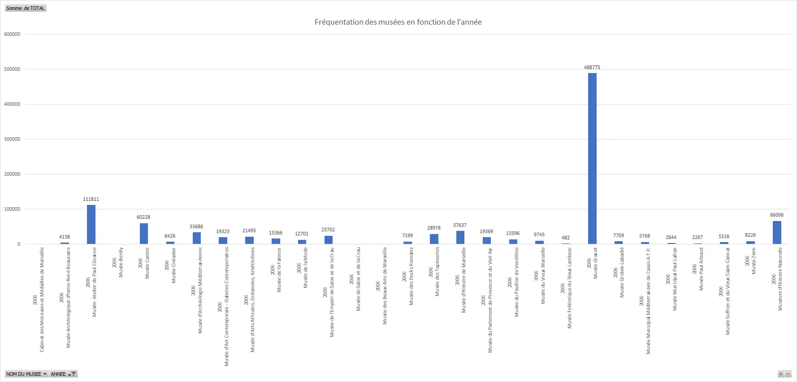

Le <strong>Musée Granet</strong> a été réouvert cette année là après sa rénovation et son agrandissement ce qui a engendré une hausse significative des fréquentations. 

## 7. Pour aller plus loin
Après avoir réaliser l'application sur la fréquentation des musées j'ai voulu voir ce qui était possible de réaliser en allant plus loin dans l'utilisation d'Excel. Pour ce faire je me suis appuyée sur la ressource de [Zeste de savoir](https://zestedesavoir.com/tutoriels/pdf/601/analysez-des-donnees-avec-excel.pdf) et plus particulièrement sur la partie <strong>Analyse des données et dynamisme du classeur</strong>. Je suis repassée très rapidement sur tout ce que j'avais déjà vu pour m'attarder sur une nouveauté : *les tableaux dynamiques croisés*.

### Horodateur 
| Date | Heures passées | Indications | 
| -------- | -------- |-------- |
| Mercredi 27/09  | 1H  | Choix des sources/cours à suivre et début de l'apprentissage |
| Jeudi 28/09  | 2H  | Création d'une BDD et nettoyage |
| Vendredi 29/09 | 1H | Dénombrement, minimum, maximum |
| Mardi  03/10 | 2H | Recherche d'une base de données à traiter et début de l'application |
| Mercredi 04/10 | 2H | Application sur les fréquentations des musées |
| Mercredi 11/10 | 1H | Application sur les fréquentations des musées |
| Jeudi 12/10 | 1H | Pour aller plus loin |

