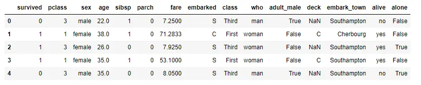
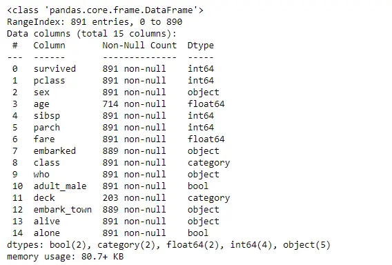
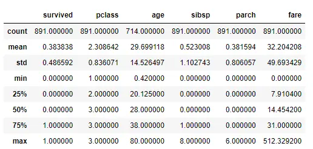

 
Savoir un peu coder en python.  


### Sommaire 
1. Qu'est-ce que le Machine Learning ? 
2. Début de l'apprentissage avec Kaggle. 
3. Résolution de problèmes classiques à l'aide du ML.
  
### Qu'est-ce que le Machine Learning

Le Machine Learning est une sous-discipline de l'intelligence artificielle qui permet le développement de techniques permettant aux ordinateurs d'apprendre à partir de certaines données. Son objectif principal est de créer des modèles capables de généraliser des schémas à partir de données passées afin de prendre des décisions ou de faire des prédictions sur de nouvelles données sans être explicitement programmés. 

##### Les différentes étapes
1. <strong>Entrainement : </strong> Un modèle de Machine Learning est formé à l'aide d'un sensemble de données d'entraînement. Ce jeu de données est composé d'exemples, généralement sous la forme de paires d'entrées et de résultats attendus.
2. <strong>Modèle : </strong> Un modèle de Machine Learning est une représentation mathématique ou statistique qui capture les relations entre les entrées eet les sorties dans les données d'entrainement. Le modèle est ajusté pendant le processus d'entraînement pour minimiser les erreurs entre les prédictions et les résultats réels.
3. <strong>Prédiction : </strong> Une fois que le modèle a été entrainé, il peut être utilisé pour faire des prédictions sur de nouvelles données pour lesquelles les résultats ne sont pas connus.
4. <strong>Evaluation : </strong> Une fois le modèle entraîné, il est évaluer sur des données de validations qu'il n'a pas vu avant pour s'assurer de sa capacité à généraliser correctement et à faire des prédictions précises.
   
##### Types de Machine Learning 
Il existe plusieurs types de Machine Learning : 

- <strong>Apprentissage supervisé : </strong> Le modèle est formé sur un ensemble de données qui contient à la fois des entrées et des résultats attendus. Le modèle apprend à faire des prédictions en se basant sur cette corresponsance entre les entrées et les sorties.
- <strong>Apprentissage non supervisé : </strong> Le modèle est formé sur un ensemble de données qui ne contient que des entrées, sans indications sur les résultats attendus. Le modèle cherche à découvrir des structures ou des patterns intrinsèques aux données. 
- <strong>Apprentissage par renforcement : </strong> Le modèle apprend à prendre des décisions en interagissant avec un environnement. Il reçoit des récompenses ou des pénalités en fonction des actions qu'il entreprend, ce qui lui permet d'ajuster son comportement au fil du temps.

##### Comprendre le fonctionnement du Machine Learning
Pour cette partie j'ai surtout regardé les vidéos de la chaîne [Machine Learnia](https://www.youtube.com/c/machinelearnia) au sujet du Machine Learning. J'ai commencé par la playlist [Initiation au Machine Learning](https://www.youtube.com/playlist?list=PLO_fdPEVlfKqUF5BPKjGSh7aV9aBshrpY) pour continuer avec [Python Spécial Machine Learning](https://www.youtube.com/watch?v=82KLS2C_gNQ&list=PLO_fdPEVlfKqMDNmCFzQISI2H_nJcEDJq) à partir de la 20ème vidéo (avant les vidéos ne concerne pas vraiment le ML mais des bibliothèques python tel que Pandas et Matplotlib qui sont important pour traiter le ML).

Concrétement voici comment procédé lorsque l'on veut faire du Machine Learning avec Python :

##### Importer les bibliothèques nécessaires

Avant de commencer, il est nécessaire <strong>d'importer les bibliothèques nécessaires</strong>, y compris scikit-learn pour les algorithmes de machine learning.

```html 
import pandas as pd 
import seaborn as sns
import numpy as np
import matplotlib.pyplot as plt
from sklearn.model_selection import train_test_split
from sklearn.model_selection import cross_val_score
from sklearn.neighbors import KNeighborsClassifier
```


##### Charger les données

Pour avoir avoir accès aux données on utilise la fonction suivante :

```html 
data = pd.read_csv('chemin/vers/votre/fichier.csv')
```

##### Explorez les données pour mieux les comprendre

Il est important de connaitre <strong>la structure des données</strong> que l'on a à disposition avant de se lancer dans les opérations de ML, pour ça on utilise ces trois fonctions :

```html 
print(data.head())
```
Cette fonction permt de retrouner les informations suivantes : 
<div stype="display:flex"></div>

```html 
print(data.info())
```
Cette fonction permt de retrouner les informations suivantes : 
<div stype="display:flex"></div>

```html 
print(data.describe())
```
Cette fonction permet de retrouner les informations suivantes : 
<div stype="display:flex"></div>

##### Traitement des données 

Pour ne pas amoindrir l'efficacité de notre modèle il est important de vérifier que les données ont du sens et d'éliminer celles dont des informations primordiales manquent ou semble trop extrême.
Pour cela on utilise la fonction suivante : 
```html 
data = data.dropna()
```

##### Séparation des données

On va diviser les données en deux ensembles : un ensemble d'entrainement et un ensemble de test. 
```html 
X = data.drop('variable_cible', axis=1)
y = data['variable_cible']

X_train, X_test, y_train, y_test = train_test_split(X, y, test_size=0.2, random_state=42)
```
Une fois que la fonction *train_test_split* est utilisée, elle génère deux ensembles distincts : l'ensemble d'entraînement (train) et l'ensemble de test. Ce découpage des données offre la possibilité <strong>d'évaluer un modèle de Machine Learning sous deux perspectives distinctes.</strong>

Initialement, le modèle est formé en utilisant <strong>l'ensemble d'entraînement </strong> fourni par la fonction. Ensuite, ses capacités prédictives sont évaluées en utilisant <strong>l'ensemble de test </strong>également fourni par la fonction. Cette approche permet de tester la performance du modèle sur des données qu'il n'a pas vues pendant l'entraînement, offrant ainsi un aperçu de sa généralisation à de nouvelles données.

##### Normalisation/Standardisation des données 

Cette étape n'est pas obligatoire mais elle peut permettre de gagner quelques pourcentage en plus leur de l'évaluation de notre modèle.  Elle vise à mettre toutes les variables (features) des données sur une échelle commune, ce qui peut être particulièrement important pour certains algorithmes et modèles.

```html 
scaler = StandardScaler()
X_train = scaler.fit_transform(X_train)
X_test = scaler.transform(X_test)
```
Globalement normaliser ou standardiser les données à pour but de <strong>garantir que le modèle utilisé fonctionne de manière optimale</strong>, en particulière lorsque l'on travaille avec des <strong>algortihmes sensibles aux échelles des variables</strong>. Le choix entre la normalisation et la standardisation dépend du contaxte spécifique des données utilisées et des exigences associées au modèle utilisé.

##### Choix du modèle 

Dans cette étape on décide du modèle que l'on va utiliser en fonction de nos données.
Les modèles de machine learning sont classés en différentes catégories en fonction du type de données sur lesquelles ils sont appliqués et du type de tâche qu'ils accomplissent. On utilise donc pas le même modèle pour chaque problématique. Les deux plus simples à comprendre sont : 

+ Modèles de <strong>Régression</strong> : *Utilisés lorsque la variable cible (output) est continue.*

Par exemple on peut utiliser le modèle *LinearRegression* qui permet de modéliser la relation linéaire entre une variable dépendante et une variable indépendante. Il existe aussi des modèles de régression linéaire multiple, polynomiale et encore bien d'autres...

```html 
from sklearn.linear_model import LinearRegression
model = LinearRegression()
```

+ Modèles de <strong>Classification</strong> : *Utilisés lorsque la variable cible est une classe ou une catégorie.*

Dans cette catégorie de modèle on retrouve plusieurs modèles. Par exemple le modèle *KNeighborsClassifier* regarde les plus proches voisins (le nombre est déterminer en hyperparamètre *n_neighbors*) de l'élément qu'il souhaite classer et choisis la catégorie à la majorité. Tandis que le modèle *RandomForestClassifier* fonctionne à l'aide d'arbre de décision dont les dernières feuilles sont les différentes catégories possibles. Il existe encore tout plein d'autres modèle dans la même catégorie mais qui ne fonctionne pas de la même manière et à chaque problème un modèle est plus adapté qu'un autre.

```html 

from sklearn.ensemble import RandomForestClassifier
model = RandomForestClassifier()

from sklearn.neighbors import KNeighborsClassifier
model = KNeighborsClassifier(n_neighbors=5)

```

##### Entraînement du modèle 

Ici, on va <strong>entrainer notre modèle</strong> sur l'ensemble des données d'entrainements qu'on a déterminer lors de la séparation des données. Pour ce faire on utilise la fonction suivante : 
```html 
model.fit(X_train, y_train)
```


##### Evaluation du modèle 

Une fois notre modèle entraîné on va s'intéresser à <strong>ces performances sur des données qu'il n'a jamais vu </strong> (l'ensemble des données test). Concrétement on veut répondre à la question "A-t-il bien appris ?". Pour ce faire on utilise la fonction suivante : 
```html 
y_pred = model.predict(X_test)
print("Accuracy:", accuracy_score(y_test, y_pred))
print("Confusion Matrix:\n", confusion_matrix(y_test, y_pred))
print("Classification Report:\n", classification_report(y_test, y_pred))
```

##### Cross-Validation

La Cross-Validation permet de <strong>s'assurer de la stabilité du modèle</strong>. Elle permet d'évaluer la performance d'un modèle sur un ensemble de données de manière plus robuste que l'utilisation d'une seule division en ensemble d'entraînement et ensemble de test. Elle aide à <strong>estimer comment le modèle généralise aux données non vues</strong>. La procédure de validation croisée implique de diviser l'ensemble de données en plusieurs sous-ensembles, puis de former et évaluer le modèle plusieurs fois. Il existe différentes variantes de la validation croisée, la plus courante étant la validation croisée k-fold. Elle fonctionne de cette façon : 
  + <strong>Division en k-Folds : </strong>
L'ensemble de données est divisé en k sous-ensembles (ou "folds") de taille égale.
  + <strong>Itérations : </strong>
Pour chaque itération, l'un des k sous-ensembles est utilisé comme ensemble de test, tandis que les k-1 autres sous-ensembles sont utilisés comme ensemble d'entraînement.
  + <strong>Entraînement et Évaluation : </strong>
Le modèle est formé sur l'ensemble d'entraînement et évalué sur l'ensemble de test.
  + <strong>Répétition : </strong>
Ces étapes sont répétées k fois, chaque sous-ensemble étant utilisé comme ensemble de test exactement une fois.
  + <strong>Moyenne des Performances : </strong>
Les performances (mesures d'évaluation telles que la précision, le F-score, etc.) de chaque itération sont généralement moyennées pour obtenir une estimation plus stable et représentative de la performance du modèle.

```html 
cv_scores = cross_val_score(model, X, y, cv=5)
print("Cross-Validation Scores:", cv_scores)
print("Mean CV Score:", cv_scores.mean())
``` 

##### Optimisation des hyperparamètres du modèle

On a vu que les modèles peuvent avoir des <strong>hyperparramètres</strong>. En fonction de leur valeur, le modèle est plus ou moins efficace, le but est donc de trouver les hyperparamètres optimaux pour que notre modèle soit le plus précis possible. 
Pour ça on utilise la fonction suivante à adapter en fonction des hyperparamètres de notre modèle :

```html 
from sklearn.model_selection import GridSearchCV

param_grid = {'n_estimators': [50, 100, 200], 'max_depth': [None, 10, 20]}
grid_search = GridSearchCV(RandomForestClassifier(), param_grid, cv=5)
grid_search.fit(X, y)
best_model = grid_search.best_estimator_
```

### Apprentissage avec Kaggle
J'ai tout d'abord suivi le cours <strong>*Learn Intro to Machine Learning*</strong> sur la plateforme [Kaggle](https://www.kaggle.com/). Puis je me suis lancé dans le challenge *House Price Prediction* sur ce Jupyter Notebook [MON : Machine Learning](MONMachineLearning.ipynb). 
J'ai essayé plusieurs modèles d'abord un peu naïvement puis en cherchant à avoir les meilleurs hyperparamètres possibles. J'ai obtenue les résultats suivants : 

| Modèle | Erreur absolue minimale|
| -------| -----------------------|
| DesicionTreeRegressor | 26322 € |
| RandomForestRegressor | 19655 € |
| GradientBoostingRegressor | 21205 € |

La moyenne des prix des maisons étant de 180 921 € la meilleur erreure que j'ai obtenue est d'environ 10.87%. 
Pour un premier travail sur le Machine Learning c'est une erreur qui me semble correcte même si on peut surement descendre en dessous. 

### Horodateur
| Date | Heures passées | Indications | 
| -------- | -------- |-------- |
| Vendredi 17/11  | 1H  | Choix des sources/cours à suivre et début de l'apprentissage |
| Dimanche 20/11 | 1H | Kaggle : *Learn Intro to Machine Learning*|
| Lundi 21/11 | 1H30 | Videos Explicatives de Machine Learnia : *Machine Learning Formation Complète* Partie 1|
| Vendredi 24/11 | 2H30 | Videos Explicatives de Machine Learnia : *Machine Learning Formation Complète* Partie 2 + *Python Spécial Machine Learning* Vidéo 20, 21 et 22|
| Jeudi 30/11 | 3H | Exercice House Pricing avec différents modèles|
| Jeudi 7/11 | 2H | Finalisation House Pricing |
