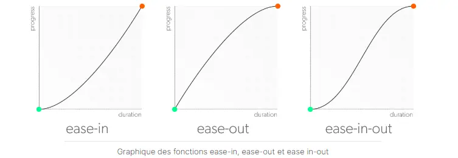

 
Connaitre les bases du HTML et du CSS.   


### Introduction
Dans le but de m'méliorer dans le développement web je voulais m'intéresser à l'utilisation des animations sur les sites web pour les rendre plus dynamiques et attractifs pour l'utilisateur.
Pour ce MON j'ai suivi le cours d'OpenClassroom [Créer des animaton CSS modernes](https://openclassrooms.com/fr/courses/5919246-creez-des-animations-css-modernes) d'une durée estimée à 15h. 

### Créer des animations avec des transitions 
Il existe deux moyens de créer des animations en CSS : 
- les <strong>transitions </strong>
- les <strong>keyframes </strong>

Les keyframes sont plus complexes à mettre en place mais elles permettent d'obtenir des animations plus élaborées. Les transitions sont elles plus limités mais plus simples à créer.

Pour créer une <strong>transition</strong> il faut différentes informations :
- une <strong>propriété CSS à modifier</strong>
- une <strong>valeur initiale pour votre propriété CSS </strong>
- une <strong>valeur finale pour cette même propriété </strong>
- une <strong> durée </strong>
- un <strong>événement pour déclencher votre transition </strong>

On applique la valeur initiale à l’élément qu’on veut modifier, et la valeur finale dans la pseudoclasse qui déclenche la transition. La durée de la transition peut s'exprimer en secondes ou en millisecondes. On peut déclarer les propriétés d'une transistion individuellement ou en les combinant.

```css
transition: transform ;
transition-duration: 400ms ; 
```
```css
transition: transform 400ms ; 
```

### Pseudos-classes pour déclencher une transition
Les pseudoclasses sont essentielles pour déclencher des transitions en CSS, les plus adaptées sont celles qui impliquent une interaction avec l'utilisateur. On peut aussi combiner des pseudoclasses entre elles pour créer des sélecteurs un peu plus précis, et permette aussi de changer le style d'un élément voisin.

- <strong>:hover</strong>, qui est déclenché au survol de la souris.

- <strong>:active</strong>, activé au clic de l'utilisateur (le plus souvent pour les liens et boutons).

- <strong>:focus</strong>, qui se déclenche lorsque son élément reçoit le focus (soit il est sélectionné à l'aide du clavier, soit il est activé avec la souris).

- <strong>:valid</strong>, dont la validation du contenu s'effectue correctement par rapport au type de donnée attendu.

- <strong>:invalid</strong>, qui inversement, correspond à un élément dont la validation du contenu ne s'effectue pas correctement par rapport au type de donnée attendu.

- <strong>:not()</strong>, qui correspond à la négation. Elle prend un sélecteur en argument et permet de cibler les éléments qui ne sont pas représentés par cet argument.

- <strong>:checked</strong>, qui correspond aux input de type checkbox, option ou radio qui sont cochés.

- <strong>:enabled</strong>, un élément avec lequel on peut interagir.

- <strong>:disabled</strong>, qui correspond à un élément dont l'interaction a été bloquée.

### Appliquez les 12 principes de l'animation web 
Maintenant, il est opportun de réfléchir à la manière de créer des animations plus <strong>naturelles et engageantes</strong>. Bien que les animations déjà élaborées soient fonctionnelles, elles se limitent aux propriétés de transition de base, en laissant de côté la plupart des valeurs par défaut. Ces dernières produisent des effets excessivement lisses, parfois artificiels, en contraste avec la nature, où les mouvements sont caractérisés par <strong>l'irrégularité</strong>, les oscillations et les changements de direction. L'objectif d'intégrer des animations sur un site web est de procurer <strong>une expérience immersive</strong> en infusant une dynamique organique dans les mouvements, <strong>harmonisant</strong> ainsi l'expérience utilisateur avec notre perception naturelle.

### Créer des transitions css à propriétés multiples
Pour créer des animations vivantes et agréables il faut faire plus que simplement passer d'un état A à un état B. En superposant des effets de mouvement on offre à l'utilisateur une animation qui parait beaucoup <strong> plus authentique</strong>.
Ainsi, au sein d'une transition, on peut facilement animer deux propriétés, ou même autant que l'on désire.

L’utilisation du mot-clé <strong>all</strong> permet de déclencher plusieurs changements au même moment et pour la même durée, mais il existe un autre moyen d’ajouter des propriétés multiples à une transition.
On peut aussi faire une <strong>liste des animations</strong> de chaque propriété à laquelle nous voulons ajouter une transition, séparées par des virgules.

```css
transition: transform 450ms, background-color 450ms ; 
```

On peut donner une <strong>durée différente</strong> pour chaque changements. C’est très utile pour obtenir un rendu <strong> moins uniforme</strong>, et ainsi créer quelque chose de plus intéressant visuellement et de plus engageant pour l’utilisateur. 

```css
transition: transform 450ms, background-color 300ms ; 
```

La différence ne se voit qu'à peine, mais ces quelques fractions de secondes permettent de rendre l’animation un peu <strong>moins parfaite</strong> et lui apportent un peu de <strong>texture</strong>.

Pour accentuer encore plus le côté "imparfait" de l'animation on peut retarder le changement sur une des propriétés. Par exemple faire démarer la transition sur *background-color* 150ms plus tard pour que les deux transistions se terminrent en même temps.

```css
transition: transform 450ms, background-color 300ms;
transition-delay: 0, 150ms;
```

### Créer des animations plus naturelles avec les fonctions de timing
Pour que les animations soient encore <strong>plus réaliste</strong> il faut penser que dans la nature un objet en mouvement doit accèléré à un moment donner et déccelérer lorsque son mouvement prend fin. On parle de <strong>ease-in</strong> et <strong>ease-out</strong>.

En CSS on utilise la propriété <strong>transition-timing-function</strong> pour régler la courbe d’accélération d’une transition.

#### Principales fonctions de timing 
- la fonction <strong>linear</strong> : elle ne connaît pas d'accentuation à l'accélération ou à la décélération. Sa courbe est totalement droite du point A au point B.
```css
transition: transform 1000ms;
transition-timing-function: linear;
```
- les fonctions <strong>ease-in-out</strong>, <strong>ease-in</strong>,<strong>ease-out</strong> : elles suivent une courbe d’accélération (pour ease-in et ease-in-out) et de décélération (pour ease-out et ease-in-out) subtile.
```css
transition: transform 1000ms ease-in-out;
```
<div style="display:flex"></div>

- la fonction <strong>ease</strong> : c'est la fonction qui est utilisée par défaut lorsqu'aucune fonction n'est précisée. Elle ressemble beaucoup aux fonctions ci-dessus mais avec une accélération plus nette et une rampe de décélération plus prononcée.

Ces fonctions sont des raccourcis de la fonction <strong>cubic-bezier</strong> : on lui indique une liste de valeurs numériques, qu'elle transforme en courbe d’accélération. Par exemple,  ease-in-out  peut être écrite ainsi :

```css
transition-timing-function: cubic-bezier(.42, 0, .58, 1);
```
Avec des outils comme le site [Cubic Bezier](https://cubic-bezier.com/#.17,.67,.83,.67) on peut créer facilement la courbe de bézier qui correspond à l'accélèration et la déccélération que l'on désire et récupérer les valeur numérique correspondante.

### Optimisez les performances de votre navigateur pour vos animations CSS
À l'écran, il n'y a pas de réel déplacement, mais plutôt <strong>une séquence d'images</strong> se succédant suffisamment rapidement pour être interprétée par notre cerveau comme un mouvement. Cette séquence d'images est appelée les <strong>FPS</strong> (Images par seconde).

Un FPS plus élevé garantit une animation <strong>plus fluide</strong>, et l'idéal est généralement de viser <strong>60 FPS</strong>. Les étapes de création d'une page web comprennent <strong>le style</strong> (où le navigateur interprète la structure HTML pour préparer le style), la <strong>mise en page</strong> (où le navigateur détermine la disposition et la taille des éléments en fonction du style), la <strong>peinture</strong> (où les éléments sont transformés en pixels), et enfin <strong>la composition</strong> (où tous les éléments sont combinés pour afficher la page).

Pour assurer <strong>la fluidité</strong> des animations, il est recommandé de se limiter à animer des propriétés lors de l'étape de composition. Les plus utiles à cet effet sont les propriétés <strong>"transform" et "opacity"</strong>.

### Créez des animations fluides avec la propriété CSS transform
Pour nous assurer que nos animations soient aussi fluides que possibles, nos deux propriétés alliées sont  <strong>transform  et  opacity</strong>. Cela peut paraitre limité mais en fait ces deux propriétés ont une multitude de fonctions à elles seules. 

La propriété "transform" offre une <strong>flexibilité</strong> exceptionnelle pour manipuler et animer les sites de manière variée. Étant donné que toutes ces manipulations se produisent pendant l'étape de <strong>composition</strong>, les animations sont fluides sur tous les supports.

Il est possible de déplacer des éléments grâce aux <strong>fonctions de translation</strong> telles que "translate()", "translateX()", "translateY()", et "translate3d()". De même, on peut ajuster la taille avec les fonctions de mise à l'échelle telles que "scale()", "scaleX()", "scaleY()", et "scale3d()". En outre, il est possible de réaliser des rotations en utilisant les fonctions "rotate()", "rotateX()", "rotateY()", et "rotateZ()".

Il est important de noter qu'ajouter une deuxième propriété "transform" annule la première, ce qui signifie qu'<strong>un seul "transform" peut être défini dans un même sélecteur</strong>. Pour effectuer plusieurs transformations, il suffit de les lister dans une seule propriété "transform", comme suit :
```css
transform:translateX(200%) scale(2)
```
L'ordre y est important car une propriété contenant plusieurs fonctions <strong>exécute ces fonctions dans l'ordre, de droite à gauche.</strong>

Pour les fonctions de transformations en 3D telles que "translate3d()", "rotateZ()", et "scale3d()", il est également nécessaire d'inclure la fonction "perspective". Cela permet d'indiquer au navigateur <strong>la distance à laquelle se trouve l'utilisateur</strong> : plus la distance est grande, moins l'animation sera perceptible.

### Modifier le point d'ancrage d'un élément grâce à transform-origin
La propriété "transform-origin" permet de <strong>déplacer le point d'ancrage</strong>, qui est initialement positionné au centre de l'élément.

On peut ajuster ce point d'origine en utilisant des unités telles que px, rem, vh, etc. Il est également possible d'utiliser des pourcentages pour les axes X et Y. Alternativement, des mots clés tels que "left" et "right" pour l'axe X, "top" et "bottom" pour l'axe Y, ainsi que "center" pour les deux axes peuvent être employés.

Il est possible de ne pas spécifier la valeur de l'axe Y, ou lors de l'utilisation de mots clés, de fournir uniquement une valeur. Dans ce cas, le navigateur comprend automatiquement à quel axe la valeur s'applique.

Lorsque le point d'origine est modifié en <strong>3D</strong>, la valeur de Z doit être exprimée <strong>en unités</strong> (et non en pourcentages).

### Analyser la performance de vos animations avec Chrome DevTools
<strong>Chrome DevTools</strong> demeure l'outil privilégié des développeurs, offrant la possibilité d'inspecter le code source d'une page, d'évaluer les performances de la page, et même de restreindre délibérément les performances de la machine pour <strong>simuler un appareil plus lent</strong>, grâce à l'activation de l'option "CPU throttling".

L'outil <strong>Performance</strong>, quant à lui, permet une analyse approfondie des performances d'une page, incluant le taux d'images par seconde d'une animation. En utilisant l'onglet Performance, il devient possible d'examiner en détail nos animations, facilitant ainsi la détection des problèmes potentiels dans notre code qui pourraient affecter la fluidité sur différents supports.

Par ailleurs, en zoomant sur une image spécifique d'une animation, il est envisageable de scruter en détail <strong>les calculs effectués par le navigateur</strong>, offrant une vision plus précise des processus évoqués dans le chapitre dédié au fonctionnement du navigateur.

### Animer les couleurs de manière performante avec opacity
Animer la couleur d'une propriété entraîne <strong>des calculs de peinture</strong>, mais la propriété "opacity" offre une alternative en permettant <strong>des transitions entre les couleurs tout en contournant ces calculs</strong>. Pour définir le niveau de transparence, la propriété "opacity" prend une valeur entre 0 et 1, où 0 représente une transparence totale et 1 une opacité totale.

Afin d'éviter d'ajouter des balises <div> supplémentaires au HTML, ce qui pourrait être nécessaire pour chaque ajout, on peut recourir aux pseudo-éléments <strong>"::before" ou "::after"</strong>. La création d'un pseudo-élément se réalise en ajoutant le nom du pseudo-élément à un sélecteur, préfixé par deux-points doubles, comme ceci :

```html
.selector::after{...}
```

Les pseudo-éléments "::before" et "::after" engendrent respectivement un élément qui est le premier ou le dernier enfant de l'élément sélectionné. Il est possible de créer des dégradés de couleur en attribuant un dégradé à la propriété "background-color" de l'élément d'arrière-plan. Ensuite, on peut faire disparaître l'élément superposé en ajustant l'opacité à 0.

### Créer des animations plus complexes avec la règle CSS @keyframes
Les animations <strong>@keyframes</strong> nous offrent la possibilité de créer des animations <strong> élaborées </strong> en définissant plusieurs étapes pour les propriétés tout au long de l'animation.

Les keyframes CSS sont créés en utilisant la règle @keyframes suivie d'un nom pour l'ensemble des keyframes, comme illustré ci-dessous :

```css
@keyframes example-frames {...};
```

Chaque keyframe peut être défini en utilisant le pourcentage d'avancement de l'animation comme valeur, tel que :

```css
33% {...};
```

Dans le cas où un seul keyframe de début et de fin est requis, les mots-clés <strong>« from » et « to » peuvent être utilisés</strong> en remplacement de 0% et 100%, respectivement.

En l'absence d'un keyframe de début ou de fin, <strong>l'animation débute et/ou se termine avec les valeurs de propriété assignées au sélecteur</strong>. Si aucune valeur n'est explicitement assignée dans le sélecteur, la valeur par défaut est choisie.

Une animation définie par la règle @keyframes peut inclure plusieurs keyframes avec des propriétés distinctes. De plus, <strong>plusieurs pourcentages peuvent être attribués à un seul keyframe</strong>, et les valeurs définies dans ce keyframe seront appliquées aux pourcentages spécifiés au cours de l'animation.

Il est important de noter que les propriétés et valeurs d'un ensemble de keyframes remplaceront les valeurs de propriétés attribuées à un sélecteur pendant l'animation.

### Utilisez les propriétés de l'animation CSS
Les animations CSS @keyframes peuvent être activées en utilisant des <strong>pseudoclasses</strong> telles que :hover, de manière similaire aux transitions. Les @keyframes CSS peuvent être déclenchés automatiquement par le chargement des éléments auxquels ils sont associés, tels qu'un sélecteur, dès le chargement d'une page, par exemple.

Pour ajuster le moment de démarrage des animations avec keyframes, on peut utiliser la propriété <strong>animation-delay</strong>, en définissant un délai en secondes ou en millisecondes, comme on le ferait pour les transitions.

Pour étendre les valeurs du début à la fin des animations, la propriété <strong>animation-fill-mode</strong> offre différentes options :
- Le mot clé <strong> "backwards" </strong> prolonge les valeurs initiales de l'animation avant son lancement, couvrant la durée du délai assigné avant le début effectif de l'animation.
- Le mot clé <strong>"forwards" </strong> prolonge les valeurs finales de l'animation jusqu'au rechargement de la page ou à la fermeture du navigateur.
- Le mot clé <strong> "both" </strong> prolonge l'animation dans les deux sens, couvrant les valeurs initiales et finales.

Une fonction de timing pour les @keyframes peut être définie en utilisant la fonction <strong>animation-timing-function</strong> sur le sélecteur où l'animation a été assignée. De plus, un timing spécifique peut être défini keyframe par keyframe en assignant la propriété animation-timing-function aux keyframes concernés.

### Manipuler et réutilisez les animations CSS

On peut répéter un ensemble de keyframes autant de fois que nécessaire en utilisant la propriété <strong>"animation-iteration-count"</strong> avec le <strong>nombre de cycles</strong> comme valeur.

Il est possible de régler nos keyframes pour qu'ils se répètent à l'infini en utilisant la propriété "animation-iteration-count" avec le mot clé <strong>« infinite »</strong>.

La propriété "animation-direction" permet de lire un ensemble de keyframes normalement avec le mot clé <strong>« normal ».</strong>

Avec le mot clé <strong>« reverse » de la propriété "animation-direction", on peut lire un ensemble de keyframes en sens inverse.

En utilisant le mot clés <strong>« alternate » </strong> avec la propriété "animation-direction", on peut lire un ensemble de keyframes en alternant entre l'avant et l'arrière.

Enfin, avec le mot clé <strong>« alternate-reverse »</strong> de la propriété "animation-direction", on peut lire un ensemble de keyframes en alternant entre l'avant et l'arrière, mais en commençant par la fin.

On peut mettre en pause une animation avec keyframe en assignant à la propriété "animation-play-state" la valeur réglée sur <strong>« paused ».</strong>

Pour reprendre la lecture d'une animation avec keyframe, on utilise la propriété "animation-play-state" avec la valeur réglée sur <strong>« running ».</strong>

### Affinez vos animations CSS avec DevTools
<strong>Iterer</strong> est la clé d'une animation réussie. Se contenter d'ajouter quelques chiffres et de cliquer sur Enregistrer ne suffit généralement pas.

L'expérience nous donne une bonne intuition sur les valeurs de départ qui semblent appropriées pour les propriétés d'animation.

Le panneau Animations de DevTools offre la possibilité d'affiner rapidement les animations, d'improviser et d'expérimenter jusqu'à trouver la bonne durée ou le bon délai pour un élément.

Le panneau Changes (Modifications) permet de visualiser les propriétés que nous avons modifiées ainsi que leurs nouvelles valeurs, facilitant ainsi la mise à jour du code source en conséquence.

## Conclusion sur la formation 
J'ai trouvé cette formation très intéressante et elle m'a permi d'en apprendre beaucoup sur les bonnes techniques à utiliser si l'on veut que nos animations web soient performantes sur n'mporte quel ordinateur. 
Les chapitres sont assez court et centré sur l'apprentissage de peu de fonctionnalité en même temps pour ne pas s'éparpiller. Il n'y a pas que du code d'animations ! On parle aussi de l'utilisation de DevTools pour apprendre à analyser nos animations afin de les améliorer. 
Si vous aimez le développement web et particulièrement le front-end c'est une bonne formation à faire :).

Voilà des animations que j'ai pu recréer lors de la formation : [Télécharger le dossier ](AnimationCSS.zip)

### Horodateur
| Date | Heures passées | Indications | 
| -------- | -------- |-------- |
| Lundi 8/01  | 1H  | Créer des animations simples avec des transitions |
| Lundi 8/01 | 1H | Déclencher les transistions avec les pseudos-classes |
| Mardi 9/01 | 20min | Appliquez les 12 principes de l'animation Web |
| Mardi 9/01 | 40min | Créer des transitions CSS à propriétés multiples |
| Mercredi 10/01 | 1H | Créer des animations plus naturelles avec les fonctions de timing |
| Mercredi 10/01 | 10min | Quizz: Réaliser ses premières animations CSS |
| Mercredi 10/01 | 30min | Optimisez les performances de votre navigateur pour vos animations CSS |
| Mercredi 10/01 | 1H | Créez des animations fluides avec la propriété CSS transform |
| Mercredi 10/01 | 1H | Modifiez le point d’ancrage d’un élément grâce à transform-origin |
| Mercredi 10/01 | 45min | Analysez la performance de vos animations avec Chrome DevTools |
| Jeudi 11/01 | 1H | Animez les couleurs de manière performante avec opacity |
| Jeudi 11/01 | 30min | Créez des animations plus complexes avec la règle CSS @keyframes |
| Jeudi 11/01 | 1H | Utilisez les propriétés de l'animation CSS |
| Samedi 13/01 | 45min | Manipulez et réutilisez les animations CSS |
| Samedi 13/01 | 45min | Affinez vos animations CSS avec DevTools |