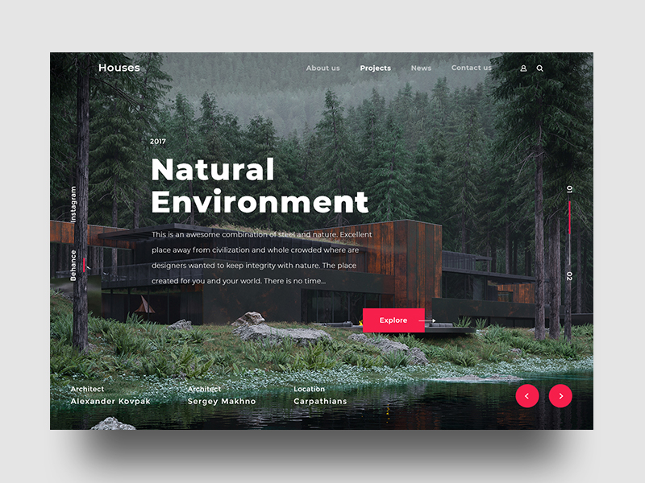
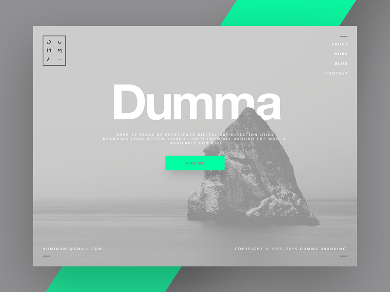

 
Aucun prérequis !  


### Introduction
WordPress est un système de gestion du contenu (CMS) open source qui permet de créer et de gérer facilement des sites web de manière flexible et personnalisable. Il permet autant de créer des blogs personnales que des sites d'entreprise ou des boutiques en ligne. Son architecture modulaire, ses thèmes personnalisables et ses plugins étendus font de lui une solution très populaire pour de nombreux utilisateurs internationaux. 
Différents plans tarifaires sont proposés en fonction du besoin de l'utilisateur, ici on se concentrera uniquement sur le plan gratuit, dont les fonctionalités bien que limités restent intéressantes pour l'objectif final : avoir un site professionnel permettant d'exposer les sorties VTT proposé par une entreprise et permette aux visiteurs de s'y inscrire.

Pour ce faire je vais suivre la formation [OpenClassroom](https://openclassrooms.com/) intitulé [Créez un site moderne et professionnel avec WordPress 5](https://openclassrooms.com/fr/courses/5489551-creez-un-site-moderne-et-professionnel-avec-wordpress-5).

## 1. Découverte de WordPress

Les CMS (systèmes de gestion de contenu) et le concept open source sont deux piliers fondamentaux de l'univers numérique contemporain, chacun apportant des avantages distincts et contribuant à façonner le paysage en ligne. 

Un CMS, ou "Content Management System", est une plateforme logicielle conçue pour la création et la gestion dynamique de sites web ou d'applications multimédia. Plutôt que de coder manuellement chaque élément d'un site, un CMS offre une interface conviviale permettant de créer et de gérer les contenus plus efficacement. 

D'autre part, le terme "open source", ou "code source ouvert", désigne des logiciels (et désormais des œuvres intellectuelles) dont la licence respecte des critères spécifiques établis par l'Open Source Initiative. Cela inclut des principes tels que la libre redistribution, l'accès au code source et la possibilité de créer des travaux dérivés. 

L'association du CMS et de l'open source est particulièrement exemplifiée par WordPress, un CMS open source qui a connu un succès phénoménal. Son code ouvert a encouragé la collaboration et l'innovation, attirant une communauté dévouée de développeurs et d'utilisateurs. Cette ouverture a permis à WordPress de devenir le leader incontesté du marché des CMS, propulsant près de 40 % des sites web dans le monde. 

L'histoire de WordPress est celle d'une évolution constante, marquée par des fonctionnalités innovantes telles que les extensions (plugins) et les thèmes, qui ont considérablement élargi ses possibilités. L'engagement envers la gratuité, la philosophie open source et la communauté a été crucial dans la croissance et le maintien de sa popularité. 

Plus récemment, WordPress a introduit Gutenberg, un éditeur de contenu basé sur des blocs, représentant une évolution majeure vers un web plus moderne et dynamique. Bien que cette transition ait suscité des débats au sein de la communauté, Gutenberg devrait finalement s'imposer comme une norme, illustrant la capacité de WordPress à s'adapter et à innover pour répondre aux besoins changeants du monde numérique.

## 2. Fonctionnement d'un site web

Le fonctionnement du web repose sur un modèle d'échanges décentralisés entre un client (généralement vous, via votre navigateur web) et un serveur qui héberge les pages web.

Lorsque vous souhaitez accéder à un site web, vous saisissez l'adresse du site dans votre navigateur, appelée URL (Uniform Resource Locator). Cette adresse se décompose en plusieurs parties :

- Le protocole de communication utilisé, tel que HTTP (Hypertext Transfer Protocol), qui est le plus courant pour afficher des pages web.
- Le nom de domaine du site, loué auprès d'un registrar et permettant d'identifier le site de manière simple.
- Le chemin d'accès spécifique à la page demandée sur le site.

Techniquement, votre navigateur demande au réseau la localisation du site à partir de son nom de domaine. Le réseau répond en fournissant l'adresse IP du serveur hébergeant le site, permettant ainsi à la requête d'atteindre le serveur.

Une fois la requête acheminée vers le serveur, celui-ci recherche la page demandée et la fournit au navigateur sous forme de code HTML.

Le navigateur interprète ensuite ce code HTML pour afficher la page web que vous voyez à l'écran.

Pour qu'un site web fonctionne, il a besoin d'un serveur pour stocker les fichiers et exécuter le code nécessaire à sa création. Pour les sites basés sur WordPress, par exemple, le serveur exécute du code PHP et accède à une base de données MySQL pour récupérer les informations nécessaires à la génération des pages.

Deux options principales sont disponibles pour disposer d'un tel serveur :

1. Créer un environnement en local en utilisant des logiciels tels que MAMP ou Local by Flywheel, qui simulent un serveur sur votre propre ordinateur. C'est gratuit mais le site ne sera accessible que sur votre machine.

2. Louer de l'espace sur un serveur auprès d'un hébergeur. Cela permet au site d'être accessible en ligne via Internet, mais cela implique des frais mensuels.

En parallèle, un nom de domaine est nécessaire pour que le public puisse accéder facilement à votre site. Il est loué auprès de fournisseurs spécialisés appelés registrar et permet de remplacer l'adresse IP du serveur par un nom convivial. Ce nom de domaine peut être accompagné de sous-domaines, tels que blog.monsite.com ou shop.monsite.com, qui peuvent pointer vers des sites différents tout en étant liés au même nom de domaine principal.

## 3. Choisir le bon hébergeur 

Il existe différent types d'hébergements selon le besoin : 
- hébergement mutualisé : 
  Ce type d'hébergement permet de louez une portion d'un serveur qui est partagé avec d'autres utilisateurs. Cette solution est la plus économique mais à de nombreux désavantages (accès limité à la configuration du serveur, subir les effets de noisy neighbours, un support très réduit,...)

- hébergement dédié : 
  Ce type d'hébergement permet de louez un serveur entier, ce qui est évidemment plus cher, mais permet d'avoir un contrôle total sur le serveur. Cependant il est primordiale d'avoir de bonnes connaissances techniques pour le gérer. 

- hébergement managé (ou infogéré) :
  Ce type d'hébergement permet de louer un certain niveau de performance et de disponibilité pour un site sans avoir à se soucier de la partie serveur. C'est un prestataire qui s'occupe de tout à notre place. Le prix est plus cher que pour un hébergement mutualisé classique mais c'est une solution très idéal si on a pas le temps de s'occuper de cette partie là. 

  Pour ce MON on va utiliser Themecloud qui est devenu [faaaster.](https://www.faaaster.io/) pour les raisons suivantes : 
  + on a un site WordPress en ligne immédiatement et gratuit pour 30 jours 
  + le site est rapide, sécurisé et sauvegardé tous les jours
  + on a un support réactif

## 4. Se connecter au bashboard WordPress

Dans la formation ils vont diront d'ajouter */wp-admin* après l'adresse du site. Ca fonctionnait peut-être avec <strong>Themecloud</strong> mais pas avec <strong>faaaster</strong>. Il suffit de cliquer sur "Se connecter au site" lorsque l'on est sur la page de notre hébergeur pour le site en question. 

Voilà on est bien dans le mode admin ! On va pouvoir naviguer depuis le dashboard WordPress.

On survole le nom du site en haut à gauche et on clique sur "Dashboard" pour accéder à l'interface d'administration WordPress.

WordPress propose deux types de contenus de base : les articles et les pages. Les articles sont des contenus d'actualité, datés, et sont généralement présentés de manière antéchronologique sur une page spécifique, constituant ainsi un blog. Les pages, en revanche, sont des contenus statiques qui ne sont pas datés et conservent une valeur constante dans le temps. Elles sont utilisées pour présenter des informations permanentes telles que la société, les services ou les coordonnées de contact, et sont généralement accessibles via un menu de navigation sur le site web.

On va créer notre premier article. 
Pour cela on survole "Posts" puis on clique sur "Add new"
// image 

On arrive alors sur cette page : 
// image

Je créer mon premier post que j'ajoutes dans la <strong>Catégorie</strong> *Weekend* : 
//image 

WordPress propose également deux systèmes de classification par défaut : les catégories et les tags.

Les catégories sont hiérarchisées et permettent de structurer le contenu dans une arborescence.

Les tags, en revanche, ne suivent pas de hiérarchie et reflètent souvent les thèmes abordés dans le contenu.

Gutenberg est le nouvel éditeur visuel de WordPress, basé sur le concept de "blocs". Il offre la possibilité de créer des mises en page complexes en utilisant une interface de type "drag and drop".

Enfin, les articles et les pages peuvent être enregistrés en brouillon, publiés en mode privé, ou planifiés pour une publication ultérieure.

## 5. Paramétrage du site WordPress
Pour passer votre site WordPress en français, accédez à "Réglages" puis "Général". Sélectionnez ensuite la langue désirée dans le menu déroulant sous "Langue".

Modifiez le titre et le slogan de votre site pour les rendre plus accrocheurs et optimiser le référencement. Vous pouvez le faire dans la même section "Réglages" >> "Général".

Assurez-vous de choisir une catégorie par défaut pour vos articles et cachez éventuellement votre site aux moteurs de recherche pendant le développement. Ces réglages se trouvent sous "Réglages" >> "Écriture" et "Réglages" >> "Lecture" respectivement.

Configurez les paramètres de commentaires selon vos besoins sous "Réglages" >> "Discussion".

Enfin, ajustez les permaliens pour optimiser les URL de votre site. Cela se fait sous "Réglages" >> "Permaliens".

Il est important de garder à l'esprit la cohérence et la facilité d'utilisation pour les visiteurs tout en optimisant le référencement de votre site.

## 6. Page d'accueil personnalisée et menu de navigation

Avant de pouvoir configurer votre page d'accueil, il est nécessaire de la créer. Pour ce faire, rendez-vous dans l'onglet "Pages" puis cliquez sur "Ajouter". Donnez un titre à votre page, par exemple "Banana WordPress Design", et saisissez une description dans la zone de contenu. Une fois terminé, cliquez sur "Publier" pour créer la page.

Répétez cette opération pour créer une page dédiée à votre blog. Pour cette page, ne saisissez aucun contenu, car elle affichera automatiquement la liste des articles publiés sur votre site.

Maintenant que vos pages sont créées, allez dans "Réglages" puis "Lecture" pour configurer la page d'accueil et la page de blog. Sous l'option "La page d'accueil affiche", choisissez "Une page statique" et sélectionnez votre page d'accueil et votre page de blog respectivement.

Une fois ces paramètres enregistrés, vérifiez votre site pour voir les changements. La page d'accueil affichera le contenu que vous avez saisi, mais pour accéder à la page du blog, il faut créer un menu de navigation.

Rendez-vous dans "Apparence" puis "Menus". Créez un nouveau menu en lui donnant un nom, par exemple "Principal", et sélectionnez l'emplacement "Supérieur".

Ensuite, ajoutez les pages que vous avez créées précédemment à ce menu en les sélectionnant dans la colonne de gauche et en cliquant sur "Ajouter au menu". Vous pouvez réorganiser l'ordre des pages en les faisant glisser et les déposer. Enregistrez ensuite le menu.

Une fois le menu créé et enregistré, visitez à nouveau votre site pour voir le menu de navigation qui s'affiche.

## 7. Type de site 

Maintenant que nous avons exploré l'interface d'administration de WordPress, nous sommes prêts à nous lancer dans notre projet. WordPress tire sa force de sa variété de composants, tels que les thèmes et les plugins, qui permettent de personnaliser et d'enrichir les fonctionnalités de notre site.

La première étape consiste à définir clairement le type de site que nous souhaitons créer, puis à installer et configurer les composants les plus adaptés à nos besoins.

Avant de commencer la création du site, il est essentiel de définir les objectifs spécifiques que nous souhaitons atteindre. Cela peut inclure des objectifs tels que générer des contacts commerciaux, offrir un design attrayant et professionnel, faciliter les interactions avec les visiteurs via un formulaire de contact et encourager l'abonnement à une newsletter.

Il est également crucial de prendre en compte le référencement dès le début du processus. Cela implique de sélectionner des expressions de recherche pertinentes sur lesquelles se positionner et de structurer le contenu en conséquence pour améliorer la visibilité dans les résultats des moteurs de recherche.

Une fois les objectifs et les expressions de recherche définis, nous pouvons passer à la structuration du site. Cela implique de créer une arborescence des pages en regroupant les informations de manière logique et cohérente, en tenant compte des objectifs et des expressions de recherche ciblées.

Pour faciliter la visualisation de la structure des pages, il est recommandé de créer des wireframes, des schémas simples qui représentent la disposition des éléments sur chaque page. Cela peut être fait à l'aide d'outils dédiés ou simplement avec un crayon et du papier.

En résumé, avant de commencer la création de notre site WordPress, il est crucial de définir clairement nos objectifs, de prendre en compte le référencement dès le départ, de structurer le contenu de manière logique et cohérente, et de planifier la disposition des éléments sur chaque page à l'aide de wireframes.

<strong>Structure de mon site : </strong>

- <strong>Accueil</strong>
Présenter les services.
Rassurer sur les compétences.
Inciter à prendre contact.

- <strong>Sorties proposées</strong>
Présenter les prochaines sorties.
Informer sur les prix.
Possibilité de s'inscrire.

- <strong>Contact</strong>
Formulaire de contact >> pour faciliter la prise de contact.
Téléphones portables accessibles pour prendre contact avec les moniteurs.

## 8. Thèmes et page builder

Le thème est crucial, car il détermine l'apparence du site et ses fonctionnalités, comme la structure de l'en-tête, du contenu, du pied de page et des barres latérales.

Un page builder facilite la création de pages avec des fonctionnalités avancées en glisser-déposer, offrant une visualisation en temps réel des modifications.

Il existe trois types de thèmes : gratuit, freemium et premium, chacun avec ses avantages et ses limitations. Les thèmes spécialisés et les thèmes multipurpose offrent des fonctionnalités variées adaptées à différents types de sites.

Lors du choix d'un thème, il est essentiel de prendre en compte des aspects tels que la dernière mise à jour, les notes et les commentaires, la rapidité de chargement, la compatibilité multilingue, le support, la source, la qualité du design et des fonctionnalités.

Pour notre projet, nous optons pour le thème OceanWP, compatible avec le page builder Elementor, en raison de sa flexibilité et de sa compatibilité avec nos besoins.

En personnalisant un thème, il est recommandé d'utiliser un thème enfant pour éviter la perte de personnalisations lors des mises à jour.

## 9. Installation et configuration du thème 
Pour installer votre thème WordPress, accédez à Apparence >> Thèmes >> Ajouter. Recherchez le thème OceanWP dans la bibliothèque WordPress.org et cliquez sur "Installer". Une fois installé, activez-le en un clic.

Si vous aviez un thème premium ou non disponible sur WordPress.org, vous auriez dû téléverser l'archive (.zip) du thème. 

Après l'activation, installez les extensions recommandées en cliquant sur "Commencez à installer les extensions" dans la notification du dashboard. Sélectionnez toutes les extensions, installez-les et activez-les en un seul clic.

Pour gagner du temps, utilisez l'Assistant de configuration d'OceanWP pour importer une démo de site prête à l'emploi. Choisissez le modèle de démo souhaité, installez les extensions requises (sauf les extensions premium), puis cliquez sur "Installer cette démo".

Votre site sera alors identique à la démo choisie. Vous disposez maintenant d'une base solide pour commencer à construire vos pages.

## 10. Extensions WordPress
Une extension WordPress est un ajout à WordPress qui permet d'intégrer des fonctionnalités supplémentaires non incluses nativement. Elles peuvent être gratuites ou payantes et sont disponibles dans la bibliothèque WordPress.org ou en dehors.

Lors de l'installation d'OceanWP, des extensions comme "WP Forms" sont incluses. Celles-ci ajoutent des fonctionnalités spécifiques telles que la création de formulaires de contact. Il existe d'autres extensions similaires comme Caldera Forms, Ninja Forms ou Gravity Forms, recommandée pour des formulaires plus complexes.

Certaines extensions sont dédiées à des composants WordPress spécifiques, comme Ocean Extra pour OceanWP ou les addons pour Elementor, le page builder utilisé. Les critères de sélection des extensions sont similaires à ceux des thèmes, et il est crucial de choisir celles qui répondent le mieux à vos besoins.

Il existe deux types d'extensions : les standards, qui ajoutent des fonctionnalités essentielles à la plupart des sites web, et les spécifiques, répondant à des besoins précis du projet. Pour notre exemple, nous choisissons des extensions telles que "SEO Press" ou "Yoast SEO" pour le référencement naturel, "Broken Link Checker" pour les liens cassés, etc.

Veillez à ne pas surcharger votre site en extensions inutiles, car cela peut affecter sa performance et la gestion des mises à jour. Il est important de sélectionner judicieusement les extensions nécessaires, de désactiver et de supprimer celles qui ne sont pas utilisées, et d'éviter d'installer plusieurs extensions pour la même fonctionnalité.

## 11. Design global du site
Dans ce chapitre, nous apprenons à définir une charte graphique pour notre site web. Voici un résumé des étapes que nous devons suivre :

1. <strong>Trouver une inspiration :</strong> Nous recherchons des sites d'inspiration pour définir une identité graphique cohérente. Des sites comme Dribbble, CollectUI, ou des comptes Instagram spécialisés dans le design peuvent être utiles.

1. <strong>Définir une palette de couleurs :</strong> Nous utilisons des outils en ligne comme Paletton ou ColorMind pour créer une palette de couleurs, en nous basant sur une image d'inspiration. Cette palette servira de base pour les choix de couleurs sur le site.

Le seul bémol pour la première palette est le rose qui je pense ne correspond pas assez à la cible visé (adolescent masculin), je préfère passer à un orange tout aussi flashy mais qui sera plus adapté. 

1. <strong>Choisir des polices de caractères :</strong> Nous optons pour des polices gratuites disponibles sur Google Fonts, en sélectionnant une police pour les titres et une autre pour le corps de texte.

2. <strong>Choisir un master visuel :</strong> Nous sélectionnons une image ou une photo qui représente notre marque et son ambiance générale. Cette image sera utilisée comme élément visuel principal sur le site. J'ai trouvé différentes images inspirantes sur le site [unsplash.fr](https://unsplash.com/fr).
   

3. <strong>Créer un logo :</strong> Si nous ne sommes pas graphistes, nous optons pour la simplicité en créant un logo avec le nom de la marque et éventuellement une icône simple. Des sites comme FreePik ou des outils en ligne comme Snappa ou Canva peuvent être utiles pour créer un logo professionnel. J'ai travaillé sur Canva pour obtenir ce logo : 

1. <strong>Paramétrer les options du thème :</strong> Nous utilisons le customizer de WordPress pour intégrer les éléments de notre charte graphique dans le thème. Cela inclut l'ajout du logo, la définition des palettes de couleurs et des polices de caractères, ainsi que la configuration du layout des pages.

En suivant ces étapes, nous pouvons créer un design cohérent et professionnel pour notre site web, même sans être des experts en design graphique.

## 12. Elementor et la page d'accueil

Ce chapitre explique comment utiliser le page builder Elementor pour modifier et personnaliser les pages de votre site WordPress, en mettant particulièrement l'accent sur la page d'accueil. Voici un résumé :

<strong>Accès à Elementor</strong> :
   - Pour éditer une page avec Elementor, rendez-vous sur la page que vous souhaitez modifier et cliquez sur "Modifier avec Elementor".
   - Si la page n'est pas encore créée avec Elementor, cliquez sur le bouton "Modifier avec Elementor" depuis le tableau de bord.

<strong>Interface Elementor</strong> :
   - L'interface d'Elementor se divise en deux parties : une colonne de gauche avec les fonctionnalités et une zone de prévisualisation à droite.
   - Vous pouvez ajouter des modules en les glissant depuis la colonne de gauche vers la zone de prévisualisation.

<strong>Personnalisation du hero</strong> :
   - La section "hero" est la première partie de la page, souvent avec un titre accrocheur et un appel à l'action.
   - Vous pouvez modifier le titre, le sous-titre, et l'image de fond en utilisant les options disponibles dans Elementor.

<strong>Personnalisation des boutons</strong> :
   - Les boutons peuvent être stylisés en changeant leur forme, couleur, et texte.
   - Vous pouvez également ajouter des animations aux boutons pour un effet visuel supplémentaire.

<strong>Personnalisation du contenu</strong> :
   - Vous pouvez personnaliser le contenu de chaque section en modifiant les titres, textes, images, etc.
   - Utilisez les options disponibles dans Elementor pour ajuster le style et la mise en page selon vos besoins.

<strong>Adaptation pour différents écrans</strong> :
   - Assurez-vous d'adapter le design pour les écrans mobiles et tablettes en modifiant les paramètres spécifiquement pour ces tailles d'écran.

<strong>Conseils supplémentaires</strong> :
   - Utilisez les fonctionnalités avancées d'Elementor pour explorer davantage de possibilités de personnalisation.
   - Ajoutez d'autres pages à votre site en utilisant des templates gratuits disponibles dans Elementor ou via l'extension Envato Elements.

En suivant ces étapes et en explorant les fonctionnalités d'Elementor, vous pouvez créer des pages personnalisées et attrayantes pour votre site WordPress.

## 13. Fonctionnalités complémentaires grâce aux extensions

Ce chapitre explique comment ajouter un formulaire de contact à un site WordPress en utilisant l'extension WP Forms. Voici un résumé synthétique :

<strong>Introduction du formulaire de contact</strong> :
   - Ajouter un formulaire de contact est crucial pour permettre aux visiteurs de soumettre des demandes.
   - WP Forms est choisi pour sa simplicité d'utilisation et sa capacité à enregistrer automatiquement les soumissions en base de données.

<strong>Création du formulaire</strong> :
   - Accéder à la rubrique "WP Forms" dans le tableau de bord WordPress.
   - Cliquer sur "Nouveau" et créer un formulaire nommé "contact" en choisissant le modèle "Formulaire de contact simple".
   - Personnaliser le formulaire en ajoutant et en organisant les champs selon les besoins.

<strong>Réglages du formulaire</strong> :
   - Modifier les libellés généraux et configurer les notifications par e-mail pour être alerté des soumissions.
   - Utiliser des balises pour personnaliser les e-mails en fonction des données saisies.
   - Configurer un message de confirmation automatique pour les visiteurs.

<strong>Insertion du formulaire dans la page</strong> :
   - Utiliser un shortcode pour insérer le formulaire dans une page ou un article.
   - Coller le shortcode dans la zone de contenu de la page.
   - Pour les utilisateurs d'Elementor, ajouter un composant de code court et y coller le shortcode.

<strong>Utilisation d'un widget</strong> :
   - Certains plugins génèrent des widgets utilisables dans les page builders comme Elementor.
   - Rechercher et glisser le widget "WP Forms" dans la section souhaitée.
   - Choisir le formulaire à afficher à l'aide du menu contextuel.

Ensuite, le chapitre explique comment ajouter un pop-up d'inscription à une newsletter en utilisant le plugin Hustle. Les étapes incluent l'installation du plugin, la création d'un pop-up, la personnalisation des paramètres et la publication du pop-up.

Enfin, le chapitre se termine par des conseils sur l'importance de sauvegarder régulièrement le site avec l'extension Updraft Plus, en téléchargeant une sauvegarde manuelle sur la machine et en planifiant des sauvegardes automatiques sur Google Drive.

## 14. Fonctionalités avancées

### Horodateur
| Date | Heures passées | Indications |
| -------- | -------- |-------- |
| Mardi 06/02 | 15min  | *Découvrez WordPress* |
| Mardi 06/02 | 15min | *Initiez-vous au fonctionnement d'un site web* |
| Mardi 06/02 | 30min | *Choisissez votre hébergeur et mettez votre site WordPress en ligne* |
| Mardi 06/02 | 5min | *Quizz : Mettez en ligne un site WordPress sur un hébergeur* |
| Mardi 06/02 | 45min | *Connectez-vous au bashboard WordPress et créez votre premier article* |
| Mardi 06/02 | 30min | *Paramétrez les options de votre site WordPress* |
| Mardi 06/02 | 20min | *Mettez en place une page d'accueil personnalisée et créez votre menu de navigation* |
| Mardi 06/02 | 5min | *Quizz : Prenez en main l'administration WordPress* |
| Mercredi 07/02 | 20min | *Définissez le type de site que vous souhaitez créer* |
| Mercredi 07/02 | 20min | *Choisissez votre thème et votre page builder* |
| Mercredi 07/02 | 30min | *Installez et configurez votre thème WordPress* |
| Mercredi 07/02 | 20min | *Choisissez et installez les extensions WordPress pertinentes pour votre projet*
| Jeudi 08/02 | 1h30 | *Définissez le design global de votre site* |
| Jeudi 08/02 | 1h30 | *Prenez en main Elementor et designez votre page d’accueil* |
| Samedi 10/02 | 45min | *Intégrez des fonctionnalités complémentaires grâce aux extensions* |
| Samedi 10/02 | | *Intégrez des fonctionnalités avancées* |

