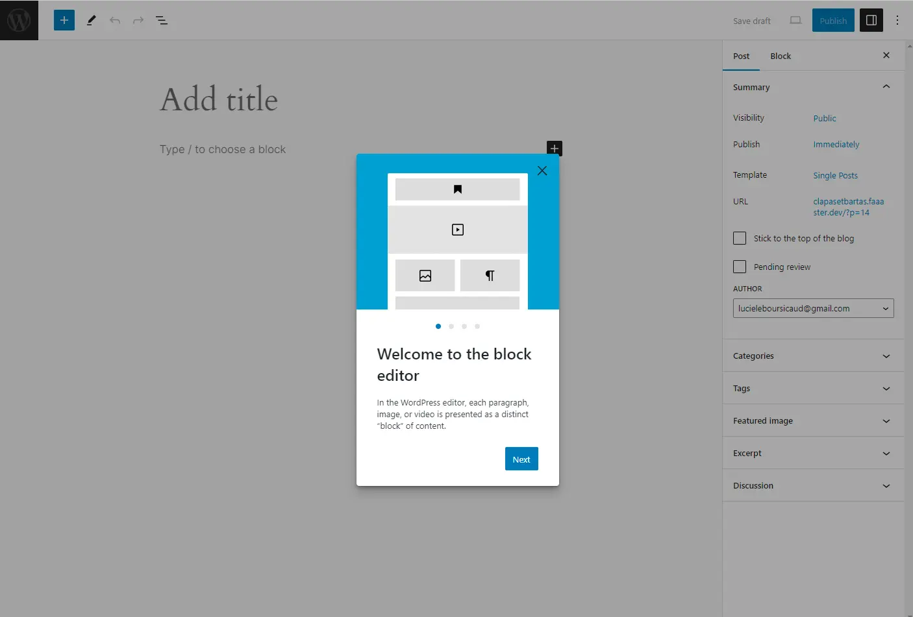
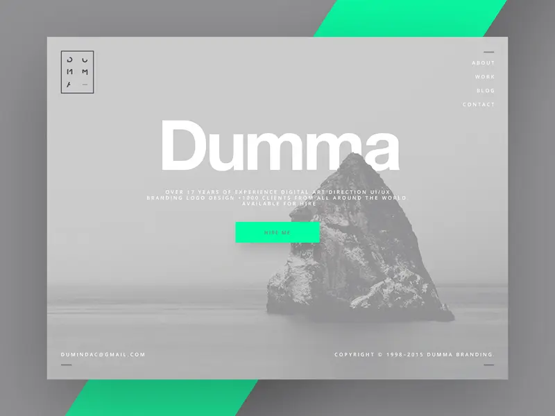
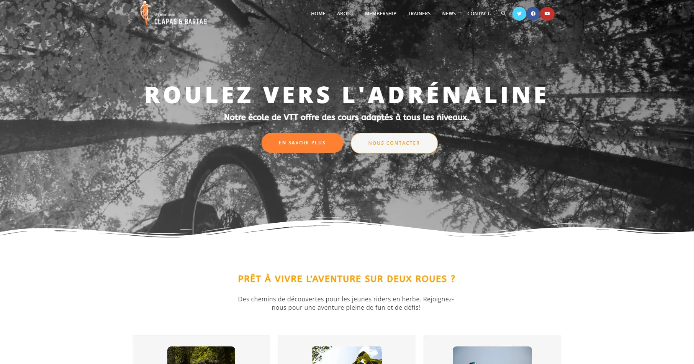
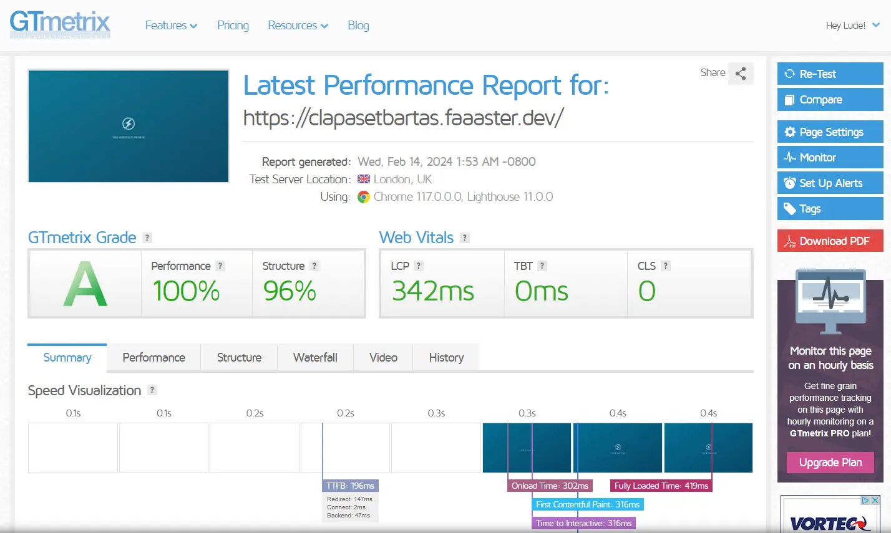
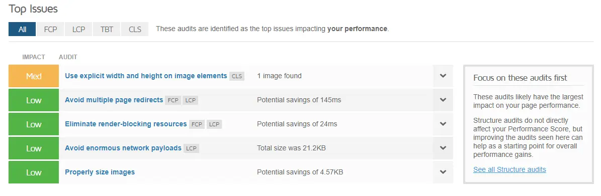
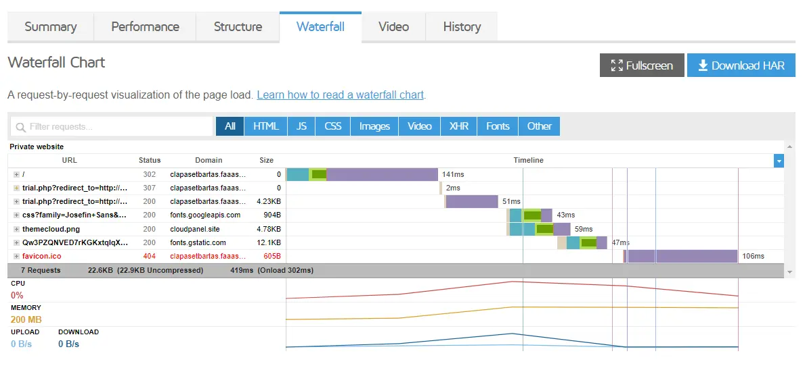
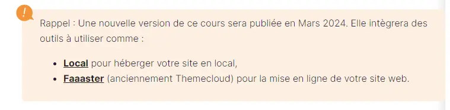

 
Aucun prérequis !  


### Introduction
WordPress est un système de gestion du contenu (CMS) open source qui permet de créer et de gérer facilement des sites web de manière flexible et personnalisable. Il permet autant de créer des blogs personnels que des sites d'entreprise ou des boutiques en ligne. Son architecture modulaire, ses thèmes personnalisables et ses plugins étendus font de lui une solution très populaire pour de nombreux utilisateurs internationaux. 
Différents plans tarifaires sont proposés en fonction du besoin de l'utilisateur, ici on se concentrera uniquement sur le plan gratuit, dont les fonctionalités bien que limités restent intéressantes pour l'objectif final : avoir un site professionnel permettant d'exposer les sorties VTT proposé par une entreprise et permette aux visiteurs de s'y inscrire.

Pour ce faire je vais suivre la formation [OpenClassroom](https://openclassrooms.com/) intitulé [Créez un site moderne et professionnel avec WordPress 5](https://openclassrooms.com/fr/courses/5489551-creez-un-site-moderne-et-professionnel-avec-wordpress-5).

## 1. Découverte de WordPress

Les <strong>CMS (systèmes de gestion de contenu)</strong> et le concept <strong> open source </strong> sont deux piliers fondamentaux de l'univers numérique contemporain, chacun apportant des avantages distincts et contribuant à façonner le paysage en ligne. 

Un CMS, ou "Content Management System", est une <strong>plateforme logicielle</strong> conçue pour la création et la gestion dynamique de sites web ou d'applications multimédia. Plutôt que de coder manuellement chaque élément d'un site, un CMS offre une interface conviviale permettant de <strong>créer et de gérer les contenus plus efficacement.</strong> 

D'autre part, le terme "open source", ou "code source ouvert", désigne des logiciels (et désormais des œuvres intellectuelles) dont la licence respecte des critères spécifiques établis par <strong>l'Open Source Initiative</strong>. Cela inclut des principes tels que la <strong>libre redistribution, l'accès au code source et la possibilité de créer des travaux dérivés. </strong>

L'association du CMS et de l'open source est particulièrement exemplifiée par WordPress, un CMS open source qui a connu un succès phénoménal. Son code ouvert a encouragé <strong>la collaboration et l'innovation</strong>, attirant une communauté dévouée de développeurs et d'utilisateurs. Cette ouverture a permis à WordPress de devenir <strong>le leader incontesté du marché des CMS</strong>, propulsant près de 40 % des sites web dans le monde. 

L'histoire de WordPress est celle d'une évolution constante, marquée par des fonctionnalités innovantes telles que les <strong>extensions (plugins) et les thèmes</strong>, qui ont considérablement élargi ses possibilités. L'engagement envers la gratuité, la philosophie open source et la communauté a été crucial dans la croissance et le maintien de sa popularité. 

Plus récemment, WordPress a introduit <strong>Gutenberg</strong>, <strong>un éditeur de contenu basé sur des blocs</strong>, représentant une évolution majeure vers un web plus moderne et dynamique. Bien que cette transition ait suscité des débats au sein de la communauté, Gutenberg devrait finalement s'imposer comme une norme, illustrant la capacité de WordPress à s'adapter et à innover pour répondre aux besoins changeants du monde numérique.

## 2. Fonctionnement d'un site web

Le fonctionnement du web repose sur un modèle d'échanges décentralisés entre <strong>un client</strong> (généralement nous, via votre navigateur web) et <strong>un serveur qui héberge les pages web.</strong>

Lorsque l'on souhaite accéder à un site web, on saisisse l'adresse du site dans notre navigateur, appelée URL (Uniform Resource Locator). Cette adresse se décompose en plusieurs parties :

- Le <strong>protocole de communication utilisé</strong>, tel que HTTP (Hypertext Transfer Protocol), qui est le plus courant pour afficher des pages web.
- Le <strong>nom de domaine du site</strong>, loué auprès d'un registrar et permettant d'identifier le site de manière simple.
- Le <strong>chemin d'accès spécifique à la page demandée sur le site.</strong>

Techniquement, notre navigateur demande au réseau la localisation du site à partir de son nom de domaine. Le réseau répond en fournissant l'adresse IP du serveur hébergeant le site, permettant ainsi à la requête d'atteindre le serveur.

Une fois la requête acheminée vers le serveur, celui-ci <strong>recherche la page demandée</strong> et la fournit au navigateur sous forme de <strong>code HTML.</strong>

Le navigateur interprète ensuite ce code HTML pour afficher la page web que l'on voit à l'écran.

Pour qu'un site web fonctionne, il a besoin <strong>d'un serveur</strong> pour stocker les fichiers et exécuter le code nécessaire à sa création. Pour les sites basés sur WordPress, par exemple, le serveur exécute du <strong>code PHP</strong> et <strong>accède à une base de données MySQL</strong> pour récupérer les informations nécessaires à la génération des pages.

Deux options principales sont disponibles pour disposer d'un tel serveur :

1. <strong>Créer un environnement en local</strong> en utilisant des logiciels tels que <strong>MAMP</strong> ou <strong>Local by Flywheel</strong>, qui simulent un serveur sur notre propre ordinateur. C'est gratuit mais le site ne sera accessible que sur notre machine.

2. <strong>Louer de l'espace sur un serveur auprès d'un hébergeur</strong>. Cela permet au site d'être accessible en ligne via Internet, mais cela implique <strong>des frais mensuels</strong>.

En parallèle, <strong>un nom de domaine est nécessaire</strong> pour que le public puisse accéder facilement à votre site. Il est <strong>loué auprès de fournisseurs spécialisés</strong> appelés registrar et permet de remplacer l'adresse IP du serveur par un nom convivial. Ce nom de domaine peut être accompagné de <strong>sous-domaines</strong>, tels que blog.monsite.com ou shop.monsite.com, qui peuvent pointer vers des sites différents tout en étant <strong>liés au même nom de domaine principal.</strong>

## 3. Choisir le bon hébergeur 

Il existe différent types d'hébergements selon le besoin : 
- <strong>hébergement mutualisé : </strong>
  Ce type d'hébergement permet de louez une portion d'un serveur qui est partagé avec d'autres utilisateurs. Cette solution est la plus économique mais à de nombreux désavantages (accès limité à la configuration du serveur, subir les effets de noisy neighbours, un support très réduit,...)

- <strong>hébergement dédié : </strong>
  Ce type d'hébergement permet de louez un serveur entier, ce qui est évidemment plus cher, mais permet d'avoir un contrôle total sur le serveur. Cependant il est primordiale d'avoir de bonnes connaissances techniques pour le gérer. 

- <strong>hébergement managé (ou infogéré) :</strong>
  Ce type d'hébergement permet de louer un certain niveau de performance et de disponibilité pour un site sans avoir à se soucier de la partie serveur. C'est un prestataire qui s'occupe de tout à notre place. Le prix est plus cher que pour un hébergement mutualisé classique mais c'est une solution très idéal si on a pas le temps de s'occuper de cette partie là. 

  Pour ce MON on va utiliser Themecloud qui est devenu [faaaster.](https://www.faaaster.io/) pour les raisons suivantes : 
  + on a un site WordPress <strong>en ligne immédiatement</strong> et <strong>gratuit pour 30 jours </strong>
  + le site est <strong>rapide, sécurisé et sauvegardé tous les jours</strong>
  + on a un <strong>support réactif</strong>

## 4. Se connecter au bashboard WordPress

Dans la formation ils nous dises d'ajouter */wp-admin* après l'adresse du site. Ca fonctionnait peut-être avec <strong>Themecloud</strong> mais pas avec <strong>faaaster</strong>. Il suffit de cliquer sur "Se connecter au site" lorsque l'on est sur la page de notre hébergeur pour le site en question. 

Voilà on est bien dans le mode admin ! On va pouvoir naviguer depuis le <strong>dashboard WordPress.</strong>

On survole le nom du site en haut à gauche et on clique sur "Dashboard" pour accéder à <strong>l'interface d'administration WordPress.</strong>

WordPress propose deux types de contenus de base : <strong>les articles et les pages.</strong> Les articles sont des <strong>contenus d'actualité, datés</strong>, et sont généralement présentés de manière antéchronologique sur une page spécifique, constituant ainsi un blog. Les pages, en revanche, sont des <strong>contenus statiques</strong> qui ne sont pas datés et conservent une valeur constante dans le temps. Elles sont utilisées pour <strong>présenter des informations permanentes</strong> telles que la société, les services ou les coordonnées de contact, et sont généralement accessibles via un menu de navigation sur le site web.

On va créer notre premier article. 
Pour cela on survole "Posts" puis on clique sur "Add new"

On arrive alors sur cette page : 

Je créer mon premier post que j'ajoutes dans la <strong>Catégorie</strong> *Weekend* : 

WordPress propose également deux systèmes de classification par défaut : <strong>les catégories et les tags.</strong>

Les catégories sont <strong>hiérarchisées</strong> et permettent de <strong>structurer le contenu dans une arborescence.</strong>

Les tags, en revanche, ne suivent pas de hiérarchie et reflètent souvent <strong>les thèmes abordés</strong> dans le contenu.

<strong>Gutenberg</strong> est le nouvel éditeur visuel de WordPress, basé sur le concept de "blocs". Il offre la possibilité de créer des mises en page complexes en utilisant une <strong>interface de type "drag and drop".</strong>

Enfin, les articles et les pages peuvent être <strong>enregistrés en brouillon</strong>, <strong>publiés en mode privé</strong>, ou <strong>planifiés pour une publication ultérieure.</strong>

## 5. Paramétrage du site WordPress
Pour passer notre site WordPress en français, il faut aller dans <strong>"Réglages" puis "Général".</strong> On sélectionne ensuite la langue désirée dans le menu déroulant sous "Langue".

On modifie <strong>le titre et le slogan</strong> de notre site pour les rendre plus accrocheurs et optimiser le référencement. On peut le faire dans la même section "Réglages" >> "Général".

Il faut s'assurer de <strong>choisir une catégorie par défaut pour les articles</strong> et <strong>cacher éventuellement le site aux moteurs de recherche</strong> pendant le développement. Ces réglages se trouvent sous "Réglages" >> "Écriture" et "Réglages" >> "Lecture" respectivement.

Il faut configurer les <strong>paramètres de commentaires</strong> selon les besoins sous "Réglages" >> "Discussion".

Enfin, on ajuste <strong>les permaliens</strong> pour optimiser les URL du site. Cela se fait sous "Réglages" >> "Permaliens".

Il est important de garder à l'esprit la cohérence et la facilité d'utilisation pour les visiteurs tout en optimisant le référencement du site.

## 6. Page d'accueil personnalisée et menu de navigation

Avant de pouvoir <strong>configurer la page d'accueil</strong>, il est nécessaire de <strong>la créer</strong>. Pour ce faire, on se rend dans l'onglet <strong>"Pages" puis on clique sur "Ajouter"</strong>. On donne <strong>un titre à la page</strong>, par exemple "Banana WordPress Design" (moi j'ai choisis "Clapas & Bartas" le nomde l'école de VTT), et on saisie <strong>une description</strong> dans la zone de contenu. Une fois terminé, on clique sur <strong>"Publier" pour créer la page.</strong>

On répéte cette opération pour créer une page dédiée à notre blog. Pour cette page, on ne saisis aucun contenu, car elle affichera automatiquement la liste des articles publiés sur le site.

Maintenant que nos pages sont créées, on va dans "Réglages" puis "Lecture" pour <strong>configurer la page d'accueil</strong> et <strong>la page de blog</strong>. Sous l'option "La page d'accueil affiche",on choisis "Une page statique" et on sélectionnes notre page d'accueil et notre page de blog respectivement.

Une fois ces paramètres enregistrés,on vérifie notre site pour voir les changements. La page d'accueil affichera le contenu que l'on a saisi, mais pour accéder à la page du blog, il faut <strong>créer un menu de navigation.</strong>

On se rend dans <strong>"Apparence" puis "Menus"</strong>. On crée <strong>un nouveau menu</strong> en lui donnant un nom, par exemple "Principal", et on sélectionne l'emplacement "Supérieur".

Ensuite, on ajoute les pages que l'on a créées précédemment à ce menu en <strong>les sélectionnant dans la colonne de gauche</strong> et en cliquant sur <strong>"Ajouter au menu"</strong>. On peut <strong>réorganiser l'ordre des pages</strong> en les faisant glisser et les déposer. On <strong>enregistre ensuite le menu.</strong>

Une fois le menu créé et enregistré, on peut visiter à nouveau votre site pour voir le menu de navigation qui s'affiche.

## 7. Type de site 

Maintenant que nous avons exploré l'interface d'administration de WordPress, nous sommes prêts à nous lancer dans notre projet. WordPress tire sa force de <strong>sa variété de composants</strong>, tels que <strong>les thèmes et les plugins</strong>, qui permettent de <strong>personnaliser et d'enrichir les fonctionnalités de notre site.</strong>

La première étape consiste à <strong>définir clairement le type de site que nous souhaitons créer</strong>, puis à installer et configurer les composants les plus adaptés à nos besoins.

Avant de commencer la création du site, il est essentiel de définir les <strong>objectifs spécifiques</strong> que nous souhaitons atteindre. Cela peut inclure des objectifs tels que générer des contacts commerciaux, offrir un design attrayant et professionnel, faciliter les interactions avec les visiteurs via un formulaire de contact et encourager l'abonnement à une newsletter.

Il est également crucial de <strong>prendre en compte le référencement dès le début</strong> du processus. Cela implique de sélectionner des <strong>expressions de recherche pertinentes</strong> sur lesquelles se positionner et de structurer le contenu en conséquence pour <strong>améliorer la visibilité dans les résultats des moteurs de recherche.</strong>

Une fois les objectifs et les expressions de recherche définis, nous pouvons passer à la <strong>structuration du site.</strong> Cela implique de créer une <strong>arborescence des pages</strong> en regroupant les informations de manière logique et cohérente, en tenant compte des objectifs et des expressions de recherche ciblées.

Pour faciliter la visualisation de la structure des pages, il est recommandé de créer des <strong>wireframes</strong>, des schémas simples qui représentent la disposition des éléments sur chaque page. Cela peut être fait à l'aide d'outils dédiés ou simplement avec un crayon et du papier.

En résumé, avant de commencer la création de notre site WordPress, il est crucial de définir clairement nos objectifs, de prendre en compte le référencement dès le départ, de structurer le contenu de manière logique et cohérente, et de planifier la disposition des éléments sur chaque page à l'aide de wireframes.

<strong>Structure de mon site : </strong>

- <strong>Accueil</strong>
Présenter les services.
Rassurer sur les compétences.
Inciter à prendre contact.

- <strong>Sorties proposées</strong>
Présenter les prochaines sorties.
Informer sur les prix.
Possibilité de s'inscrire.

- <strong>Contact</strong>
Formulaire de contact >> pour faciliter la prise de contact.
Téléphones portables accessibles pour prendre contact avec les moniteurs.

## 8. Thèmes et page builder

Le thème est crucial, car il <strong>détermine l'apparence du site et ses fonctionnalités</strong>, comme la structure de l'en-tête, du contenu, du pied de page et des barres latérales.

<strong>Un page builder facilite la création de pages</strong> avec des fonctionnalités avancées en glisser-déposer, offrant une visualisation en temps réel des modifications.

Il existe trois types de thèmes : <strong>gratuit, freemium et premium</strong>, chacun avec ses avantages et ses limitations. Les thèmes spécialisés et les thèmes multipurpose offrent des fonctionnalités variées adaptées à différents types de sites.

Lors du choix d'un thème, il est essentiel de prendre en compte des aspects tels que <strong>la dernière mise à jour, les notes et les commentaires, la rapidité de chargement, la compatibilité multilingue, le support, la source, la qualité du design et des fonctionnalités.</strong>

Pour notre projet, nous optons pour le thème <strong>OceanWP</strong>, compatible avec le page builder <strong>Elementor</strong>, en raison de sa flexibilité et de sa compatibilité avec nos besoins.

En personnalisant un thème, il est recommandé d'utiliser <strong>un thème enfant </strong>pour éviter la perte de personnalisations lors des mises à jour.

## 9. Installation et configuration du thème 

Pour installer notre thème WordPress, on va dans <strong>Apparence >> Thèmes >> Ajouter</strong>. On <strong>recherche le thème OceanWP dans la bibliothèque WordPress.org</strong> et on clqiue sur <strong>"Installer"</strong>. Une fois installé, on <strong>l'active en un clic.</strong>

Si on choisi un thème premium ou non disponible sur WordPress.org, on aurait dû téléverser l'archive (.zip) du thème. 

Après l'activation, on <strong>installe les extensions recommandées</strong> en cliquant sur "Commencez à installer les extensions" dans la notification du dashboard. On sélectionne toutes les extensions, on les installes et on les actives.

Pour gagner du temps, on utilise <strong>l'Assistant de configuration d'OceanWP</strong> pour importer une <strong>démo de site prête à l'emploi</strong>.On a choisi le modèle de démo souhaité, on installe les extensions requises (sauf les extensions premium), puis on clique sur <strong>"Installer cette démo".</strong>

Notre site sera alors identique à la démo choisie. On dispose maintenant d'une base solide pour commencer à construire nos pages.

## 10. Extensions WordPress

Une extension WordPress est <strong> un ajout à WordPress qui permet d'intégrer des fonctionnalités supplémentaires</strong> non incluses nativement. Elles peuvent être <strong>gratuites ou payantes</strong> et sont disponibles dans la bibliothèque WordPress.org ou en dehors.

Lors de l'installation d'OceanWP, des extensions comme <strong>"WP Forms"</strong> sont incluses. Celles-ci ajoutent des fonctionnalités spécifiques telles que <strong>la création de formulaires de contact.</strong> Il existe d'autres extensions similaires comme Caldera Forms, Ninja Forms ou Gravity Forms, recommandée <strong>pour des formulaires plus complexes.</strong>

Certaines extensions sont dédiées à des composants WordPress spécifiques, comme Ocean Extra pour OceanWP ou les addons pour Elementor, le page builder utilisé. <strong>Les critères de sélection des extensions sont similaires à ceux des thèmes</strong>, et il est crucial de choisir celles qui répondent le mieux à vos besoins.

Il existe deux types d'extensions : <strong>les standards</strong>, qui ajoutent des <strong>fonctionnalités essentielles</strong> à la plupart des sites web, et les <strong>spécifiques</strong>, répondant à des <strong>besoins précis</strong> du projet. Pour notre exemple, nous choisissons des extensions telles que "SEO Press" ou "Yoast SEO" pour le référencement naturel, "Broken Link Checker" pour les liens cassés, etc.

Il faut faire attention à <strong>ne pas surcharger votre site en extensions inutiles</strong>, car cela peut affecter sa performance et la gestion des mises à jour. Il est important de sélectionner judicieusement les <strong>extensions nécessaires</strong>, de <strong>désactiver et de supprimer celles qui ne sont pas utilisées</strong>, et <strong>d'éviter d'installer plusieurs extensions pour la même fonctionnalité.</strong>

## 11. Design global du site
Dans ce chapitre, nous apprenons à définir <strong>une charte graphique</strong> pour notre site web. Voici un résumé des étapes que nous devons suivre :

1. <strong>Trouver une inspiration :</strong> Nous recherchons des sites d'inspiration pour définir une identité graphique cohérente. Des sites comme Dribbble, CollectUI, ou des comptes Instagram spécialisés dans le design peuvent être utiles.

1. <strong>Définir une palette de couleurs :</strong> Nous utilisons des outils en ligne comme Paletton ou ColorMind pour créer une palette de couleurs, en nous basant sur une image d'inspiration. Cette palette servira de base pour les choix de couleurs sur le site.

Le seul bémol pour la première palette est le rose qui je pense ne correspond pas assez à la cible visé (enfant/adolescent masculin pour la plus part), je préfère passer à un orange tout aussi flashy mais qui sera plus adapté.

1. <strong>Choisir des polices de caractères :</strong> Nous optons pour des polices gratuites disponibles sur Google Fonts, en sélectionnant une police pour les titres et une autre pour le corps de texte.

2. <strong>Choisir un master visuel :</strong> Nous sélectionnons une image ou une photo qui représente notre marque et son ambiance générale. Cette image sera utilisée comme élément visuel principal sur le site. J'ai trouvé différentes images inspirantes sur le site [unsplash.fr](https://unsplash.com/fr).
   

3. <strong>Créer un logo :</strong> Si nous ne sommes pas graphistes, nous optons pour la simplicité en créant un logo avec le nom de la marque et éventuellement une icône simple. Des sites comme FreePik ou des outils en ligne comme Snappa ou Canva peuvent être utiles pour créer un logo professionnel. J'ai travaillé sur Canva pour obtenir ce logo : 

4. <strong>Paramétrer les options du thème :</strong> Nous utilisons le customizer de WordPress pour intégrer les éléments de notre charte graphique dans le thème. Cela inclut l'ajout du logo, la définition des palettes de couleurs et des polices de caractères, ainsi que la configuration du layout des pages.

En suivant ces étapes, nous pouvons créer un design cohérent et professionnel pour notre site web, même sans être des experts en design graphique.

## 12. Elementor et la page d'accueil

Ce chapitre explique comment utiliser <strong>le page builder Elementor</strong> pour modifier et personnaliser les pages de notre site WordPress, en mettant particulièrement l'accent sur la page d'accueil.

<strong>Accès à Elementor</strong> :
   - Pour <strong>éditer une page avec Elementor</strong>, on se rend sur la page que l'on souhaite modifier et on clique sur <strong>"Modifier avec Elementor".</strong>
   - Si la page n'est pas encore créée avec Elementor, on clique sur le bouton "Modifier avec Elementor" depuis le tableau de bord.

<strong>Interface Elementor</strong> :
   - L'interface d'Elementor se divise en deux parties : <strong>une colonne de gauche avec les fonctionnalités et une zone de prévisualisation à droite.</strong>
   - On peut ajouter des modules en les glissant depuis la colonne de gauche vers la zone de prévisualisation.

<strong>Personnalisation du hero</strong> :
   - La section <strong>"hero"</strong> est la première partie de la page, souvent avec <strong>un titre accrocheur et un appel à l'action.</strong>
   - On peut modifier le titre, le sous-titre, et l'image de fond en utilisant les options disponibles dans Elementor.

<strong>Personnalisation des boutons</strong> :
   - Les boutons peuvent être <strong>stylisés en changeant leur forme, couleur, et texte.</strong>
   - On peut également ajouter des <strong>animations aux boutons</strong> pour un effet visuel supplémentaire.

<strong>Personnalisation du contenu</strong> :
   - On peut <strong>personnaliser le contenu</strong> de chaque section en modifiant <strong>les titres, textes, images, etc.</strong>
   - On utilises les options disponibles dans Elementor pour ajuster le style et la mise en page selon nos besoins.

<strong>Adaptation pour différents écrans</strong> :
   - On s'assure <strong>d'adapter le design pour les écrans mobiles et tablettes</strong> en modifiant les paramètres spécifiquement pour ces tailles d'écran.

<strong>Conseils supplémentaires</strong> :
   - On utilise les fonctionnalités avancées d'Elementor pour explorer davantage de possibilités de personnalisation.
   - On ajoute d'autres pages à notre site en utilisant des templates gratuits disponibles dans Elementor ou via l'extension Envato Elements.

En suivant ces étapes et en explorant les fonctionnalités d'Elementor, on peut créer des pages personnalisées et attrayantes pour notre site WordPress.

Voilà un aperçu de ce que j'ai fait : 

## 13. Fonctionnalités complémentaires grâce aux extensions

Ce chapitre explique comment ajouter un formulaire de contact à un site WordPress en utilisant l'extension WP Forms.

<strong>Introduction du formulaire de contact</strong> :
   - Ajouter un formulaire de contact est crucial pour permettre aux visiteurs de <strong>soumettre des demandes.</strong>
   - <strong>WP Forms</strong> est choisi pour sa simplicité d'utilisation et sa capacité à enregistrer automatiquement les soumissions en base de données.

<strong>Création du formulaire</strong> :
   - Accéder à la rubrique <strong>"WP Forms" dans le tableau de bord WordPress.</strong>
   - Cliquer sur <strong>"Nouveau" et créer un formulaire nommé "contact"</strong> en choisissant le modèle "Formulaire de contact simple".
   - Personnaliser le formulaire en <strong>ajoutant et en organisant les champs selon les besoins.</strong>

<strong>Réglages du formulaire</strong> :
   - Modifier les <strong>libellés généraux</strong> et <strong>configurer les notifications par e-mail pour être alerté des soumissions.</strong>
   - Utiliser des balises pour personnaliser les e-mails en fonction des données saisies.
   - Configurer un <strong>message de confirmation automatique</strong> pour les visiteurs.

<strong>Insertion du formulaire dans la page</strong> :
   - Utiliser un <strong>shortcode</strong> pour insérer le formulaire dans une page ou un article.
   - Coller le shortcode dans la <strong> zone de contenu de la page.</strong>
   - Pour les utilisateurs d'Elementor, ajouter un composant de code court et y coller le shortcode.

<strong>Utilisation d'un widget</strong> :
   - Certains plugins génèrent des widgets utilisables dans les page builders comme Elementor.
   - Rechercher et glisser le widget "WP Forms" dans la section souhaitée.
   - Choisir le formulaire à afficher à l'aide du menu contextuel.

Ensuite, le chapitre explique comment <strong>ajouter un pop-up d'inscription à une newsletter</strong> en utilisant le plugin <strong>Hustle</strong>. Les étapes incluent l'installation du plugin, la création d'un pop-up, la personnalisation des paramètres et la publication du pop-up. Mais je n'ai pas jugé utile d'ajouter cette fonctionnalité à mon site.

Enfin, le chapitre se termine par des conseils sur l'importance de sauvegarder régulièrement le site avec <strong>l'extension Updraft Plus</strong>, en téléchargeant une sauvegarde manuelle sur la machine et en <strong>planifiant des sauvegardes automatiques sur Google Drive.</strong>

## 14. Fonctionalités avancées

Ce chapitre explique comment <strong>configurer une page d'attente personnalisée</strong> ainsi que <strong>la création de headers et footers</strong> sur mesure avec Elementor et OceanWP, et l'ajout de <strong>CSS personnalisés.</strong>

<strong>Page d'attente personnalisée </strong>:
   - Deux solutions sont présentées pour rendre un site inaccessible au public jusqu'au lancement : <strong>utiliser une extension spécialisée ou créer une page personnalisée avec Elementor.</strong>
   - Pour créer une <strong>page d'attente avec Elementor</strong>, on se rend sur <strong> Elementor > Mes modèles </strong>, on crée un <strong>nouveau modèle de type "Page"</strong> et on la personalise selon nos besoins.
   - Ensuite, on va dans <strong>Elementor > Outils</strong>, on sélectionne l'onglet <strong>"Maintenance"</strong>, on choisis <strong>"Arrivée bientôt"</strong> et on utilise le modèle créé précédemment.

<strong>Header et footer personnalisés avec Elementor et OceanWP</strong> :
   - OceanWP permet de <strong>créer des headers et footers avec Elementor</strong> pour des designs complexes.
   - Pour créer un header personnalisé, on va dans <strong>Theme Panel > Ma bibliothèque</strong>, on crée un nouveau modèle de type "Header", on le personnalise avec Elementor en ajoutant le menu, puis l'applique dans le customizer.
   - Le même processus est applicable pour le footer.

<strong>Ajout de CSS personnalisés</strong> :
   - L'ajout de règles CSS personnalisées est possible dans la section <strong>"CSS et JS personnalisés"</strong> du customizer.
   - Il est nécessaire d'<strong>avoir des bases en CSS</strong> pour utiliser cette fonctionnalité.
   - Les éléments peuvent être ciblés en <strong>attribuant des classes CSS dans Elementor</strong> ou en utilisant <strong>l'inspecteur du navigateur.</strong>

<strong>Création de types de contenus personnalisés</strong> :
   - Pour des sites plus complexes, la création de <strong>types de contenus personnalisés</strong> est nécessaire.
   - L'extension <strong>CPT UI</strong> permet de créer facilement des types de contenus personnalisés.
   - Les types de contenus peuvent être utilisés pour <strong>créer des sections comme des testimoniaux ou des portfolios.</strong>
   - Les contenus de type portfolio peuvent être affichés avec des <strong>addons Elementor</strong> comme "Livemesh Addons for Elementor" en utilisant le widget "Posts Grid" pour afficher une liste de contenus.

En suivant ces étapes, il est possible de <strong>personnaliser efficacement différents aspects d'un site WordPress</strong> avec Elementor et OceanWP, tout en utilisant des fonctionnalités avancées telles que les pages d'attente, les headers et footers personnalisés, l'ajout de CSS personnalisés et la création de types de contenus personnalisés.

## 15. Optimisation du SEO et suivi du traffic

Ce chapitre aborde les principaux <strong>axes d'optimisation SEO</strong>, en se concentrant sur les optimisations <strong>off site et on site</strong>, ainsi que sur l'utilisation de <strong>l'extension SEO Press</strong> pour optimiser le contenu et les paramètres globaux.

<strong>Optimisations off site</strong> :
   - Ces optimisations se font <strong>en dehors du site</strong> et incluent des actions telles que la déclaration du site sur Google Search Console, la création d'un profil Google My Business, et l'acquisition de liens entrants de qualité.

<strong>Optimisations on site</strong>:
   - Celles-ci concernent les éléments directement optimisables sur le site, comme le contenu, le balisage, etc.
   - Des facteurs importants incluent <strong>la qualité du contenu, l'inclusion du mot-clé principal dans le nom de domaine, et l'optimisation des titres et descriptions de page.</strong>

<strong>Utilisation de SEO Press</strong> :
   - L'extension SEO Press est présentée comme un outil utile pour <strong>optimiser le site WordPress.</strong>
   - Les recommandations globales incluent <strong>la mise en place d'un certificat SSL, la gestion du flux RSS, l'augmentation du nombre d'articles par page, et la création d'un compte Google My Business.</strong>
   - Différents modules optionnels sont disponibles pour gérer les titres et métas, le plan de site, les réseaux sociaux, Google Analytics, etc.

<strong>Optimisation des contenus avec SEO Press</strong> :
   - L'extension permet <strong>d'optimiser le SEO pour chaque page ou article du site.</strong>
   - Des recommandations sont fournies pour des éléments tels que le <strong>nombre de mots sur la page, le titre de l'article, les titres de niveaux deux et trois, ainsi que les balises titre et métadescription.</strong>

En suivant ces conseils et en utilisant l'extension SEO Press, il est possible <strong>d'améliorer significativement le classement et la visibilité du site sur les moteurs de recherche.</strong>

## 16. Temps de chargement 

Ce chapitre aborde l'importance de <strong>mesurer et d'optimiser le temps de chargement d'un site web.</strong>

<strong>Vérification du temps de chargement</strong> :
   - Un temps de <strong>chargement lent</strong> peut entraîner une <strong>perte de revenus et affecter le classement SEO du site.</strong>
   - Des outils comme <strong>GT Metrix </strong> permettent de mesurer le temps de chargement et fournissent des <strong>indicateurs de performance</strong> importants tels que le Largest Contentful Paint, le Total Blocking Time et le Cumulative Layout Shift.
   Voici ce que j'obtiens pour mon site. 
   

   

   

   

   

   

   

   Gloablement c'est plutôt très positif, par contre il y un soucis lors de la requête affichant favicon.icon qu'il va falloir régler.

<strong>Optimisation du temps de chargement</strong>:
   - La mise en place <strong>d'une solution de cache</strong> est recommandée pour <strong>stocker temporairement les pages et les délivrer plus rapidement aux visiteurs.</strong>
   - Il est également conseillé d'optimiser le chargement des ressources statiques (fichiers JS et CSS) en les minifiant, les concaténant et en les préchargeant.
   - Des extensions comme WP Rocket, WP Super Cache, et W3 Total Cache peuvent être utilisées à cet effet.

<strong>Nettoyage de la base de données</strong> :
   - Les <strong>bases de données surchargées peuvent ralentir les chargements.</strong> Des outils d'optimisation comme ceux inclus dans <strong>WP Rocket et Autoptimize</strong> peuvent aider à <strong>nettoyer et optimiser la base de données.</strong>

<strong>Optimisation des images</strong> :
   - Les <strong>images non optimisées</strong> sont une cause fréquente de temps de chargement prolongé. Il est recommandé de compresser les images avant de les importer dans WordPress.
   - Des plugins comme <strong>Imagify et ShortPixel</strong> peuvent être utilisés pour <strong>optimiser les images automatiquement.</strong>

<strong>Utilisation des bonnes tailles d'images</strong> :
   - Il est important <strong>d'utiliser des tailles d'images</strong> appropriées pour éviter de surcharger le chargement de la page.
   - WordPress génère automatiquement différentes tailles de miniatures pour les images, qui peuvent être sélectionnées en fonction de la taille d'affichage souhaitée.

En suivant ces recommandations, il est possible <strong>d'optimiser efficacement le temps de chargement du site et d'améliorer ainsi l'expérience utilisateur et le classement SEO.</strong>

## 17. Vérifications avant lancement

Ce chapitre énumère les vérifications essentielles à effectuer avant de lancer votre site :

<strong>Supprimer les contenus non utilisés</strong>:
   - Les articles et pages de démo importés doivent être <strong>supprimés ou mis en brouillon</strong> pour éviter d'être indexés par les moteurs de recherche.

<strong>Vérifier l'affichage sur tous les écrans</strong> :
   - On vérifie que nos pages <strong>s'affichent correctement sur tous les types d'écrans</strong>, en particulier sur les appareils mobiles (50% du traffic).

<strong>Assurer l'accessibilité</strong> :
   - On veille à ce que notre site <strong>respecte les bonnes pratiques d'accessibilité</strong> pour être accessible à tous, y compris aux personnes souffrant de handicaps.

<strong>Vérifier les liens cassés</strong> :
   - On utilise un <strong>plugin pour détecter et corriger les liens cassés sur notre site.</strong>

<strong>Tester les formulaires</strong> :
   - On vérifie que <strong>tous les formulaires, notamment le formulaire de contact, fonctionnent</strong> correctement avant de mettre le site en ligne.

<strong>Activer la visibilité aux moteurs de recherche</strong> :
   - On <strong>désactive l'option de blocage des moteurs de recherche</strong> pour que votre site soit indexé avant le lancement.

<strong>Créer les pages légales obligatoires</strong> :
   - On s'assure de créer les pages contenant les <strong>informations légales obligatoires</strong>, telles que les mentions légales et la politique de confidentialité conforme au RGPD.

<strong>Protéger le site des hackers</strong> :
   - On installe un <strong>plugin de sécurité tel que Wordfence ou SecuPress</strong> et modifiez l'URL de connexion pour renforcer la sécurité de votre site.

En suivant ces vérifications, on s'assure que notre site est prêt à être lancé tout en garantissant sa sécurité, son accessibilité et sa conformité aux réglementations en vigueur.

## 18. Connexion nom de domaine 

J'arrive un peu trop tôt, je n'aurais donc pas la méthode pour faaaster dans ce chapitre.

Ce chapitre guide sur la configuration du nom de domaine pour notre site avant de le mettre en ligne. Voici les étapes à suivre :

<strong>Récupération des enregistrements requis par l'hébergeur</strong>:
   - L'hébergeur fournira les <strong>enregistrements DNS à configurer sur notre domaine</strong>. Si on utilise Themecloud, on pourra le faire depuis <strong>l'interface de gestion.</strong>

<strong>Modification des enregistrements DNS</strong> :
   - On accède à la page de modification des enregistrements DNS de votre fournisseur de domaine et on <strong>met à jour les enregistrements requis.</strong> On peut utiliser des services externes comme <strong>Cloudflare</strong> pour bénéficier de fonctionnalités supplémentaires.

<strong>Attente de la propagation des DNS et modification des URL en base de données</strong> :
   - On attend que les nouveaux enregistrements DNS se propagent sur le réseau. Une fois cela fait, Themecloud mettra <strong>automatiquement à jour les URL en base de données</strong>. Sinon, on utilise un script comme Search Replace par Inteconnect.it pour le faire manuellement.

<strong>Finalisation des configurations</strong> :
   - On configure <strong>Google Analytics</strong> en <strong>créant un compte</strong> et une propriété pour notre site. On utilise <strong>SEOPress</strong> pour <strong>activer le suivi Google Analytics</strong> et <strong>remplir les informations nécessaires pour le consentement RGPD.</strong>
   - On configure <strong>Google Search Console</strong> en <strong>créant un compte</strong> et une propriété pour votre domaine. On utilise les méthodes de validation proposées par Google, telles que le dépôt d'un fichier à la racine du site ou l'ajout d'une balise meta dans le header HTML des pages.

En suivant ces étapes, vous pouvez <strong>connecter votre nom de domaine final à votre site</strong> et finaliser les configurations nécessaires avant de le mettre en ligne.

### Conclusion

Et voilà le site est désormais opérationnel, <strong>référencé sur Google, et l'audience est suivie grâce à Google Analytics.</strong>

Cependant, il est crucial de <strong> maintenir une publication régulière de contenu, d'analyser le trafic et le positionnement SEO, et de rester à jour avec les mises à jour de WordPress et de ses extensions. </strong>

Voilà les compétences que le cours a permis d'explorer :

- Déployer un site WordPress sur un hébergement.
- Maîtriser l'administration de WordPress.
- Configurer un thème et des extensions WordPress.
- Personnaliser le contenu et le design de notre site WordPress.
- Optimiser la configuration de notre site WordPress.

### Horodateur
| Date | Heures passées | Indications |
| -------- | -------- |-------- |
| Mardi 06/02 | 15min  | *Découvrez WordPress* |
| Mardi 06/02 | 15min | *Initiez-vous au fonctionnement d'un site web* |
| Mardi 06/02 | 30min | *Choisissez votre hébergeur et mettez votre site WordPress en ligne* |
| Mardi 06/02 | 5min | *Quizz : Mettez en ligne un site WordPress sur un hébergeur* |
| Mardi 06/02 | 45min | *Connectez-vous au bashboard WordPress et créez votre premier article* |
| Mardi 06/02 | 30min | *Paramétrez les options de votre site WordPress* |
| Mardi 06/02 | 20min | *Mettez en place une page d'accueil personnalisée et créez votre menu de navigation* |
| Mardi 06/02 | 5min | *Quizz : Prenez en main l'administration WordPress* |
| Mercredi 07/02 | 20min | *Définissez le type de site que vous souhaitez créer* |
| Mercredi 07/02 | 20min | *Choisissez votre thème et votre page builder* |
| Mercredi 07/02 | 30min | *Installez et configurez votre thème WordPress* |
| Mercredi 07/02 | 20min | *Choisissez et installez les extensions WordPress pertinentes pour votre projet*
| Jeudi 08/02 | 1h30 | *Définissez le design global de votre site* |
| Jeudi 08/02 | 1h30 | *Prenez en main Elementor et designez votre page d’accueil* |
| Samedi 10/02 | 45min | *Intégrez des fonctionnalités complémentaires grâce aux extensions* |
| Samedi 10/02 | 45min | *Intégrez des fonctionnalités avancées* |
| Mercredi 14/02 | 5min | *Quizz : Personnalisez les contenus et le design d'un site WordPress* |
| Mercredi 14/02 | 25min | *Optimisez le SEO et suivez le trafic de votre site* |
| Mercredi 14/02 | 35min | *Optimisez les temps de chargement de votre site* |
| Jeudi 15/02 | 30min | *Vérifications à faire avant de lancer votre site* |
| Jeudi 15/02 | 15min |*Connectez votre nom de domaine et finalisez vos configurations* |