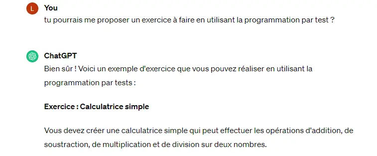
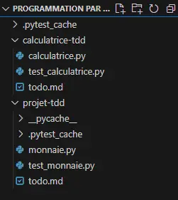
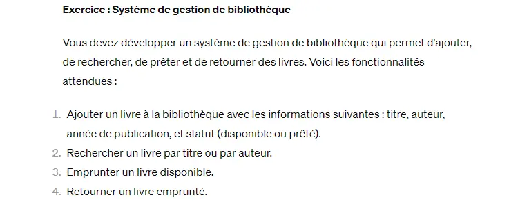
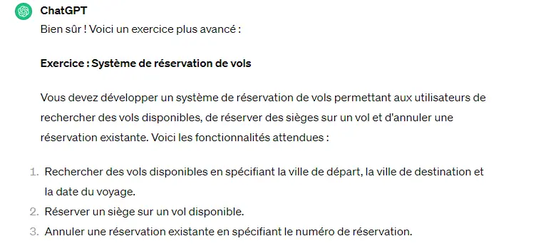

 
Connaitre python. 


### Introduction
Pour ce MON je vais donc me baser sur le cours [Programmation par les tests](https://francoisbrucker.github.io/cours_informatique/cours/coder-et-d%C3%A9velopper/projet-TDD/) de François Brucker. On utilisera tout au long des chapitres le language Python.

## Sommaire 

1. Cours de François Brucker 
2. Exercices

### C'est quoi la programmation par les tests ? 

La programmation par tests (Test-Driven Development ou TDD en anglais), c'est une approche de développement logiciel où les tests sont écrits avant même que le code de production ne soit implémenté. Pour mettre en place cette méthode on suit généralement trois étapes :  

1. <strong>Écriture du test (Red)</strong> : Dans cette première étape, on **rédige un test unitaire** qui définit le comportement attendu d'une fonction ou d'un module. À ce stade, le code de production n'existe pas encore, donc **le test échouera initialement.**

2. <strong>Implémentation du code de production (Green)</strong> : Après avoir écrit le test, on **crée le code minimal** nécessaire pour faire passer le test avec succès. L'objectif est de produire un code qui satisfait les exigences du test, sans ajouter de fonctionnalités supplémentaires, **seulement le nécessaire.**

3. <strong>Refactoring (Refactor)</strong> : Une fois que le test passe avec succès, on peut ensuite réorganiser et améliorer le code sans altérer son comportement externe. Cela implique souvent d'éliminer les **duplications de code**, **d'améliorer la lisibilité** ou **d'optimiser les performances**.

Ce cycle se répète continuellement, chaque nouvelle fonctionnalité ou modification du code étant accompagnée de l'écriture de nouveaux tests, garantissant ainsi que les changements ne causent pas de régressions ou de dysfonctionnements dans le système existant.

### Pourquoi c'est bien ?

La programmation par tests présente plusieurs avantages :

- <strong>Fiabilité accrue</strong> : En ayant une suite complète de tests automatisés, on peut être plus confiants dans la stabilité et la fiabilité de notre code.
  
- <strong>Découverte précoce des erreurs</strong> : En écrivant les tests en premier, on est plus susceptible de détecter les erreurs dès le début du processus de développement, ce qui permet de les corriger rapidement et à moindre coût.
  
- <strong>Conception modulaire</strong> : Cette approche encourage la conception modulaire en favorisant la création de code testable, ce qui conduit généralement à des architectures logicielles plus propres et mieux structurées.
  
- <strong>Documentation vivante</strong> : Les tests servent également de documentation vivante du comportement attendu du code, ça permet de mieux comprendre le code pour quelqu'un qui ne la pas écrit de sa main.

Ainsi, la programmation par tests est une méthode de développement qui vise à améliorer la qualité du code en écrivant des tests automatisés avant d'écrire le code de production, favorisant ainsi la fiabilité, la détection précoce des erreurs et une meilleure conception logicielle. C'est pour ça que c'est bien de s'y intéresser, de bien comprendre son principe et de prendre le temps de s'exercer parce que ce fonctionnement n'est pas très intuitif au débu (on a très souvent envie de coder directement la fonction "compliqué" car on sait les soucis que l'on peut rencontrer).

## Cours de François Brucker

### 1. Départ

Dans ce premier chapitre on met en place le projet de développement pour s'initier à la programmation par test.

- <strong>Définition des objectifs principaux : </strong>
  Avant de commercer à écrire du code, il est crucial de définir ce que l'applucation doit accomplir. Cela peut-être sous la forme d'une liste de tâches à réaliser, appelée aussi backlog ou todo-list.

- <strong>Création du projet : </strong>
  On utilise l'environnement de développement VSCode. On crée un nouveau dossier pour le projet, le fichier <strong>test_monnaie.py</strong> et je télécharge la bibliothèque python <strong>pytest</strong> que l'on utilise pour faire les tests.

- <strong>Ecriture du premier test :</strong>
  Selon la méthode TDD, on commence par écrire un test qui spécifie le comportement attendu du code. Dans cet exemple, le premier test concerne la multiplication de 5 dollars par 2.

- <strong>Analyse du test :</strong>
  L'écriture du test soulève des questions sur l'implémentation du code, ce qui conduit à une extension de la todo-list avec de nouveaux éléments à considérer.

- <strong>Itérations de développement :</strong>
  En suivant le cycle du TDD (test-driven development), on implémente juste assez de code pour que le test passe, puis on réfactorise pour supprimer les duplications et améliorer la conception du code.

- <strong>Résumé du processus TDD :</strong>
  La méthode générale du TDD est résumée comme suit : écrire un test, le faire échouer (en rouge), écrire juste assez de code pour le faire passer (en vert), puis réfactoriser pour améliorer le code tout en maintenant les tests verts.

- <strong>Pattern TDD : </strong>
  L'utilisation du "fake it", où l'on duplique simplement le résultat attendu dans le code, est mentionnée comme une stratégie utile dans le processus TDD.

Grâce à ce chapitre on a introduit les bases de la programmation par test en mettant l'accent sur la création de tests avant l'écriture de code fonctionnel, et en décrivant un processus itératif pour développer et améliorer le code de manière incrémentale.

### 2. Value Object

Ce chapitre se concentre sur la mise en œuvre d'objets de valeur (value objects) dans le processus de développement.

- <strong>Priorités dans le développement :</strong> 
  L'approche préconisée consiste à d'abord assurer le fonctionnement correct de l'application (that works), avant de se concentrer sur l'optimisation du code (clean code).

- <strong>Todo list :</strong> 
  L'élaboration d'une liste de tâches à effectuer permet de hiérarchiser les actions à entreprendre. Dans cet exemple, la priorité est donnée à la multiplication des devises, suivie de la sécurisation de la classe Dollar en tant qu'objet de valeur.

- <strong>Implémentation des tests :</strong> 
  Les tests sont utilisés pour spécifier le comportement attendu du code. Dans cet exemple, des tests sont écrits pour vérifier que la multiplication des dollars produit le résultat escompté.

- <strong>Détection de "code smell" : </strong>
  La lecture du code peut révéler des signes de mauvaise conception ou de comportement inhabituel, appelés "code smell". Dans ce cas, l'usage de valeurs mutables pour représenter l'argent est considéré comme problématique.

- <strong>Utilisation des value objects :</strong> 
  Les objets de valeur sont des objets immuables, qui une fois créés ne peuvent pas être modifiés. Cette propriété les rend sécurisés et prévisibles dans leur utilisation.

- <strong>Implémentation de la méthode fois :</strong> 
  En suivant la méthodologie TDD, une implémentation évidente de la méthode fois est proposée, qui retourne un nouvel objet Dollar résultant de la multiplication.

- <strong>Pattern de TDD :</strong> 
  Implémentation évidente : L'implémentation directe du test, sans trop de réflexion, est appelée "obvious implementation". Cela implique de coder la solution la plus évidente pour faire passer le test.

Grâce à ce chapitre on a mis en lumière l'importance de garantir le bon fonctionnement de l'application avant de se préoccuper de son optimisation, et on a introduit la notion d'objets de valeur comme moyen de sécuriser et de rendre prévisible le comportement du code.

### 3. ==

Le troisième chapitre se concentre sur l'implémentation de la comparaison d'égalité (==) entre les objets Dollar.

- <strong>Todo list : </strong>
  La mise en place d'une liste de tâches guide le développement. Dans cet exemple, l'implémentation de l'égalité entre les objets Dollar est ajoutée à la liste des tâches à réaliser.

- <strong>Écriture des tests : </strong>Des tests sont écrits pour spécifier le comportement attendu de l'opérateur d'égalité (==) entre deux objets Dollar.

- <strong>Utilisation de la technique "fake it" : </strong> 
  Pour faire passer les tests, une implémentation initiale est réalisée en retournant toujours True dans la méthode __eq__. Cela permet de passer les tests mais ne fournit pas une comparaison correcte.

- <strong>Triangulation : </strong> 
  Pour supprimer les duplications non évidentes, la technique de triangulation est utilisée. Cela implique d'écrire un nouveau test qui devrait retourner False pour l'égalité entre deux objets Dollar.

- <strong> Suppression des duplications : </strong> 
  En ajoutant un test supplémentaire, les duplications dans la méthode __eq__ deviennent évidentes et peuvent être supprimées. Cela conduit à une implémentation correcte de la méthode d'égalité.

- <strong>Todo list mise à jour : </strong>
  À mesure que de nouveaux problèmes sont identifiés, ils sont ajoutés à la liste des tâches à effectuer pour une future résolution.

Ce chapitre illustre la démarche itérative du TDD pour implémenter la comparaison d'égalité entre les objets Dollar, en mettant l'accent sur la détection des duplications et la résolution progressive des problèmes identifiés.

### 4. __mul__

Le quatrième chapitre se concentre sur l'implémentation de la méthode spéciale __mul__ pour permettre la multiplication des objets Dollar.

- <strong>Todo list :</strong> 
  La mise à jour de la liste des tâches inclut l'implémentation de la méthode spéciale __mul__ pour permettre la multiplication des objets Dollar.

- <strong>Écriture des tests : </strong>
  Les tests sont adaptés pour inclure l'utilisation de l'opérateur de multiplication (*) entre les objets Dollar et un scalaire.

- <strong>Obvious implementation : </strong>
  Une implémentation initiale est réalisée pour faire passer les tests. Dans cet exemple, la multiplication d'un objet Dollar par un scalaire retourne un nouvel objet Dollar avec le montant correct.

- <strong>Todo list mise à jour : </strong> 
  Après avoir complété l'implémentation de la méthode spéciale __mul__, la liste des tâches est mise à jour pour refléter les prochaines étapes à réaliser.

ce chapitre illustre comment utiliser la méthodologie TDD pour implémenter la multiplication des objets Dollar en ajoutant la méthode spéciale __mul__. Ce processus met en évidence la progression itérative du développement logiciel en identifiant les tâches à accomplir et en les réalisant une par une.

### 5. Privacy

Le cinquième chapitre se concentre sur la confidentialité de l'attribut montant et sur la manière de tester les objets Dollar en se concentrant sur leur comportement externe plutôt que sur leur implémentation interne.

- <strong>Todo list mise à jour : </strong>
  La confidentialité de l'attribut montant est ajoutée à la liste des tâches à accomplir.

- <strong>Écriture des tests : </strong> 
  Les tests sont adaptés pour ne pas faire référence directe à l'attribut montant. Ils se concentrent uniquement sur le comportement des objets Dollar, en utilisant les opérateurs définis (__mul__) pour les tester.

- <strong>Bonnes pratiques de test : </strong>
  Il est souligné qu'il est préférable de tester le comportement d'une classe plutôt que de ses attributs internes. Cela garantit que les tests restent robustes même lorsque l'implémentation de la classe change.

- <strong>Progression itérative :</strong> 
  À mesure que de nouveaux tests sont ajoutés et que l'implémentation évolue, la liste des tâches est mise à jour pour refléter les prochaines étapes à réaliser.

Ce chapitre illustre l'importance de tester le comportement externe des objets Dollar et de maintenir la confidentialité de leur implémentation interne. La méthodologie TDD est utilisée pour guider le développement de manière itérative, en se concentrant sur les fonctionnalités à implémenter et en vérifiant leur fonctionnement par le biais de tests.

### 6. Dollar 

Dans ce chapitre, l'objectif est de commencer à introduire les Francs dans le système de gestion de la monnaie.

- <strong>Todo list mise à jour :</strong> 
  L'objectif ambitieux de la conversion de $5 + 2.5CHF = $10 est découpé en sous-tâches. La première étape est de permettre la multiplication de 5 CHF par 2 pour obtenir 10 CHF.

- <strong>Écriture des tests :</strong> 
  Deux nouveaux tests sont ajoutés pour les Francs, similaire à ceux des Dollars mais adaptés à cette nouvelle devise.

- <strong>Implémentation des Francs :</strong> 
  Pour faire passer les tests, une classe Franc est créée en copiant/collant la classe Dollar et en la modifiant pour refléter les caractéristiques des Francs.

- <strong>Todo list mise à jour : </strong> 
  Après avoir fait passer les tests, la todo list est mise à jour pour refléter les prochaines tâches à accomplir, notamment la gestion de la duplication entre les classes Dollar et Franc.

Ce chapitre montre comment découper des tâches ambitieuses en étapes plus gérables et comment commencer à intégrer de nouvelles fonctionnalités dans le système en utilisant la méthodologie TDD. La todo list sert de guide pour s'assurer que toutes les étapes nécessaires sont prises en compte et réalisées de manière itérative.

### 7. même == pour tous

Ce chapitre se concentre sur l'élimination de la duplication du code identique présent dans les classes Dollar et Franc en les faisant hériter d'une classe mère Monnaie.

- <strong>Todo list mise à jour : </strong> 
  Un nouvel item est ajouté pour éliminer la duplication du code identique présent dans les classes Dollar et Franc.

- <strong>Création de la classe abstraite Monnaie :</strong> 
  Une classe abstraite Monnaie est créée pour englober les fonctionnalités communes des classes Dollar et Franc. Initialement, cette classe ne contient aucune méthode.

- <strong>Vérification des tests :</strong> 
  Les tests sont exécutés pour vérifier qu'ils passent initialement.

- <strong>Héritage de Dollar et Franc de la classe Monnaie :</strong> 
  Les classes Dollar et Franc sont modifiées pour hériter de la classe Monnaie.

- <strong>Remontée de la méthode \_\_init\_\_ : </strong>
  Comme la méthode \_\_init\_\_ est identique dans les classes Dollar et Franc, elle est remontée dans la classe mère Monnaie.

- <strong>Ajout de tests d'égalité pour les Francs :</strong> 
  Des tests d'égalité et de différence sont ajoutés pour les Francs afin de garantir que le mouvement de la méthode \_\_eq\_\_ dans la classe mère Monnaie se déroule correctement.

- <strong>Todo list mise à jour :</strong> 
  La todo list est mise à jour pour inclure la comparaison entre les Francs et les Dollars.

- <strong>Remontée de la méthode \_\_eq\_\_ :</strong>
 La méthode \_\_eq\_\_ est finalement remontée dans la classe mère Monnaie pour éliminer la duplication du code.

Ce chapitre montre l'importance de l'élimination de la duplication du code pour maintenir un code propre et éviter les répétitions inutiles. L'utilisation de l'héritage et de la remontée des méthodes communes dans une classe mère permet d'optimiser la structure du code.

### 8. Franc/Dollar

Ce chapitre se concentre sur la comparaison entre les objets de classe Franc et Dollar.

- <strong>Todo list mise à jour :</strong> 
  Un nouvel item est ajouté pour comparer les Francs et les Dollars.

- <strong>Ajout d'un test de comparaison :</strong> 
  Un test est ajouté pour vérifier que des Francs ne sont pas égaux à des Dollars.

- <strong>Correction de la méthode \_\_eq\_\_ :</strong> 
  La méthode \_\_eq\_\_ est modifiée pour vérifier que les classes des deux objets à comparer sont différentes.

- <strong>Réflexion sur la conception :</strong> 
  Une réflexion est menée sur la manière dont la comparaison est effectuée. Il est souligné que la comparaison actuelle est basée sur les classes des objets plutôt que sur leur signification réelle en termes de devises. Cela soulève des préoccupations quant à la conception du code.

- <strong>Mise à jour de la todo list :</strong> 
  Un nouvel item est ajouté pour explorer une meilleure façon de gérer la comparaison des devises, en utilisant leur signification plutôt que leur classe.

Ce chapitre met en lumière l'importance de coder en tenant compte de la signification des objets plutôt que de leur implémentation interne. La todo list est mise à jour pour réfléchir à une meilleure façon de gérer la comparaison des devises.

### 9. Duplication Franc/Dollar

Dans ce chapitre, l'objectif est de supprimer la duplication entre les classes Franc et Dollar en les remplaçant par une seule classe, tout en garantissant que toutes les fonctionnalités sont préservées grâce aux tests.

- <strong>Mise à jour de la todo list :</strong> 
  Un nouvel item est ajouté pour explorer la possibilité de supprimer les tests de la classe Franc.

- <strong>Utilisation du design pattern factory :</strong> 
  Les tests sont modifiés pour utiliser une fonction factory, `dollar`, qui crée des objets de la classe Dollar.

- <strong>Implémentation de la fonction `dollar` :</strong> 
  Une fonction `dollar` est ajoutée dans le module `monnaie` pour créer des objets de la classe Dollar.

- <strong>Remplacement des références à Dollar :</strong> 
  Toutes les références à la classe Dollar dans les tests sont remplacées par des appels à la fonction `dollar` du module `monnaie`.

- <strong>Question sur l'utilité des tests de Franc :</strong> 
  Une réflexion est menée sur l'utilité de conserver les tests de la classe Franc, étant donné que les deux classes Franc et Dollar seront unifiées. Cette question est ajoutée à la todo list.

- <strong>Remplacement des références à Franc :</strong> 
  De manière similaire à Dollar, toutes les références à la classe Franc dans les tests sont remplacées par des appels à une fonction factory `franc` du module `monnaie`.

- <strong>Réflexion sur la suppression des duplications :</strong> 
  Bien que les tests aient été modifiés pour utiliser le factory, des duplications persistent entre Franc et Dollar dans le code. Cependant, avant de les supprimer, une réflexion est menée sur la manière de les remplacer par quelque chose qui les unifie.

- <strong>Mise à jour de la todo list :</strong> 
  Un nouvel item est ajouté pour gérer la suppression des duplications entre Franc et Dollar.

Ce chapitre montre comment utiliser le design pattern factory pour remplacer les références directes aux classes Franc et Dollar par des fonctions de création d'objets, en préparation de leur unification.

### 10. Devise

Dans ce chapitre, l'objectif est de remplacer les classes Franc et Dollar par une seule classe Monnaie tout en maintenant les fonctionnalités existantes et en éliminant les duplications de code.

- <strong>Mise à jour de la todo list :</strong> 
  Un nouvel item est ajouté pour explorer la possibilité de supprimer les tests de la classe Franc.

- <strong>Ajout de l'attribut devise :</strong> 
  Un attribut `devise` est ajouté aux classes Franc et Dollar pour distinguer les devises.

- <strong>Refactoring pattern : Pull Up Field : </strong>
  L'attribut `devise` est remonté dans la classe Monnaie à l'aide du pattern de refactoring Pull Up Field.

- <strong>Refactoring pattern : Pull Up Method :</strong> 
  Les constructeurs des classes Franc et Dollar sont modifiés pour avoir la même signature que celui de la classe Monnaie, puis les méthodes de création d'objets (factory methods) sont utilisées pour créer des objets Monnaie. Les méthodes `__mul__` des classes Franc et Dollar sont également modifiées pour utiliser les factory methods.

- <strong>Uniformisation des constructeurs :</strong> 
  Les constructeurs des classes Franc et Dollar sont rendus identiques en ajoutant un paramètre de devise utilisé pour créer des objets Monnaie.

- <strong>Suppression des constructeurs :</strong> 
  Les constructeurs des classes Franc et Dollar sont supprimés une fois qu'ils sont devenus identiques à celui de la classe Monnaie.

Ce chapitre montre comment unifier les classes Franc et Dollar en une seule classe Monnaie tout en maintenant les fonctionnalités et en éliminant les duplications de code, grâce à l'utilisation de patterns de refactoring et de bonnes pratiques de conception.

### 11. Unification de *

Dans ce chapitre, l'objectif était de supprimer les méthodes de multiplication `__mul__` des classes Franc et Dollar pour les unifier dans la classe Monnaie.

- <strong>Mise à jour de la todo list :</strong> 
  Un nouvel item est ajouté pour supprimer les duplications entre Franc et Dollar.

- <strong>Modification de `__mul__` dans Monnaie :</strong> 
  Une méthode `__mul__` est ajoutée dans la classe Monnaie pour remplacer les méthodes `__mul__` des classes Franc et Dollar.

- <strong>Suppression de `__mul__` dans Franc :</strong> 
  La méthode `__mul__` est supprimée de la classe Franc.

- <strong>Correction de `__eq__` dans Monnaie : </strong> 
  La méthode `__eq__` de la classe Monnaie est modifiée pour utiliser l'attribut `devise` plutôt que la classe elle-même.

- <strong>Suppression de `__mul__` dans Dollar :</strong> 
  La méthode `__mul__` est également supprimée de la classe Dollar.

- <strong>Utilisation du constructeur de Monnaie :</strong> 
  Les factory methods pour créer des objets sont mises à jour pour utiliser le constructeur de la classe Monnaie.

- <strong>Suppression des classes Franc et Dollar :</strong> 
  Finalement, les classes Franc et Dollar sont supprimées une fois que toutes les fonctionnalités sont unifiées dans la classe Monnaie.

Ce chapitre montre comment unifier les méthodes de multiplication `__mul__` des classes Franc et Dollar dans la classe Monnaie, en éliminant les duplications de code et en maintenant les fonctionnalités existantes.

PS : il faut bien penser à retirer l'importation des classes Dollar et Franc qui n'existe plus du fichier des tests sinon ça marche pas :) 

### 12. Addition 1/3
Dans cette étape, nous avons ajouté la fonctionnalité d'addition pour une unique devise.

- <strong>Todo list mise à jour :</strong> 
  Un nouvel item a été ajouté pour traiter l'addition de deux montants de la même devise.

- <strong>Écriture du test d'addition : </strong>
 Un test a été écrit pour vérifier que l'addition de $5 et $2 est égale à $7 en utilisant la méthode `plus` de la classe Monnaie. Cela garantit que l'opération d'addition fonctionne correctement.

- <strong>Implémentation de l'addition : </strong> 
  Dans la classe Monnaie, la méthode `plus` a été remplacée par `__add__` pour permettre une syntaxe plus élégante lors de l'addition de deux montants. L'implémentation de `__add__` crée un nouvel objet Monnaie avec le montant total de l'addition et la même devise que les objets d'origine.

- <strong>Mise à jour du test :</strong> 
  Le test a été ajusté pour utiliser l'opérateur `+` à la place de la méthode `plus`.

Cette étape nous a permis d'ajouter la fonctionnalité d'addition pour une unique devise, ce qui constitue un progrès dans la réalisation des opérations monétaires de base.

Voici le test que j'ai ajouté : 
```html
def test_addition():
    cinq = monnaie.dollar(5)
    deux = monnaie.dollar(2)
    sept = monnaie.dollar(7)
    assert cinq.plus(deux) == sept

```
Et voici mon code : 
```html
class Monnaie:
    def __init__(self, montant, devise):
        self.montant = montant
        self.devise = devise

    def __eq__(self, other):
        if(self.devise==other.devise) :
            return self.montant == other.montant
        else :
            return False
    
    def __mul__(self, multiplicateur):
        return Monnaie(self.montant * multiplicateur, self.devise)
    
    def plus(self, other):
        return Monnaie(self.montant + other.montant, self.devise)
```
Et mes tests passent. 
Après vérification ma fonction <strong> plus </strong> est similaire à la correction et mon test peut-être simplifié de cette façon mais l'idée est la même : 

```html
def test_plus():
    assert monnaie.dollar(7) == monnaie.dollar(5).plus(monnaie.dollar(2))
```
### 13. Addition 

Avant de traiter l'addition de deux monnaies différentes, il est nécessaire de commencer par traiter le cas de l'addition de montants d'une même monnaie.

- <strong>Écrire un test :</strong>
  Commencez par écrire un test pour vérifier que $5 + $2 donne $7.

- <strong>Implémenter la méthode plus :</strong> 
  Créez une méthode `plus` dans la classe `Monnaie` qui prend une autre monnaie en paramètre et retourne la somme des deux montants.

- <strong>Utiliser __add__ :</strong> 
  Remplacez la méthode `plus` par `__add__` dans la classe `Monnaie` pour utiliser l'opérateur `+`.

- <strong>Écrire le test :</strong> 
  Écrivez un test pour vérifier que l'opérateur `+` fonctionne correctement avec des montants de même devise.

- <strong>Implémenter __add__ :</strong> 
  Implémentez la méthode `__add__` dans la classe `Monnaie` pour retourner une nouvelle instance de `Monnaie` contenant la somme des montants.

- <strong>Valider le test :</strong> 
  Exécutez les tests pour vérifier que l'opérateur `+` fonctionne comme prévu pour les montants de même devise.

Cela permet de garantir que l'addition de montants d'une même monnaie fonctionne correctement avant de passer à des cas plus complexes impliquant des devises différentes.

Après avoir traité l'addition de montants d'une même monnaie, il est nécessaire de résoudre le problème de l'addition de montants de devises différentes.

- <strong>Identifier le problème :</strong> 
  L'addition de montants de devises différentes pose des défis car les taux de change peuvent varier avec le temps, ce qui signifie que la valeur de la somme peut également changer.

- <strong>Écrire un test :</strong> 
  Écrivez un test pour vérifier que la conversion d'une somme de devises différentes en une devise donnée produit le résultat attendu.

- <strong>Implémenter la conversion :</strong> 
  Créez une classe `Banque` avec une méthode `conversion` qui prend une somme et une devise cible en paramètres, puis retourne la conversion de la somme dans la devise cible.

- <strong>Écrire le test final :</strong> 
  Utilisez la classe `Banque` pour convertir une somme de montants de devises différentes en une devise cible, puis vérifiez que le résultat correspond à ce qui est attendu.

- <strong>Implémenter la conversion :</strong> 
  Implémentez la logique de conversion dans la méthode `conversion` de la classe `Banque`.

- <strong>Valider le test :</strong> 
  Exécutez les tests pour vérifier que la conversion de la somme de devises différentes produit le résultat attendu.

Cela permet de résoudre le problème de l'addition de montants de devises différentes en assurant une conversion appropriée des montants avant de les additionner.

Après avoir traité l'addition de montants de devises différentes, il est temps de généraliser cette approche pour toutes les opérations d'addition.

- <strong>Définir la nouvelle approche :</strong> 
  Considérez que toute somme de deux montants de monnaies différentes est une nouvelle classe appelée `Somme`.

- <strong>Mettre à jour la liste de tâches :</strong> 
 Modifiez la liste de tâches pour inclure la nécessité de rendre $5 + $2 égal à $7, tout en maintenant la conversion correcte pour les montants de devises différentes.

- <strong>Supprimer les tests obsolètes :</strong> 
  Supprimez le test vérifiant que $5 + $2 égale $7, car cela ne sera plus vrai avec la nouvelle approche.

- <strong>Écrire un test pour la classe `Somme` :</strong> 
  Écrivez un test pour vérifier que la somme de deux montants de monnaies différentes crée une instance de la classe `Somme` contenant les montants d'origine.

- <strong>Implémenter la classe `Somme` :</strong> 
  Créez une classe `Somme` avec des attributs `gauche` et `droite` pour stocker les montants d'origine.

- <strong>Modifier l'implémentation de l'addition :</strong> 
  Dans la classe `Monnaie`, mettez à jour la méthode `__add__` pour renvoyer une instance de `Somme` au lieu d'une nouvelle monnaie.

- <strong>Valider le test :</strong> 
  Exécutez les tests pour vérifier que la somme de deux montants de monnaies différentes crée une instance de `Somme` contenant les montants d'origine.

En suivant ces étapes, l'ajout de montants de devises différentes sera correctement géré par la classe `Somme`, tandis que les montants de la même devise resteront gérés par la classe `Monnaie`.

### 14. Conversion

Pour permettre que $5 + $2 corresponde à quelque chose qui vaut à $7, nous devons travailler sur la méthode `conversion` de la classe `Banque`. Actuellement, c'est une méthode fictive qui renvoie $7. Nous devons la rendre fonctionnelle pour gérer les conversions de devises.

- <strong>Supprimer les duplications dans la méthode `conversion` de la `Banque` :</strong> 
  Cette méthode doit pouvoir gérer les sommes de monnaies en supposant que les parties gauche et droite sont des `Monnaie`, et que le taux de change est toujours de 1 pour 1.

- <strong>Implémenter une nouvelle méthode de conversion dans la classe `Somme` :</strong> 
  Pour éviter que la classe `Banque` ait une connaissance directe des attributs de `Monnaie`, déplacez la logique de conversion de la banque vers une méthode `conversion` dans la classe `Somme`.

- <strong>Mettre à jour la liste de tâches :</strong> 
  Ajoutez à la liste de tâches la nécessité de faire en sorte que la méthode `Somme.conversion(devise)` effectue réellement des conversions.

L'implémentation actuelle de la méthode `Banque.conversion` pose des problèmes car la banque doit connaître l'implémentation de `Monnaie` pour accéder à l'attribut `montant`. Cela viole le principe de la loi de Déméter en matière de développement orienté objet.

- <strong>Remonter la méthode de conversion de la `Banque` à la `Somme` :</strong>
  Cette étape permet de réduire le niveau de connaissance de la banque sur les objets environnants, suivant ainsi la loi de Déméter.

L'étape précédente a permis de baisser le niveau de connaissance de la banque, mais il reste à traiter le cas où la méthode `Banque.conversion` a une `Monnaie` comme paramètre. Pour cela, nous devons ajouter une méthode de conversion dans la classe `Monnaie`.

- <strong>Créer un test pour la conversion d'une `Monnaie` :</strong> 
  Écrivez un test où l'argument de `Banque.conversion` est un objet de type `Monnaie`.
  
- <strong>Implémenter la méthode de conversion dans la classe `Monnaie` :</strong> 
  Ajoutez une méthode `conversion` à la classe `Monnaie` pour gérer la conversion vers une devise donnée.

### 15. Taux de change

Dans cette partie, nous nous attaquons à la gestion des taux de change. Nous commençons par travailler sur les objets de type `Monnaie` pour réaliser des conversions entre devises.

- <strong>Créer un test pour `Banque.change` :</strong> 
  Assurez-vous que `Banque.change` fonctionne correctement pour deux devises identiques et implémentez cette méthode dans la classe `Banque.conversion`.

- <strong>Ajouter des tests pour les conversions de devises :</strong> 
  Écrivez des tests pour convertir des dollars en CHF et vice versa, et assurez-vous que la méthode `Banque.conversion` renvoie les résultats corrects.

- <strong>Implémenter la méthode `Monnaie.conversion` :</strong> 
  Utilisez la banque pour effectuer des conversions dans la méthode `Monnaie.conversion`. N'oubliez pas d'ajouter la banque comme paramètre.

Maintenant que la conversion de devises pour les sommes de monnaies identiques fonctionne, nous passons à la gestion des conversions pour des devises différentes.

- <strong>Ajouter un test pour la conversion de somme de devises différentes :</strong> 
  Écrivez un test pour convertir la somme de $2 et 1CHF en franc suisse et implémentez la logique nécessaire.

Pour généraliser les opérations sur les sommes et les monnaies, nous utilisons le design pattern composite. Nous devons nous assurer que les opérations telles que l'addition et la multiplication fonctionnent correctement avec les sommes et les monnaies.

- <strong>Implémenter la méthode `__add__` pour la classe `Somme` :</strong>
  Assurez-vous que l'addition de deux sommes fonctionne correctement en implémentant la méthode `__add__`.

- <strong>Ajouter une méthode `__mul__` pour la classe `Somme` :</strong> 
  Implémentez la méthode `__mul__` pour permettre la multiplication d'une somme par un entier.

- <strong>Tester la multiplication de somme :</strong> 
  Écrivez un test pour la multiplication d'une somme et assurez-vous que cela fonctionne correctement.

### Conclusion du cours

La programmation par les tests (TDD) est une approche de développement logiciel où les tests sont écrits avant le code de production. Durant ce cours on a vu son principe et ses qualités : 

1. <strong>Itératif :</strong> Les tests sont écrits, le code est implémenté pour les faire passer, puis refactoré si nécessaire, dans un cycle itératif.

2. <strong>Qualité :</strong> Les tests automatisés identifient les erreurs tôt, garantissant la qualité du code et réduisant les coûts de maintenance.

3. <strong>Conception dirigée par les tests :</strong> Les tests définissent le comportement attendu du logiciel, guidant ainsi sa conception et son implémentation.

4. <strong>Documentation vivante :</strong> Les tests servent également de documentation du code, facilitant sa compréhension et favorisant la collaboration.

5. <strong>Agilité :</strong> La TDD permet une adaptation rapide aux changements et une réactivité aux besoins métier, assurant un développement fiable et évolutif.

La programmation par les tests est essentielle pour développer rapidement des logiciels de haute qualité, tout en favorisant la collaboration et l'agilité.

## Exercices

Maintenant que je connais mieux le fonctionnement du TDD et que j'ai réalisé mon premier programme à l'aide du cours, je peux tenter de réaliser un exercice par moi-même. J'ai donc demandé à ChatGPT de me proposer un exercice pour mettre en application ce que j'ai appris : 

<div style="display:flex">
<div></div>
</div>

Donc on va coder une <stong>calculatrice simple</strong> ! 

### Calculatrice simple

Je crée un nouveau dossier <strong>calculatrice-tdd</strong> dans lequel j'ajoute un fichier pour les tests <strong>test_calculatrice.py</strong>, un fichier pour mon code <strong>calculatrice.py</strong> et bien sur on n'oublies pas <strong>todo.md</strong>.
<div style="display:flex">
<div></div>
</div>

La première chose c'est donc de remplir notre <strong>todo</strong>.
Le plus instinctif ça serait d'écrire ça : 

```html
## MY TODO 1
- [] Pouvoir ajouter deux nombres
- [] Pouvoir soustraire deux nombres
- [] Pouvoir multiplier deux nombres
- [] Pouvoir diviser deux nombres
```
Commençons par <strong>l'addition</strong>.
On écrit un test simple : 

<strong>test_calculatrice.py</strong>
```html
from calculatrice import Calculatrice

def test_addition():
    assert Calculatrice.add(1,2)==3
```
Je lance mon test : 
```html
python -m pytest test_calculatrice.py
```
Et évidemment ça échoue, il n'existe pas de class <strong>Calculatrice</strong>. On en crée donc une mais qui ne fait rien : 

<strong>calculatrice.py</strong>
```html
class Calculatrice():
    pass
```
Maintenant l'erreur vient du fais que la class <strong>Calculatrice</strong> n'a pas de méthode <strong>add</strong>. On va donc la coder : 

```html
class Calculatrice():
    def add(self, other) :
        return self + other
```
Et le test passe ! 
Maintenant on va s'ocupper de la <strong>soustraction</strong>.
J'écris un nouveau test : 

<strong>test_calculatrice.py</strong>
```html
from calculatrice import Calculatrice

def test_addition():
    assert Calculatrice.add(1,2)==3

def test_soustraction():
    assert Calculatrice.sub(5,3)==2
```

Evidemment le test échoue car on a pas créé de méthode <strong>sub</storng>.
On s'occupe de le faire : 

```html
class Calculatrice():
    def add(self, other) :
        return self + other
    
    def sub(self, other) :
        return self - other
```
Super les tests passent ! 

On va faire la <strong>multiplication</strong>.

<strong>test_calculatrice.py</strong>
```html
from calculatrice import Calculatrice

def test_addition():
    assert Calculatrice.add(1,2)==3

def test_soustraction():
    assert Calculatrice.sub(5,3)==2

def test_multiplication():
    assert Calculatrice.mul(4,5)==20
```
<strong>calculatrice.py</strong>
```html
class Calculatrice():
    def add(self, other) :
        return self + other
    
    def sub(self, other) :
        return self - other
    
    def mul(self, other) : 
        return self*other
```
Et les 3 tests passent bien. 

La <strong>division</strong> pour finir : 

<strong>test_calculatrice.py</strong>
```html
from calculatrice import Calculatrice

def test_addition():
    assert Calculatrice.add(1,2)==3

def test_soustraction():
    assert Calculatrice.sub(5,3)==2

def test_multiplication():
    assert Calculatrice.mul(4,5)==20

def test_division():
    assert Calculatrice.div(36,3)==12
```
<strong>calculatrice.py</strong>
```html
class Calculatrice():
    def add(self, other) :
        return self + other
    
    def sub(self, other) :
        return self - other
    
    def mul(self, other) : 
        return self*other
    
    def div(self, other):
        return self/other
```
Et nos tests passent bien. 

Bon cet exercice est assez simple parce qu'on manipule des nombres, même si je peux complexifier le code j'ai envie d'aller vers autre chose de moins intuitif. 

### Gestion d'une bibliothèque
Je redemande à ChatGPT un nouvel exo mais un peut moins simple cette fois :

<div style="display:flex">
<div></div>
</div>

Je crée mes différents fichiers et je rempli ma <strong>todo</strong>.

```html
## MY TODO
- [] Pouvoir ajouter un livre avec titre auteur année de publication et statut
- [] Rechercher un livre par titre ou par auteur
- [] Emprunter un livre disponible
- [] Retourné un livre emprunté
```

On va commencer par <strong>ajouter un livre</strong> car sans ça on ne peut pas faire les autes. 

#### Ajouter un livre 

Je ne savais pas trop quoi mettre comme test pour vérifier que l'ajout a bien fonctionné. J'ai fait ça sans être trop sûre de moi : 

<strong>test_bibliotheque.py</strong>
```html
from bibliotheque import Bibliotheque

def test_ajout_livre():
    bibliotheque= Bibliotheque()
    bibliotheque.add_book("L'Ecume des jours","Boris Vian",1947)
    assert bibliotheque.livre_existe("L'Ecume des jours")
```
Evidemment le test échoue, il n'existe pas de class <strong>Bibliotheque</strong> et encore moins de méthode <strong>add_book</strong> ou <strong>livre_existe</strong>.

Je commence mon code dans <strong>bibliotheque.py</strong>. Evidemment ça a pas été évident du premier coup, j'ai un peu eu du mal au début (surtout que je code pas souvent en orienté objet...) mais au final j'ai réussi à m'en sortir ! Voici le code : 

```html
class Bibliotheque() : 
    def __init__(self):
        self.livres = []

    def add_book(self, titre, auteur, annee):
        livre = {"titre" : titre, "auteur": auteur, "année" : annee, "disponible" : True}
        self.livres.append(livre)

    def livre_est_disponible(self, titre):
        for livre in self.livres : 
            if livre["titre"] == titre:
                return livre["disponible"]
        return False
```
Et ça passe ! 
On peut mettre à jour la <strong>Todo</strong>.
```html
## MY TODO
- [x] Pouvoir ajouter un livre avec titre auteur année de publication et statut
- [-] Rechercher un livre par titre et obtenir ses infos
- [ ] Rechercher un livre par auteur et avoir la liste de ses livres
- [] Emprunter un livre disponible
- [] Retourné un livre emprunté
```
On va s'occuper de la recherche d'un livre maintenant, mais comme on a déjà codé le fait qu'il existe on va dire que cette fois on veut savoir ses informations et surtout sa disponibilité. 

### Recherche d'un livre par titre

On commence par écrire le test associé à la fonctionnalité :

<strong>test_bibliotheque.py</strong>
```html
from bibliotheque import Bibliotheque

def test_ajout_livre():
    bibliotheque= Bibliotheque()
    bibliotheque.add_book("L'Ecume des jours","Boris Vian",1947)
    assert bibliotheque.livre_existe("L'Ecume des jours")

def test_recherche_livre():
    bibliotheque= Bibliotheque()
    bibliotheque.add_book("L'Ecume des jours","Boris Vian",1947)
    assert bibliotheque.recherche_livre("L'Ecume des jours")==["L'Ecume des jours","Boris Vian",1947,True]
```
Le test échoue, on va rajouter une nouvelle méthode <strong>recherche_livre</strong>.

```html
class Bibliotheque() : 
    def __init__(self):
        self.livres = []

    def add_book(self, titre, auteur, annee):
        livre = {"titre" : titre, "auteur": auteur, "année" : annee, "disponible" : True}
        self.livres.append(livre)

    def livre_existe(self, titre):
        for livre in self.livres : 
            if livre["titre"] == titre:
                return True
        return False
    
    def recherche_livre(self, titre):
        for livre in self.livres :
            if livre["titre"] == titre:
                return [livre["titre"],livre["auteur"],livre["année"],livre["disponible"]]
```
Et ça passe du premier coup ! 
On peut mettre à jour la <strong>Todo</strong>.
```html
## MY TODO
- [x] Pouvoir ajouter un livre avec titre auteur année de publication et statut
- [x] Rechercher un livre par titre et obtenir ses infos 
- [-] Rechercher un livre par auteur et obtenir la liste de ses livres 
- [] Emprunter un livre disponible
- [] Retourné un livre emprunté
```
### Recherche d'un livre par auteur

On commence par écrire le test associé à la fonctionnalité :

<strong>test_bibliotheque.py</strong>
```html
from bibliotheque import Bibliotheque

def test_ajout_livre():
    bibliotheque= Bibliotheque()
    bibliotheque.add_book("L'Ecume des jours","Boris Vian",1947)
    assert bibliotheque.livre_existe("L'Ecume des jours")

def test_recherche_livre():
    bibliotheque= Bibliotheque()
    bibliotheque.add_book("L'Ecume des jours","Boris Vian",1947)
    assert bibliotheque.recherche_livre("L'Ecume des jours")==["L'Ecume des jours","Boris Vian",1947,True]

def test_recherche_livres_par_auteur():
    bibliotheque= Bibliotheque()
    bibliotheque.add_book("L'Ecume des jours","Boris Vian",1947)
    bibliotheque.add_book("L'Arrache-coeur","Boris Vian",1953)
    bibliotheque.add_book("Les Misérables","Victor Hugo",1862)
    assert bibliotheque.recherche_livres_par_auteur("Boris Vian")==["L'Ecume des jours","L'Arrache-coeur"]
    assert bibliotheque.recherche_livres_par_auteur("Victor Hugo")==["Les Misérables"]
```

Je commence donc à coder une fonction pour faire passer le test : 
<strong>bibliotheque.py</strong>
```html
class Bibliotheque() : 
    def __init__(self):
        self.livres = []

    def add_book(self, titre, auteur, annee):
        livre = {"titre" : titre, "auteur": auteur, "année" : annee, "disponible" : True}
        self.livres.append(livre)

    def livre_existe(self, titre):
        for livre in self.livres : 
            if livre["titre"] == titre:
                return True
        return False
    
    def recherche_livre(self, titre):
        for livre in self.livres :
            if livre["titre"] == titre:
                return [livre["titre"],livre["auteur"],livre["année"],livre["disponible"]]
            
    def recherche_livres_par_auteur(self, auteur):
        listes_des_livres=[]
        for livre in self.livres : 
            if livre["auteur"]==auteur:
                listes_des_livres.append(livre["titre"])
        return listes_des_livres
```
Ca passe aussi ! 
On peut mettre à jour la <strong>Todo</strong>.

```html
## MY TODO
- [x] Pouvoir ajouter un livre avec titre auteur année de publication et statut
- [x] Rechercher un livre par titre et obtenir ses infos 
- [x] Rechercher un livre par auteur et obtenir la liste de ses livres 
- [-] Emprunter un livre disponible
- [] Retourné un livre emprunté
```

### Emprunter un livre

On va s'occuper maintenant de l'emprunt d'un livre si il est disponible.



<strong>bibliotheque.py</strong>
```html
from bibliotheque import Bibliotheque

def test_ajout_livre():
    bibliotheque= Bibliotheque()
    bibliotheque.add_book("L'Ecume des jours","Boris Vian",1947)
    assert bibliotheque.livre_existe("L'Ecume des jours")

def test_recherche_livre():
    bibliotheque= Bibliotheque()
    bibliotheque.add_book("L'Ecume des jours","Boris Vian",1947)
    assert bibliotheque.recherche_livre("L'Ecume des jours")==["L'Ecume des jours","Boris Vian",1947,True]

def test_recherche_livres_par_auteur():
    bibliotheque= Bibliotheque()
    bibliotheque.add_book("L'Ecume des jours","Boris Vian",1947)
    bibliotheque.add_book("L'Arrache-coeur","Boris Vian",1953)
    bibliotheque.add_book("Les Misérables","Victor Hugo",1862)
    assert bibliotheque.recherche_livres_par_auteur("Boris Vian")==["L'Ecume des jours","L'Arrache-coeur"]
    assert bibliotheque.recherche_livres_par_auteur("Victor Hugo")==["Les Misérables"]

def test_emprunt_livre():
    bibliotheque=Bibliotheque()
    bibliotheque.add_book("L'Ecume des jours","Boris Vian",1947)
    bibliotheque.add_book("L'Arrache-coeur","Boris Vian",1953)
    bibliotheque.add_book("Les Misérables","Victor Hugo",1862)
    assert bibliotheque.emprunt_livre("L'Arrache-coeur")==True
    assert bibliotheque.emprunt_livre("L'Arrache-coeur")==False
    assert bibliotheque.emprunt_livre("L'Ecume des jours")==True
```




<strong>bibliotheque.py</strong>
```html
class Bibliotheque() : 
    def __init__(self):
        self.livres = []

    def add_book(self, titre, auteur, annee):
        livre = {"titre" : titre, "auteur": auteur, "année" : annee, "disponible" : True}
        self.livres.append(livre)

    def livre_existe(self, titre):
        for livre in self.livres : 
            if livre["titre"] == titre:
                return True
        return False
    
    def recherche_livre(self, titre):
        for livre in self.livres :
            if livre["titre"] == titre:
                return [livre["titre"],livre["auteur"],livre["année"],livre["disponible"]]
            
    def recherche_livres_par_auteur(self, auteur):
        listes_des_livres=[]
        for livre in self.livres : 
            if livre["auteur"]==auteur:
                listes_des_livres.append(livre["titre"])
        return listes_des_livres

    def emprunt_livre(self, titre):
        for livre in self.livres :
            if livre["titre"] == titre and livre["disponible"]:
                livre["disponible"]=False
                return True
        return False
```


On peut mettre à jour la <strong>Todo</strong>.

```html
## MY TODO
- [x] Pouvoir ajouter un livre avec titre auteur année de publication et statut
- [x] Rechercher un livre par titre et obtenir ses infos 
- [x] Rechercher un livre par auteur et obtenir la liste de ses livres 
- [x] Emprunter un livre disponible
- [-] Retourné un livre emprunté
```

### Retourner un livre

On va s'occuper maintenant de retourner un livre emprunté.



<strong>bibliotheque.py</strong>
```html
from bibliotheque import Bibliotheque

def test_ajout_livre():
    bibliotheque= Bibliotheque()
    bibliotheque.add_book("L'Ecume des jours","Boris Vian",1947)
    assert bibliotheque.livre_existe("L'Ecume des jours")

def test_recherche_livre():
    bibliotheque= Bibliotheque()
    bibliotheque.add_book("L'Ecume des jours","Boris Vian",1947)
    assert bibliotheque.recherche_livre("L'Ecume des jours")==["L'Ecume des jours","Boris Vian",1947,True]

def test_recherche_livres_par_auteur():
    bibliotheque= Bibliotheque()
    bibliotheque.add_book("L'Ecume des jours","Boris Vian",1947)
    bibliotheque.add_book("L'Arrache-coeur","Boris Vian",1953)
    bibliotheque.add_book("Les Misérables","Victor Hugo",1862)
    assert bibliotheque.recherche_livres_par_auteur("Boris Vian")==["L'Ecume des jours","L'Arrache-coeur"]
    assert bibliotheque.recherche_livres_par_auteur("Victor Hugo")==["Les Misérables"]

def test_emprunt_livre():
    bibliotheque=Bibliotheque()
    bibliotheque.add_book("L'Ecume des jours","Boris Vian",1947)
    bibliotheque.add_book("L'Arrache-coeur","Boris Vian",1953)
    bibliotheque.add_book("Les Misérables","Victor Hugo",1862)
    assert bibliotheque.emprunt_livre("L'Arrache-coeur")==True
    assert bibliotheque.emprunt_livre("L'Arrache-coeur")==False
    assert bibliotheque.emprunt_livre("L'Ecume des jours")==True

def test_retour_livre():
    bibliotheque=Bibliotheque()
    bibliotheque.add_book("L'Ecume des jours","Boris Vian",1947)
    bibliotheque.add_book("L'Arrache-coeur","Boris Vian",1953)
    bibliotheque.add_book("Les Misérables","Victor Hugo",1862)
    bibliotheque.emprunt_livre("L'Arrache-coeur")
    bibliotheque.emprunt_livre("L'Ecume des jours")
    bibliotheque.retour_livre("L'Arrache-coeur")
    assert bibliotheque.livre_disponible("L'Arrache-coeur")==True
    assert bibliotheque.livre_disponible("L'Ecume des jours")==False
```




<strong>bibliotheque.py</strong>
```html
class Bibliotheque() : 
    def __init__(self):
        self.livres = []

    def add_book(self, titre, auteur, annee):
        livre = {"titre" : titre, "auteur": auteur, "année" : annee, "disponible" : True}
        self.livres.append(livre)

    def livre_existe(self, titre):
        for livre in self.livres : 
            if livre["titre"] == titre:
                return True
        return False
    
    def recherche_livre(self, titre):
        for livre in self.livres :
            if livre["titre"] == titre:
                return [livre["titre"],livre["auteur"],livre["année"],livre["disponible"]]
            
    def recherche_livres_par_auteur(self, auteur):
        listes_des_livres=[]
        for livre in self.livres : 
            if livre["auteur"]==auteur:
                listes_des_livres.append(livre["titre"])
        return listes_des_livres

    def emprunt_livre(self, titre):
        for livre in self.livres :
            if livre["titre"] == titre and livre["disponible"]:
                livre["disponible"]=False
                return True
        return False

    def retour_livre(self, titre):
        for livre in self.livres :
            if livre["titre"] == titre:
                livre["disponible"]=True
        pass
    
    def livre_disponible(self, titre):
        for livre in self.livres :
            if livre["titre"] == titre: 
                return livre["disponible"]
        return False
```


On peut mettre à jour la <strong>Todo</strong>.

```html
## MY TODO
- [x] Pouvoir ajouter un livre avec titre auteur année de publication et statut
- [x] Rechercher un livre par titre et obtenir ses infos 
- [x] Rechercher un livre par auteur et obtenir la liste de ses livres 
- [x] Emprunter un livre disponible
- [x] Retourné un livre emprunté
```
On a fini notre gestionaire de bibliothèque ! 

### Sytème de réservation de vol

Je redemande à ChatGPT un nouvel exo mais encore plus dur :

<div style="display:flex">
<div></div>
</div>

Je crée mes différents fichiers et je rempli ma <strong>todo</strong>.

```html
## MY TODO
- [] Pouvoir ajouter un nouveau vol en précisant la compagnie, la ville de départ, la ville d'arrivée, l'heure de départ, l'heure d'arrivée, la date du vol et le numéro de vol
- [] Rechercher des vols disponibles en précisant une ville de départ, une ville d'arrivée et la date du voyage
- [] Pouvoir réserver un vol et obtenir un numéro de réservation
- [] Pouvoir réserver un siège sur le vol à l'aide du numéro de réservation
- [] Pouvoir annuler une réservation à l'aide de son numéro
```

#### Ajouter un nouveau vol

<strong>test_vol.py</strong>
```html
from vol import VolSysteme

def test_ajouter_vol():
    volsysteme=VolSysteme()
    volsysteme.ajouter_vol("Rayanair","Marseille","Lisbonne","16:00","17:20","12/03/2024","RYA2598")
    volsysteme.ajouter_vol("EasyJet","Marseille","Lisbonne","15:10","16:35","12/03/2024","EZS081")
    assert volsysteme.recherche_vol("Marseille","Lisbonne","12/03/2024")==["RYA2598","EZS081"]
```
Evidemment le test échoue, il n'existe pas de class <strong>VolSysteme</strong> et encore moins de méthode <strong>ajouter_vol</strong> ou <strong>recherche_vol</strong>.

Je commence mon code dans <strong>vol.py</strong>.

```html
class VolSysteme():
    def __init__(self):
        self.vols = []

    def ajouter_vol(self,compagnie, depart, arrivee, heured, heurea, date, numero):
        vol = {"compagnie":compagnie, "depart":depart, "arrivee":arrivee, "heured":heured, "heurea":heurea, "date": date, "numero":numero}
        self.vols.append(vol)
    
    def recherche_vol(self,depart,arrivee,date):
        vols_possibles=[]
        for vol in self.vols:
            print(vol)
            if(vol["arrivee"] == arrivee and vol["depart"] == depart and vol["date"] == date):
                vols_possibles.append(vol["numero"])
        return vols_possibles
```

```html
## MY TODO
- [x] Pouvoir ajouter un nouveau vol en précisant la compagnie, la ville de départ, la ville d'arrivée, l'heure de départ, l'heure d'arrivée, la date du vol et le numéro de vol
- [x] Rechercher des vols disponibles en précisant une ville de départ, une ville d'arrivée et la date du voyage
- [] Pouvoir réserver un vol et obtenir un numéro de réservation
- [] Pouvoir réserver un siège sur le vol à l'aide du numéro de réservation
- [] Pouvoir annuler une réservation à l'aide de son numéro
```

#### Suite de l'exercice
 
J'ai continué l'exercice de la même manière. Voici mes deux fichiers finaux : 

<strong>test_vol.py</strong>

```html
from vol import VolSysteme

def test_ajouter_vol():
    volsysteme=VolSysteme()
    volsysteme.ajouter_vol("Rayanair","Marseille","Lisbonne","16:00","17:20","12/03/2024","RYA2598")
    volsysteme.ajouter_vol("EasyJet","Marseille","Lisbonne","15:10","16:35","12/03/2024","EZS081")
    assert volsysteme.recherche_vol("Marseille","Lisbonne","12/03/2024")==["RYA2598","EZS081"]

def test_réserver_siège():
    volsysteme=VolSysteme()
    volsysteme.ajouter_vol("Rayanair","Marseille","Lisbonne","16:00","17:20","12/03/2024","RYA2598")
    volsysteme.ajouter_vol("EasyJet","Marseille","Lisbonne","15:10","16:35","12/03/2024","EZS081")
    assert volsysteme.réserver_siège("RYA2598", "A1")==True
    assert ("A1" in volsysteme.vols[0]["sieges"]) == True

def test_annuler_réservation():
    volsysteme=VolSysteme()
    volsysteme.ajouter_vol("Rayanair","Marseille","Lisbonne","16:00","17:20","12/03/2024","RYA2598")
    volsysteme.ajouter_vol("EasyJet","Marseille","Lisbonne","15:10","16:35","12/03/2024","EZS081")
    assert volsysteme.réserver_siège("RYA2598", "A1")==True
    assert volsysteme.annuler_réservation("RYA2598", "A1")==True
    assert ("A1" not in volsysteme.vols[0]["sieges"]) == True
```

<strong>vol.py</strong>

```html
class VolSysteme():
    def __init__(self):
        self.vols = []

    def ajouter_vol(self,compagnie, depart, arrivee, heured, heurea, date, numero):
        vol = {"compagnie":compagnie, "depart":depart, "arrivee":arrivee, "heured":heured, "heurea":heurea, "date": date, "numero":numero}
        self.vols.append(vol)
    
    def recherche_vol(self,depart,arrivee,date):
        vols_possibles=[]
        for vol in self.vols:
            print(vol)
            if(vol["arrivee"] == arrivee and vol["depart"] == depart and vol["date"] == date):
                vols_possibles.append(vol["numero"])
        return vols_possibles
    
    def réserver_siège(self, numéro_vol, siège):
        for vol in self.vols:
            if vol["numero"] == numéro_vol:
                if "sieges" not in vol:
                    vol["sieges"] = []
                vol["sieges"].append(siège)
                return True
        return False

    def annuler_réservation(self, numéro_vol, siège):
        for vol in self.vols:
            if vol["numero"] == numéro_vol and "sieges" in vol and siège in vol["sieges"]:
                vol["sieges"].remove(siège)
                return True
        return False
```

Maintenant je me dis qu'on peut ajouter une gestion des passagers et de les tarifs. 
Je fais donc une nouvelle <strong>Todo</strong>, créer mes tests et ajuster le code en conséquence. 

[Ici](tdd.zip), vous trouverez mes différents fichiers sur lesquels j'ai travaillé. 


### Horodateur
| Date | Heures passées | Indications |
| -------- | -------- |-------- |
| Samedi 24/02 | 2H | *Environnement + Parie 1/3* |
| Samedi 24/02 | 1H30 | *Partie 2/3* |
| Dimanche 25/02 | 2H | *Partie 3/3* |
| Mercredi 28/02 | 30min | *Exercice calculatrice* |
| Mercredi 28/02 | 2H | *Exercice bibliothèque* |
| Vendredi 01/03 | 2H | *Exercice réservation de vol*|
