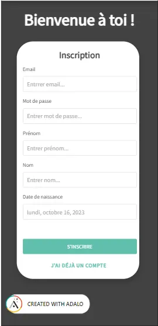

 
Aucun prérequis !  


# Sprint 1 
###### Objectifs du premier sprint
Fonctionalités à implémenter : 
+ [x] Authentification  - 1
+ [x] Pouvoir changer les informations de son profil  - 1
+ [x] Pouvoir visualiser une recette  - 2
+ [x] Pouvoir publier une recette  - 1
+ [x] Pouvoir se déconnecter  - 1

Autres éléments : 
+ [X] Avoir un design/visuel agréable - 3
+ [x] Travailler le parcours utilisateurs - 2

## Sommaire

1. Découverte d'Adalo
2. Idée de l'application 
3. Développement de l'application

## 1.Découverte d'Adalo
"Transformer des idées réelles en applications réeeles sans écrire une seule ligne de code", voici la promesse d'Adalo, un nouvel outil permettant de bâtir des applications web et mobiles sans coder.
Le but d'Adalo est de permettre à n'importe qui de construire une application de manière la plus simple possible. 
La première étape est évidemment de se créer un compte sur Adalo. Ensuite il faut créer une nouvelle application.
On peut choisir si l'on souhaite créer une application mobile ou responsive qui permettra un visuel adéquat si on utilise un ordinateur par exemple. Puis le site nous propose des thèmes ou bien de partir d'un visuel vide (c'est mon choix). Enfin on choisi le nom de l'application et les couleurs principales qui peuvent être modifiées plus tard.

Nous arrivons alors sur l'environnement d'Adalo qui se présente comme ceci : 

A droite le bouton <strong>+</strong> nous permet d'ajouter des élements tels que du texte, des boutons, des listes ou encore des images et des formulaires... Lorsque l'on sélectionne un élément on peut le personaliser sur sa taille, sa forme, sa visibilité ou encore les actions qui en découlent lorsque l'on clique dessus.

Le menu <strong>Branding</strong> permet de personnifier les coloris de l'application ainsi que la police principale.

Le menu <strong>Screen</strong> permet de visualiser les différentes pages déjà créés et d'en ajouter de nouvelles.

Dans le menu <strong>Database</strong> on peut ajouter de nouvelles collections qui correspondent aux tables de données. On peut créer des liens entre les différentes tables et visualiser les données déjà enregistrées.

Dans le menu <strong>Setting</strong> on peut changer le nom de l'application, définir si l'application à le droit d'être cloner ou non, obtenir une API d'accès ou encore supprimer l'application.

Le menu <strong>Publish</strong> permet de publier son application (mais pour ça il faut payer).

Le menu <strong>Analytics</strong> permet d'avoir un apperçu du nombre d'utilisateurs qui se connecte à l'application ainsi que d'autres données qui ne seront pas utilise comme nous ne pourrons pas publier l'application.

Enfin le menu <strong>Version History</strong> permet d'enregistrer différentes versions de design, là aussi il faut avoir la version payante pour accéder à cette fonctionalité. 

## 2.Idée de l'application
J'ai décidé de réaliser une application de partage de recettes: <strong>Lucette | Recipes & Co</strong> afin de pouvoir garder en mémoire mes recettes et les partager à d'autres utilisateurs. 

[Lien vers l'application](https://lucie-le-boursicauds-team.adalo.com/les-recettes-de-lulu?_gl=1%2A19rdhxq%2A_ga%2AMTQyNTAyOTgxNC4xNjk1MDM4NjQ2%2A_ga_SWT45DV35L%2AMTY5NTQ5NTc1My4xMi4wLjE2OTU0OTU3NTMuNjAuMC4w&target=3hni4na11m72olt1r9567f5qe&params=%7B%7D)

##### Fonctionalités nécessaires
Afin de me donner des objectifs de réalisations voici la liste des fonctionalités qui devront être mise en place obligatoirement à la fin des 20h de projet :
+ [x] Authentification 
+ [x] Fonctionalité de "mot de passe oublié"
+ [x] Pouvoir changer les informations de son profil
+ [x] Pouvoir visualiser une recette
+ [x] Pouvoir publier une recette
+ [x] Ajouter une recette a ses favoris 
+ [x] Pouvoir noter une recette

## 3.Développement de l'application
Pour commencer à developper l'application je me suis occupé du système d'inscription et d'authentification. Aucune difficulté avec Adalo puisque le site fait déjà la moitié du travail pour nous. Je me suis donc concentrée sur le design pour rentre l'application joli dès la première interraction avec l'utilisateur.

Ensuite j'ai créé de nouvelles collections dans la database : Recettes et Categories.
Une fois créer j'ai donc pu mettre en place un formulaire permettant la création d'une nouvelle recette. 
La encore Adalo permet un gain de temps important en proposant des formulaires tout fait dans lequel on peut décider quel champs doit apparaitre, si il est obligatoire ou non, ect... 

J'ai donc créer plusieurs recettes via ce formulaire puis j'ai créé la page d'accueil permettant à l'utilisateur de visualiser des recettes suggérées et de faire une recherche si celui-ci a déjà une idée de ce qu'il veut tester. 

Lorsque l'utilisateur clique sur l'un des recettes, il est renvoyé vers une nouvelle page de visualisation de la recette qu'il a choisi. Les différentes imformations de la recette y sont inscrites ainsi que les étapes de la recette.
Si l'utilisateur est le créateur de la recette alors il apprait une icone permettant de modifier la recette si celui-ci le désire.

Une fois cette partie réalisé je me suis consacrée à la page de profil de l'utilisateur. On y découvre ses informations qu'il peut modifier si nécessaire ainsi que les recettes qu'il a publié, elles aussi modifiables.

Pour que le parcours utilisateur soit le plus agréable possible j'ai ajouté la barre de navigation. Lorsque l'utilisateur clique sur l'une des icones il est redirigé vers la page corresponsante. 

# Sprint 2
###### Objectifs du deuxième sprint
Fonctionalités à implémenter : 
+ [x] Fonctionalité de "mot de passe oublié"  - 1
+ [x] Ajouter une recette a ses favoris    - 3
+ [x] Pouvoir noter une recette         - 3
+ [x] Pouvoir laisser un avis sur une recette  - 2
+ [x] Avoir des badges en fonction du nombre de recettes publiées    - 1
+ ~~[ ] Pouvoir partager une recette   - 5 ~~ Impossible sur la version gratuite
+ [x] Ajouter une liste d'ingrédient pour chaque recette avec les quantités adéquates   - 5

Autres : 
+ [~] Retravailler le design de certaines pages - 3

## Sommaire

1. Développement de l'application
2. Conclusion 

## 1. Déveoppement de l'application

Pour ajouter la fonctionalité de favoris ça m'a paru un peu plus délicat que d'autres fonctionalités. J'ai essayé de trouver une solution par moi-même, mon idée de base étant d'avoir une table *Favoris* avec l'Id de la recette et de l'utilisateur concerné, puis de filtrer les recettes à partir de cette table. Seulement il n'était pas possible de le formuler tel quel et après 1h d'essais je me suis tournée vers l'excellente plateforme <strong>Youtube</strong> afin de me trouver un tuto sur cette fonctionalité. Et bingo ! Voici la (super) courte vidéo qui a résolu tous mes soucis : [How to Favorite Items in Adalo](https://www.youtube.com/watch?v=7EMMGKGYL0g). 
Une fois la fonctionalité mise en place j'ai donc pu afficher les recettes favorites dans une page spéciale.

Je n'aime pas spécialement le design de cette page mais je viendrais retravailler ça après avoir développer les fonctionalités manquantes.

Ensuite il a fallu mettre en place un système de notation des recettes par les utilisateurs. J'ai donc utilisé un plug-in adapté appelé <strong>Rating</strong>. Il permet d'ajouter une échelle de note à base d'icones que l'on peut choisir et d'effectuer une action lorsque l'on clique sur une note. J'ai donc rajouté le champs <strong>Rate</strong> pour la collection <strong>Recette</strong> qui est modifié lorsqu'un utilisateur note la recette en faisant la moyenne des notes qui ont été données.

La moyenne s'affiche alors sous l'image de la recette.

Par la suite j'ai implémenter la possibilité de publier des avis sur des recettes à l'aide d'un petit formulaire. J'ai créé une nouvelle collections <strong>Avis</strong> qui est relié à une recette et un utilisateur. Voici ce que cela donne : 

Encore une fois le design sera retravaillé par la suite.

Après, il a fallu que je m'occupe de <strong>l'ajout des ingrédients et des quantités</strong> en faisant en sorte que l'ajout de ces éléments soit pratique pour un utilisateur qui souhaite ajouter une nouvelle recette. J'ai pas mal réfléchis pour faciliter l'implémentation de cette fonctionalité pour obtenir ce résultat : 

Maitenant lorsque l'utilisateur visualise une recette les ingrédients sont affichés comme ci-dessous : 

Toutes les fonctionalités possible avec la version gratuite d'Adalo que j'avais voulu apporté à l'application ont été mises en place. Seulement le design de l'application est encore à mon goût pas assez travaillé. Je vais donc me concentrer sur ça afin de rendre l'expérience utilisateur plus agréable.

## Résultat final 

Voici les différentes pages finales de l'application disponible [ici](https://lucie-le-boursicauds-team.adalo.com/les-recettes-de-lulu?_gl=1%2A19rdhxq%2A_ga%2AMTQyNTAyOTgxNC4xNjk1MDM4NjQ2%2A_ga_SWT45DV35L%2AMTY5NTQ5NTc1My4xMi4wLjE2OTU0OTU3NTMuNjAuMC4w&target=3hni4na11m72olt1r9567f5qe&params=%7B%7D).

#### Pages de connexions/inscriptions

#### Page principale

#### Profil

#### Favoris

#### Explorer

#### Nouvelle recette

## Conclusion 
Adalo est un très bon outil de No Code, intuitif et facile d'utilisation. Comme tout outil No Code il possède des limites et la barrière du design restreint est compliqué à surpasser si l'on veut faire de jolies applications. Je pense que cela demanderait beaucoup de temps pour effectuer un design que l'on a en-tête. 
En tout cas l'intéraction avec la base de données est vraiment adapté à un public novice ce qui beaucoup de fonctionnalités simples à réaliser. 
Il ne faut pas hésiter à regarder des tutoriels pour certaines fonctionalités que l'on souhaite implémenter, on peut tourner en rond longtemps alors que la solution est en réalité bien plus simple que ce que l'on imagine. Cela m'a fait perdre parfois un peu de temps mais c'est aussi important de chercher par soi-même un minimum avant de trouver une solution déjà toute faite.