 
Connaitre les bases de Figma.  


# Sprint 1 
###### Objectifs du premier sprint
+ [x] Réaliser une maquette simplifiée - 2
+ [x] Choisir la charte graphique  - 3
+ [x] Créer les éléments et les variants principaux  - 2
+ [x] Avoir des ébauches de différentes pages - 2

## Sommaire

1. Présentation de Figma
2. Charte graphique
3. Maquette simplifiée
4. Ebauches de différentes pages

## 1.Présentation de Figma
Lors du cours d'UX design nous avons utilisé Figma, un outil de conception et de prototypage très populaire et largement utilisé dans le domaine du design d'interface utilisateur et d'expérience utilisateur. Les principaux arguments à son utilisation abondante par les designers sont les suivantes :

- <strong>Interface collaborative</strong>
  Figma peut-être utilisé pour travailler en groupe simultanément sur un même projet ce qui facile la collaboration au sein d'une équipe de conception.

- <strong>Conception basées sur les vecteurs</strong>
  Figma utilise une approche basée sur les vecteurs d'où une précision et une mise à l'échelle sans aucune perte de qualité.

- <strong>Bibliothèques de composants réutilisables</strong>
  On peut créer différents composants que l'on peut utiliser à sa guise et en créer des variants pour gagner du temps et accélerer le processus de maquettage.

- <strong>Prototypage interactif</strong>
  Figma propose des fonctionnalités permettant d'animer les maquettes pour créer des intéractions utilisateur. On peut vraiment recréer la naviguation sur un site web de manière plutôt simple.

-<strong>Inspecteur de design</strong>
 Le gros atout de Figma c'est d'avoir un inspecteur de design permettant aux développeur d'obtenir des informations détaillées sur les élements de conception.

-<strong>Versions et historique</strong>
Figma garde un historique des modifications, permettant ainsi aux utilisateurs de revenir à d'anciennes version d'un projet offrant alors une certaine flexibilité lors du travail de groupe.

Figma propose sa version payante gratuite pour tous les étudiants. Je me suis donc créer un compte à l'aide de mon adresse mail de Centrale afin d'obtenir un accès totale à l'outil et explorer toutes les possibilités qu'il offre.

## 2. Charte graphique
Afin d'avoir une charte graphique la plus adaptée possible j'ai réalisé un brief graphique. 

**Brief Graphique : VIBE Brunch & Art**

**Utilisateurs :**

**Amateurs d'Art :** Personnes passionnées par l'art sous toutes ses formes, recherchant une expérience où la créativité culinaire se marie harmonieusement avec des expositions artistiques.
  
**Foodies Avertis :** Individus appréciant la gastronomie raffinée et innovante, cherchant une expérience de brunch exceptionnelle associée à un environnement artistique.

**Événements Spéciaux :** Groupes ciblés pour des événements privés, réceptions et célébrations artistiques, recherchant un lieu unique et créatif.

**Valeurs :**

**Créativité :** Le mariage de l'art et de la gastronomie pour une expérience stimulant tous les sens.

**Convivialité :** Un espace accueillant favorisant les rencontres, les échanges et la découverte.

**Innovation :** Un lieu constamment en évolution, offrant des expériences uniques à chaque visite.

**Personnage du Design :**

Le design doit incarner l'essence de la créativité, la fusion de deux mondes distincts. Il doit être :

**Élégant et Contemporain :** Reflétant la sophistication d'un brunch de qualité et la modernité de l'art contemporain.

**Dynamique :** Capturant l'énergie et le mouvement, évoquant la vitalité de l'expérience VIBE.

**Équilibré :** Assurant une harmonie visuelle entre les éléments artistiques et culinaires sans compromettre la lisibilité.

**Contraintes Techniques :**

**Adaptabilité :** Le design doit être adaptable à divers supports tels que les menus, les enseignes, le site web et les supports promotionnels.

**Palette de Couleurs :** Utilisation d'une palette vibrante, reflétant l'énergie du lieu tout en maintenant une cohérence avec l'expérience globale.

**Lisibilité :** Assurer une lisibilité claire du logo et des éléments graphiques, même à petite échelle.

**Accessibilité :** Garantir une accessibilité optimale, notamment en ce qui concerne les contrastes de couleur pour les personnes atteintes de déficiences visuelles.

**Intégration du Logo :** Le logo doit s'intégrer naturellement dans tous les supports, en conservant son impact visuel.

##### Logo 
Pour créer le logo j'ai utilisé Canva que je maitrise plutôt bien. 
J'ai essayé différents arrangements pour avoir le nom VIBE en harmonie avec l'information "Brunch & Art".Choisir la disposition parfaite pour intégrer ces éléments a été mon point de départ, je voulais refléter l'atmosphère artistique tout en assurant une lisibilité claire et immédiate. Au début j'ai essayé des arrangements très simples ce qui est efficace mais qui reflète peu le côté créatif que je voulais exprimé. 

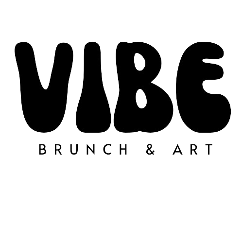

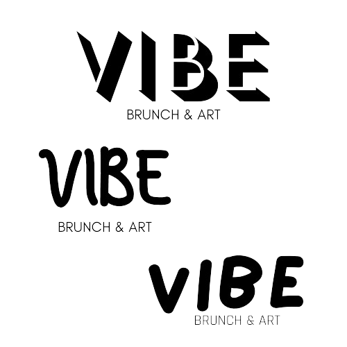

J'ai essayé donc d'autres justement. Ensuite, il a fallu trouvé la police adéquate assez expressive pour le nom de la marque mais aussi une police plus élégante et sobre pour l'information.
J'ai ajouté des formes un peu artistiques et de la couleur pour former des versions finales qui correspondent bien à ce que j'imaginais. Ces formes évocatrices soulignent la créativité et l'énergie du lieu. Pour la palette de couleurs j'hésitait entre des couleurs vibrantes pour stimuler les sens ou des couleurs plus pastelles.

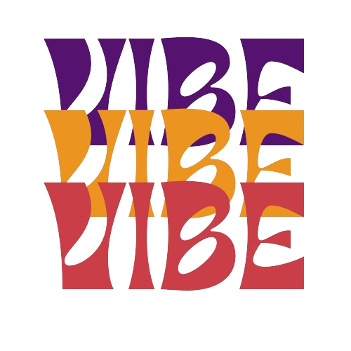

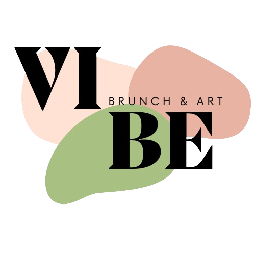

#### Typographie 

La sélection de typographie que j'ai opérée pour ce site repose sur la recherche d'un équilibre entre la lisibilité, l'esthétique et la cohérence visuelle. Pour les titres, j'ai opté pour Montserrat en raison de son caractère moderne et élégant. Cette police apporte une forte présence tout en restant facile à lire, ce qui la rend idéale pour attirer l'attention sur les éléments clés de l'interface.

Pour le corps du texte, j'ai choisi Kokoro. Cette police offre une bonne lisibilité tout en apportant une touche de chaleur et de personnalité. Sa simplicité épurée s'aligne parfaitement avec les valeurs du persona du design, créant une lecture fluide et agréable.

En ce qui concerne les boutons, j'ai opté pour Koulen. Cette typographie confère aux boutons une apparence distinctive et une certaine énergie, tout en maintenant une clarté visuelle pour les interactions utilisateur. Koulen ajoute une dimension subtile, soulignant l'importance des actions à entreprendre sans compromettre la facilité d'utilisation.

Dans l'ensemble, cette combinaison de Montserrat, Kokoro et Koulen vise à créer une expérience visuelle harmonieuse, cohérente pour les utilisateurs, renforçant ainsi l'identité visuelle de l'entreprise.

#### Couleurs

#### Iconographie

## 3. Réalisation d'une maquette simplifiée
Pour ce POK j'ai décidé de réaliser le site web d'un concept store que j'aimerais ouvrir à l'avenir. L'idée est de pouvoir peindre entre amis autour d'un repas. C'est un concept très à la mode en ce moment et qui n'est pas encore développé à Marseille. 

La première étape est donc d'avoir une idée globale de la structure du site nottament le placement des différents éléments, les boutons de navigations ect. Pour ce faire j'ai d'abord fait des croquis à la main puis je les ai reproduit sur Figma pour avoir un résultat plus précis et de meilleur qualité. 
La réflexion principale pour ces maquettes simplifiées c'est que le parcours utilisateur soit le plus fluide possible lors que celui-ci cherche une information précise. Je veux donc quelque chose d'assez original mais qui reste intuitif : tout le défi de ce POK réside dans ce travail. 

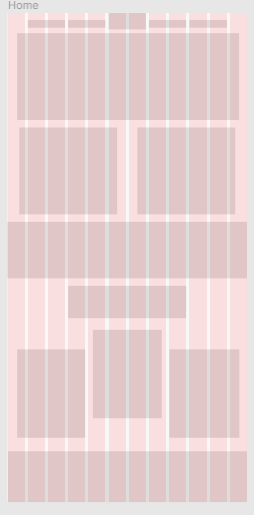

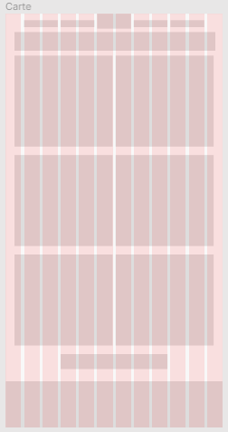

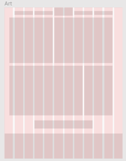

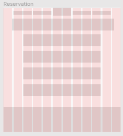

## 4. Ebauche des différentes pages
À partir d'une maquette simplifiée, j'ai élaboré des ébauches de pages toujours à l'aide de l'outil Figma. 

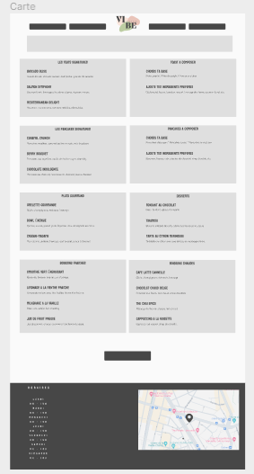

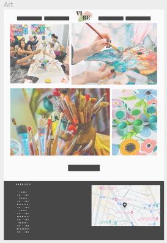

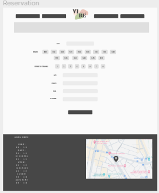

### Horodateur
| Date | Heures passées | Indications | 
| -------- | -------- |-------- |
| Jeudi 16/11  | 1H  | Travail sur le brief design |
| Jeudi 16/11 | 2H | Travail sur le logo, les typographies, les couleurs, recherche sur ce qui se fait aujourd'hui|
| Dimanche 20/11 | 2H | Maquette simlifiée : *Placement des éléments fictifs*|
| Vendredi 24/11 | 2H | Création des premiers composants|
| Mercredi 6/12 | 1H | Maquette : *Placement des vrais composants et ajustement|
| Vendredi 8/12 | 2H | Amélioration composants |
