 
Connaitre les bases de Figma.  


# Sprint 1 
###### Objectifs du premier sprint
+ [x] Réaliser le brief graphique - 1H
+ [x] Choisir la charte graphique (typographie et couleur) - 1H
+ [x] Réaliser un logo - 1H
+ [x] Réaliser la maquette simplifiée de la page *Home* - 1H
+ [x] Réaliser la maquette simplifiée de la page *Carte* - 1H
+ [x] Réaliser la maquette simplifiée de la page *Réservation* - 1H
+ [x] Réaliser la maquette simplifiée de la page *Art* - 1H
+ [x] Créer les boutons d'actions - 30min
+ [x] Créer la bottom bar - 1H
+ [x] Créer les inputs de réservations - 30min
+ [x] Créer les boutons pour le choix des heures et nombres de personnes - 30min
+ [x] Ajouter des photos - 30min

## Sommaire

1. Présentation de Figma
2. Charte graphique
3. Maquette simplifiée
4. Ebauches de différentes pages

## 1.Présentation de Figma
Lors du cours d'UX design nous avons utilisé Figma, un outil de conception et de prototypage très populaire et largement utilisé dans le domaine du design d'interface utilisateur et d'expérience utilisateur. Les principaux arguments à son utilisation abondante par les designers sont les suivantes :

- <strong>Interface collaborative</strong>
  Figma peut-être utilisé pour travailler en groupe simultanément sur un même projet ce qui facile la collaboration au sein d'une équipe de conception.

- <strong>Conception basées sur les vecteurs</strong>
  Figma utilise une approche basée sur les vecteurs d'où une précision et une mise à l'échelle sans aucune perte de qualité.

- <strong>Bibliothèques de composants réutilisables</strong>
  On peut créer différents composants que l'on peut utiliser à sa guise et en créer des variants pour gagner du temps et accélerer le processus de maquettage.

- <strong>Prototypage interactif</strong>
  Figma propose des fonctionnalités permettant d'animer les maquettes pour créer des intéractions utilisateur. On peut vraiment recréer la naviguation sur un site web de manière plutôt simple.

-<strong>Inspecteur de design</strong>
 Le gros atout de Figma c'est d'avoir un inspecteur de design permettant aux développeur d'obtenir des informations détaillées sur les élements de conception.

-<strong>Versions et historique</strong>
Figma garde un historique des modifications, permettant ainsi aux utilisateurs de revenir à d'anciennes version d'un projet offrant alors une certaine flexibilité lors du travail de groupe.

Figma propose sa version payante gratuite pour tous les étudiants. Je me suis donc créer un compte à l'aide de mon adresse mail de Centrale afin d'obtenir un accès totale à l'outil et explorer toutes les possibilités qu'il offre.

## 2. Charte graphique
Pour ce POK j'ai décidé de réaliser le site web d'un concept store que j'aimerais ouvrir à l'avenir. L'idée est de pouvoir peindre entre amis autour d'un repas. C'est un concept très à la mode en ce moment et qui n'est pas encore développé à Marseille. 
Afin d'avoir une charte graphique la plus adaptée possible j'ai réalisé un brief graphique. 

**Brief Graphique : VIBE Brunch & Art**

**Utilisateurs :**

+ **Jeunes créatifs :** Personnes passionnées par l'art sous toutes ses formes, recherchant un endroit posé où elles peuvent utilisées leur créativité et manger de bons plats.
  
+ **Expert du brunch :** Individus appréciant les brunchs, cherchant une expérience innovante associée à un environnement artistique.

+ **Événements Spéciaux :** Groupes ciblés pour des événements privés, réceptions et célébrations artistiques, recherchant un lieu unique et créatif pouvant servir à manger.

**Valeurs :**

+ **Créativité :** Le mariage de l'art et de la cuisine pour une expérience stimulant tous les sens.

+ **Convivialité :** Un espace accueillant favorisant les rencontres, les échanges et la découverte.

+ **Innovation :** Un lieu constamment en évolution, offrant des expériences uniques à chaque visite.

**Personnage du Design :**

Le design doit incarner l'essence de la créativité, la fusion de deux mondes distincts. Il doit être :

+ **Élégant et Contemporain :** Reflétant la sophistication d'un brunch de qualité et la modernité de l'art contemporain.

+ **Dynamique :** Capturant l'énergie et le mouvement, évoquant la vitalité de l'expérience VIBE.

+ **Équilibré :** Assurant une harmonie visuelle entre les éléments artistiques et culinaires sans compromettre la lisibilité.

**Contraintes Techniques :**

+ **Adaptabilité :** Le design doit être adaptable à divers supports tels que les menus, les enseignes, le site web et les supports promotionnels.

+ **Palette de Couleurs :** Utilisation d'une palette vibrante, reflétant l'énergie du lieu tout en maintenant une cohérence avec l'expérience globale.

+ **Lisibilité :** Assurer une lisibilité claire du logo et des éléments graphiques, même à petite échelle.

+ **Accessibilité :** Garantir une accessibilité optimale, notamment en ce qui concerne les contrastes de couleur pour les personnes atteintes de déficiences visuelles.

+ **Intégration du Logo :** Le logo doit s'intégrer naturellement dans tous les supports, en conservant son impact visuel.

##### Logo 
Pour créer le logo j'ai utilisé Canva que je maitrise plutôt bien. 
J'ai essayé différents arrangements pour avoir le nom VIBE en harmonie avec l'information "Brunch & Art".Choisir la disposition parfaite pour intégrer ces éléments a été mon point de départ, je voulais refléter l'atmosphère artistique tout en assurant une lisibilité claire et immédiate. Au début j'ai essayé des arrangements très simples ce qui est efficace mais qui reflète peu le côté créatif que je voulais exprimé. 

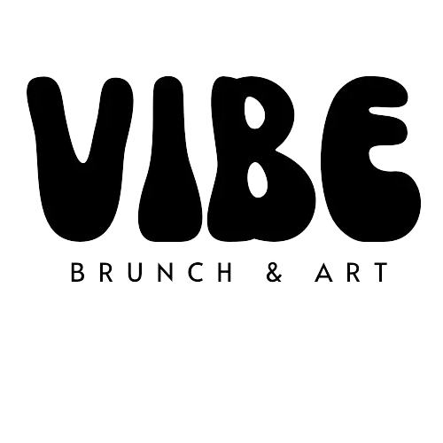

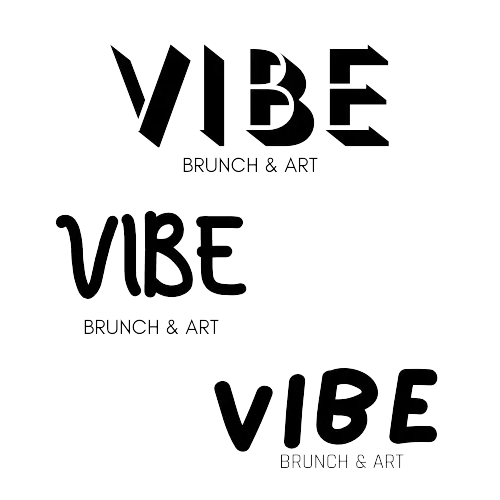

J'ai essayé donc d'autres justement. Ensuite, il a fallu trouvé la police adéquate assez expressive pour le nom de la marque mais aussi une police plus élégante et sobre pour l'information.
J'ai ajouté des formes un peu artistiques et de la couleur pour former des versions finales qui correspondent bien à ce que j'imaginais. Ces formes évocatrices soulignent la créativité et l'énergie du lieu. Pour la palette de couleurs j'hésitait entre des couleurs vibrantes pour stimuler les sens ou des couleurs plus pastelles.

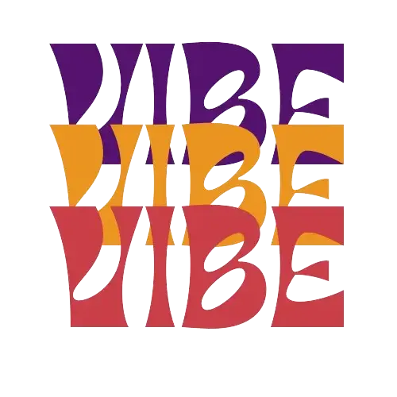

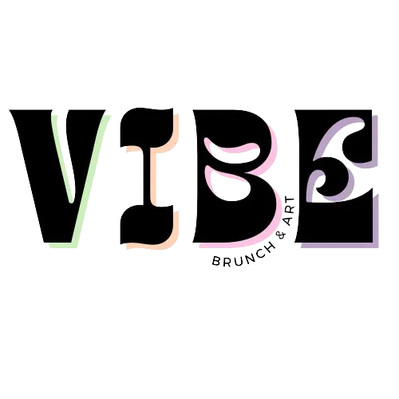

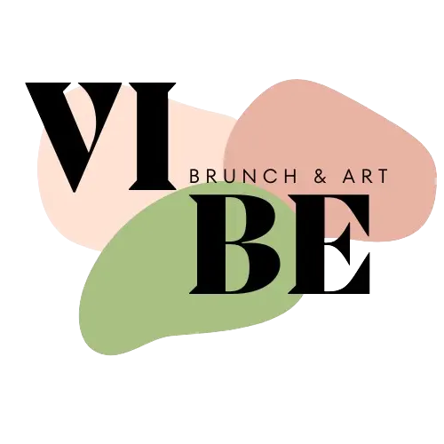

#### Typographie 

La sélection de typographie que j'ai opérée pour ce site repose sur la recherche d'un équilibre entre la lisibilité, l'esthétique et la cohérence visuelle. Pour les titres, j'ai opté pour Montserrat en raison de son caractère moderne et élégant. Cette police apporte une forte présence tout en restant facile à lire, ce qui la rend idéale pour attirer l'attention sur les éléments clés de l'interface.

Pour le corps du texte, j'ai choisi Kokoro. Cette police offre une bonne lisibilité tout en apportant une touche de chaleur et de personnalité. Sa simplicité épurée s'aligne parfaitement avec les valeurs du persona du design, créant une lecture fluide et agréable.

En ce qui concerne les boutons, j'ai opté pour Koulen. Cette typographie confère aux boutons une apparence distinctive et une certaine énergie, tout en maintenant une clarté visuelle pour les interactions utilisateur. Koulen ajoute une dimension subtile, soulignant l'importance des actions à entreprendre sans compromettre la facilité d'utilisation.

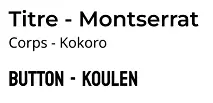

Dans l'ensemble, cette combinaison de Montserrat, Kokoro et Koulen vise à créer une expérience visuelle harmonieuse, cohérente pour les utilisateurs, renforçant ainsi l'identité visuelle de l'entreprise.

#### Couleurs

## 3. Réalisation d'une maquette simplifiée
Pour cette partie j'ai essayé déjà de voir les sites proposant des brunchs classiques ou un peu plus innovants pour me donner des idées et m'inspirer. 

+ [Kozy](https://www.kozy.fr/)

+ [Parenthèse](https://www.parenthesebrunch.com/menu)

+ [Sookie](https://www.hotelsookie.com/fr/page/coffee-shop-petit-dejeuner-marais.10175.html)
  
+ [Galerie Wawi](https://www.galeriewawi.com/brunch-paint)
  

La première étape est donc d'avoir une idée globale de la structure du site nottament le placement des différents éléments, les boutons de navigations ect. Pour ce faire j'ai d'abord fait des croquis à la main puis je les ai reproduit sur Figma pour avoir un résultat plus précis et de meilleur qualité. 
La réflexion principale pour ces maquettes simplifiées c'est que le parcours utilisateur soit le plus fluide possible lors que celui-ci cherche une information précise. Je veux donc quelque chose d'assez original mais qui reste intuitif : tout le défi de ce POK réside dans ce travail. 

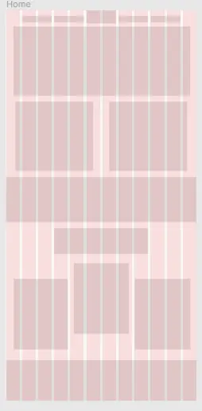

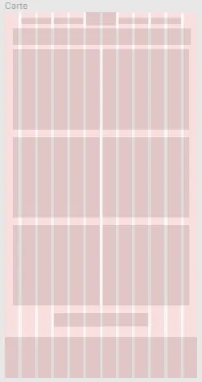

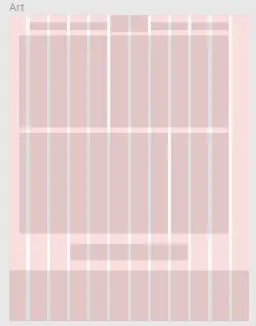

## 4. Ebauche des différentes pages et création de premiers composants
À partir d'une maquette simplifiée, j'ai élaboré des ébauches de pages toujours à l'aide de l'outil Figma. 

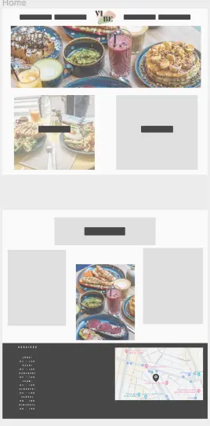

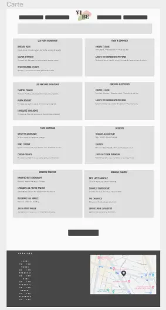

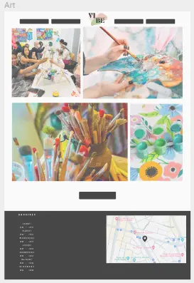

Et les premiers composants : 

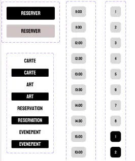

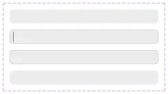

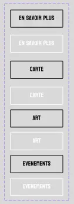

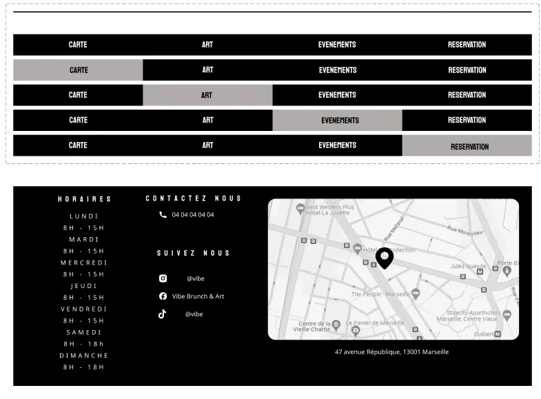

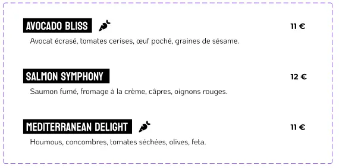

# Sprint 2
###### Objectifs du deuxième sprint
+ [x] Faire le composant d'en tête pour les différentes pages - 1H
+ [x] Faire les composants des autres plats - 1H
+ [x] Faire les composants des categories - 30min
+ [x] Faire le composant de réservation bien prise en compte - 30min
+ [x] Ajouter le composant en-tête aux pages *Réservation* et *Carte* - 15min
+ [x] Ajouter les composants des autres plats sur la page *Carte* - 15min
+ [x] Ajouter les couleurs aux différentes pages - 2H
+ [x] Réaliser les animations d'interaction hoover sur les boutons - 1H
+ [x] Réaliser les animation non interractive sur la page *Home* - 2H
+ [x] Ajouter les photos sur toutes les pages - 1H

### Composants pour les différentes pages
En utilisant les outils de Figma, j'ai créé une structure de base pour l'en-tête de page. J'ai essayé plusieurs modèles mais je trouvais que le plus sobre était celui qui rendait le mieux finalement.

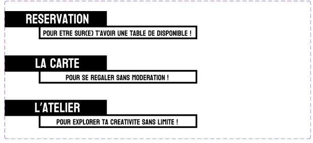

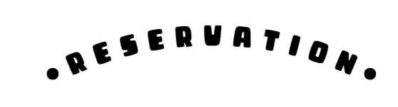

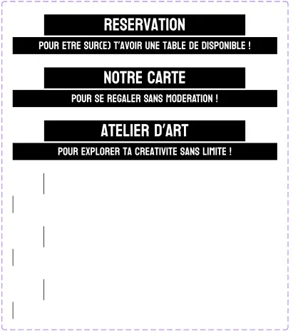

J'ai aussi fait différents prototypes pour les catégories de plats et j'en ai gardé un assez sobre. 

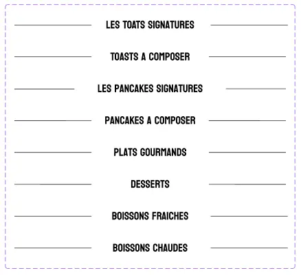

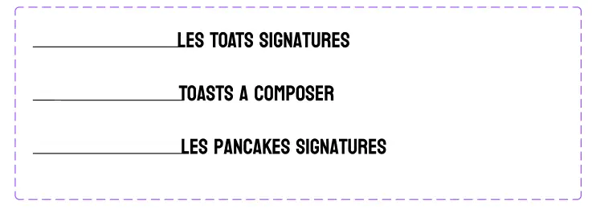

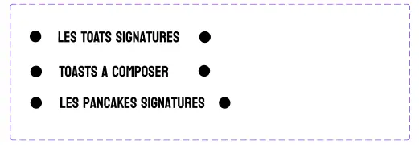

### Réservation bien prise en compte
Pour ce composant je me suis inspirée de ce que j'ai trouve en me baladant sur les templates de site pour essayer de recréer quelque chose de similaire et dans l'esprit du mien. 

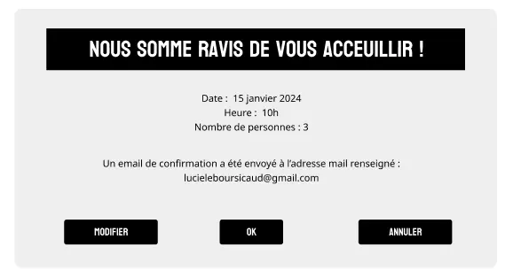

### Ajouter les couleurs aux différentes pages 
Cette partie là était pas vraiment évidente parce que j'ai testé plusieurs teintes et sur plusieurs éléments pour voir ce qui ressortait le mieux. Au final mettre la couleur sur les boutons de navigation et en bas de page m'a semblé être le choix le plus judicieu. En rajoutant trop de couleurs un peu partout j'avais peur de perdre l'utilisateur.

### Réaliser les animations 
Je voulais qu'il y ait des animations sur les boutons lors du survol et lors du clic et aussi ajouter des animations sur les en-tête de page lors de l'arrivée sur une page. Pour la page principale j'ai aussi des animations sur les boutons qui apparaissent à l'écran. 

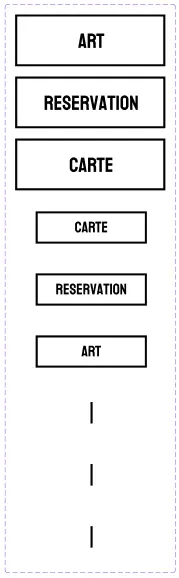

A l'arrivée sur la page le bouton n'est qu'un simple trait, puis il s'élargit jusqu'à devenir le bouton, et lors de son survol il grossit. J'ai bien toutes les animations que je voulais et je me suis servie de mon MON pour un peu mieux gérer les transitions et les temps d'animations optimaux.

### Retravail de la structure de certaines pages
La page principale ne me plaisait pas. J'ai donc essayé d'autres structures jusqu'à trouver celle qui me plaisait le plus. C'est aussi celle que l'on retrouve sur beaucoup de site web, elle n'est donc pas très originale mais elle fonctionne bien avec l'esprit du site. Le fait de l'avoir autant simplifié permet à l'utilisateur de se concecentrer sur l'essentiel de ce qu'il a envie de voir. 

Exemples : 

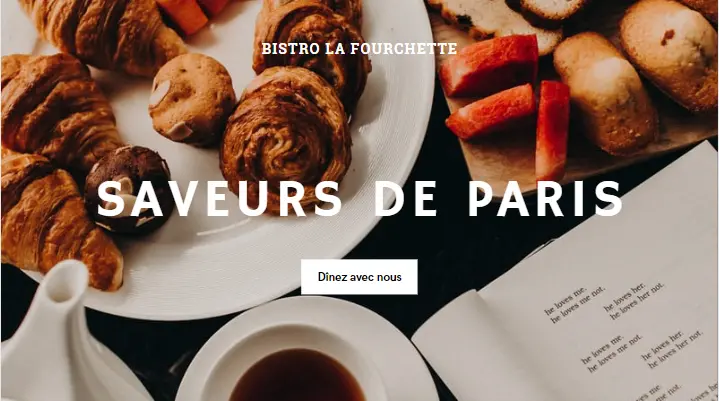

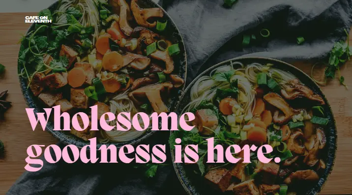

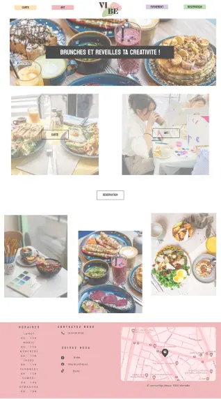

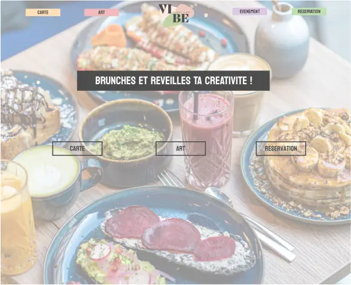

#### Réalisation finale 

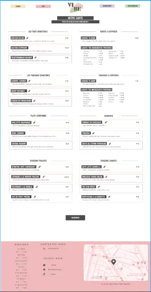

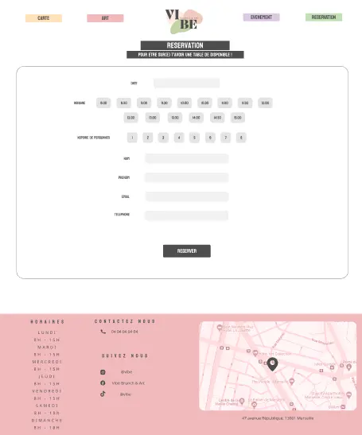

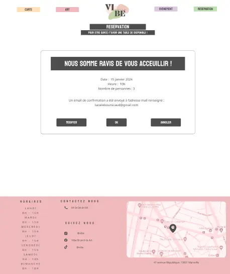

### Horodateur
| Date | Heures passées | Indications |
| -------- | -------- |-------- |
| Jeudi 16/11  | 1H  | Travail sur le brief design |
| Jeudi 16/11 | 2H | Travail sur le logo, les typographies, les couleurs, recherche sur ce qui se fait aujourd'hui|
| Dimanche 20/11 | 2H | Maquette simlifiée : *Placement des éléments fictifs*|
| Vendredi 24/11 | 2H | Création des premiers composants|
| Mercredi 6/12 | 1H | Maquette : *Placement des vrais composants et ajustement|
| Vendredi 8/12 | 2H | Amélioration composants |
|---------- | --------- | ------- |
| Jeudi 14/12 | 3H | Composants en-tête + plats + categories |
| Jeudi 14/12 | 1H15 | Composants de réservation bien prise en compte + ajout des composants |
| Samedi 13/01 | 1H30 | Ajout des couleurs sur les différentes pages |
| Samedi 13/01 | 1H30 | Animations d'interraction sur les boutons |
| Lundi 15/01 | 2H | Animation non interractive sur les pages |
| Lundi 15/01 | 1H | Retravail de la structure de certaines pages |

