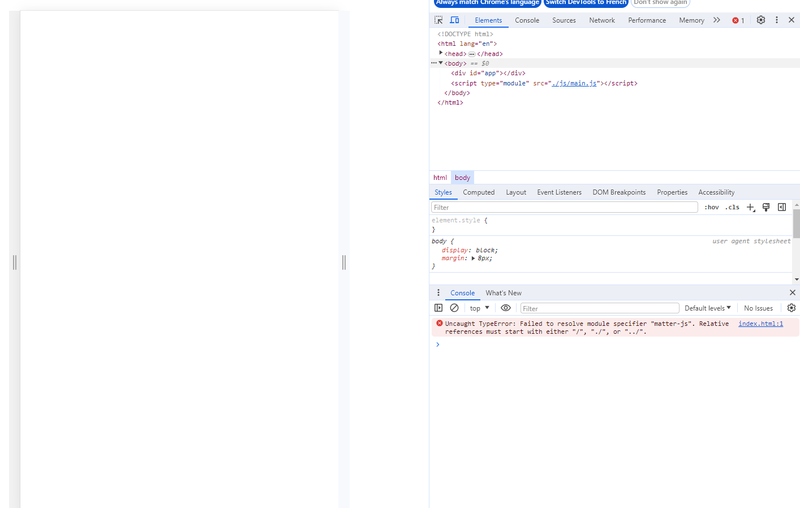

 
Etre à l'aise avec JavaScript.  


### Introduction
Le "Jeu de la pastèque" ou *Suika Game* est un jeu vidéo japonais qui est sorti en décembre 2021 au Japon. Il est diffusé au reste du monde en octobre 2023 et devient un véritable phénomène très relié par les réseaux sociaux notamment par TikTok. 

##### But du jeu 

Le joueur doit remplir une jarre avec des fruits, à chaque fois qu'il en jette un, il gagne des point. L'objectif est de déverser un maximum de fruits afin d'obtenir un meilleur score. Mais lorsque deux fruits identiques entrent en contact, ils fusionnent pour donner un fruit plus gros. Le plus petit fuits est une myrtille et le plus gros une pastèque (d'où le nom du jeu). Dès lors qu'un fruit dépasse de la jarre alors la partie est terminé. 
Ce jeu s'est beaucoup inspiré du mécanisme de 2048 qui a été un gros succès il y a déjà quelques années.
Voici une capture d'écran du jeu qui est disponible sur téléphone : 

<div style="display:flex">
<div></div>
</div>

##### Objectif du POK
L'objectif ici est de reproduire ce jeu sur un navigateur en déplaçant le fruit avec les flèche de l'ordinateur et en le lachant avec la barre espace.

# Sprint 1 
###### Objectifs du premier sprint
+ [] Découvrir rapidement Matter.js (1H)
+ [] Créer l'environnement de code avec les différents modules utiles (1H)
+ [] Créer la boite du jeu (2H)
+ [] Créer un rond qui tombe (1H)
+ [] Faire un sorte que le rond ne tombe pas tout de suite (1H)
+ [] Pouvoir faire bouger le rond avec les flèches (1H)
+ [] Pouvoir lacher le rond avec la barre espace (1H)
+ [] Générer aléatoirement plusieurs tailles de rond (2H)


### 1. Découvrir rapidement Matters.js
[Matter.js](https://brm.io/matter-js/) est une bibliothèque JavaScript open-source qui permet la création de simulations physiques en 2D. Il s'agit d'une bibliothèque assez populaire dans le domaine du développement de jeux car elle est facile à utiliser et est très performante. Elle permet de simuler des objets, des collisions, des forces et la gravité, ce qui va être utile dans la création du jeu.
Je me suis rendue sur une [documentation](https://brm.io/matter-js/) pour comprendre comment fonctionne cette bibliothèque. J'ai donc regardé une première vidéo [Introduction to Matter.js](https://www.youtube.com/watch?v=urR596FsU68&list=PLRqwX-V7Uu6akvoNKE4GAxf6ZeBYoJ4uh) et la deuxième [Introduction to Matter.js Continued](https://www.youtube.com/watch?v=uITcoKpbQq4&list=PLRqwX-V7Uu6akvoNKE4GAxf6ZeBYoJ4uh&index=21).

### 2. Créer l'environnement de code 
Je me crée un dossier *Pasteque* et j'initialise mon projet avec 

npm init 

J'ajoute la ligne "type" : "module", je crée un fichier index.js et index.html et j'installe Express et Matter via les commande 

npm add --save express
npm install matter-js

J'ajoute un fichier main.js

J'ai eu beaucoup de difficultés en suivant cette méthode dont une que j'ai pas réussi à corriger : 

<div style="display:flex">
<div></div>
</div>

J'ai donc utilisé Vite pour créer mon projet (ce qu'un des tutos Matter.js utilisé comme environnement) et cela à très bien marché en suivant la documentation.

J'ai donc l'environnement suivant : 


### 3. Créer la boite du jeu 
La première chose à créer est donc une boite, pour ça j'ai juste suivi la [documentation](https://brm.io/matter-js/) qui explique comment ajouter des corps aux mondes ce qui m'a donné cela : 

<div style="display:flex">
<div></div>
</div>

Et le code associé : 
```html

```


# Sprint 2 
###### Objectifs du second sprint
+ [] Créer un nouveau rond quand il y a une collision de deux même rond (3H)
+ [] Gérer la fin de la partie (2H)
+ [] Remplacer les ronds par des fruits (3H)
+ [] Rendre l'interface joli (2H)
