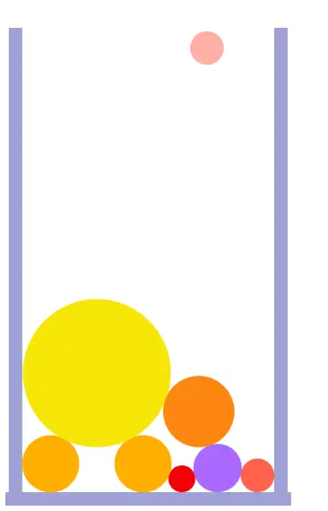
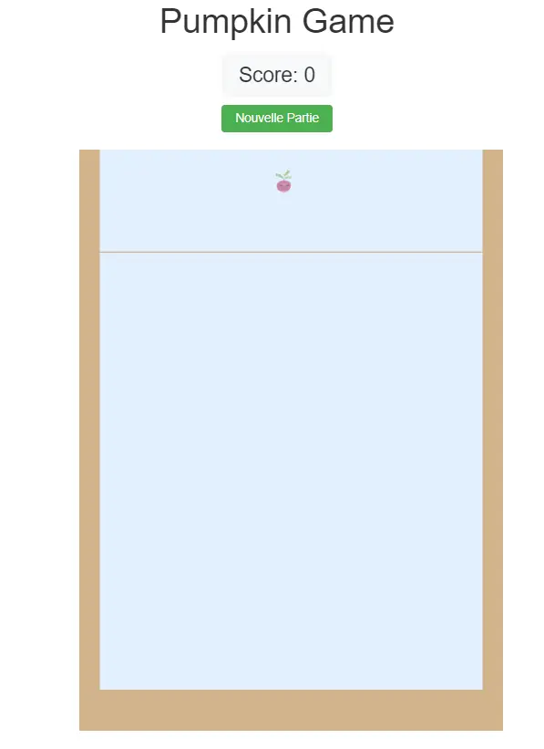

 
Etre à l'aise avec JavaScript.  


### Introduction
Le "Jeu de la pastèque" ou *Suika Game* est un jeu vidéo japonais qui est sorti en décembre 2021 au Japon. Il est diffusé au reste du monde en octobre 2023 et devient un véritable phénomène très relié par les réseaux sociaux notamment par TikTok. 

##### But du jeu 

Le joueur doit remplir une jarre avec des fruits, à chaque fois qu'il en jette un, il gagne des point. L'objectif est de déverser un maximum de fruits afin d'obtenir un meilleur score. Mais lorsque deux fruits identiques entrent en contact, ils fusionnent pour donner un fruit plus gros. Le plus petit fuits est une myrtille et le plus gros une pastèque (d'où le nom du jeu). Dès lors qu'un fruit dépasse de la jarre alors la partie est terminé. 
Ce jeu s'est beaucoup inspiré du mécanisme de 2048 qui a été un gros succès il y a déjà quelques années.
Voici une capture d'écran du jeu qui est disponible sur téléphone : 

<div style="display:flex">
<div></div>
</div>

##### Objectif du POK
L'objectif ici est de reproduire ce jeu sur un navigateur en déplaçant le fruit avec les flèche de l'ordinateur et en le lachant avec la barre espace.

# Sprint 1 
###### Objectifs du premier sprint
+ [x] Découvrir rapidement Matter.js (1H) 
+ [x] Créer l'environnement de code avec les différents modules utiles (1H)
+ [x] Créer la boite du jeu (2H)
+ [x] Créer un rond qui tombe (1H)
+ [x] Faire un sorte que le rond ne tombe pas tout de suite (1H)
+ [x] Pouvoir faire bouger le rond avec les flèches (1H)
+ [x] Pouvoir lacher le rond avec la barre espace (1H)
+ [x] Générer aléatoirement plusieurs tailles de rond (2H)


### 1. Découvrir rapidement Matters.js
[Matter.js](https://brm.io/matter-js/) est une bibliothèque JavaScript open-source qui permet la création de simulations physiques en 2D. Il s'agit d'une bibliothèque assez populaire dans le domaine du développement de jeux car elle est facile à utiliser et est très performante. Elle permet de simuler des objets, des collisions, des forces et la gravité, ce qui va être utile dans la création du jeu.
Je me suis rendue sur une [documentation](https://brm.io/matter-js/) pour comprendre comment fonctionne cette bibliothèque. J'ai donc regardé une première vidéo [Introduction to Matter.js](https://www.youtube.com/watch?v=urR596FsU68&list=PLRqwX-V7Uu6akvoNKE4GAxf6ZeBYoJ4uh) et la deuxième [Introduction to Matter.js Continued](https://www.youtube.com/watch?v=uITcoKpbQq4&list=PLRqwX-V7Uu6akvoNKE4GAxf6ZeBYoJ4uh&index=21).

### 2. Créer l'environnement de code 

Je me crée un dossier *Pasteque* et j'initialise mon projet avec :

```html
npm init 
```

J'ajoute la ligne "type" : "module", je crée un fichier index.js et index.html et j'installe Express et Matter via les commandes : 

```html
npm add --save express
npm install matter-js 
```

J'ajoute un fichier main.js dans lequel je vais coder les différentes fonctions pour le jeu.

J'ai eu beaucoup de difficultés en suivant cette méthode dont une que j'ai pas réussi à corriger : 

<div style="display:flex">
<div></div>
</div>

J'ai donc utilisé [Vite](https://vitejs.dev/) pour créer mon projet (ce qu'un des tutos Matter.js utilisé comme environnement) et cela à très bien marché en suivant la documentation.

### 3. Créer la boite du jeu 

Maintenant que j'ai mon environnement je peux commencer à coder le jeu.
La première chose à créer est donc une boite, pour ça j'ai juste suivi la [documentation](https://brm.io/matter-js/) qui explique comment ajouter des corps aux mondes ce qui m'a donné cela : 

<div style="display:flex">
<div></div>
</div>




```html
import {Engine, Render, Runner} from "matter-js";

const engine = Engine.create();
const render = Render.create({
    engine,
    element: document.body,
    options: {
        wireframes:false,
        background: "#E1FAD7",
        width: 620,
        height: 850,
    },
});

const world = engine.world;

const sol = Bodies.rectangle(115,820,620,20,{
    isStatic:true,
    render: {
        fillStyle: "#9EA1D4",
    }
});

const murgauche = Bodies.rectangle(15,470,20,700,{
    isStatic:true,
    render: {
        fillStyle: "#9EA1D4",
    }
});

const murdroite = Bodies.rectangle(410,470,20,700,{
    isStatic:true,
    render: {
        fillStyle: "#9EA1D4",
    }
});

World.add(world, [sol,murgauche,murdroite]);

Render.run(render);
Runner.run(engine);
```



## 4. Créer un rond qui tombe
De la même façon j'ai juste suivi la [documentation](https://brm.io/matter-js/). Et j'ai obtenu cela : 
<div style="display:flex">
<div></div>
</div>



```html
import {Engine, Render, Runner} from "matter-js";

const engine = Engine.create();
const render = Render.create({
    engine,
    element: document.body,
    options: {
        wireframes:false,
        background: "#E1FAD7",
        width: 620,
        height: 850,
    },
});

const world = engine.world;

const sol = Bodies.rectangle(115,820,620,20,{
    isStatic:true,
    render: {
        fillStyle: "#9EA1D4",
    }
});

const murgauche = Bodies.rectangle(15,470,20,700,{
    isStatic:true,
    render: {
        fillStyle: "#9EA1D4",
    }
});

const murdroite = Bodies.rectangle(410,470,20,700,{
    isStatic:true,
    render: {
        fillStyle: "#9EA1D4",
    }
});

World.add(world, [sol,murgauche,murdroite]);

Render.run(render);
Runner.run(engine);

function ajouterFruit(){
    const body = Bodies.circle(300, 150,30, {
        render : {
            fillStyle: "green",
        },
    });
    World.add(world,body);
};

ajouterFruit();
```



## 5. Le rond qui tombe ne doit pas tomber de suite
Ici le but est de comprendre comment faire pour que le rond ne tombe pas avant que j'appuie sur la barre espace. Après avoir chercher un peu, il faut utiliser le booléen <strong>isSleeping</strong> qui permet de mettre le corps en attente et on pourra le réveiller par la suite.



```html
import {Engine, Render, Runner} from "matter-js";

const engine = Engine.create();
const render = Render.create({
    engine,
    element: document.body,
    options: {
        wireframes:false,
        background: "#E1FAD7",
        width: 620,
        height: 850,
    },
});

const world = engine.world;

const sol = Bodies.rectangle(115,820,620,20,{
    isStatic:true,
    render: {
        fillStyle: "#9EA1D4",
    }
});

const murgauche = Bodies.rectangle(15,470,20,700,{
    isStatic:true,
    render: {
        fillStyle: "#9EA1D4",
    }
});

const murdroite = Bodies.rectangle(410,470,20,700,{
    isStatic:true,
    render: {
        fillStyle: "#9EA1D4",
    }
});

World.add(world, [sol,murgauche,murdroite]);

Render.run(render);
Runner.run(engine);

function ajouterFruit(){
    const body = Bodies.circle(300, 150,30, {
        isSleeping: true,
        render : {
            fillStyle: "green",
        },
    });
    World.add(world,body);
};

ajouterFruit();
```



## 6. Faire bouger le rond avec les flèches 
Maintenant que le rond reste endormi il faut pouvoir utiliser les flèches de notre clavier pour le faire bouger. Pour cela j'utilise des écouteurs d'évements <strong>onkeydown</strong> et en fonction du <strong> code </strong> de la touche sur laquelle j'appuie je ne vais pas faire la même action donc j'utilise un <strong>switch</strong> sur <strong>event.code</strong>. Afin de récupérer mon élement rond (qui sera un fruit par la suite) j'ajoute une ligne dans le code de la fonction *ajouterFruit()* qui affecte à la variable <strong>monFruit</strong> le body de l'élément en question. Voilà où j'en suis :

```html
function ajouterFruit(){
    const body = Bodies.circle(300, 150,30, {
        isSleeping: true,
        render : {
            fillStyle: "green",
        },
    });
    monFruit = body;
    World.add(world,body);
};

window.onkeydown = (event) => {
  switch(event.code){
    case "ArrowLeft":
      
    case "ArrowRight":

  }
  }
```

Maintenant je veux pouvoir bouger mon élement. Pour ça on va devoir importer *Body* dans cette ligne ci : 

```html
import {Engine, Render, Runner, Bodies, World, Body} from 'matter-js';
```
et on va utiliser la méthode <strong>setPosition()</strong> comme ci dessous.

```html
function ajouterFruit(){
    const body = Bodies.circle(300, 150,30, {
        isSleeping: true,
        render : {
            fillStyle: "green",
        },
    });
    monFruit = body;
    World.add(world,body);
};

window.onkeydown = (event) => {
  switch(event.code){
    case "ArrowLeft":
      Body.setPosition(currentFruit, {x: monFruit.position.x - 1, y:monFruit.position.y,
      });
    case "ArrowRight":
      Body.setPosition(currentFruit, {x: monFruit.position.x + 1, y:monFruit.position.y,
      });
  }
  }
```

Le soucis est que le mouvement de notre fruit est très lent, et si j'augmente en passant de 1 à 10 par exemple, le mouvement est saccadé et je ne peux pas faire tomber mon fruit avec précision. J'ai beaucoup cherché à résoudre ce problème pour trouver et mettre en place la solution : <strong>utiliser des intervalles</strong>. Ca permet d'automatiser la mise à jour de la position pour qu'elle se fasse toutes les *temps* milisecondes.

```html

let interval = null;

window.onkeydown = (event) => {
  switch(event.code){
    case "ArrowLeft":
      if(interval) return;
      interval= setInterval(() => {
        Body.setPosition(currentFruit, {x: monFruit.position.x - 1, y:monFruit.position.y,
      });
      },5)
    case "ArrowRight":
      if(internal) return;
      interval= setInterval(() => {
        Body.setPosition(currentFruit, {x: monFruit.position.x - 1, y:monFruit.position.y,
      });
      },5)
  }
  }

window.onkeyup = (event) => {
  switch(event.code){
    case "ArrowLeft":
    case "ArrowRight":
      clearInterval(interval);
      interval = null;
  }
}
```
Le problème c'est que je peux déplacer le fruit à l'extérieur des murs ce qui n'est pas envisageable. Il faut donc vérifier que notre fruit ne se situe pas au bord de la boite si l'on veut le déplacer. Pour ça j'ai utilisé un <strong>if()</strong> sur la position de *monFruit*.



```html
window.onkeydown = (event) => {
    switch (event.code) {
        case "ArrowDown":
            if(interval) return ; 
            interval = setInterval(() => {
                if(monFruit.position.x - 20 > 25)
            Body.setPosition(monFruit, {
                x: monFruit.position.x - 1, 
                y: monFruit.position.y,
            });
            }, 5);
            break;
        case "ArrowRight":
            if(interval) return ; 
            interval = setInterval(() => {
                if(monFruit.position.x + 20 <400)
            Body.setPosition(monFruit, {
                x: monFruit.position.x + 1, 
                y: monFruit.position.y,
            });
            }, 5);
            break;
    }
};

window.onkeyup = (event) => {
    switch (event.code) {
        case "ArrowDown":
        case "ArrowRight":
            clearInterval(interval);
            interval = null;
    }
};
```


Alors notre fruit est bloqué sur les deux côté du mur : 
<div style="display:flex">
<div></div>
<div></div>
</div>

## 7. Faire tomber le fruit avec la barre espace
L'ojectif est clair : lorsque l'on appuie sur la barre espace, le fruit "se réveille" et tombe.
Pour ça on utilise encore l'écouteur d'évenement <strong>onkeydown</strong> et on va devoir importer <strong>Sleeping</strong> depuis la bibliothèque matter.js.

```html
import {Engine, Render, Runner, Bodies, World, Body, Sleeping} from 'matter-js';
```
On va donc ajouter le cas où l'on appuie sur la touche espace dans notre écouteur, et passer le booléen <strong>isSleeping</strong> à la valeur <strong>false</strong> avec la méthode <strong>set()</strong>.

```html
window.onkeydown = (event) => {
    switch (event.code) {
        case "ArrowDown":
            if(interval) return ; 
            interval = setInterval(() => {
                if(monFruit.position.x - 20 > 25)
            Body.setPosition(monFruit, {
                x: monFruit.position.x - 1, 
                y: monFruit.position.y,
            });
            }, 5);
            break;
        case "ArrowRight":
            if(interval) return ; 
            interval = setInterval(() => {
                if(monFruit.position.x + 20 <400)
            Body.setPosition(monFruit, {
                x: monFruit.position.x + 1, 
                y: monFruit.position.y,
            });
            }, 5);
            break;
        case "Space":
            Sleeping.set(monFruit, false);
    }
};

```

Notre fruit tombe quand on appuie sur espace ! 
Sauf que l'on a qu'un seul fruit... Il faudrait qu'un autre fruit apparaisse lorsque le premier fruit est tombé. J'ai donc rajouté l'appel à la fonction <strong>ajouterFruit()</strong> à la suite de mon cas. 

```html
case "Space":
  Sleeping.set(monFruit, false);
  ajouterFruit();
```
Mais dans le jeu il y a un petit moment de latence entre le fruit qui est tombé et l'apparition d'un nouveau fruit et là c'est direct donc c'est moins agréable. On va alors ajouter un delais avec la fonction <strong>setTimeout</strong> avant d'ajouter un nouveau fruit.

```html
window.onkeydown = (event) => {
    switch (event.code) {
        case "ArrowDown":
            if(interval) return ; 
            interval = setInterval(() => {
                if(monFruit.position.x - 20 > 25)
            Body.setPosition(monFruit, {
                x: monFruit.position.x - 1, 
                y: monFruit.position.y,
            });
            }, 5);
            break;
        case "ArrowRight":
            if(interval) return ; 
            interval = setInterval(() => {
                if(monFruit.position.x + 20 <400)
            Body.setPosition(monFruit, {
                x: monFruit.position.x + 1, 
                y: monFruit.position.y,
            });
            }, 5);
            break;
        case "Space":
            Sleeping.set(monFruit, false);
            setTimeout(() => {
              ajouterFruit()
            }, 1000);
    }
};

```

Mais ça ne suffit pas le problème persiste. Il faut donc empêcher le joueur de lacher le fruit, donc rendre la touche espace "inactive". Pour ça on va créer une variable booléenne qui permettra de savoir si lorsque j'appuie sur espace le fruit est laché ou non.

```html
import {FRUITS} from "./fruits";
```

Maintenant on va créer la fonction qui permet de générer un fruit aléatoire pour succéder à celui qu'on vient de lâcher. Pour ce faire on va générer un <strong>index</strong> aléatoire qu'on appliquera au tableau pour récupérer un fruit. On a la possibilité de tomber seulement sur les 5 premiers fruits sinon ça serait trop facile. Voilà ma fonction : 

```html
function randomFruit(){
  const randomIndex = Math.floor(Math.random()*5)
  const fruit = FRUITS[randomIndex];
  return fruit;
}
```
Maintenant on va utiliser cette fonction pour la génération automatique du fruit d'après. On va donc modifier un peu la fonction <strong>ajouterFruit()</strong>.

```html
function ajouterFruit(){
    const randomFruit = randomFruit();

    const body = Bodies.circle(300, 150,randomFruit.radius, {
        label: randomFruit.label,
        isSleeping: true,
        render : {
            fillStyle: randomFruit.color,
        },
    });
    monFruit = body;
    World.add(world,body);
};
```

<div style="display:flex">
<div></div>
</div>


# Sprint 2 
###### Objectifs du second sprint
+ [x] Détecter une collision entre deux élements (1H)
+ [x] Supprimer les deux élements si ce sont les mêmes fruits (1H)
+ [x] Faire apparaitre le fruit suivant à l'endroit de la collision (1H)
+ [x] Créer une ligne de délimition en haut (15min)
+ [x] Arrêter la partie quand un fruit dépasse la ligne (1H)
+ [x] Trouver des images de fruits/légumes (1H)
+ [x] Redimensionner et enlever le background des images (30min)
+ [x] Ajouter les images dans le projet (15min)
+ [x] Ajouter les images dans le code (1H30)
+ [x] Rendre l'interface joli (2H)

## 1. Faire apparaitre le fruit suivant lors de la collision de deux fruits identiques
Pour gérer la fusion des fruits, on va utiliser l'objet <strong>Events</strong> que l'on importe depuis la bibliothèque matter.js. 

```html
import {Engine, Render, Runner, Bodies, World, Body, Sleeping, Events} from 'matter-js';
```

On va pouvoir écouter certains type d'évenements qui peuvent arriver dans le moteur physique avec <strong>Events.on()</strong>. On va chercher à savoir si les deux éléments qui sont entrés en collision on le même label et dans ce cas supprimer ceux-là.

```html
Events.on(engine, "collisionStart", (event) => {
  event.pairs.forEach(collision => {
    if(collision.bodyA.label == collision.bodyB.label){
      World.remove(world, [collision.bodyA, collision.bodyB]);
    }
  })
})
```

<div style="display:flex">
<div></div>
<div></div>
</div>

Lorsque deux fruits identiques se touchent ils disparaisent. 
Maintenant il faut faire apparaitre le fruit d'après à l'endroit de la collision. Comment savoir le fruit prochain ? Et bien le tableau <strong>FRUITS</strong> doit être ordonné par croissance des fruits pour nous faciliter la tâche. On va donc récupérer l'<strong>index</strong> du fruit qui est rentré en collision et l'incrémenter de 1 pour obtenir l'index du nouveau fruit et extraire ses propriétés du tableau.

```html
Events.on(engine, "collisionStart", (event) => {
  event.pairs.forEach(collision => {
    if(collision.bodyA.label == collision.bodyB.label){
      World.remove(world, [collision.bodyA, collision.bodyB]);

      const index= FRUITS.findIndex((fruit) => fruit.label == collision.bodyA.label);

      const nouveauFruit = FRUITS[index + 1];
      const body = Bodies.circle(
        collision.collision.supports[0].x,
        collision.collision.supports[1].y,
        nouveauFruit.radius,
        {rendeer : {
          fillsStyle : nouveauFruit.color
        },
        label : nouveauFruit.label
        }
      )
      World.add(world,body);
    }
  });
})
```

<div style="display:flex">
<div></div>
<div></div>
</div>

Désormais quand deux fruits se rencontrent, le fruit suivant apparait ! 
Par contre il faut que l'on fasse attention au cas ou deux derniers fruits se rencontrent. Dans le jeu les deux pastèques disparaisent mais rien ne réapparait. On va donc rajouter cette règle dans notre fonction.

```html
Events.on(engine, "collisionStart", (event) => {
  event.pairs.forEach(collision => {
    if(collision.bodyA.label == collision.bodyB.label){
      World.remove(world, [collision.bodyA, collision.bodyB]);

      const index= FRUITS.findIndex((fruit) => fruit.label == collision.bodyA.label);

      if(index == FRUITS.length - 1) return;

      const nouveauFruit = FRUITS[index + 1];
      const body = Bodies.circle(
        collision.collision.supports[0].x,
        collision.collision.supports[1].y,
        nouveauFruit.radius,
        {rendeer : {
          fillsStyle : nouveauFruit.color
        },
        label : nouveauFruit.label
        }
      )
      World.add(world,body);
    }
  });
})
```

## 2. Gérer la fin de la partie 
Pour ça on va rajouter une ligne en haut et si un fruit dépasse la ligne notre partie prendra fin. 

```html
const lignehaut = Bodies.rectangle(310,150,620,2, {
    isStatic: true,
    isSensor: true,
    render: {fillStyle: "#9EA1D4"},
    label: "ligne",
})

World.add(world, [sol,murgauche,murdroite,lignehaut]);
```
La propriété <strong>isSensor</strong> permet de déterminer si l'élément n'est sensible à la collision ou non. On doit le mettre à true car sinon nos fruits vont rester bloqué par cette ligne en haut et ne tomberont pas. Pas contre on détecte quand même les collisions ce qui permet de savoir si la partie est fini ou non, on va rajouter cette règle dans le jeu sur l'écouteur <strong>Events.on()</strong>.

```html
Events.on(engine, "collisionStart", (event) => {
  event.pairs.forEach(collision => {
    if(collision.bodyA.label == collision.bodyB.label){
      World.remove(world, [collision.bodyA, collision.bodyB]);

      const index= FRUITS.findIndex((fruit) => fruit.label == collision.bodyA.label);

      if(index == FRUITS.length - 1) return;

      const nouveauFruit = FRUITS[index + 1];
      const body = Bodies.circle(
        collision.collision.supports[0].x,
        collision.collision.supports[1].y,
        nouveauFruit.radius,
        {rendeer : {
          fillsStyle : nouveauFruit.color
        },
        label : nouveauFruit.label
        }
      )
      World.add(world,body);
    }
    if((collision.bodyA.label === "ligne" || collision.bodyB.label === "ligne")&&!disableAction){
      alert("Game over");
    }
  });
})
```

## 3. Ajouter des images pour remplacer les ronds
Pour ça je me suis rendue sur Canva et j'ai cherché des images de légumes/fruits qui iront bien dans le jeu, voici ceux que j'ai sélectioné : 

<div style="display:flex">
<div></div>
<div></div>
<div></div>
<div></div>
<div></div>
<div></div>
<div></div>
<div></div>
</div>
<div style="display:flex">
<div></div>
<div></div>
<div></div>
</div>

Le set n'est pas parfait et il y a les filligrames de Canva mais si j'ai le temps j'essaierais de trouver quelque chose de mieux à la fin.
On va ajouter toutes ces images dans le dossier public et les ajouter dans le code. On fera attention de nommer les images avec le label du fruit correspondant. Par exemple *garlic.webp* pour notre ail. Au lieu d'ajouter une couleur à nos fruits on va leur rajouter une image avec <strong>sprite</strong>.

```html
function ajouterFruit(){
    const randomFruit = randomFruit();

    const body = Bodies.circle(300, 150,randomFruit.radius, {
        label: randomFruit.label,
        isSleeping: true,
        render : {
            fillStyle: randomFruit.color,
            sprite: {texture : '/${randomFruit.label}.webp'}
        },
    });
    monFruit = body;
    World.add(world,body);
};
```
Il faut faire la même modification lorsque deux fruits se rencontrent et que le prochain fruit apparait.


<div style="display:flex">
<div></div>
<div></div>
</div>

## 4. Ajout d'un score pour la partie 

On va rajouter un tableau de score pour notre jeu. D'abord j'ajoute une nouvelle variable <strong>score</strong> qui ajoutera les points à chaque fois que l'on ajout un fruit dans notre boite.

```html
let score = 0;

function updateScore(points) {
    score += points;
    document.getElementById('score').innerText = `Score: ${score}`;
}
```

Ensuite je modifie mon tableau <strong>FRUITS</strong> en rajoutant une propriété <strong>point</strong> pour chaque fruit.


```html
export const FRUITS = [
  {
    label: "radish",
    radius: 40 / 2,
    color: "#F20306",
    points: 10
  },
  {
    label: "garlic",
    radius: 50 / 2,
    color: "#FF624C",
    points: 15
  },
  {
    label: "onionw",
    radius: 72 / 2,
    color: "#A969FF",
    points: 20
  },
  {
    label: "lemon",
    radius: 85 / 2,
    color: "#FFAF02",
    points: 30
  },
  {
    label: "orange",
    radius: 106 / 2,
    color: "#FC8611",
    points: 45
  },
  {
    label: "tomato",
    radius: 140 / 2,
    color: "#F41615",
    points: 65
  },
  {
    label: "onion",
    radius: 160 / 2,
    color: "#FDF176",
    points: 90
  },
  {
    label: "paprika",
    radius: 196 / 2,
    color: "#FEB6AC",
    points: 130
  },
  {
    label: "eggplant",
    radius: 220 / 2,
    color: "#F7E608",
    points: 200
  },
  {
    label: "artichoke",
    radius: 270 / 2,
    color: "#89CE13",
    points: 300
  },
  {
    label: "pumpkin",
    radius: 300 / 2,
    color: "#26AA1E",
    points: 450
  },
];
```


Ensuite je vais appeler la fonction <strong>updateScore</strong> lorsque je lâche un fruit et aussi quand un nouveau fruit apparait.

```html
case "Space":
            disableAction=true;
            const indexF = FRUITS.findIndex((fruit)=> fruit.label==fruitActuel.label);
            const monFruit = FRUITS[indexF] ; 
            Sleeping.set(fruitActuel, false);
            setTimeout(() => {
                ajouterFruit();
                disableAction = false;
            },1000);
            updateScore(monFruit.points);
```

```html
Events.on(engine,"collisionStart",(event)=>{
    event.pairs.forEach(collision => {
        if(collision.bodyA.label == collision.bodyB.label){
            World.remove(world, [collision.bodyA, collision.bodyB]);

            const index = FRUITS.findIndex((fruit )=> fruit.label==collision.bodyA.label);

            if(index == FRUITS.length - 1) return;
            
            const newfruit = FRUITS[index + 1];
            const body = Bodies.circle(
                collision.collision.supports[0].x,
                collision.collision.supports[0].y,
                newfruit.radius,
                {render: {
                    fillStyle: newfruit.color,
                    sprite: { texture: `/${newfruit.label}.webp` },
                },
            label : newfruit.label,
        });
        updateScore(newfruit.points);
        World.add(world, body);

        }
        if((collision.bodyA.label === "ligne" || collision.bodyB.label === "ligne")&&!disableAction){
            alert("Game over");
          } 
    })
});
```
J'améliore un peu l'hmtl et j'obtiens ça : 
<div style="display:flex">
<div></div>
<div></div>
</div>

Ensuite j'ai changé les couleurs de la boite et du fond et j'ai rajouté un bouton pour lancer une nouvelle partie. Pour cela j'ai supprimé tous les corps autre que les constituants de la boite et mis le score à zero lorsque le joueur clique sur le bouton.

```html
document.getElementById('newGameButton').addEventListener('click', () => {
    score = 0;
    updateScore(score);
    world.bodies.filter(body => body.label !== "sol" && body.label !== "ligne" && body.label !== "murgauche"&& body.label !== "murdroite").forEach(body => {
        World.remove(world, body);
    });
    ajouterFruit();
 } );
```

<div style="display:flex">
<div></div>
</div>


### Conclusion et améliorations possibles 

Le jeu final est très proche du jeu auquel on joue sur téléphone, néanmoins de nombreux choses peuvent être améliorés.

Voici d'autres améliorations possibles : 
- une interface plus jolie avec une chartre graphique précise 
- des images en SVG, rogner à la forme du fruit/légume, pour éviter de grands espaces entre les éléments
- une possibilité d'enregistrement du meilleur score 
- correction de certains bugs inexpliqués (un oignon a réussi à traverser le sol...)

[Cliquez ici](./pumpkin-main.zip) pour télécharger le fichier zip.


### Horodateur
| Date | Heures passées | Indications |
| -------- | -------- |-------- |
| Lundi 22/01 | 1H  | *Découvrir rapidement Matter.js* |
| Mardi 22/01 | 2H  | *Créer l'environnement de code avec les différents modules utiles* |
| Mercredi 23/01 | 1H  | *Créer la boite du jeu* |
| Mercredi 23/01 | 15min  | *Créer un rond qui tombe* |
| Jeudi 24/01 | 1H30  | *Faire en sorte que le rond ne tombe pas tout de suite* |
| Samedi 27/01 | 2H | *Pouvoir faire bouger le rond avec les flèches* |
| Samedi 27/01 | 1H | *Pouvoir lâcher le rond avec la barre espace* |
| Mardi 30/01 | 2H | *Générer aléatoirement plusieurs tailles de rond* |
| -------- | -------- |-------- |
| Jeudi 01/02 | 1H30  | *Détecter une collision entre deux élements* |
| Jeudi 01/02 | 30min  | *Supprimer les deux élements si ce sont les mêmes fruits* |
| Samedi 03/02 | 1H30  |  *Faire apparaitre le fruit suivant à l'endroit de la collision* |
| Samedi 03/02 | 15min  | *Créer une ligne de délimition en haut* |
| Samedi 03/02 | 1H | *Arrêter la partie quand un fruit dépasse la ligne* |
| Dimanche 04/02 | 1H | *Trouver des images de fruits/légumes* |
| Dimanche 04/02 | 30min | *Redimensionner et enlever le background des images* |
| Dimanche 04/02 | 15min | *Ajouter les images dans le projet* |
| Dimanche 04/02 | 1H30 | *Ajouter les images dans le code* |
| Vendredi 16/02 | 1H | *Ajout d'un score et modification de couleurs*|


