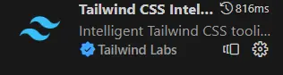

<a href="https://tailwindcss.com/" target="_blank">
        
    </a>

Le front web au travers d'une introduction à [TailwindCSS](https://tailwindcss.com/).

<h2 id="toc"> Table des matières </h2>

- [Table des matières](#toc)
- [Introduction](#h1)
  - [Qu'est ce que le langage HTML ?](#h1-1)
  - [Qu'est ce que TailwindCSS ?](#h1-2)
- [Outils complémentaires](#h2)
- [Installation de l'environnement](#h3)
- [Liens utiles](#liens)

<h2 id="h1"> Introduction </h2>

Le but de ce MON est de découvrir le front web au travers d'une introduction à TailwindCSS.

<h3 id="h1-1"> Qu'est ce que le language HTML ? </h3>

Le langage HTML (HyperText Markup Language) est un langage utilisé pour créer et structurer le contenu d'une page web pour la rendre lisible et agréable pour le lecteur.

<h3 id="h1-2"> Qu'est ce que TailwindCSS ? </h3>

L'idée de TailwindCSS est de proposer des classes faciles à utiliser et extrêmement modifiable, afin d'avoir la personnalisation la plus complète possible de la page web avec des fonctions faciles d'utilisation.

```html
<body class="min-h-screen bg-slate-50 dark:bg-black dark:text-white">
    <header class="bg-teal-700 text-white sticky top-0 z-10">
        <section class="max-w-4xl mx-auto p-4 flex justify-between items-center">
            <h1 class="text-3xl font-medium"></h1>
                TailwindCSS
        </section>
</body>
```

Ce paragraphe permet de créer un titre avec des personnalisations :

- le fond va être "bg-teal-700" (une sorte de vert)
- "text-white" écris en blanc
- "dark:bg-black" défini la couleur du background en dark mode, cela permet donc de créer facilement son site web dans les deux coloris.
- "items-center" permet de centrer les objets

L'intérêt est donc d'avoir des abréviations intuitives qui permettent de personnaliser efficacement

<h2 id="h2"> Outils complémentaires </h2>

En vue d'utiliser TailwindCSS et plus généralement pour écrire du code HTML, il est nécessaire d'avoir un environnement de travail qui soit propre. Ainsi, les extensions suivantes permettent de faciliter le développement :

- [Tailwind CSS IntelliSense](https://code.visualstudio.com/docs/editor/intellisense), le but de cette extension est de faciliter l'écriture du code tailwind css, en effet elle permet la complétion automatique de syntaxe et surligne les erreurs.



- [Live Server](https://marketplace.visualstudio.com/items?itemName=ritwickdey.LiveServer), le but de cette extension est d'avoir votre page web toujours ouverte et toujours à jour ! Cela permet de ne plus effectuer de "npm run serve" et de ne plus avoir de temps d'attente entre la modification et le rendu graphique.


- [Inline Fold](https://marketplace.visualstudio.com/items?itemName=moalamri.inline-fold), le but de cette extension est de rendre le code lisible, lorsque l'on écrit en html et en Tailwind, les personnalisations viennent encombrer notre écran, cette extension va masquer la partie personnalisation de chaque Class en vue de ne garder que la structure de la page. Lorsque l'on souhaite modifier la personnalisation d'une classe, il nous suffit de cliquer sur les trois points de suspension.


Voici un exemple du code précédent en utilisant Inline Fold, il permet doc de masquer toutes les personnalisations tant qu'on ne clique pas sur les points de suspensions :


<h2 id="h3"> Installation de l'environnement </h2>

Le but de ce paragraphe est de détailler les étapes à suivre afin d'installer proprement les bibliothèques de TailwindCSS.

**Installer la bibliothèque Tailwind**

Usuellement on se place dans notre fichier et on va venir construire différents dossier :
- src
- nodes_modules
- dist

Voici la démarche à suivre que l'on retrouve sur le [site officiel](https://tailwindcss.com/docs/installation)

1. Installer Tailwind CSS via npm dans le terminal

```
npm install -D tailwindcss
npx tailwindcss init
```

Attention à bien se placer dans le dossier dans lequel on souhaite créer notre projet.

2. Ajouter la bibliothèque TailwindCSS à chacune des pages

Dans le fichier tailwind.config.js qui vient d'être construit par les commandes précédentes il faut impérativement spécifier quels fichiers doivent utiliser TailwindCSS. Cela se fait de la manière suivante :

```
/** @type {import('tailwindcss').Config} */
module.exports = {
  content: ["./src/**/*.{html,js}"],
  theme: {
    extend: {},
  },
  plugins: [],
}
```
La ligne "content" précise le chemin vers les fichiers où Tailwind sera utilisé (via ./src/**/*) et précise le type de fichier qui sont concernés ( {html,js})
Cette étape est capitale et c'est elle qui m'a bloqué pendant des heures et m'a fait refaire 5/6 fois l'installation sans comprendre où était mon problème.

3. Construire le fichier suivant

Dans le dossier source il est nécessaire de créer un dossier input.css qui permettra d'installer les outils de TailwindCSS, dans ce fichier on écrira les lignes suivantes (qui pourront être étoffer pour ceux qui souhaiteraient aller plus loin)

```
@tailwind base;
@tailwind components;
@tailwind utilities;
```

4. Installer ces composants

Via la commande suivante dans le terminal on va pouvoir installer les outils qui sont écrit dans le fichier (input.CSS) que l'on vient de créer.

```
npx tailwindcss -i ./src/input.css -o ./dist/output.css --watch
```

Cette commande va créer le dossier dist avec le fichier output.css qui contient un ensemble de fonction pour TailwindCSS.

5. Ajouter le chemin à chaque page web qui utilise Tailwind

Lorsque l'on construit une nouvelle page (index.html par exemple), il est nécessaire de préciser dans le "head" le lien du fichier précédent (output.css) cela se fait par exemple avec la ligne suivante :

```html
<head>
  <link href="/dist/output.css" rel="stylesheet">
</head>
```
<h2 id="liens"> Liens utiles </h2>
```

Voici différents lien permettant de se former à l'utilisation de TailwindCSS :

### Un tutoriel de Dave Gray

<a href="//www.youtube.com/watch?v=lCxcTsOHrjo" target="_blank">
        
    </a>

Ce tutoriel permet d'installer proprement un environnement de travail pour développer une page Web en utilisant TailwindCSS, il utilise ensuite les différents outils qu'il présente pour construire une petite page internet.

### La page web officielle de TailwindCSS

<a href="https://tailwindcss.com/" target="_blank">
        
    </a>

Cette page met en évidence les différentes applications et intérêts de TailwindCSS

### Le discord de TailwindCSS

En cas de problème, ou pour élargir ses connaissances sur le sujet, [le discord de TailwindCSS](https://discord.gg/7NF8GNe) peut être d'une grande aide pour approfondir son sujet.
