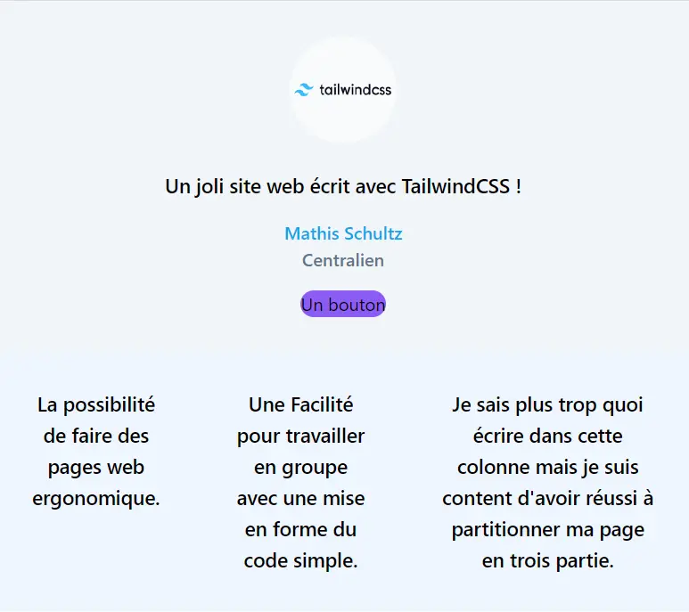
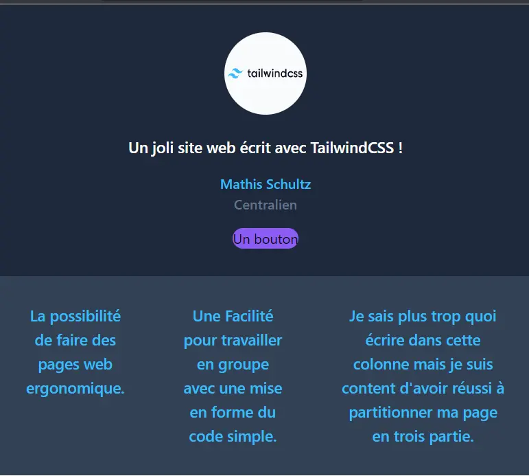
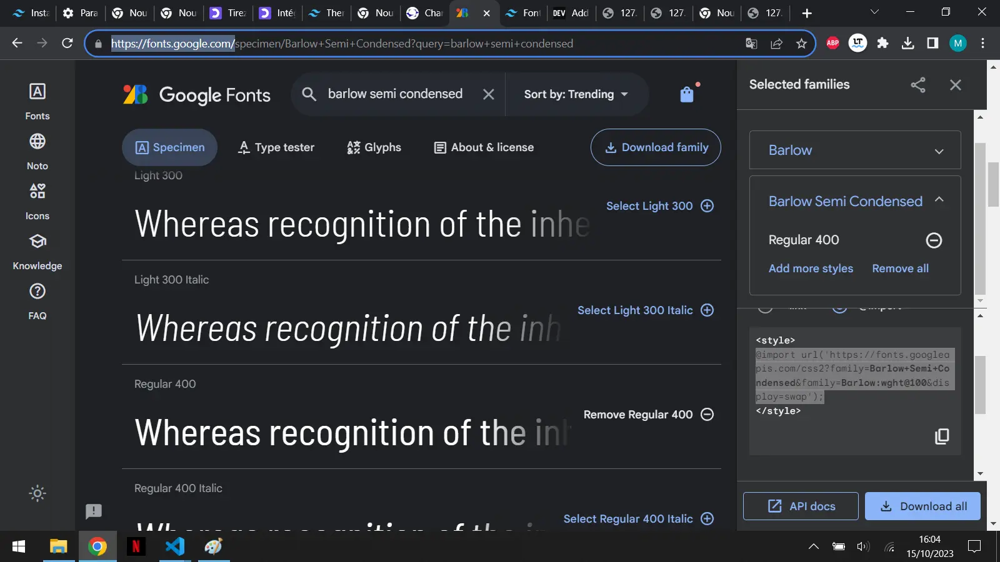
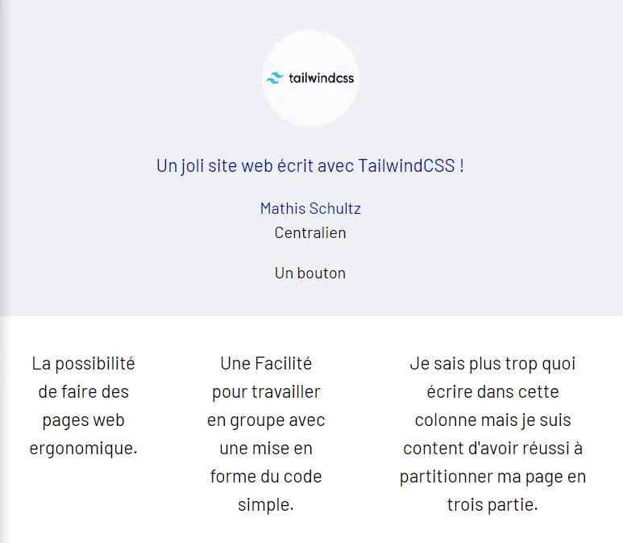
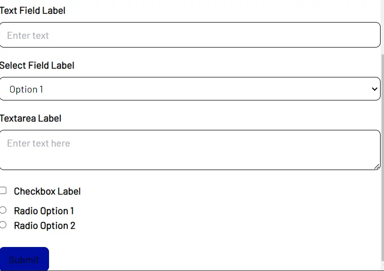

<h2 id="h1"> Introduction </h2>

Le but de ce MON est de réaliser une première page à partir de [TailwindCSS](https://tailwindcss.com/).

Mon précédent MON détaille l'installation de l'environnement de travail, ainsi le code que je vous partage ne peut fonctionner sans réaliser préalablement l'installation.

<h2 id="prerequis"> Prérequis </h2>

Avant de s'intéresser à TailwindCSS, il est important de se former au langage html et au langage CSS, je vous renvois vers mon MON précédent qui donne des ressources pour apprendre le HTML/CSS et pour installer un environnement de travail.

<h2 id="toc"> Table des matières </h2>

- [Introduction](#h1)
- [Prérequis](#prerequis)
- [Table des matières](#toc)
- [Une première page](#h2)
- [Choisir son style](#h3)
- [Un questionnaire](#h4)
- [Outils complémentaires](#h5)
- [Conclusion](#h6)
- [Liens utiles](#liens)

<h2 id="h2"> Une première page </h2>

Le but de ce paragraphe est de faire la mise en page d'une première page web, établir quelques éléments à placer ainsi que de partitionner la page.



Image du site sur fond clair

Il est facile de passer d'un site clair à un site sombre ! il suffit pour de définir les couleurs à utiliser en dark mode, dans mon cas, vu le peu d'élément j'ai défini individuellement les couleurs à utiliser pour le mode sombre et pour le mode clair mais il est possible de modifier le fichier tailwind.config.js pour que les modifications opère sur l'ensemble du site.

Voici le résultat en ajoutant simplement "dark:text-bleu" ou "dark:bg-slate-100" pour modifier le text ou le fond en mode sombre.



Image du site sur fond sombre

<h2 id="h3"> Choisir son style </h2>

Le but de ce paragraphe est d'expliquer comment choisir sa charte graphique afin de construire sa page web. Pour cet exemple on va utiliser la charte graphique de Centrale.

1. Choisir ses couleurs

Choisir des couleurs est extrêmement simple avec TailwindCSS, il suffit de ce rendre dans le dossier tailwind.config.js et de rajouter les couleurs que l'on souhaite utiliser dans le thème :

```js
/** @type {import('tailwindcss').Config} */
module.exports = {
  content: ['*.html'],
  theme: {
    colors: {
      'bleu': '#000f9f',
      'gris': '#4d5f80',
      'gris_claire': '#eff0f4',
    },
    extend: {},
  },
  plugins: [],
}
```

Ici, j'ai implémenter le bleu de Centrale ainsi que les deux gris majoritairement utilisé.

2. Choisir des typographies :

Il existe plusieurs méthodes pour ajouter des typographies :

- la première possibilité est de télécharger la charte graphique de centrale avec des fichiers au formats ttf et de réaliser un certain nombre d'opérations, voici le lien d'un tutoriel pour détailler cette méthode [tuto](https://dev.to/thomasvanholder/add-a-custom-tailwind-css-fonts-to-your-website-1nn6) : il faut lire la section 1.b pour effectuer cette démarche.

- La seconde méthode qui me semble plus simple, qui propose beaucoup plus de typographie et sans avoir besoin de retrouver la charte de centrale est d'utiliser le site [fonts.google.com](https://fonts.google.com/). Voici la démarche à suivre :
- utiliser la barre de recherche pour trouver sa typo
- choisir plusieurs typo sur le site et cliquer sur le petit "+"
- un bandeau s'affiche, en cliquant sur import un code apparaît entre deux balises < style>, il faut copier le code entre les balises pour venir le coller dans le fichier input.css



Image du site permettant de télécharger les typographie

- transformer votre fichier input.css : coller le @import de votre presse-papier puis rajouter les lignes concernant le layer.

```css
@import url('https://fonts.googleapis.com/css2?family=Barlow+Semi+Condensed&family=Barlow:wght@100&display=swap');
@tailwind base;
@tailwind components;
@tailwind utilities;

@layer base {
    html {
        font-family: Barlow;
    }
}
```

- Enfin, la dernière étape consiste à ajouter le code suivant au fichier tailwind.config.js :

```js
    fontFamily: {
      'custom': ['Barlow'],
    },
```

Voilà le résultat avec la charte de Centrale : une typographie Barlow et les nuances de bleus et de gris :



Image du site avec la charte de Centrale

<h2 id="h4"> Un questionnaire </h2>

L'idée de cette partie est de développer les différents outils pour mettre en forme un questionnaire.
L'objectif est d'avoir :

- Un champ à remplir
- Une question à choix multiple
- Une case à cocher
- Un bouton soumettre

Cette partie ne propose pas de mettre en oeuvre la partie Java, ainsi bien que les boutons ou case puissent être rempli, il n'y a que la forme qui n'est créé.

**Un champ à remplir**

```html
<div class="mb-4">
          <label for="inputField" class="block text-gray-700 font-bold mb-2">Text Field Label</label>
          <input
            type="text"
            id="inputField"
            name="inputField"
            class="w-full px-3 py-2 border rounded-lg text-gray-700 focus:outline-none focus:border-blue-500"
            placeholder="Enter text"
          />
        </div>
```

**Une question à choix multiple**

```html
<div class="mb-4">
          <label for="selectField" class="block text-gray-700 font-bold mb-2">Select Field Label</label>
          <select
            id="selectField"
            name="selectField"
            class="w-full px-3 py-2 border rounded-lg text-gray-700 focus:outline-none focus:border-blue-500"
          >
            <option value="option1">Option 1</option>
            <option value="option2">Option 2</option>
            <option value="option3">Option 3</option>
          </select>
        </div>
```

**Une case à cocher**

```html
<div class="mb-6">
          <label class="block text-gray-700 font-bold mb-2">
            <input type="checkbox" class="mr-2 leading-tight" /> Checkbox Label
          </label>
          <label class="block text-gray-700 font-bold">
            <input type="radio" class="mr-2 leading-tight" name="radioGroup" value="radioOption1" /> Radio Option 1
          </label>
          <label class="block text-gray-700 font-bold">
            <input type="radio" class="mr-2 leading-tight" name="radioGroup" value="radioOption2" /> Radio Option 2
          </label>
        </div>
```

**Un bouton soumettre**

```html
        <div class="flex items-center justify-between">
          <button
            type="submit"
            class="px-4 py-2 bg-blue-500 text-white rounded-lg hover:bg-blue-600 focus:outline-none focus:bg-blue-600"
          >
            Submit
          </button>
        </div>
```



Image du site avec un questionnaire simple

<h2 id="h5"> Outils complémentaires </h2>

Ce qui est difficile lorsque l'on souhaite apprendre un nouveau langage (HTML ou CSS) est de connaître les fonctions afin de pouvoir réaliser notre site, il est donc nécessaire d'expérimenter, de découvrir des fonctionnalités même si elle ne servent pas encore. Il faut comprendre la structure. Pour cela je recommande donc d'utiliser différentes ressources :

- [Open Classroom](https://openclassrooms.com/fr/courses/1603881-creez-votre-site-web-avec-html5-et-css3) qui permet de comprendre les structures de page web ainsi que les bases de mise en forme. Cet outil incontournable permet de fixer des notions et de donner des idées pour que votre site ait une architecture fiable. Maîtriser HTML5 et CSS3 est un prérequis presqu'indispensable pour construire dans de bonnes conditions.
- [Chat GPT](https://chat.openai.com/) va permettre d'aller vite, de trouver facilement des solutions pour des fonctionnalités. Il ne pourra pas créer un bel ensemble homogène mais il va rapidement vous donner accès au code pour réaliser un bouton, l'arrondir, le centré, il pourra faciliter grandement la mise en page. Et si vous trouvez par la suite une meilleure solution il suffira de remplacer ce code par le votre. En somme l'intérêt comme toujours de chat GPT est de gagner du temps bien qu'il ne réalise pas complètement votre mission et qu'il produise régulièrement des choses à côté de la plaque.

<h2 id="h6"> Conclusion </h2>

Tailwind permet facilement de définir l'environnement graphique de notre site internet, ce n'est pas la seule solution disponible sur le marché, bootstrap est très répandu aussi.

<h2 id="liens"> Liens utiles </h2>

- [Open Classroom](https://openclassrooms.com/fr/courses/1603881-creez-votre-site-web-avec-html5-et-css3)
- [Chat GPT](https://chat.openai.com/)
- [TailwindCSS](https://tailwindcss.com/)
- [fonts.google.com](https://fonts.google.com/) : télécharger des typographie
- [tuto](https://dev.to/thomasvanholder/add-a-custom-tailwind-css-fonts-to-your-website-1nn6) : pour installer les typographies.