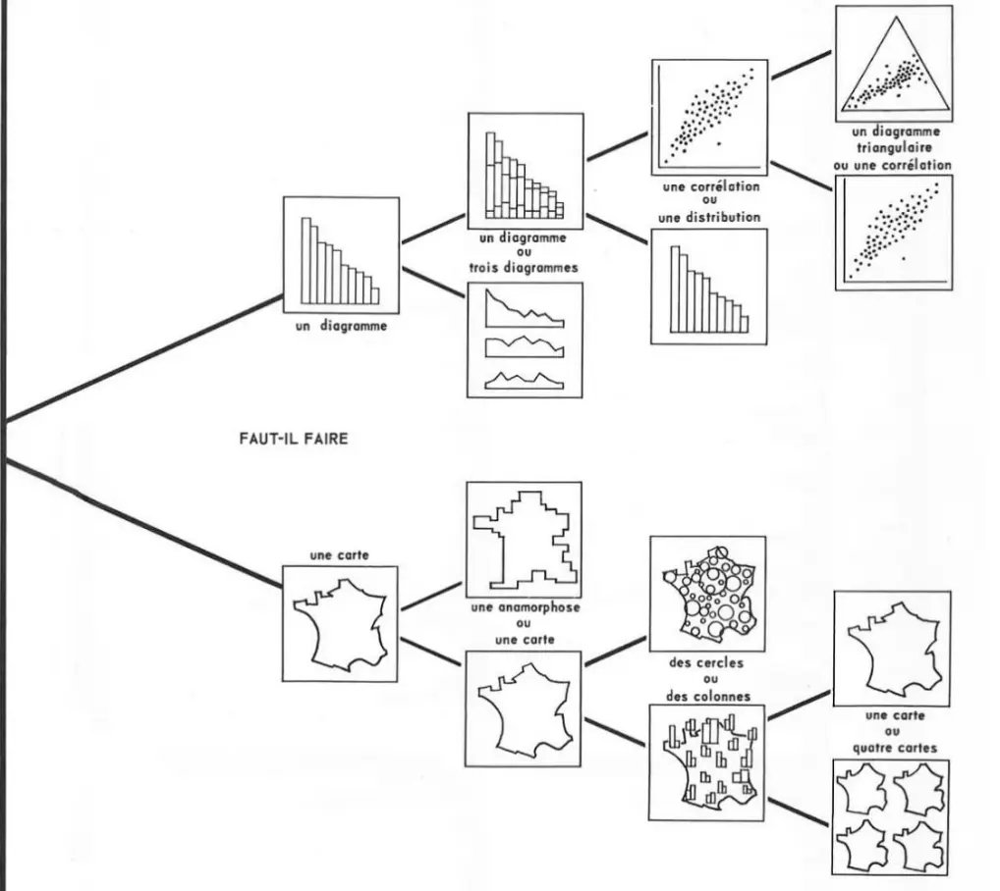
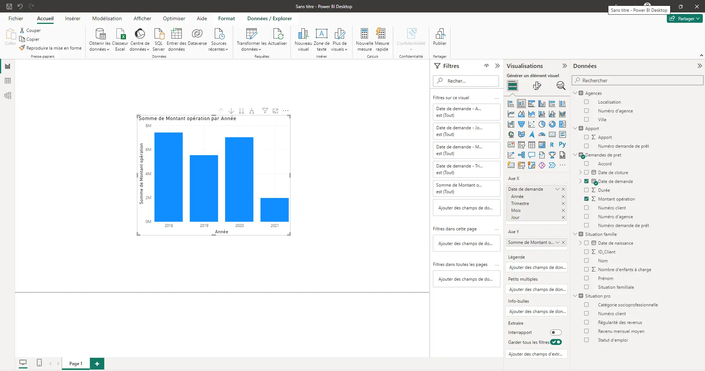
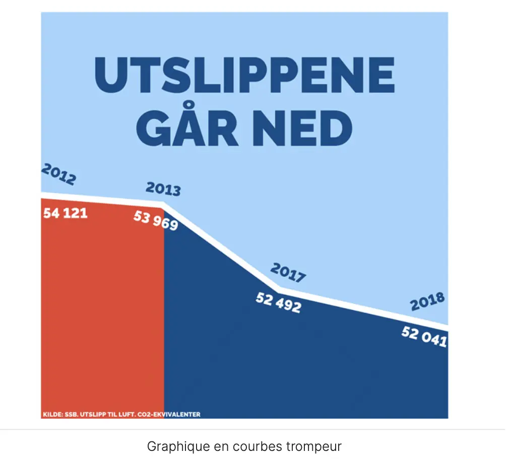
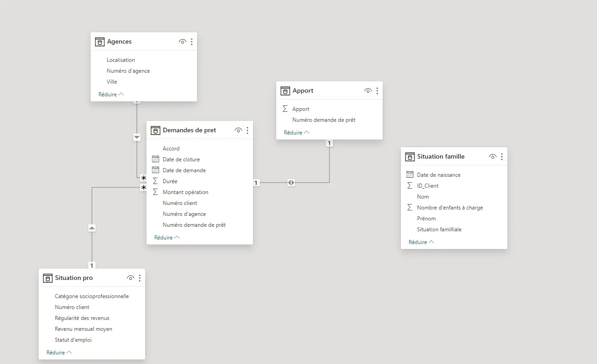
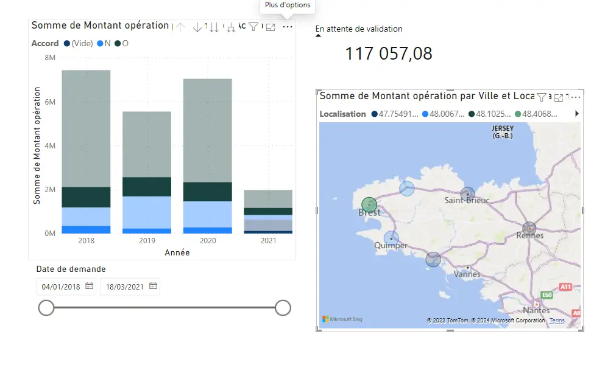
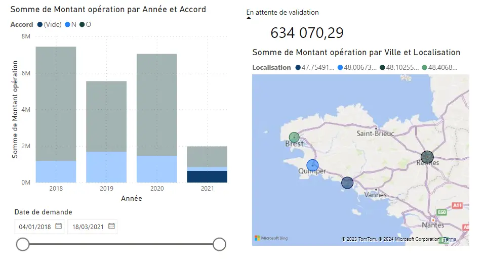

<h2 id="h1"> Introduction </h2>

**Qu'est-ce que la data visualisation ?**

La data visualisation est l'utilisation de représentations graphiques de données, interactives ou statistiques, pour amplifier les processus cognitifs (attention, compréhension, mémorisation)

**Qu'est-ce que la Business Intelligence ?**

La Business Intelligence (BI) combine analytique métier, data mining, visualisation de données, outils et infrastructure de gestion des données et meilleures pratiques pour aider les entreprises à prendre des décisions basées sur les données. En pratique, on parle de BI lorsque vous disposez d'une vue d'ensemble des données de votre entreprise et utilisez ces données pour favoriser le changement, gagner en efficacité et vous adapter aux évolutions du marché.
*Elle englobe donc la data visualisation afin de répondre à un besoin plus globale : celui de la prise de décision.*

**Un peu d'histoire**

**Jasques Bertin**, il n'est pas le premier à avoir réalisé une carte ou un graphique bien évidemment, mais son ouvrage "**Sémiologie Graphique**" pose de nombreuses bases sur les choix qu'il est nécessaire de prendre afin de pouvoir transmettre plus facilement de l'information. Son ouvrage est une aide à la décision et à la compréhension de représentation graphique. Il défini l'utilisation des symboles, types de graphique ou encore couleur afin d'insister sur un point ou un autre.

*Image tiré du livre Sémiologie Graphique*

Le but de ce MON est donc de répondre à la question : *Comment construire un tableau de bord pertinent ?*

<h2 id="h1bis"> Exploitation des ressources </h2>

Pour réaliser ce MON, j'ai voulu m'intéresser aux enjeux de la représentation de données et étudier le processus pour élaborer un tableau de bord.

Parmi les ressources utilisés, Chacune m'a apporté des informations concrètes sur les enjeux de la données. Celle qui m'a apporté le plus est le cours d'**Open Classroom**, en effet, il détail les enjeux et les risques, donne des exemples pertinents et rajoute un peu de manipulation de Power BI. 

<h2 id="toc"> Table des matières </h2>

- [Introduction](#h1)
- [Exploitation des ressources](#h1bis)
- [Table des matières](#toc)
- [Risques associés](#h2)
- [Mise en place](#h3)
- [Exemple d'utilisation](#h4)
- [Conclusion](#h6)
- [Liens utiles](#liens)

<h2 id="h2"> Risques associés </h2>

Dans ce paragraphe je vais vous présenter les risques associés au management de données ainsi que les méthode à mettre en oeuvre afin de les minimiser.

Régulièrement des cyberattaques ont lieu sur des entreprises de toutes tailles et de tout secteur : finance, distribution, service internet, site de rencontre...  

Le but de toutes ces attaques est souvent le même (hors conflit internationaux) : obtenir de l'information et l'échanger contre de l'argent. Pour cela le but de l'attaque va être d'accéder aux données et d'être capable de les exploiter. Cependant, il existe des moyens de limiter les risques :

**Sécurisation**

- Utiliser des mots de passe sécurisés.
- Mettre en place une gouvernance autour de la gestion des données.
- Revoir fréquemment les accès et habilitations aux données.
- Auditer les prestataires et partenaires ayant accès à vos données, sur leurs systèmes de conformité.
- Chiffrer les données sensibles afin de limiter leur accès.
- Anonymiser.

**Conservation**

- Ne pas conserver les données personnelles au-delà des limites légales (entre 2 et 5 ans en fonction des données, selon le Règlement général pour la protection des données : le RGPD).
- De façon générale, supprimer les données dont vous n’avez plus besoin.

**Information**

- Informer les utilisateurs sur leurs droits de consultation et de modification des données, ainsi que sur les traitements réalisés sur leurs données (opérations, destinataires, durée de conservation, etc.).
- Informer également les relais à la protection des données dans votre entreprise.

<h2 id="h3"> Mise en place </h2>

Afin de mettre en place un tableau de bord, il est nécessaire de suivre une démarche précise afin d'obtenir un résultat pertinent pour le client, voici quelques points important de la démarche :

**Rencontrer les utilisateurs finaux**
Il est nécessaire d'aller rencontrer les utilisateurs finaux :

- La façon dont ils travaillent au quotidien.
- Comment votre projet peut servir leur besoin.
- Ainsi, on est sûr de partir du bon pied !

**Réunir les parties prenantes**
Organiser un atelier de cadrage avec les représentants de chacun des groupes d‘utilisateurs et le client, il est nécessaire de cadrer les travaux avant de les démarrer.

L’objectif est de s’assurer que l’ensemble du groupe est aligné sur :

- Le périmètre du projet.
- Les critères de succès.
- L’organisation du projet.
- Le planning.

**Réaliser des User Stories**
Le but de la user storie va être d'identifier les besoins de chacun, ainsi que les raisons pour lesquels ils en ont besoin.

**Aider à se projeter via des illustrations**
Le but est de présenter des dashboard similaires aux clients afin qu'ils puissent imaginer à quoi ressemblerait la solution pour eux. En effet, la plupart des collaborateurs n'ont jamais vu de dashboard et il faudra les aider à l'imaginer.

**Prototyper la solution avec un wireframe**
Le wireframe (ou plus simplement une maquette) va permettre de dessiner l'ébauche du tableau de bord. Cette étape permet en collaboration avec le client de proposer une solution qui leur est adapté et qui est ergonomique pour leurs différents cas d'utilisation. Le but de cette maquette va être de répondre aux besoins identifiés dans les users stories.

**Fixer des étapes de réalisation du tableau de bord**
Comme dans tout projet, il est important d'éviter l'effet tunnel. Il est donc nécessaire de fixer des étapes avec des rendus pour la réalisation du dashboard.

<h2 id="h4"> Exemple d'utilisation </h2>

Le but de ce paragraphe est de construire un dashboard. Pour cela, je vais utiliser la version gratuite de Microsoft Power BI Desktop qu'il est possible de télécharger en allant sur le Microsoft Store. Les données que je vais utiliser pour la visualisation sont celle du cours d'[Open Classroom](https://openclassrooms.com/fr/courses/7110891-realisez-des-dashboards-avec-power-bi).

Voici un aperçu de Power BI :

Au centre on retrouve le tableau de bord, c'est à dire les données que l'on souhaite visualiser.
Sur la droite on retrouve 3 choses :

- Les filtres qui permettent d'affiner ce qui est affiché :
  - Choisir une année en particulier.
  - Choisir à partir d'un seuil.
- La visualisation qui permet de mettre en forme les données sélectionnées
  - Choisir le type de graphique : histogramme, camembert...
  - Choisir les axes.
- Les données qui sont sélectionnées dans chacune des différentes bases
  - Il suffit de faire glisser les données sur l'axe qui nous intéresse.

**Quelques exemple de pièges**
Les exemples suivants sont ceux d'Open Classroom :

Lorsque l'on observe le graphique on peut avoir l'impression que la majorité des gens sont pour la légalisations de la marijuana, cependant cela est du au fait que les proportions ne sont pas respecté.

Rien ne laisse paraître de problème dans ce graphique, le partie conservateur norvégien semble avoir tenue la promesse de diminuer les émissions CO2. Cependant, les années 2014-2016 ne sont pas représentés, et les émissions étaient plus élevés sur cette période.

**Comment éviter les pièges**
Voici quelques questions à se poser afin de limiter les pièges de la représentation graphique :

*Quoi* : Quelles sont les données que votre utilisateur souhaite visualiser ?
En fonction de celles-ci, vous ne vous choisirez pas le même type de visualisation.

*Pourquoi* : Pourquoi votre utilisateur souhaite visualiser ces données ?
Cette question a une incidence forte sur le choix de la visualisation et l'interaction que vous devez mettre en place. Souhaite-il identifier une tendance ? des corrélations entre des variables ? rechercher une valeur particulière ?

*Comment* : Enfin, demandez-vous comment présenter les données à votre utilisateur.
Souhaite-t-il les afficher triées ? filtrées ?
Souhaite-t-il afficher tous les points de données, ou les agréger dans des groupes de valeurs ?

**Les différents types de représentation**
Power BI propose bien évidemment les graphiques classiques que l'on retrouve sur excel : nuage de points, camembert...
Cependant, pour aller plus loin, il est possible d'utiliser les graphiques qui sont créés par la communauté : diagramme gant, nuages de mots...

**Autres outils de Power BI**
Power BI propose un ensemble d'outil afin de faciliter son utilisation, par exemple, lorsque l'on importe des données, Power BI propose le diagramme relationnel de cette base de données. Cela permet de savoir facilement comment il fait le lien entre les données.

Power BI propose pour son tableau de bord une dynamique complète : en effet, lorsque l'on interagie avec un graphique cela se répercute sur les autres, et permet donc de visualiser facilement des données spécifiques. Cela est comparable à un système de filtre mais qui permet une interaction intuitive avec l'utilisateur sans avoir à aller écrire des requêtes de filtres.

Par exemple ici, j'ai cliqué sur la ville de Brest, cela va mettre à jour les autres graphiques :

- Pour le graphique des sommes de montant, ce qui ne correspond pas à Brest va être mis en transparence.
- Le montant "en attente de validation" est mis à jour.
- La ville de Brest est légèrement plus visible que les autres sur la map (ce paramètre est réglable)

Sur cet extrait, j'ai cliqué sur les accords "vide" du diagramme donc ceux en attente. Cela met en avant les villes dans lesquels il y a des prêts en attente.

**Défauts de Power BI**
Voici quelques défauts que j'ai pu remarqué lors de mon utilisation de Power BI :

- La version gratuite a des limites : il est difficile d'accéder aux ressources gratuites sans avoir de mail professionnel.
- Le logiciel ne met pas en avant les étapes de traitement des données : le nettoyage et la collecte sont possible mais moins intuitif que le reste.
- Les fonctions et filtres sont complexes et permettent de réaliser un ensemble de requête SQL très poussé, cependant les filtres mis en avant ne sont pas toujours exactement ceux que l'on imagine.

N'ayant pas eu l'occasion d'essayer d'autre logiciel de création de tableau de bord je ne peux pas émettre de recommendation particulière.

<h2 id="h6"> Conclusion </h2>

Les outils de tableau de bord sont pertinent pour l'étude de données, ils apportent une ergonomie d'utilisation que ne possède pas d'autres logiciel (excel notamment) puisqu'il permet de faire des interaction dynamique là ou excel se contente de réaliser une seule fois le graphique.

Ainsi, afin de construire un tableau de bord efficace, il est nécessaire de prendre des précautions :

- S'assurer de bien comprendre les besoins clients.
- Respecter les enjeux de sécurités liés à l'utilisation de données.
- Vérifier que les données sont propres, juste et dans un formatage pertinent
- Choisir les bons indicateurs et les présenter de manière ergonomique.

Je trouve que Power BI est une vraie révolution en terme de manipulation de données comparé à ce que l'on nous habitue à faire sous excel et de ce qu'on nous enseigne à faire avec python. J'admet qu'en théorie Python apporte plus de liberté et permet d'aller plus loin dans l'exploitation de la donnée.

L'ergonomie et la simplicité d'utilisation de Power BI permette d'aller vite et d'obtenir des résultats présentable. Le vrai défaut de ce genre de logiciel est qu'il met moins en avant les requêtes utilisées, en effet, il est plus difficile de savoir précisément ce qu'affiche Power BI. De plus ce logiciel ne permet pas l'apprentissage de SQL et de l'analyse de données en générale.

<h2 id="liens"> Liens utiles </h2>

["Semiologie Graphique" de Jacques Bertin](https://visionscarto.net/la-semiologie-graphique-a-50-ans)

["Visualization Analysis Design" de Tamara Muzner](https://www.amazon.fr/Visualization-Analysis-Design-Tamara-Munzner/dp/1466508914)

[Organisation performante](https://www.organisation-performante.com/construire-un-tableau-de-bord-en-5-questions/)

[Dashboard PowerBI](https://openclassrooms.com/fr/courses/7110891-realisez-des-dashboards-avec-power-bi)

[Autre ressource intéressante](https://jujotte.fr/blog/la-data-visualisation-ou-lart-de-la-representation)
