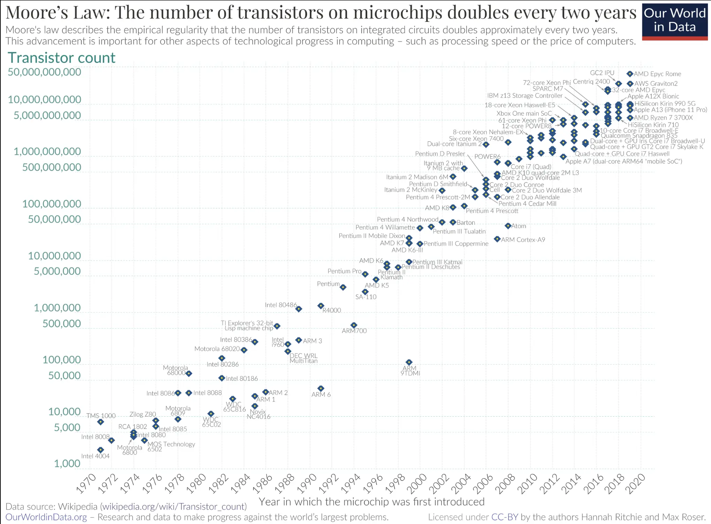

<h2 id="h1"> Introduction </h2>

L'objectif de ce MON va être d'étudier les différents composants électroniques et les différentes technologies possible pour continuer à innover dans le secteur de l'électronique. Pour comprendre les marges de manœuvre, ainsi que les enjeux vis-à-vis des nouvelles technologie comme l'IA. Comment faut-il repenser ces structures ?

<h2 id="toc"> Table des matières </h2>

- [Introduction](#h1)
- [Un peu d'histoire](#h2)
- [Ordinateurs Quantiques](#h3)
- [Supraconducteur](#h4)
- [Germamène](#h5)
- [Enjeux écologique](#h6)
- [Conclusion](#h7)
- [Liens utiles](#liens)

<h2 id="h2"> Un peu d'histoire </h2>

Les découvertes de scientifiques tels que André-Marie Ampère, Michael Faraday et James Clerk Maxwell au XIXe siècle ont jeté les bases de la théorie électromagnétique, reliant les phénomènes électriques et magnétiques.
L'invention du transistor en 1947 par William Shockley, John Bardeen et Walter Brattain chez les Bell Laboratories a marqué un tournant majeur dans l'histoire de l'électronique. Le transistor a remplacé les encombrants et fragiles tubes à vide par des dispositifs beaucoup plus petits, plus fiables et plus économes en énergie.
Les dernières décennies du XXe siècle et le début du XXIe siècle ont été marquées par une révolution numérique sans précédent, caractérisée par l'émergence d'Internet, des smartphones, des ordinateurs personnels et d'une multitude d'autres dispositifs électroniques omniprésents dans la vie quotidienne.

Les capacités de calcul des processeur évolue très vite, avec une règle semi-logarithmique. Repoussant les limites physiques années après années. Les épaisseurs de gravure sont actuellement de 10nm, avec des recherches pour atteindre les 2nm.

<h2 id="h3"> Ordinateurs quantiques </h2>

Un processeur classique utilise des bits pour effectuer ses opérations. Un ordinateur quantique utilise des qubits pour exécuter des algorithmes quantiques multidimensionnels.

**Superfluides**
Votre ordinateur de bureau utilise probablement un ventilateur afin d'être suffisamment froid pour pouvoir fonctionner. Nos processeurs quantiques doivent être très froids – environ un centième de degré au-dessus du zéro absolu. Pour y parvenir, nous utilisons des superfluides surfondus pour créer des supraconducteurs.

**Supraconducteurs**
À ces températures ultrabasses, certains matériaux de nos processeurs présentent un autre effet de mécanique quantique important : les électrons se déplacent sans résistance. Cela en fait des "supraconducteurs". 

Lorsque les électrons traversent les supraconducteurs, ils s'apparient, formant des « paires de Cooper ». Ces paires peuvent transporter une charge à travers des barrières, ou isolants, grâce à un processus connu sous le nom de tunnellisation quantique. Deux supraconducteurs placés de part et d'autre d'un isolant forment une jonction Josephson.

**Contrôle**
Nos ordinateurs quantiques utilisent des jonctions Josephson comme qubits supraconducteurs. En envoyant des photons micro-ondes sur ces qubits, nous pouvons contrôler leur comportement et les amener à conserver, modifier et lire des unités individuelles d'informations quantiques.

**Superposition**
Un qubit en lui-même n'est pas très utile. Mais il peut réaliser une chose importante : placer les informations quantiques qu'il détient dans un état de superposition, qui représente une combinaison de toutes les configurations possibles du qubit. Des groupes de bits quantiques en superposition peuvent créer des espaces de calcul complexes et multidimensionnels. Les problèmes complexes peuvent être représentés de nouvelles manières dans ces espaces.

**Intrication**
L'intrication est un effet de mécanique quantique qui corrèle le comportement de deux choses distinctes. Lorsque deux bits quantiques sont intriqués, les modifications apportées à l'un ont un impact direct sur l'autre. Les algorithmes quantiques exploitent ces relations pour trouver des solutions à des problèmes complexes.

Les ordinateurs quantiques fonctionnent avec différents algorithmes, ils présentent de nombreux avantages théoriques. La nécessité de moins d'énergie pour faire de plus gros calculs ou du moins des calculs difficile avec des ordinateurs classique. Cependant il reste beaucoup de travail pour développer d'une part les ordinateurs mais aussi des algorithmes qui soient performant et fiable.

Un des enjeux majeurs est celui de la supraconductivité, matériau essentiel à sa conception.

<h2 id="h4"> Supraconducteur </h2>

Les supraconducteurs, ces matériaux qui permettent de transmettre de l'énergie sans résistance (donc sans perte) se développe et ouvre de nouvelles perspectives. Le frein à son utilisation est que sa température de travail est proche du zéro absolu.

- Les circuits électroniques basés sur des supraconducteurs peuvent fonctionner avec une efficacité énergétique bien supérieure à celle des dispositifs conventionnels. Étant donné qu'ils n'ont pas de résistance électrique, ils ne dissipent pas d'énergie sous forme de chaleur lors de la circulation du courant électrique, ce qui réduit considérablement les pertes énergétiques.
- Les supraconducteurs peuvent transporter des courants électriques beaucoup plus élevés que les conducteurs classiques sans subir de perte significative d'énergie. Cela ouvre la voie à la conception de dispositifs électroniques capables de manipuler des courants très élevés, ce qui est particulièrement crucial pour les applications de puissance et de transmission d'énergie.
- Les supraconducteurs sont très sensibles aux champs magnétiques et peuvent être utilisés pour détecter de faibles champs magnétiques avec une sensibilité exceptionnelle. Cela trouve des applications dans des domaines tels que la magnétométrie, la détection d'imagerie par résonance magnétique (IRM) et la détection de champs magnétiques extraterrestres pour l'astronomie.
- Les supraconducteurs sont utilisés dans divers dispositifs d'imagerie, tels que les caméras infrarouges à haute sensibilité et les détecteurs de rayons X et de particules subatomiques. Leurs propriétés permettent la création d'images de haute résolution et de détecteurs ultra-sensibles pour des applications médicales, de sécurité et scientifiques.
- Les supraconducteurs sont l'une des plates-formes prometteuses pour la réalisation de qubits, les unités de calcul quantique. Leur capacité à conserver des états quantiques cohérents pendant de longues périodes de temps, ainsi que leur intégration dans des circuits électroniques, en font un candidat attrayant pour le développement d'ordinateurs quantiques à grande échelle.

**Un nouvel espoir ?**

Ces dernière années, les laboratoires de recherche travaille activement sur le sujet des supraconducteurs, ils ont trouvé des manière d'en obtenir à des températures plus élevés (15°C) cependant ne sont pas exploitable pour différentes raisons, notamment leur stabilité. Ainsi, la démocratisation de ce procédé n'est pas encore possible mais des découvertes régulière font avancer le sujet.

<h2 id="h5"> Germamène </h2>

Les isolants topologiques sont des matériaux ayant la propriété unique d'isoler l'électricité à l'intérieur tout en conduisant l'électricité le long de leurs bords. Les bords conducteurs permettent au courant électrique de circuler sans perte d'énergie. Contrairement aux matériaux normaux, où la dispersion aux défauts est autorisée, dans les isolants topologiques 2D, la dispersion des électrons aux défauts est interdite en raison du mécanisme de protection topologique unique. Par conséquent, le courant électrique dans les isolants topologiques 2D circule sans dissipation d'énergie, les rendant plus économes en énergie que les matériaux électroniques actuels.

Le germanène est un isolant topologique 2D de ce type, unique en ce sens qu'il est composé d'un seul élément. Pour créer ce matériau excitant, les chercheurs ont fondu du germanium avec du platine. Lorsque le mélange a refroidi, une fine couche d'atomes de germanium s'est arrangée en une structure en nid d'abeille au-dessus de l'alliage germanium-platine. Cette couche 2D d'atomes est appelée germanène.

Les chercheurs ont également découvert que les propriétés conductrices du matériau peuvent être "éteintes" en appliquant un champ électrique, une caractéristique unique pour un isolant topologique. Cette possibilité de passer entre les états "allumé" et "éteint" ouvre des perspectives passionnantes pour l'application du germanène, notamment la conception de transistors à effet de champ topologiques, qui pourraient remplacer les transistors traditionnels dans les dispositifs électroniques. Cela conduirait à des appareils électroniques qui ne chauffent plus.

<h2 id="h6"> Enjeux écologiques </h2>

Les nouvelles technologies proposes toujours plus, les systèmes tendent tous vers la numérisation et le cloud, pour dématérialiser et pour réduire l'utilisation des feuilles de papiers. Cependant, depuis l’essor de l'électronique, les émissions liés à ces technologies n'ont pas réduit d'une quelconque manière les émissions de CO2. En effet, les gains d'efficacité dans tous les domaines accélèrent trop le développement pour réduire les émissions. Aujourd'hui internet représente entre 2 et 4% des émissions directe de CO2eq selon les sources. le problème réside dans ces évolutions, en effet, stratégique aujourd'hui les investissement sont massifs dans ce secteur, et sa consommation double tous les 4ans. Les nouvelles technologie comme la 5G, les réseaux fibres 8Gb annoncé par Free ou Google consomme encore plus en temps qu'infrastructure mais ouvre surtout la porte à de nouvelles possibilité : le streaming 8K, qui nous parait inutile aujourd'hui comme l'était le HD 1080p il y a encore peu.  

- Consommation d'énergie : Les microprocesseurs nécessitent une quantité considérable d'électricité pour fonctionner. Cette demande énergétique peut contribuer à l'augmentation de la consommation globale d'énergie, ce qui peut avoir un impact sur les émissions de gaz à effet de serre et la disponibilité des ressources énergétiques.
- Épuisement des ressources : La fabrication des microprocesseurs nécessite l'utilisation de matériaux rares et précieux tels que le silicium, le cuivre, le gallium et le germanium. L'extraction et le traitement de ces matériaux peuvent entraîner une pression supplémentaire sur les écosystèmes locaux et contribuer à l'épuisement des ressources naturelles.
- Déchets électroniques : Les microprocesseurs sont souvent intégrés dans des produits électroniques qui finissent par devenir des déchets une fois qu'ils sont obsolètes ou cassés. La gestion inadéquate des déchets électroniques peut entraîner des problèmes environnementaux graves, tels que la pollution des sols et de l'eau par des substances toxiques présentes dans les composants électroniques.

<h2 id="h7"> Conclusion </h2>

Les nouvelles technologies et recherche offre un champs des possibles inimaginable, les évolutions promettent encore plus de capacité alors qu'on pensait encore atteindre les limites de l'imaginable. Cependant, il est nécessaire de questionner la pertinence de tels capacités, est-ce nécessaire d'aller au delà de 120 images par seconde ? d'avoir de la 8K pour les particuliers ? D'avoir un réseaux dimensionné pour stocker 30 fois la taille des données mondiales ? De construire de nouveaux data center pour des IAs qui génèrent des vidéos instagram ?

<h2 id="liens"> Liens utiles </h2>

[Germamène](https://phys.org/news/2023-05-material-paves-efficient-electronics.html)
[Thèses](https://www.theses.fr/?q=Supraconducteurs)