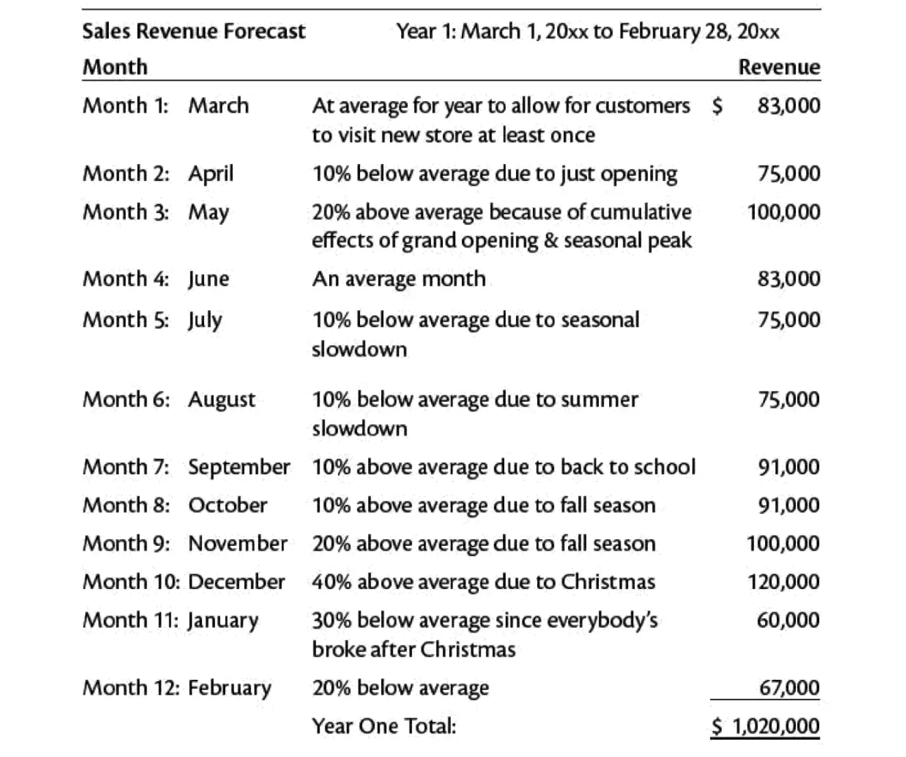

<h2 id="h1"> Introduction </h2>

L'objectif de ce mon est de s'intéresser à la réalisation de business plan, pour cela je vais m'appuyer le le cours d'[open classroom](https://openclassrooms.com/fr/courses/5191546-construisez-un-business-plan) qui traite de ce sujet. En parallèle je me suis plongé dans la lecture d'un [article](https://books.google.fr/books?hl=fr&lr=&id=FGx2DwAAQBAJ&oi=fnd&pg=PT14&dq=business+plan&ots=YSp_c8On9i&sig=2YkAObkRJy46Xq4t6Qk1tiWniGI&redir_esc=y#v=onepage&q=business%20plan&f=false) en anglais traitant de la manière d'aborder le business plan ainsi que les enjeux liés.

Ce Mon est pour moi le plus intéressant que j'ai réalisé car il s'écarte des connaissances abordé en cours et apporte un élément complémentaire d'un point de vue entrepreneurial sur le monde du travail. La lecture de l'article est extrêmement chronophage mais entraînante. L'auteur présente la rédaction de ce document comme un jeu dont j'ai présenté des points clés ci-dessous. Mettre à plat cet ensemble de notion que nous pouvons imaginer mais que nous ne concevons pas automatiquement bien m'a semblé pertinent pour l'apprentissage. Je pense même que des cours d’entreprenariat pourrait être un gros plus pour la filière Do_It puisque c'est à mon sens l'aboutissement du management et de la gestion de projet et cela permet même de mieux comprendre les préoccupation des personnes qui dirigent et par conséquent de mieux répondre à leur demande (dans le conseil notamment).

<h2 id="toc"> Table des matières </h2>

- [Introduction](#h1)
- [Définition](#h2)
- [Pourquoi écrire un business plan](#h3)
- [L'entrepreneur](#h4)
- [Les besoins du business](#h5)
- [Connaître le business](#h6)
- [Le mouvement du marché](#h7)
- [Étudier la rentabilité](#h8)
- [Financement](#h9)
- [Conclusion](#h10)
- [Liens utiles](#h11)

<h2 id="h2"> Définition </h2>

Un business plan est un document synthétique qui présente les tenants et aboutissant d'un projet.

<h2 id="h3"> Pourquoi écrire un business plan </h2>

Un business plan a plusieurs intérêts, tout d'abord il permet de prendre le temps de réfléchir aux enjeux du projet. De poser son esprit et d'avoir une approche plus objective. Il permet de décider s'il est bon ou non de continuer le projet.
Un avantage certain de posséder un tel document est de pouvoir lever des fonds. En effet, il est plus facile de convaincre des investisseurs lorsqu'un projet est bien détaillé et répond à toutes les questions plutôt qu'une simple idée. De plus, pour l'aspect financier, il permet de suivre l'argent, savoir où il est dépensé, et savoir où il est gagné.
La flexibilité du business plan permet d'essayer différents scénarios, en effet il est possible de se projeter en changeant des paramètres tels que des prédictions de ventes ou encore de chiffrer des amortissements. Le business plan permet d'anticiper, il résout en avance un certain nombre de problème qui aurait pu être des urgences, guide le projet même lorsqu'il est difficile de savoir où on en est.

<h2 id="h4"> l'entrepreneur </h2>

Il est nécessaire de se connaître pour monter une affaire. Identifier ses points forts et points faibles permet de comprendre les axes d'améliorations, et d'acquérir les connaissances nécessaire. Il est important de savoir pourquoi on veut monter une affaire, et si on est prêt à faire les sacrifices associés. De plus, cela permet de mettre en lumière des incohérences : ne pas aimer le contact avec le publique et en parallèle vouloir être le principal interlocuteur.

<h2 id="h5"> Les besoins du business </h2>

De la même manière que l’entrepreneur, il est nécessaire de lister les besoins du projet, que ce soit des besoins généraux (comptabilité) ou plus spécifique. Enfin, il va être nécessaire d'établir les objectifs du business.
Une fois qu'on a fait ressortir les différents besoins du business et de l'entrepreneur, il faut assurer leur cohérence, vérifier que notre profil match avec ce que l'on souhaite faire. De plus, il peut être intéressant de demander l'avis à quelqu'un d'honnête qui soit capable de nous dire si cela lui semble cohérent et qu'on ne s'est pas menti à soi-même.

<h2 id="h6"> Connaître le business </h2>

Il est important de connaître tous les aspects du business que l'on veut monter, savoir faire toutes les tâches élémentaires permet d'avoir une vision du business, d'être capable d'améliorer les processus et de proposer une affaire qui fonctionne. Il est intéressant d'aller questionner des entreprises similaires, ils partageront leurs expériences si vous ne leur faites pas directement concurrence (il est donc mieux de se renseigner dans d'autres villes). Découvrir les clés des succès ou échec de business similaire. Être capable d'identifier le besoin du consommateur, en effet le business doit répondre à un besoin. Ce besoin à une valeur pour le consommateur et il est important d'être capable de quantifier le besoin pour dimensionner le business. Des questions générales peuvent être utile :

- Qui sont les clients ?
- Quel problème résout mon projet ?
- Comment communiquer avec la cible ?
- Quel est le service/bien que je vends ?
- Quel besoin client je décide de ne pas remplir ?
- Quelle localisation ?
- Qui sont mes fournisseurs ?
- Qui sont mes employés ?
- Qui maîtrise les missions critiques (vente, sav, marketing) ?
- Quels sont les points forts et faiblesses des concurrents ?
- Qu'est-ce qui me différencie ?

<h2 id="h7"> Le mouvement du marché </h2>

Aucune entreprise ne peut perdurer sans évoluer. Tout d'abord parce que les technologies évoluent, certaines deviennent obsolète, ou simplement deviennent moins bon marché qu'elle ne l'était. D'autre entreprise coule à cause des goûts du consommateur. En effet, certaine marque qui était des icônes de mode un jour ont fondu parce que le consommateur en a décidé autrement. Il est essentiel de suivre les tendances, d'analyser ce qu'aime le client, de comprendre l'évolution de son besoin. Certain service sont parfois en avance sur leur temps : les casques de réalités virtuelles sont des nouvelles technologies qui ont mis du temps à se développer car cela n'intéressait pas le consommateur final.

<h2 id="h8"> Étudier la rentabilité </h2>

On peut construire des entreprises dans n'importe quel but : pour protéger l'environnement ? Les animaux ? Pour faciliter l'inclusion sociale ? Parce qu'on aime un sport ?  
Peut importe la raison, il y a toujours un critère financier qui revient : suis-je rentable ? Il n'est pas nécessaire de faire des millions si ce n'est pas l'objectif, mais travailler à perte ne permet pas de survivre. Il est indispensable de faire des prévisions financières avec différents scénarios.
Quelques estimations sont nécessaires :

- revenus des ventes : prévisions de rentrée d'argent (chaque semaine, mois)
- coûts fixes : eau, électricité, téléphone, loyer que l'on paie indépendamment des ventes.
- bénéfice par vente
- Le point de rentabilité : nombre de vente à partir du quel je suis rentable par semaines/mois.

Il faut être capable d'admettre qu'une idée n'est pas rentable si même les prévisions les plus haute ne mènent pas à la rentabilité.

Une fois qu'une étude complète avec des prévisions est faite, il est intéressant de faire d'autre prévision en changeant un facteur, cela jusqu'à trouver une solution qui soit rentable et qui satisfasse nos objectifs (il ne faudrait pas partir de l'idée d'un restaurant gastronomique pour finalement ouvrir un fast-food)

<h2 id="h9"> Financement </h2>

Le financement est une partie intéressante du projet, car il n'est pas réaliste de se lancer sans en avoir les moyens. Il est donc nécessaire de convaincre les banquiers ou investisseurs. Pour cela, certains critères peuvent jouer en notre faveur pour convaincre : 

- Avoir une expérience d'entrepreneur
- Monter un type de business qui marche ailleurs
- Avoir les moyens de survenir à l'imprévu
- Avoir un plan réfléchit

Cependant, les banques ne sont pas toujours les premières à investir dans un business, il existe d'autre moyen :

- Famille ou les amis
- Aide de l'état
- Financement participatif en ligne

L'intérêt de ces financements et tout d'abord de lever de première somme au près de gens qui sont prêt à vous aider, mais surtout, il est plus facile de convaincre un banquier de prêter une somme lorsqu'il y a déjà une somme sur la table. On obtient alors une plus grande capacité de prêt ou des meilleurs taux.

De plus, il peut être dangereux d'utiliser ses propres biens pour sécuriser un prêt. En effet, si vous ne rembourser pas suffisamment vite et que votre maison joue le rôle de garanti, vous pourriez être forcé de la vendre. Une fois de plus, bien estimer les coûts du business permet de limiter ce risque.

<h2 id="h10"> Conclusion </h2>

Dans l'ensemble le cours d'open classroom se complète bien avec l'article que j'ai utilisé, ce domaine me paraît encore très vaste et j'aurais bien aimé approfondir le sujet afin d'avoir une vision plus entrepreneurial du management.

<h2 id="h11"> Lien utile </h2>

[Open CLassroom](https://openclassrooms.com/fr/courses/5191546-construisez-un-business-plan)
[Business plan - Google Scholar](https://books.google.fr/books?hl=fr&lr=&id=FGx2DwAAQBAJ&oi=fnd&pg=PT14&dq=business+plan&ots=YSp_c8On9i&sig=2YkAObkRJy46Xq4t6Qk1tiWniGI&redir_esc=y#v=onepage&q=business%20plan&f=false)
