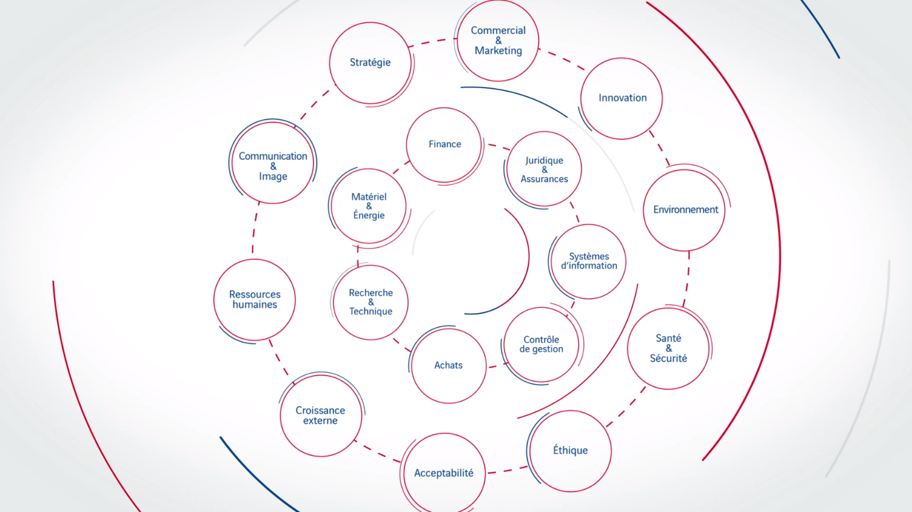
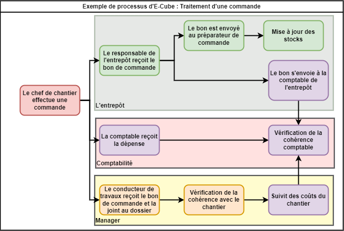

<h2 id="toc"> Table des matières </h2>

- [Table des matières](#toc)
- [Introduction](#h1)
  - [Quel est le rôle d'E-Cube](#h1-1)
  - [Approche utilisé](#h1-2)
- [Un outil habilitant](#h2)
- [Un outil coercitif](#h3)
- [Liens utiles](#liens)

<h2 id="h1"> Introduction </h2>

En temps qu'alternant au sein du groupe Eurovia, et pour mettre à profit mes connaissances préliminaires sur les systèmes d'informations, je vais vous proposer une analyse d'un système très complexe, opérationnel et en constante évolution.


Mon analyse n'est que préliminaire et ne permet pas de tirer de quelconque conclusion.


<h3 id="h1-1"> Quel est le rôle d'E-Cube </h3>

Le rôle d'E-Cube est de rassembler l'ensemble des outils informatiques qu'utilise Eurovia. Les intérêts sont variés et propre à chaque acteurs :

- faciliter les rapports de chantier.
- Aider la transmission d'information au service de comptabilité.
- Aider au management des équipes.
- ...

Le but de l'application est de faire le lien entre tous les outils de chaque acteurs.

  

*Différents acteurs au sein du groupe Eurovia*

**Voici un exemple d'application de la plate-forme E-Cube :**

Le but est d'analyser le trajet d'une donnée lorsqu'un chef de chantier effectue une demande de ressource pour son chantier. Voici un diagramme montrant le trajet et l'exploitation de la demande :

*Diagramme du traitement d'une commande*

*NB : Ce diagramme est sujet à modification au fûr et à mesure de mes découvertes*

<h3 id="h1-1"> Approche utilisé </h3>

Afin de débuter mon analyse, je me suis donc rapproché de mon tuteur et du service informatique du groupe. Les démarches sont longues et ne me donnent que peu d'accès mais permettent de visualiser l'intérêt de l'uniformisation de la donnée.
Pour des raisons de confidentialités lié à la publication du fonctionnement de l'application, mais aussi lié à mon statu d'apprenti qui ne me donne malheureusement pas un plein accès au code de l'application, les démarches pour accéder aux informations me prennent du temps, je n'aurai dans cette étude qu'un accès à une partie de l'interface utilisateur :

- accès aux fonctionnalités de chefs de chantier et de rapport
- accès aux fonctionnalités de conducteur de travaux
- accès à la documentation de la structure de l'application
- accès à l'interface Ressource Humaine

Cela ne représente que 3 des 17 acteurs en jeux dans le fonctionnement de l'application.

<h2 id="h2"> Un outil habilitant </h2>

Dans ce paragraphe nous allons nous intéresser aux différents bénéfices qu'apporte cette plateforme.  
Tout d'abord d'un point de vue globale cette application permet aux différents managers à différentes échelles de suivre les projets, leur avancement ainsi que leurs résultats.  
Cet outil favorise la reproductibilité, en effet, aujourd'hui lorsqu'Eurovia souhaite ouvrir une nouvelle agence il suffit de faire venir des collaborateurs qui sont déjà formé sur les outils, il y a une facilité pour changer de secteur puisque ces outils sont commun dans tout le groupe.  
Il y a une simplification de certain processus avec l'automation de certaines tâches : les bons de commandes qui sont directement transmis aux comptables des différents organisme avec une nomenclature uniformisé qui permet de faire le lien d'un organe à un autre.

<h2 id="h3"> Un outil coercitif </h2>

Le but de ce paragraphe est de mettre en lumière les aspects négatifs de cet outil.

**Un enjeu social**

Une transition difficile, en effet, cet outil a demandé un effort complémentaire pour prendre la main sur le système et être capable de réaliser les missions nécessaire.  
Une perte de lien entre les collaborateurs; l'efficacité qu'apporte ce système en transmettant automatiquement les documents vient réduire le nombre d’interactions. Par exemple les comptables ne devrons plus aller collecter les bons auprès des collaborateurs. Les échanges se limiteront aux cas où un problème surviendrait.  
La segmentation et l'automation de processus à tendance à réduire l'étendu de compétence de l'employé qui remplit le formulaire. En effet face à un choix limité, l'appel aux connaissances est plus restreinte.

**Un enjeu environnemental** 

La digitalisation et la dématérialisation des processus. L'utilisation de Cloud, de tablette ou autre support informatique en vue de dématérialiser à tendance à augmenter l'impact environnemental : en effet, ce type d'outil à pour objectif de maximiser les traces de chaque opérations, et ces traces sont conservés sur des durées infiniment trop longue. Il est possible de retrouver le bon de commande de l'utilisation d'un camion il y a plusieurs années sur un chantier achevé depuis longtemps.

**Un enjeu de design**

N'ayant pas encore eu d'accès très approfondi au système, je n'ai pas relevé de problème de design.

**Un enjeu économique**

D'un point de vue économique le système a tendance à optimiser les performances d'entreprise, cependant ce système s'installe comme une dépense mensuelle indispensable et éternelle pour l'entreprise, en plus du coût des outils numériques.

[Présentation vidéo de la plateforme](https://www.black-euphoria.com/work/r/what-is-ecube)
