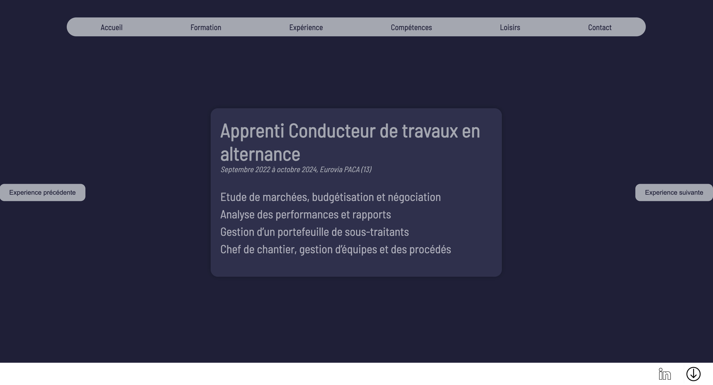
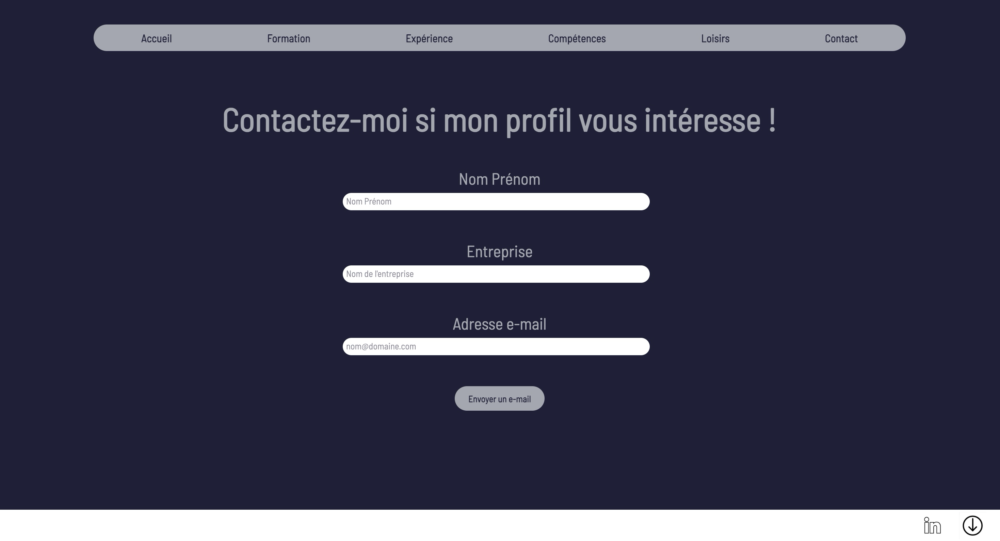
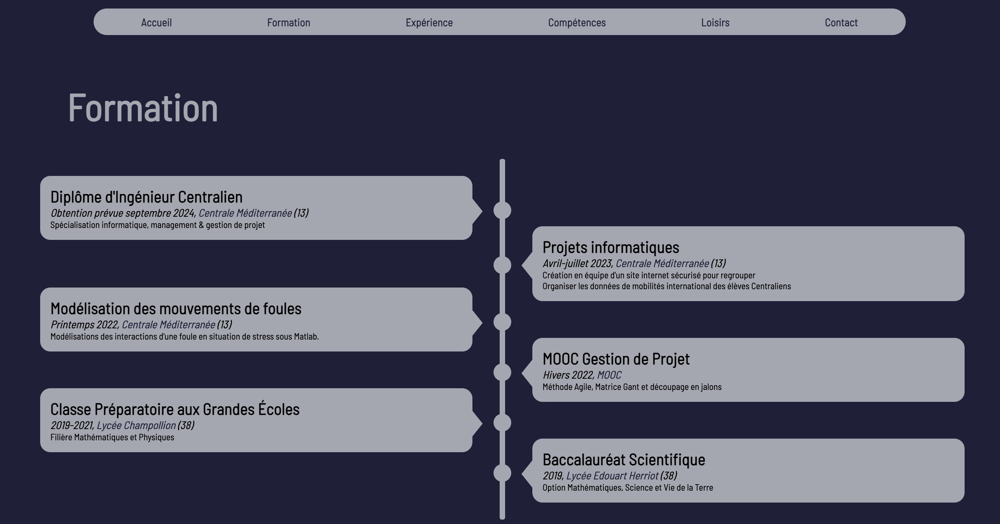
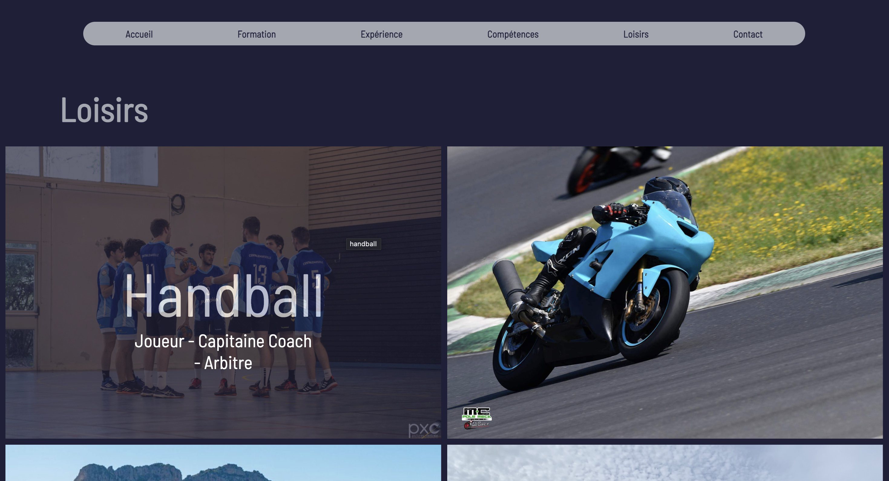

<h2 id="h1"> Introduction </h2>

L'intérêt majeur de ce CV interactif réside dans sa capacité à captiver l'attention. Mon but est de raconter mon histoire professionnelle de manière visuellement attrayante, et de démontrer mes compétences de manière pratique. je souhaite intégrer des animations pour mettre en avant mes capacités en développement web bien qu'elle soit plutôt basique. En vue de l'utilisation d'un CV intéractif, je ne souhaite faire que du front web. En effet, je ne vois pas l'intérêt de compléter avec une base de donnée le site web puisque je serai le seul à vouloir modifier les données du site.

Ayant échangé avec Agathe à propos de son POK pour créer un CV en ligne, J'ai constaté le travail qu'il est possible d'accomplir en 20h de POK : obtenir différentes pages web avec des dispositions réussi, une charte graphique homogène ainsi que des fonctionnalités comme l'envoie de mail pour être contacté. J'ai donc décidé, plutôt que de reproduire un travail semblable d'avoir comme point de départ son POK.

Mes objectifs sont donc les suivants :

- Reprendre la main sur son code et me l'approprier
- Rajouter des fonctionnalités : pouvoir télécharger mon CV pdf depuis le site
- Rajouter des animations pour mettre en lumière les expériences et formation via JavaScript
- Publier le site web pour qu'il soit consultable


Mon repository Github a pour vocation à vous être utile, n'hésitez pas à reprendre mon code pour faire votre CV en ligne, Ce serait un plaisir de savoir que mon code sert ne serait-ce qu'à une personne.


<h2 id="toc"> Table des matières </h2>

- [Introduction](#h1)
- [Table des matières](#toc)
- [Organisation des sprints](#sprint)
- [Sprint 1](#h2)
- [Sprint 2](#h3)
- [Conclusion](#h5)
- [Liens utiles](#liens)

<h2 id="sprint"> Organisation des sprints </h2>

**Sprint 1**

- Construire l'environnement de travail via Github
- S'approprier le travail d'Agathe : comprendre la structure du code html et des différentes fonctionnalités
- Adapter le CV avec mes propres expériences
- Publier le site web en ligne via Github 
- Créer un carroussel pour faire défiler mes expériences sans utiliser de librairie particulière.
- Ajouter la fonctionnalités pour pouvoir télécharger mon CV depuis mon site web.

**Sprint 2**

- Amélioration du carroussel : je souhaite une version plus esthétique
- Rédiger une aide à l'utilisation de mon code pour que d'autre puisse le reprendre et se l'approprier
- Tests au près de ma famille et de mes collocataires
- Une version Anglaise ? Cette fonctionnalité n'est pas très intéressante d'un point de vue développement mais peut avoir un vrai intérêt professionnel.

<h2 id="h2"> Premier Sprint </h2>

**Construction de l'environnement de travail**

La première étape a été de récupérer le code d'Agathe sur son repository Github. Cela m'a permis d'avoir une première base de travail pour ne pas refaire trop d'html et de CSS puisqu'elle avait déjà choisit la charte graphique et la structure du site. Cela m'a donc permis de me concentrer sur les fonctionnalités que je souhaitais rajouter.

**Apropriation du code**

La seconde étape a été l'appropriation du code. En effet, n'étant pas auteur du code il est nécessaire d'être capable de comprendre le code qui est déjà écris pour continuer à l'utiliser. Dans l'ensemble le code était très clair même si j'ai eu l'occasion de casser quelques fonctionnalités. Notamment au niveau de la mise en page que j'ai parfois renversé puisque le code ne s'adaptais pas toujours à différentes tailles de paragraphe. Les fonctions de positions CSS m'ont fait perdre pas mal de temps alors que j'aurais du finir de construire mes animations avant d'essayer de les corriger.

**Mettre à jour mes expériences**

Bien que le parcours d'Agathe soit très intéressant, il ne correspond pas tout à fait à mes expériences professionnelles. J'ai donc remplacé les différents paragraphes, photos et liens qui apparraissait. Cela m'a demandé un certain travail sur moi-même afin de choisir des expériences que je trouvais pertinentes. Je ne compte pas ce temps dans les 10h du POK puisque ce travail, bien que chronophage ne rentre pas tout à fait dans le cadre de mon projet. Cette partie a été celle qui m'a généré le plus de problème vis à vis du code d'Agathe puisque les mises en pages ne se sont pas toujours adapté à la taille de mes paragraphes ou de mes images. J'ai donc du me repencher sur le CSS. J'ai donc obtenu une version à jour du site d'Agathe avec mes propres informations.

**Publication du site**

Une fois que je m'étais approprié le code d'Agathe, que j'eu remplassé ces expériences par les miennes j'ai voulu publier le CV sur internet. Pour cela j'ai commencé par étudier le fonctionnement de pythonAnywhere qu'on avait utilisé l'an dernier durant le cours d'info2. Cependant, en faisant des recherches j'ai trouvé plus simple d'utiliser les fonctionnalités de incluse de Github qui ne nécessitait donc pas d'une application tierce. Ainsi, à la manière du site Do_It, j'ai utilisé les fonctionnalités gratuite de Github qui me permette de publier mon site web. Les caractéristiques de Github sont amplement suffisante pour moi puisque ce site n'a pas vocation à détroner Facebook.
En éditant ce site web, j'ai choisit de le rendre publique, visible par tous. Cependant des questions de vie privée se pose, quels informations est-ce que j'accepte de transmettre. Étant donnée que mon LinkedIn réduit déjà à néant ma vie privée je ne me suis pas longuement attardé sur cette question mais je tiens à rappeler l'importance de se poser la question des informations que l'on partage sur internet surtout lorsque l'on développe un site qui ne comporte aucune fenêtre de connexion. 

**Création du Carroussel**

Un carroussel (ou slider) permet de faire défiler des images ou paragraphes afin d'animer un site web. La mise en place de cet outil nécessite l'utilisation de JavaScript. Certaine bibliothèque notamment jQuerry permette de créer facilement des carroussels, cependant l'exercice de la faire en JavaScript Native est intéressant. J'ai donc choisit de le construire manuellement.

Les fonctions que j'ai utilisé sont donc celle pour :

- Afficher une expérience
- Construire la structure pour afficher la suivante ou la précédente
- Établir un timer pour un défilement automatique
- S'assurer que si l'on atteint le boût du carroussel on revienne au départ

Les difficultés liées à ce caroussel sont surtout portées sur la lisibilité, en effet il faut être sûr que la personne comprend qu'il fait face à un carroussel et donc qu'il doit faire défiler les pages. Cependant il doit avoir le temps de lire pour ne pas se battre contre le défilement. Trouver le temps idéal est assez difficile. J'ai donc choisit de mettre en avant des boutons de défilement pour simplifier la compréhension dans un premier temps.

Une amélioration que j'essaie de mettre en oeuvre est d'avoir l'expérience principale affiché au centre et d'avoir en fond les expérience flouté pour avoir une meilleure expérience utilisateur et un parcour plus fluide. Cette amélioration me permet de garder le code qui structure l'ordre de défilement des paragraphes mais m'impose de reprendre le reste. Cette amélioration est mon principal point de blocage. Je passe beaucoup de temps pour réussir ma mise en forme. Il est parfois difficile de savoir où travailler pour corriger mes problèmes : est-ce un problème d'html ? de CSS ? de JavaScript ? Une combinaison des trois ? Stackoverflow, ChatGPT ou encore les github mette beaucoup de ressource à disposition à propos des sliders, chacun utilise des méthodes ou bibliothèques différents, on y retrouve beaucoup de bonnes idées et on y gagne pas mal de temps pour obtenir les premières briques de construction, cependant je ne trouve pas exactement la fonctionnalité que je souhaite et je compose avec des assemblages de codes.

**Conclusion de Sprint 1**

Chaque étape me paraissait simple, effectivement les missions de mise en page, la création des animations, la publications et les intégrations sont individuellement simple. Cependant, le fait d'avoir du code legacy, d'avoir un temps de compréhension de ce code qui est court et de vouloir le modifier crée un ensemble de petite erreur qui se répercute. Je conseillerai à chacun de partir de zéro pour être complètement souverain de son code, le comprendre à 100%. Cependant, il est évident qu'en vue d'être efficace et d'obtenir rapidement des résultats il est plus simple de partir d'un code existant. Et je vous encourage à reprendre mon code, et à rajouter des fonctionnalités. 

**Rendu Intermédiaire**

  

<h2 id="h3"> Second sprint </h2>


Ce paragraphe n'est pas encore disponible


<h2 id="h5"> Conclusion </h2>


Ce paragraphe n'est pas encore disponible


<h2 id="liens"> Liens utiles </h2>

Dans cette partie vous retrouverez les différentes ressources utilisés pour construire mon POK, ainsi que les résultats obtenu pour pouvoir vous l'approprier.

- [Dépôt Github](https://github.com/schultzmathis/mon-cv)
- [Lien vers mon CV](https://schultzmathis.github.io/mon-cv/)
- [Lien vers le POK d'Agathe](../../../Agathe-Rabachou/pok/temps-1/)
- [Lien du Github d'Agathe](https://github.com/arabachou/CVInteractif)
