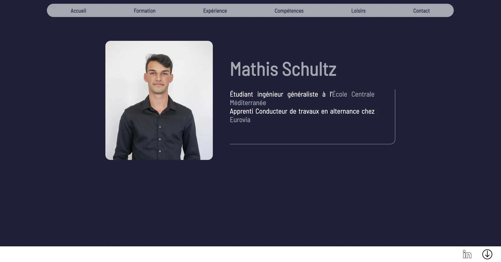
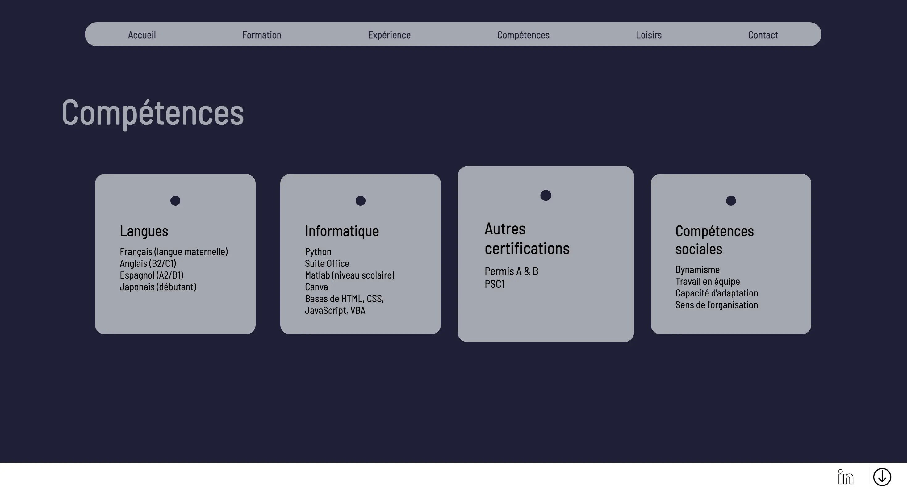
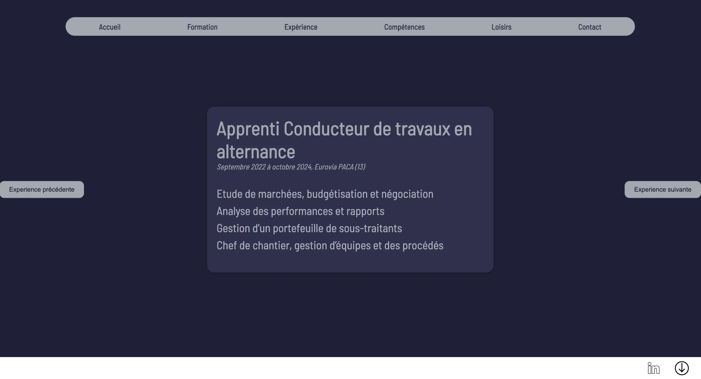
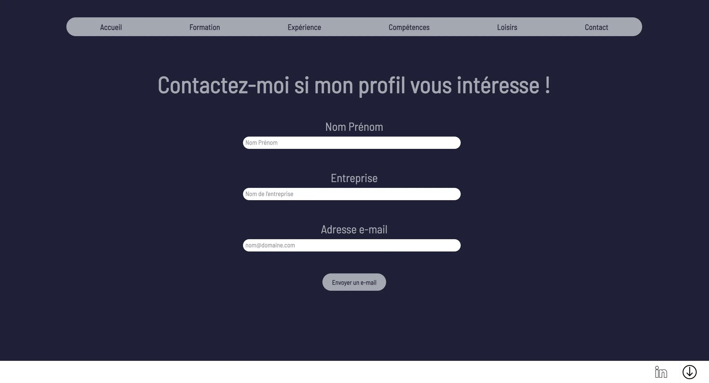
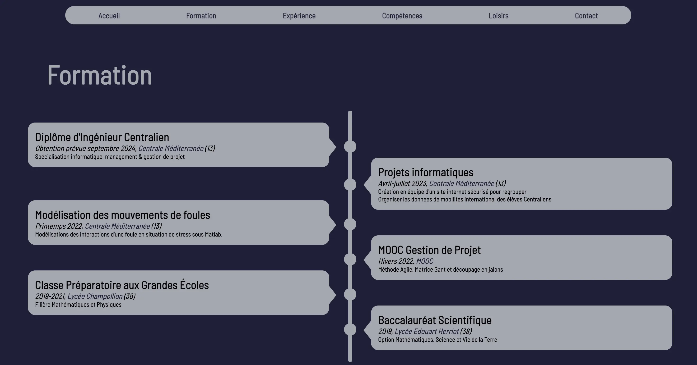
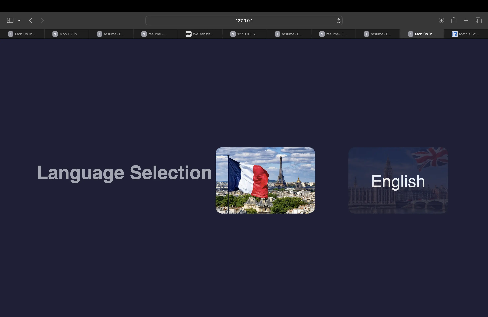
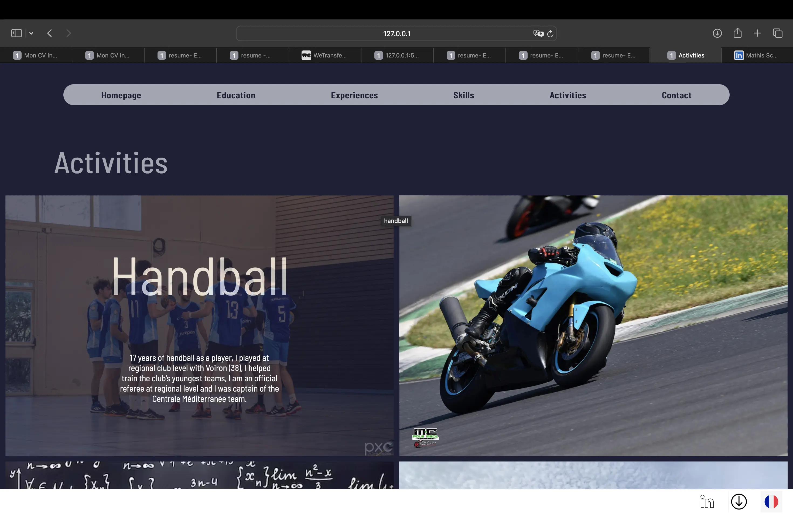

<h2 id="h1"> Introduction </h2>

L'intérêt majeur de ce CV interactif réside dans sa capacité à captiver l'attention. Mon but est de raconter mon histoire professionnelle de manière visuellement attrayante, et de démontrer mes compétences de manière pratique. je souhaite intégrer des animations pour mettre en avant mes capacités en développement web bien qu'elle soit plutôt basique. En vue de l'utilisation d'un CV intéractif, je ne souhaite faire que du front web. En effet, je ne vois pas l'intérêt de compléter avec une base de donnée le site web puisque je serai le seul à vouloir modifier les données du site.

Ayant échangé avec Agathe à propos de son POK pour créer un CV en ligne, J'ai constaté le travail qu'il est possible d'accomplir en 20h de POK : obtenir différentes pages web avec des dispositions réussi, une charte graphique homogène ainsi que des fonctionnalités comme l'envoie de mail pour être contacté. J'ai donc décidé, plutôt que de reproduire un travail semblable d'avoir comme point de départ son POK.

Mes objectifs sont donc les suivants :

- Reprendre la main sur son code et me l'approprier
- Rajouter des fonctionnalités : pouvoir télécharger mon CV pdf depuis le site
- Rajouter des animations pour mettre en lumière les expériences et formation via JavaScript
- Publier le site web pour qu'il soit consultable


Mon repository Github a pour vocation à vous être utile, n'hésitez pas à reprendre mon code pour faire votre CV en ligne, Ce serait un plaisir de savoir que mon code sert ne serait-ce qu'à une personne.


<h2 id="toc"> Table des matières </h2>

- [Introduction](#h1)
- [Table des matières](#toc)
- [Organisation des sprints](#sprint)
- [Sprint 1](#h2)
- [Sprint 2](#h3)
- [Conclusion](#h5)
- [Liens utiles](#liens)

<h2 id="sprint"> Organisation des sprints </h2>

**Sprint 1**

- Construire l'environnement de travail via Github
- S'approprier le travail d'Agathe : comprendre la structure du code html et des différentes fonctionnalités
- Adapter le CV avec mes propres expériences
- Publier le site web en ligne via Github 
- Créer un carrousel pour faire défiler mes expériences sans utiliser de librairie particulière.

**Sprint 2**

- Amélioration du carrousel : je souhaite une version plus esthétique
- Ajouter la fonctionnalités pour pouvoir télécharger mon CV depuis mon site web.
- Rédiger une aide à l'utilisation de mon code pour que d'autre puisse le reprendre et se l'approprier
- Tests au près de ma famille et de mes colocataires
- Une version Anglaise ? Cette fonctionnalité n'est pas très intéressante d'un point de vue développement mais peut avoir un vrai intérêt professionnel.

<h2 id="h2"> Premier Sprint </h2>

**Construction de l'environnement de travail**

La première étape a été de récupérer le code d'Agathe sur son repository Github. Cela m'a permis d'avoir une première base de travail pour ne pas refaire trop d'html et de CSS puisqu'elle avait déjà choisit la charte graphique et la structure du site. Cela m'a donc permis de me concentrer sur les fonctionnalités que je souhaitais rajouter.

**Apropriation du code**

La seconde étape a été l'appropriation du code. En effet, n'étant pas auteur du code il est nécessaire d'être capable de comprendre le code qui est déjà écris pour continuer à l'utiliser. Dans l'ensemble le code était très clair même si j'ai eu l'occasion de casser quelques fonctionnalités. Notamment au niveau de la mise en page que j'ai parfois renversé puisque le code ne s'adaptais pas toujours à différentes tailles de paragraphe. Les fonctions de positions CSS m'ont fait perdre pas mal de temps alors que j'aurais du finir de construire mes animations avant d'essayer de les corriger.

**Mettre à jour mes expériences**

Bien que le parcours d'Agathe soit très intéressant, il ne correspond pas tout à fait à mes expériences professionnelles. J'ai donc remplacé les différents paragraphes, photos et liens qui apparaissaient. Cela m'a demandé un certain travail sur moi-même afin de choisir des expériences que je trouvais pertinentes. Je ne compte pas ce temps dans les 10h du POK puisque ce travail, bien que chronophage ne rentre pas tout à fait dans le cadre de mon projet. Cette partie a été celle qui m'a généré le plus de problème vis à vis du code d'Agathe puisque les mises en pages ne se sont pas toujours adapté à la taille de mes paragraphes ou de mes images. J'ai donc du me repencher sur le CSS. J'ai donc obtenu une version à jour du site d'Agathe avec mes propres informations.

**Publication du site**

Une fois que je m'étais approprié le code d'Agathe, que j'eu remplassé ces expériences par les miennes j'ai voulu publier le CV sur internet. Pour cela j'ai commencé par étudier le fonctionnement de pythonAnywhere qu'on avait utilisé l'an dernier durant le cours d'info2. Cependant, en faisant des recherches j'ai trouvé plus simple d'utiliser les fonctionnalités de incluse de Github qui ne nécessitait donc pas d'une application tierce. Ainsi, à la manière du site Do_It, j'ai utilisé les fonctionnalités gratuite de Github qui me permette de publier mon site web. Les caractéristiques de Github sont amplement suffisante pour moi puisque ce site n'a pas vocation à détrôner Facebook.
En éditant ce site web, j'ai choisit de le rendre publique, visible par tous. Cependant des questions de vie privée se pose, quels informations est-ce que j'accepte de transmettre. Étant donnée que mon LinkedIn réduit déjà à néant ma vie privée je ne me suis pas longuement attardé sur cette question mais je tiens à rappeler l'importance de se poser la question des informations que l'on partage sur internet surtout lorsque l'on développe un site qui ne comporte aucune fenêtre de connexion. 

**Création du Carrousel**

Un carrousel (ou slider) permet de faire défiler des images ou paragraphes afin d'animer un site web. La mise en place de cet outil nécessite l'utilisation de JavaScript. Certaine bibliothèque notamment jQuerry permette de créer facilement des carrousels, cependant l'exercice de la faire en JavaScript Native est intéressant. J'ai donc choisit de le construire manuellement.

Les fonctions que j'ai utilisé sont donc celle pour :

- Afficher une expérience
- Construire la structure pour afficher la suivante ou la précédente
- Établir un timer pour un défilement automatique
- S'assurer que si l'on atteint le bout du carrousel on revienne au départ

Les difficultés liées à ce carrousel sont surtout portées sur la lisibilité, en effet il faut être sûr que la personne comprend qu'il fait face à un carrousel et donc qu'il doit faire défiler les pages. Cependant il doit avoir le temps de lire pour ne pas se battre contre le défilement. Trouver le temps idéal est assez difficile. J'ai donc choisit de mettre en avant des boutons de défilement pour simplifier la compréhension dans un premier temps.

Une amélioration que j'essaie de mettre en oeuvre est d'avoir l'expérience principale affiché au centre et d'avoir en fond les expérience flouté pour avoir une meilleure expérience utilisateur et un parcours plus fluide. Cette amélioration me permet de garder le code qui structure l'ordre de défilement des paragraphes mais m'impose de reprendre le reste. Cette amélioration est mon principal point de blocage. Je passe beaucoup de temps pour réussir ma mise en forme. Il est parfois difficile de savoir où travailler pour corriger mes problèmes : est-ce un problème d'html ? de CSS ? de JavaScript ? Une combinaison des trois ? Stackoverflow, ChatGPT ou encore les github mette beaucoup de ressource à disposition à propos des sliders, chacun utilise des méthodes ou bibliothèques différents, on y retrouve beaucoup de bonnes idées et on y gagne pas mal de temps pour obtenir les premières briques de construction, cependant je ne trouve pas exactement la fonctionnalité que je souhaite et je compose avec des assemblages de codes.

**Conclusion de Sprint 1**

Chaque étape me paraissait simple, effectivement les missions de mise en page, la création des animations, la publications et les intégrations sont individuellement simple. Cependant, le fait d'avoir du code legacy, d'avoir un temps de compréhension de ce code qui est court et de vouloir le modifier crée un ensemble de petite erreur qui se répercute. Je conseillerai à chacun de partir de zéro pour être complètement souverain de son code, le comprendre à 100%. Cependant, il est évident qu'en vue d'être efficace et d'obtenir rapidement des résultats il est plus simple de partir d'un code existant. Et je vous encourage à reprendre mon code, et à rajouter des fonctionnalités. 

**Rendu Intermédiaire**

  

<h2 id="h3"> Second sprint </h2>

Les objectifs de ce second sprint sont les suivants :

- Amélioration du carrousel : je souhaite une version plus esthétique
- Rédiger une aide à l'utilisation de mon code pour que d'autre puisse le reprendre et se l'approprier
- Tests au près de ma famille et de mes colocataires
- Une version Anglaise ? Cette fonctionnalité n'est pas très intéressante d'un point de vue développement mais peut avoir un vrai intérêt professionnel.

**Amélioration du Caroussel**

Après avoir eu recours aux avis de mes collègues, je n'ai pas souhaité modifier le carrousel pour deux raisons : la première étant que ce format ne semble pas adapté pour les expériences professionnelles, et avec le temps et l'énergie que j'ai donné, je ne souhaitait pas supprimer mon travail pour le POK, bien que je compte à terme le retirer : je pense le remplacer par un sommaire sur le côté et une expérience beaucoup plus détaillé au centre. En effet, le but de ce site est de détailler les expériences, pas simplement de refaire une redite de mon CV.

**Aide à l'utilisation**

L'objectif de ce paragraphe est d'expliquer les points critiques de l'utilisation du code afin de permettre un remaniement.
Voici donc les étapes à suivre :
-Télécharger le code sur [Dépôt Github](https://github.com/schultzmathis/mon-cv)
-Adapter le texte dans chacune des pages html.
-Adapter le texte dans le code Javascript pour les "expériences".
-Adapter le code en Anglais : Il est possible d'adapter le code en reprenant ligne par ligne le text, ou alors de supprimer les différents liens afin de ne garder que la version française. Pour cela, le plus simple est simplement de ne garder que le code présent dans "fr" qui est auto-suffisant.
-Adapter les photos dans le dossier "image".
-Adapter le lien linkedIn dans chaque page html.
-Adapter le lien de téléchargement de CV en remplaçant le fichier pdf dans "image".

**Téléchargement du CV**

Cette fonctionnalité permet de télécharger au format pdf mon CV, cela n'est pas tout à fait abouti car mon CV n'est pas encore à jour en anglais, de plus cette fonctionnalité peut-être problématique dans la mesure ou le CV n'est pas forcément adapté aux personnes qui consultent le site.

**Version Anglaise**

Réaliser la version anglaise est à la fois une mission simple et fastidieuse :
En effet, il suffit de dupliquer chaque page et adapter le corps du texte. J'ai donc commencé en dupliquant tout les fichiers, images incluses afin d'obtenir une version fonctionnelle rapidement. La seconde étape a donc été d'épuré le code puisque jusqu'ici tout était en double (y compris les images) ce qui n'est pas idéal. J'ai donc repris les liens de chaque image dans les pages html et css afin de ne garder plus qu'une fois chaque image et document.
Ainsi, bien que cette mission semble simple, elle nécessite un fort investissement temporelle car elle nécessite de faire deux fois le travail puisque mon code n'était pas adapté pour faire une traduction. En effet, si dès le départ mes dossier étaient organisés de tel manière à ne pas refaire toute l'architecture des liens entre les pages. En discutant lors de ma phase de test du site, on m'a indiqué que pour souligner l'esprit d'organisation il était nécessaire que la structure du site soit propre et qu'il n'y ait pas deux fois chaque fichier. Ainsi j'ai remanié les différents liens afin de maintenir le site en allégeant sa taille. Cependant j'ai choisi de garder chaque fichier CSS indépendant pour simplifier la compréhension de la structure bien que la plupart des éléments soient commun à chaque fichier.

En conclusion de cette partie, l'effort à payé puisque cette page en anglais a beaucoup plus aux personnes que j'ai audité à propos du site : elle met en avant l'investissement personnel dans ce projet. De plus, j'ai eu des retours de RH sur le site, il semble adapté pour de la recherche d'emploi en management, ou en IT, mais il n'est pas parfait pour une recherche d'emploie technique en développement car il ne met pas en avant d'outil très poussé.

**Audit**

Voici comment les étapes pour réaliser l'audit de mon site web :

- Choisir les personnes à contacter avec des profils assez variés : RH, Famille, Centraliens.
- L'objectif va être de les laisser s'approprier le site web.
- En me positionnant par dessus leur épaule je peux suivre leur trajet visuel et voir ce qui leur plaît ou non, et surtout voir s'il repère toutes les informations importantes.

Voici quelques retours que j'ai eu sur le site web :

- Simplicité pour le parcourir.
- Le Carrousel n'est pas pertinent pour les expériences, il faudrait toutes les voir en même temps; je n'ai pas trouvé d'autre forme de Carrousel ou d'exposition qui me plaisait plus, donc pour l'instant j'ai gardé cette solution.
- Un design dans l'air du temps, très épuré avec des animations qui le font vivre.
- Les loisirs sont un peu vide de sens, on ne ressent pas leur âme : j'ai donc mis à jour cette section en rajoutant des paragraphes pour donner du sens et ne pas avoir de simple images.
- Une difficulté à trouver le bouton pour télécharger le CV et le LinkedIn.
- Travailler par duplication des pages et images n'est pas un bon moyen de faire preuve d'esprit d'organisation : J'ai donc retravailler la structure afin de ne pas avoir de copie d'un même élément.
- Avoir un site web est un gadget mais qui montre une forme de patience et d'engagement pour la recherche d'emploi.
- Ce site web est bien pour des emplois liés à l'IT car il montre une maîtrise des outils, mais ne sont pas suffisant pour un emploi technique dans le milieu (notamment développer), il aurait fallu que le site soit auto-suffisant (i.e qu'on puisse modifier son contenu sans utiliser d'éditeur de code)

En conclusion, avoir réalisé cet audit m'a permis de renforcer des points du site web, avoir des retours constructifs et me permettra d'améliorer certaines fonctionnalités que je n'ai pas encore eu le temps de traité.

**Conclusion de Sprint**

Mes objectifs ont légèrement était bouleversé par l'audit, mais cela montre l'importance du rôle qu'il a joué. En effet, il m'a permis de prendre du recul sur les objectifs du site et d'arriver à une version presque aboutit du site qui soit plus pertinente. Voici les images de mon site en fin de sprint 2.

Cette nouvelle page d'accueil permet de choisir la langue du site web.

J'ai un problème de chemin sur cette page que je ne comprend pas, pour l'instant cette page est masqué (accessible à cette adresse : [Lien vers la page d'accueil](https://schultzmathis.github.io/mon-cv/fr/))

Remaniement des loisirs, avec plus de texte pour être plus vivant. Apparition d'un bouton langue en bas de chaque page qui renvoie vers la page similaire dans l'autre langue.

<h2 id="h5"> Conclusion </h2>

Voici le rendu de mon site en fin de POK, il reste des choses que je souhaite retoucher mais que je ferai hors POK puisque j'ai bien dépassé mon forfait de 20heures mais je tiens à ce qu'il soit prêt pour mes session d'entretien d'Avril - Juin. Je vous invite donc à réutiliser le code et les différentes fonctionnalités pour votre propre site.
Bien que par la suite je ne mette pas à jour le POK, je risque de faire des mises à jours du site web régulièrement avec mes expériences, n'hésitez pas à venir en discuter !

<h2 id="liens"> Liens utiles </h2>

Dans cette partie vous retrouverez les différentes ressources utilisés pour construire mon POK, ainsi que les résultats obtenu pour pouvoir vous l'approprier.

- [Dépôt Github](https://github.com/schultzmathis/mon-cv)
- [Lien vers mon CV](https://schultzmathis.github.io/mon-cv/fr/)
- [Lien vers le POK d'Agathe](../../../Agathe-Rabachou/pok/temps-1/)
- [Lien du Github d'Agathe](https://github.com/arabachou/CVInteractif)
