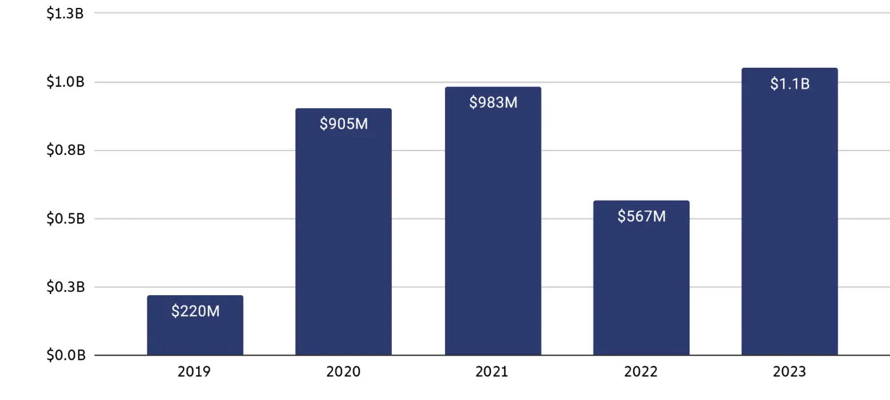

<h2 id="h1"> Introduction </h2>

Le but de ce pok est de s'intéresser aux enjeux de cybersécurité au travers d'une approche sociétale.
J'ai commencé par une introduction à la cybercriminalité sur [Open Classroom 1](https://openclassrooms.com/fr/courses/8028761-decouvrez-lunivers-de-la-cybersecurite), que j'ai complété avec des recherches de documentations et quelques informations du cours de cybersécurité du temps 3.
Pour le second sprint j'ai aussi prévu un cours de cryptographie pour entrer plus profondément dans le sujet via [Open Classroom 2](https://openclassrooms.com/fr/courses/1757741-securisez-vos-donnees-avec-la-cryptographie).

<h2 id="toc"> Table des matières </h2>

- [Introduction](#h1)
- [Table des matières](#toc)
- [Organisation des sprints](#sprint)
- [Sprint 1](#h2)
- [Sprint 2](#h3)
- [Conclusion](#h4)
- [Liens utiles](#liens)

<h2 id="sprint"> Organisation des sprints </h2>

**Objectif du premier sprint**

- Histoire de la cybercriminalité. (le rôle de la Russie et la stratégie actuelle)
- État actuel de la cybercriminalité. (les méthodes utilisées, une course sans fin ?)
- Chiffrer son impact. (économique, social, politique et environnemental ?)

**Objectif du second sprint**

- Les stratégies des géants du numérique (l'inter-connectivité, la complexification et la centralisation de la data)
- Les bonnes pratiques des développeurs.
- Les bonnes pratiques des utilisateurs.

<h2 id="h2"> Sprint 1 </h2>

**Histoire de la cybercriminalité.**

**État actuel de la cybercriminalité. (les méthodes utilisées, une course sans fin ?)**

- L'homme, le maillon faible de la sécurité ?

Les géants d'internet qui ont pour coeur de métier l'IT ne sont pas épargné, voici un aperçu de l'histoire d'Uber, qui illustre la faiblesse de l'homme dans la cybersécurité :

Dans une conversation avec le chercheur en cybersécurité Corben Leo, le hacker a révélé avoir obtenu l’accès aux systèmes de Uber à l’aide d’identifiants de connexion obtenus auprès d’un employé grâce à l’ingénierie sociale. Il s’est fait passer par un membre de l’équipe IT de l’entreprise afin de piéger sa victime.

C’est ce qui lui a permis d’accèder à un VPN interne de l’entreprise, puis de trouver les scripts PowerShell sur l’intranet d’Uber contenant les identifiants de gestion d’accès. Il a ainsi pu infiltrer les comptes AWS et G Suite.

Le 19 septembre 2022, Uber a précisé que le hacker a en fait acheté le mot de passe d’un sous-traitant sur le Dark Web. Les identifiants du sous-traitant en question auraient été exposés par un malware ayant infecté son laptop.

Le cybercriminel aurait ensuite tenté à plusieurs reprises de se connecter au compte. Toutefois, grâce à l’authentification à deux facteurs, le sous-traitant recevait une requête d’approbation à chaque tentative et bloquait l’accès en refusant. Malheureusement, il a finalement accepté l’une des requêtes et le hacker a pu se connecter.

- le chiffrement RSA : pilier fragile d'internet

Le chiffrage RSA est utilisé dans de nombreux domaines numériques au quotidien. À titre d’exemple, les protocoles de communication HTTPS (Hypertext Transfer Protocol Secure) ou encore les certificats SSL sont la plupart du temps sécurisés à l’aide d’un chiffrage RSA. Un système de chiffrement RSA permet également d’encoder les emails ou messages d’une boîte de messagerie, des données d’images ou même un disque dur. Sans la clé de chiffrement RSA nécessaire, il serait trop long de décoder ces données, même avec la puissance de calcul la plus élevée qui soit. Ce processus est donc considéré comme étant relativement sécurisé.

Le principal problème de ce système réside dans la simplicité théorique à le décoder. En effet, la protection réside sur le fait que le temps de calcul est trop long pour être réalisé actuellement. Cependant, une méthode utilisé pour outrepasser ce système est d'accumuler un grand nombre de communication chiffrer et de les stocker pour plus tard, lorsque la technologie sera suffisamment rapide pour les décoder. On pourrait penser que le temps que cela se produise, l'information sera obsolète. Cependant, des informations tels que les données bancaires, données personnelles ou mot de passe sont souvent utilisé longtemps.

- Le rôle des ordinateurs quantiques

Le rôle des ordinateurs quantique pourrait mettre fin au chiffrement RSA. En effet, suite aux différents concours de chiffrement, il a été démontré que des algorithmes quantiques peuvent décoder très rapidement le chiffrement RSA via notamment l'algorithme de SHOR.  
Il faut tout de même noter que ces ordinateurs ne sont pas encore industrialisable à cause des contraintes de température des supraconducteur. De plus, de nouvelle méthode de chiffrement sont déjà prête pour être mise en place si les ordinateurs quantique se répande.

**Chiffrer son impact. (économique, social, politique et environnemental ?)**

- Le rôle des cryptomonaies

Le montant des cyberattaque via ransomware en 2023 a simplement atteint 1,1 milliards de dollars en cryptomonaies. En effet, les cryptomonaies ont un gros avantage, elles sont difficile à tracer, et ne sont pas sous la tutelle d'une banque étatique, donc impossible à inspecter.

- La data, un nerf de la guerre ?

Les nouvelles entreprises sont pour beaucoup des services internet : Amazon, Uber Eats, Tik Tok, Cloud. Elles ont toutes en commun une stratégie basée sur la donnée, qui consiste à toucher le publique le plus large possible et à collecter un maximum de données. Certains vont se servir des données pour améliorer leur service via des suggestion ou plus simplement vendre les données. Ces données sont normalement anonymisée pour être vendu. Ainsi, on peut collecter énormément de données légalement sur internet. Jusque là il n'y a pas de faille majeur de sécurité. Cependant, si l'entreprise qui vend les données subit une attaque qui permet de faire le lien entre un profil et une personne on peut facilement se retrouver avec une gigantesque base de données qui n'est plus anonyme. De plus, si cela se réalise sur une entreprise, via l'interconnectivité des services "se connecter avec mon compte google", alors on peut acheter les données d'un autre service et être capable de le recouper à notre base de données.

- La data, au coeur des débats politiques et les Fakenews.

Comment est-ce que ces données peuvent-elles avoir autant de valeur ?  
Il y a tout d'abord l'utilisation du ciblage publicitaire à des fins moralement discutable. Comme par exemple mettre en avant un dictateur, soutenir une guerre, favoriser un candidat à des élections en montrant des fakenews nuisant aux adversaires.  
La seconde problématique réside dans les attaques au phishing : nous recevons régulièrement des mails de A..maZ00n3 ou Chr0noppost, qui ne ressemble à rien. Cependant si vous commencez à ajouter "Bonjour Mathis Schultz" puis des recommendations d'article que j'ai vraiment consulté, ainsi qu'une promotion en or, une "vente flash". ou alors si le mail indique mon numéro client ? Mes chiffres de sécurité sociale ? Il est raisonnable de penser qu'une grande part de la population se fasse avoir.

<h2 id="h3"> Sprint 2 </h2>

**Les stratégies des géants du numérique (l'inter-connectivité, la complexification et la centralisation de la data)**

- Des Objets toujours plus connecté

Les objets connectés sont au coeur des stratégies marketing des géants d'internet :
Amazon propose Alexa, l'assistant connecté capable de contrôler les objets connectés. Ces objets peuvent être directement supporté par Amazon ou alors connecté à la main en créant des routines pour Alexa. Orange propose aussi des solution pour la maison connecté, que ce soit pour gérer les verrouillage des portes, les éclairages, les panneaux solaires ou autre. La stratégie d'Apple repose entièrement sur l'inter-connectivité des services. Cela à de grand intérêt comme par exemple pouvoir accéder à ses caméra à distance, verrouiller la porte électromagnétiquement à distance. Cependant cela comporte plusieurs risques majeurs :

- Le premier extrêmement critique, facile à imaginer : le piratage du système de contrôle qui donnerai à l'attaquant un accès complet au système. Ce cas n'est pas impossible mais il faut de gros moyen pour s'en prendre à Amazon.
- Le second, beaucoup plus fréquent est de s'en prendre au maillon faible du réseau : la caméra acheter pour 50€ qui marche en wifi ? ou même la brosse à dent électrique qui permet de mesurer que votre enfant se brosse suffisamment les dents. Le point commun de ces deux objets est qu'il ne sont pas conçu pour être sécurisé. Le problème est qu'ils vont avoir accès au wifi via des protocoles non-sécurisé voir complètement obsolète. Ils vont permettre à l'attaquant de pénétrer dans le réseau en se faisant passer pour celui ci et vont obtenir des droits qui pourraient être néfaste.

- Des systèmes impossible à sonder (IA) ?

La complexification des systèmes les rends de plus en plus dur à sonder. Personne ne sait comment chat GPT arrive à un résultat. Il ne se base pas sur une base de vérité que l'on peut retracer via l'accès au source comme le permettent les moteurs de recherche plus traditionnel. Le problème majeur en terme de sécurité est qu'il n'est pas impossible de trouver des moyens de sonder la données que connaît l'IA sans en avoir le droit. Il y a une bataille perpétuel entre les administrateurs des IA qui modèrent les droits des IA et les utilisateurs qui trouvent des moyens de faire sortir l'IA de ces règles. Je fais notamment référence au premier prompt qui permettait à Chat GPT de dire des propos racistes ou d'expliquer la recette d'explosif en lui expliquant que c'était dans le cadre de la recherche scientifique.

- Qui utilise et possède de la donnée ?

Les acteurs de la données comme Amazon travail quotidiennement pour l'accumuler. Cela se fait notamment via des stratégie de pricing très faible, en effet pour quelques euros par mois on peut stocker énormément sur le cloud. Cela sert bien évidemment à la publicité sur internet qui a un impact énorme sur les utilisateurs mais aussi pour les propagandes. Mention spécial pour les pubs de tourisme dans un pays du proche orient qui souhaite maintenir le soutien Européen pendant les massacres au sud de son territoire. Ou pour des élections présidentielles américaines.  
Au delà des pubs, nos données servent aussi à l’entraînement des IA sans avoir un consentement particulier de la part de l'utilisateur. Ainsi ces données collecté massivement deviennent des enjeux majeurs, et les infrastructures sont régulièrement la proie des hackeurs.

- Cloud VS On premise

Présenté par Datadog, les avantages des solution cloud sont multiples, on peut mettre en place un ensemble de traces, de metrics ou de logs pour analyser d'une part le système mais aussi les préférences utilisateurs. Ces solutions sont facilement extensibles probablement moins impactante environnementalement parlant si les sociétés partagent la ressource. Elle nécessite bien moins de compétence puisque le système est en partie géré par des acteurs comme AWS ou Datadog qui fournissent la compétence technique. Cependant, ces entités deviennent donc des cibles et même s'ils ne sont que rarement hacké (2016 il me semble la dernière fois que Datadog a eu un soucis majeur - date à confirmer) lorsque cela arrive ce n'est pas un service qui est piraté avec quelques utilisateurs mais bien un ensemble d'entreprise qui regroupe un nombre certain d'utilisateur.

Les solutions on Premise pour les petites entreprises sont plus onéreuses à installer et à sécuriser mais limite la criticité d'une attaque.

- Payer ? Un moyen de se soustraire à la donnée ?

Malheureusement le fait de payer pour des services ne soustrait pas l'utilisateur des logs ou autre collecte de données. En effet, les services payant comme Netflix analyse nos données pour proposer du contenu ou même pour savoir quel film financer. Leurs algorithmes sont en phase de test pour l'analyse et l'écriture de script afin d'optimiser leur dépense. Ce service est bien évidemment source de débat sur le travail des écrivains. D'autre entreprise comme Microsoft qui nous fait payer des licenses une centaine d'euros collecte gracieusement nos données (les confrères en font tout autant).

**Les bonnes pratiques des développeurs.**

- Des systèmes orienté sécurité

La création de système doit se faire en suivant un ensemble de règle afin de limiter les risques, bien évidemment il y a des règles de cryptographie ou de protection de la données qu'il est nécessaire de suivre mais même plus simplement le fait d'utiliser des outils qui soient à jour et toujours supporté. En effet, une fois qu'une faille est découverte, si le système n'est pas maintenu à jour et que les technologies utilisés sont obsolète, il y aura toujours quelqu'un qui finira par s'attaquer au système.

- La modération de la data

La collecte de données est un outil intéressant pour comprendre et améliorer un service, collecter les préférences des utilisateurs permet de proposer du contenu adapter, mais est-ce vraiment une pratique acceptable éthiquement ? Ne devrait-il pas y avoir un voile qui limite ce qui est accessible pour une plateforme ? Dois-je vraiment donner mon nom, numéro de téléphone et mail pour être un client fidèle ? Ne serait il pas plus raisonnable de limiter cela à un pseudo ou nom si la personne le souhaite ? Qu'apporte le fait de donner son numéro au client ? De plus, la collecte des numéros permet en cas de brèche dans un service de contacter les utilisateurs en se faisant passer pour l'entreprise. Il est donc nécessaire que les entreprises ou l'état modère la collecte de données.

- La protection de l'utilisateur

Si l'entreprise collecte de la données, il est nécessaire qu'elle soit protégé. Cela passe par des méthodes d'anonymisations, le fait de séparer les données bancaires, d'écarter le nom de l'utilisateur de ses préférences.

**Les bonnes pratiques des utilisateurs.**

- les gestionnaires de mdp ? Une vraie solution ?

Les gestionnaires de mot de passe sont des outils redoutable pour sécuriser l'ensemble de ses applications. En effet, il génère des mots de passes trop complexe pour être piraté individuellement. De plus, en proposant des mots de passes pré-enregistré pour des services il nous mette la puce à l'oreille lorsque le mot de passe n'est pas prérempli. Cependant, il y a deux points clés à garder en tête, tout d'abord, le mot de passe de ces applications doit être très sécurisé car il contient les clés de tout vos services y compris le mail de récupération en cas de problème. Ainsi, ces services sont les cibles des hackeurs puisqu'ils deviennent stratégique.

- La double authentification

Ce système est sûrement le plus désagréable à utiliser puisqu'il vous demande un effort supplémentaire mais c'est le plus sécurisé puisqu'il limite le pouvoir d'un mot de passe sur un service. Il existe différentes manières de le mettre en place. Soit via une clé externe (clé usb notamment) ou alors via la signature d'un appareil ou d'une application. 

- Le rôle des VPN ?

Les VPN sont un système de protection supplémentaire, son objectif va être d'encrypter la communication entre vous et un serveur intermédiaire afin d'éviter que quelqu'un puisse intercepter vos requêtes à mi-chemin. Ils sont donc indispensable dans des environnement non sécurisé (aéroport ou réseau wifi gratuit). Ces solutions sont de plus mise en place dans les entreprises afin de permettre aux employés de se connecter au service de l'entreprise depuis l'extérieur. Ce sont des services performant mais pas invincible.

<h2 id="h4"> Conclusion </h2>

Pour moi, le plus important en cybersécurité est de comprendre que c'est une course technologique sans fin entre la défense et l'attaque qui à un coût financier et environnemental considérable. Rien dans le système n'est inviolable mais l'objectif est d'avoir quelque chose de suffisamment long et coûteux à attaquer pour que ce ne soit pas rentable pour l'attaquant de s'en prendre à vous. Les ressources ci dessous donne des détails sur l'ensemble des technologies, des bonnes pratiques ou même des choses à faire en cas de problème, section que je n'ai pas développé ici.

<h2 id="liens"> Liens utiles </h2>

● Le site de l’[ANSSI](https://cyber.gouv.fr) avec des ressources en français, et en particulier le guide d’hygiène informatique, utile pour connaître les sujets de sécurité les plus critiques à mettre en œuvre pour une organisation, ou tout document de la catégorie bonnes pratiques ;
● Le site [cybermalveillance.gouv.fr](https://www.cybermalveillance.gouv.fr) fournit des conseils et des informations pour se protéger contre les cyberattaques et savoir y réagir ;
● Le site de l’[ENISA](https://www.enisa.europa.eu) avec des ressources disponibles en français et de nombreuses langues européennes ;
● Le site du [NCSC](https://www.ncsc.gov.uk) avec des ressources disponibles uniquement en anglais ;
● Le site du [CCB](https://ccb.belgium.be/fr) avec des ressources disponibles en français et anglais ;
● Le site du [CISA](https://www.cisa.gov) avec des ressources disponibles uniquement en anglais.
[Open Classroom 1](https://openclassrooms.com/fr/courses/8028761-decouvrez-lunivers-de-la-cybersecurite)
[Open Classroom 2](https://openclassrooms.com/fr/courses/1757741-securisez-vos-donnees-avec-la-cryptographie)