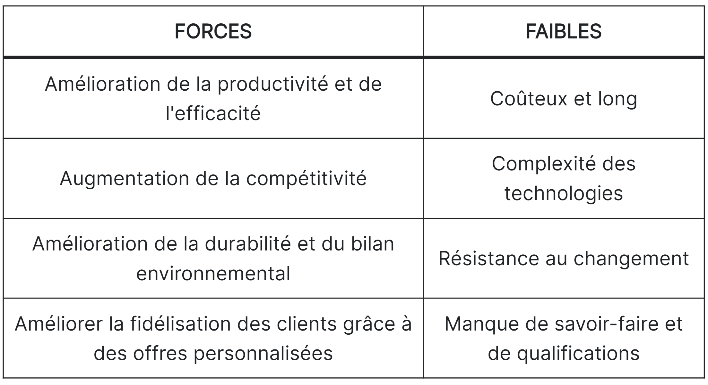
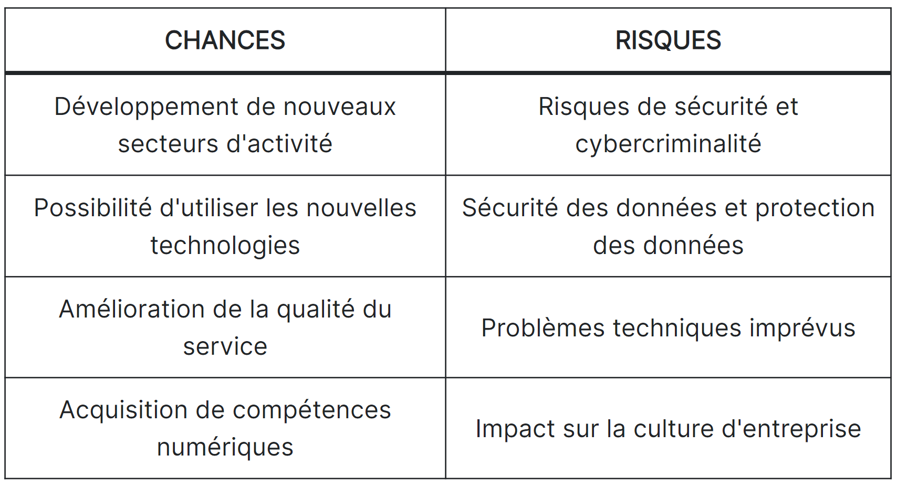

## Table des matières

- [Introduction](#section-1)
- [Comprendre la Stratégie IT](#section-2)
- [Go to Section 3](#section-3)

## Introduction 
Traditionnellement, les technologies de l'information étaient principalement utilisées pour des tâches de soutien au sein des organisations, mais leur rôle s'est métamorphosé en un atout stratégique crucial pour renforcer la vision globale des entreprises à mesure que l'environnement commercial évolue rapidement. L'alignement entre la stratégie IT et la stratégie commerciale est essentiel, avec un focus sur l'identification du potentiel stratégique des investissements IT. Les avantages potentiels de la numérisation sont multiples, mais leur réalisation dépend d'une solide stratégie, car la simple intégration de ces technologies ne garantit pas automatiquement des résultats.

## Comprendre la Stratégie IT 
### Définitions
Avant d'aborder le sujet, il est important de définir les termes clés.
- **Stratégie :**
La stratégie peut être définie comme l'ensemble des activités qui renforcent la position concurrentielle de l'entreprise qui entreprend de telles actions, englobant la planification, la surveillance et l'exécution d'opérations préalablement planifiées

  

- **Stratégie d'entreprise :**
 La stratégie d'entreprise encapsule essentiellement une formule concernant la manière spécifique dont une entreprise va concourir, ses objectifs et les politiques nécessaires pour atteindre ces objectifs. En essence, la stratégie concurrentielle se compose d'objectifs et de politiques qui concrétisent ces objectifs.
   

 - **Technologies de l'information (TI) :**
 Les technologies de l'information peuvent être définies comme la somme totale de tous les investissements qu'une entreprise a réalisés dans des actifs tels que le matériel informatique, l'informatique, les logiciels, la technologie de communication et les télécommunications

  

- **Stratégie IT :**
La stratégie IT est une composante essentielle de la gestion d'entreprise moderne. Elle représente une approche stratégique de la gestion, de l'utilisation et de l'alignement des technologies de l'information au sein d'une organisation en vue d'atteindre ses objectifs commerciaux et de renforcer sa position concurrentielle. 
    

- **Allignement :**
L'alignement est le degré auquel les objectifs et la mission présents dans la stratégie d'entreprise sont partagés et renforcés par la stratégie IT
 
  

### Objectifs et rôles de la stratégie IT
La stratégie IT joue un rôle essentiel dans l'alignement des objectifs et des investissements technologiques avec la vision globale de l'entreprise. Elle se concentre sur l'identification et la mise en valeur du potentiel stratégique des investissements réalisés dans le domaine des technologies de l'information, tels que le matériel informatique, les systèmes, les logiciels, les technologies de communication et les télécommunications.
Les avantages potentiels de la numérisation sont multiples et comprennent une augmentation des ventes, une amélioration de la productivité, la possibilité d'innovations créatrices de valeur, ainsi que de nouvelles formes d'interaction avec les clients. L'exploitation et l'intégration des technologies numériques touchent souvent divers aspects des entreprises, allant au-delà de leurs frontières traditionnelles, et influencent les produits, les processus commerciaux, les canaux de vente et les chaînes d'approvisionnement.
  

### Importance de l'alignement stratégique
L'alignement de la stratégie IT avec la stratégie de l'entreprise est impératif. Il est essentiel de noter que la simple intégration de ces technologies de l'information ne garantit pas automatiquement les résultats souhaités. Les entreprises ne peuvent pas simplement adopter les dernières technologies sans avoir une stratégie IT solide qui les guide. Cette stratégie IT doit être en parfaite harmonie avec la vision globale de l'entreprise et orienter la manière dont les technologies numériques sont utilisées pour remodeler ou redéfinir des modèles d'entreprise entiers.

## Outtil de prise de décision
La prise de décision dans le cadre du développement de la stratégie informatique et de l'alignement sur les objectifs de l'entreprise fait appel à plusieurs outils et méthodologies pour aider les organisations à faire des choix éclairés. Voici quelques outils de prise de décision couramment utilisés:
### Analyse SWOT 
 L'analyse SWOT (Strengths, Weaknesses, Opportunities, Threats) permet d'évaluer les forces et les faiblesses internes d'une organisation, ainsi que les opportunités et les menaces externes. Elle fournit un cadre structuré pour la prise de décision en mettant en évidence les domaines qui doivent être améliorés ou dans lesquels des avantages stratégiques peuvent être exploités. 
:-------------------------:|:-------------------------:
 | 

### Analyse Coût-Avantage(CBA)
CBA est une technique quantitative utilisée pour évaluer les coûts et les bénéfices associés à différentes initiatives informatiques. Elle permet de comparer les retours attendus par rapport aux investissements, ce qui facilite la hiérarchisation des projets en fonction de leur potentiel de création de valeur. Voici les étapes pour réussir une analyse coût-bénéfice:
#### Étape 1 : Déterminer le coût du maintien du statu quo
- Mesurez les coûts si aucune action n'est entreprise.
- Évaluez si rester immobile est la meilleure décision ou si cela peut entraîner des coûts à long -terme.
#### Étape 2 : Identifier les coûts
- Élaborez une liste complète des coûts potentiels, y compris les coûts initiaux, imprévus, tangibles, intangibles, continus, futurs, et tout risque financier associé.
- Utilisez une carte mentale pour structurer et explorer ces coûts.
#### Étape 3 : Identifier les opportunités
- Déterminez les bénéfices potentiels du projet.
- Posez-vous des questions sur les revenus supplémentaires, le retour sur investissement, et la définition du retour sur investissement pour votre entreprise.
- Identifiez les opportunités à court et à long terme.
#### Étape 4 : Attribuer une valeur monétaire aux coûts et opportunités
- Convertissez tous les coûts et bénéfices en unités monétaires.
- Incluez les coûts humains tels que la main-d'œuvre, les nouvelles embauches, les équipements, les remplacements, la formation, et les avantages intangibles.
#### Étape 5 : Créer une chronologie des coûts et des revenus attendus
- Établissez un calendrier prévisionnel indiquant quand les coûts et les revenus sont prévus.
- Prévoyez l'impact temporel des coûts et des revenus pour une gestion et un ajustement efficaces.



* [IT Strategy Duke University](https://www.youtube.com/watch?v=vzB1HVt6_sk&ab_channel=DukeUniversity-TheFuquaSchoolofBusiness)
* [Transformation IT dans le monde numérique, y compris analyse SWOT](https://konfuzio.com/fr/it-transformation/#:~:text=L'analyse%20SWOT%20montre%20que,la%20possibilit%C3%A9%20de%20d%C3%A9velopper%20de)
* [LucidChart: Comment créer une analyse coût-bénéfice](https://www.lucidchart.com/blog/fr/analyse-cout-benefice)
* [Aligning IT strategy with business strategy :A case study of global IT consultancy firms](https://aaltodoc.aalto.fi/handle/123456789/21474)

