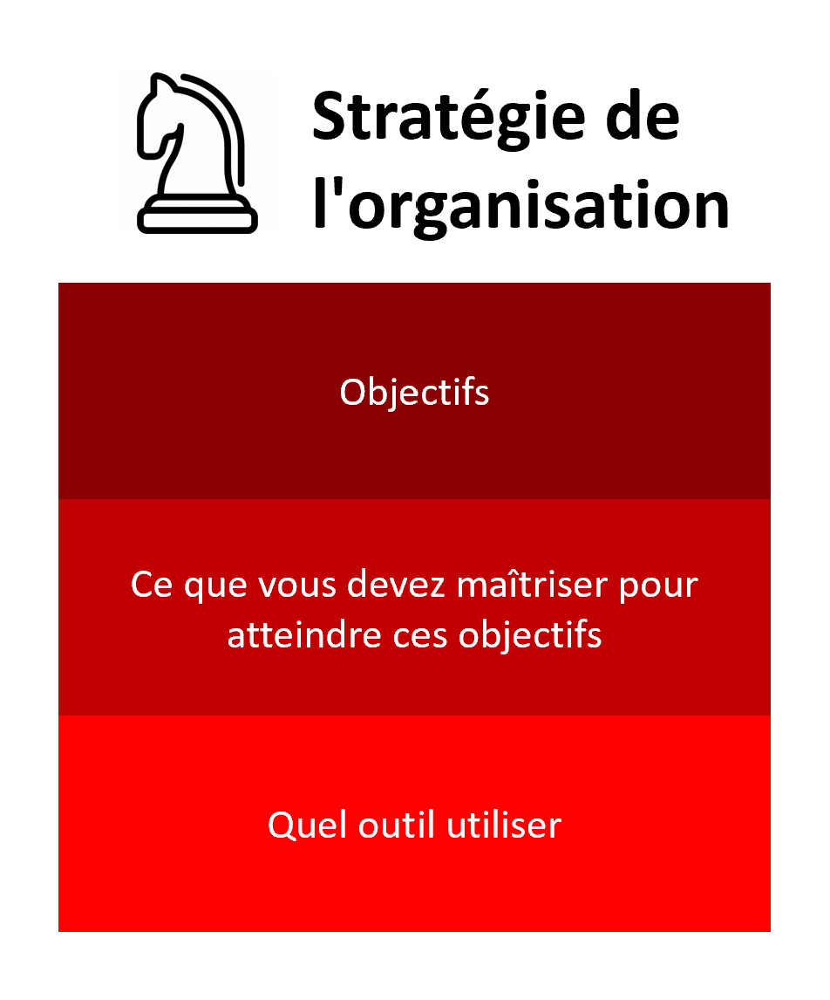
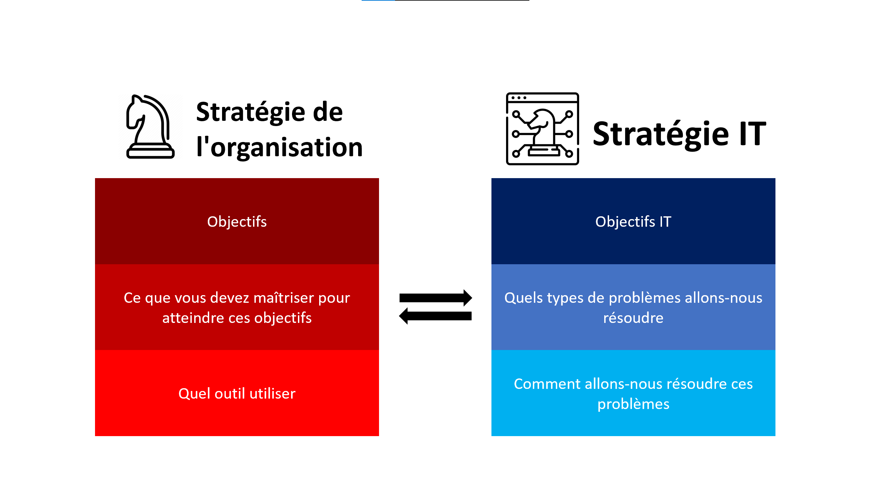

## Table des matières

- [Introduction](#section-1)
- [Comprendre la Stratégie IT](#section-2)
- [Go to Section 3](#section-3)

## Introduction

Traditionnellement, les technologies de l'information étaient principalement utilisées pour des tâches de soutien au sein des organisations, mais leur rôle s'est métamorphosé en un atout stratégique crucial pour renforcer la vision globale des entreprises à mesure que l'environnement commercial évolue rapidement. L'alignement entre la stratégie IT et la stratégie commerciale est essentiel, avec un focus sur l'identification du potentiel stratégique des investissements IT. Les avantages potentiels de la numérisation sont multiples, mais leur réalisation dépend d'une solide stratégie, car la simple intégration de ces technologies ne garantit pas automatiquement des résultats.

## Comprendre la Stratégie IT

### Définitions
- **Stratégie :**
La stratégie peut être définie comme l'ensemble des activités qui renforcent la position concurrentielle de l'entreprise qui entreprend de telles actions, englobant la planification, la surveillance et l'exécution d'opérations préalablement planifiées

  

- **Stratégie d'entreprise :**
 La stratégie d'entreprise encapsule essentiellement une formule concernant la manière spécifique dont une entreprise va concourir, ses objectifs et les politiques nécessaires pour atteindre ces objectifs. En essence, la stratégie concurrentielle se compose d'objectifs et de politiques qui concrétisent ces objectifs.
   

 - **Technologies de l'information (TI) :**
 Les technologies de l'information peuvent être définies comme la somme totale de tous les investissements qu'une entreprise a réalisés dans des actifs tels que le matériel informatique, l'informatique, les logiciels, la technologie de communication et les télécommunications

  

- **Stratégie IT :**
La stratégie IT est une composante essentielle de la gestion d'entreprise moderne. Elle représente une approche stratégique de la gestion, de l'utilisation et de l'alignement des technologies de l'information au sein d'une organisation en vue d'atteindre ses objectifs commerciaux et de renforcer sa position concurrentielle. 
    

- **Allignement :**
L'alignement est le degré auquel les objectifs et la mission présents dans la stratégie d'entreprise sont partagés et renforcés par la stratégie IT
 
  

### Objectifs et rôles de la stratégie IT
La stratégie IT joue un rôle essentiel dans l'alignement des objectifs et des investissements technologiques avec la vision globale de l'entreprise. Elle se concentre sur l'identification et la mise en valeur du potentiel stratégique des investissements réalisés dans le domaine des technologies de l'information, tels que le matériel informatique, les systèmes, les logiciels, les technologies de communication et les télécommunications.
Les avantages potentiels de la numérisation sont multiples et comprennent une augmentation des ventes, une amélioration de la productivité, la possibilité d'innovations créatrices de valeur, ainsi que de nouvelles formes d'interaction avec les clients. L'exploitation et l'intégration des technologies numériques touchent souvent divers aspects des entreprises, allant au-delà de leurs frontières traditionnelles, et influencent les produits, les processus commerciaux, les canaux de vente et les chaînes d'approvisionnement.
  

### Importance de l'alignement stratégique
L'alignement de la stratégie IT avec la stratégie de l'entreprise est impératif. Il est essentiel de noter que la simple intégration de ces technologies de l'information ne garantit pas automatiquement les résultats souhaités. Les entreprises ne peuvent pas simplement adopter les dernières technologies sans avoir une stratégie IT solide qui les guide. Cette stratégie IT doit être en parfaite harmonie avec la vision globale de l'entreprise et orienter la manière dont les technologies numériques sont utilisées pour remodeler ou redéfinir des modèles d'entreprise entiers.

