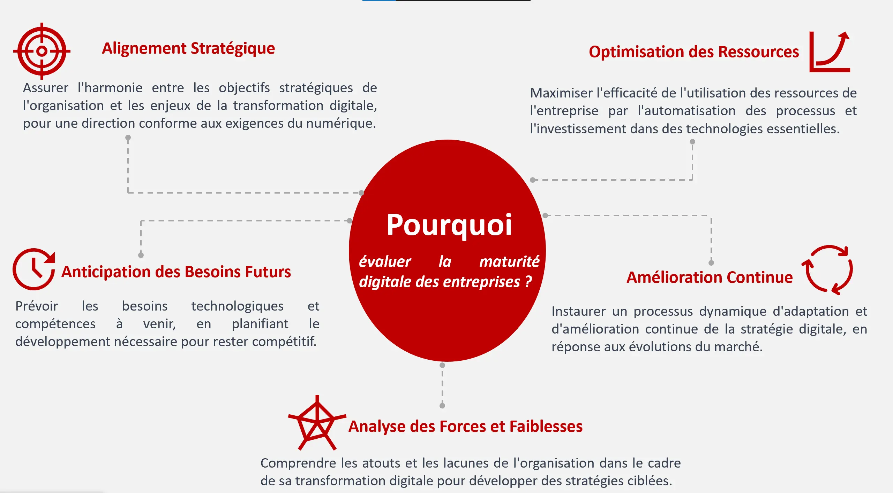
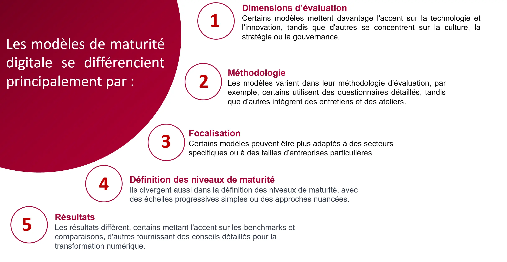
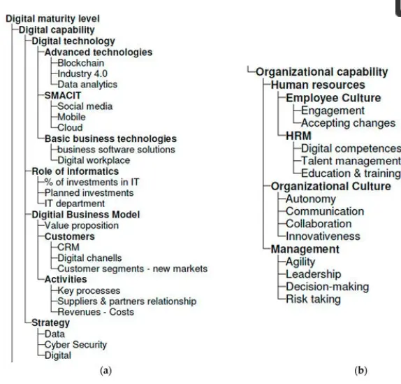
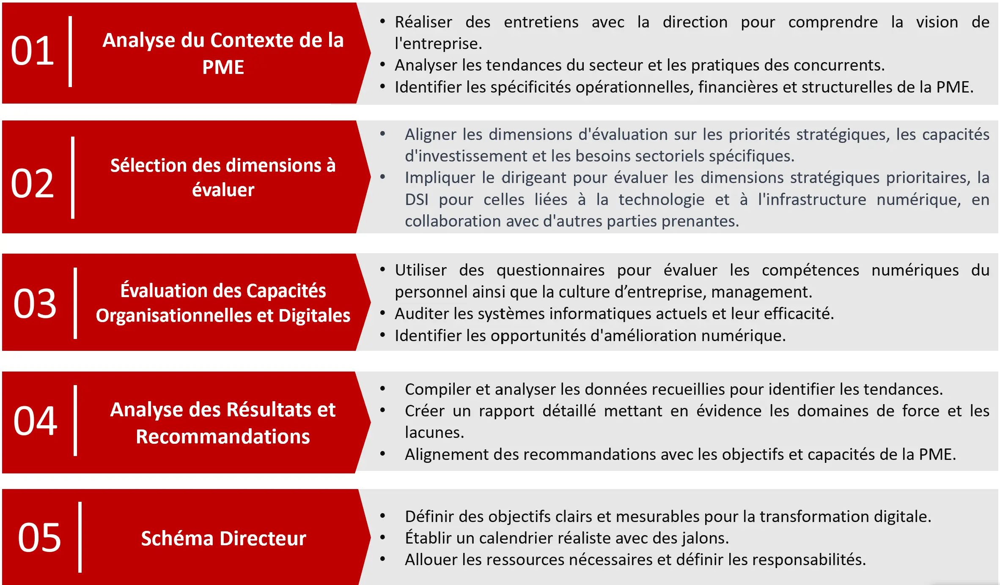

## Table des matières
1. [Introduction](#section-1)
2. [Transformation Digitale](#section-2)
3. [Maturité digitale](#section-3)
4. [Démarche pour une PME](#section-4)

## Introduction 
La transformation digitale redéfinit le tissu professionnel, intégrant les technologies numériques pour optimiser les opérations des organisations. Ses enjeux, allant de l'innovation à la compétitivité, sont cruciaux. La maturité digitale, reflet de l'adaptation aux technologies, nécessite une évaluation méthodique pour guider les organisations vers une transformation digitale réussie. J'ai réalisé ce travail afin qu'il devienne une référence dans ce domaine pour les autres étudiants (d'où son exhaustivité).
## Transformation digitale : 
La transformation digitale peut être définie comme un processus visant à améliorer une entité en provoquant des changements significatifs dans ses propriétés grâce à des combinaisons de technologies de l'information, de l'informatique, de la communication et de la connectivité [[1]](#doc-1). Ce processus influence les dimensions organisationnelles, stratégiques, technologiques, humaines et commerciales d'une entité


1.	Adaptation aux Nouvelles Attentes Clients : Les clients attendent des expériences plus fluides, personnalisées et instantanées. 
Exemple  :Amazon a introduit la fonctionnalité "Suggestions d'achat" basée sur l'historique d'achats et les préférences des utilisateurs,

2.	Optimisation des Opérations Internes : La transformation digitale vise à améliorer l'efficacité opérationnelle en automatisant des tâches, en mettant en place des systèmes de gestion intégrés et en utilisant l'analyse de données pour prendre des décisions plus éclairées. 
Exemple : General Electric a mis en œuvre l'Internet des Objets (IoT) pour surveiller et optimiser les performances de ses turbines, permettant une maintenance prédictive.

3.	Innovation et Nouveaux Business Model : Les technologies digitales offrent des opportunités pour l'innovation. Elle permet aux organisations d’introduire des idées novatrices et à repenser leurs méthodes traditionnelles de fourniture de leurs services.
Exemple : Netflix a révolutionné l'industrie du divertissement en proposant un modèle d'abonnement pour le streaming de contenu, déplaçant ainsi l'accent de la vente de DVD à une expérience de visionnage en ligne à la demande.

4.	Formation et Gestion des Talents : La transformation digitale exige des compétences nouvelles 
Exemple : l'Observatoire de la Transformation Digitale des Écoles de Management de la FNEGE s'engage à guider les écoles de management dans l'évolution de leurs pratiques managériales, en les adaptant au contexte de la transformation digitale

5.	Durabilité Environnementale : La transformation digitale peut également contribuer à des pratiques plus durables, par exemple en réduisant la consommation de papier grâce à la dématérialisation.



## Maturité digitale  
La maturité de la transformation digitale d'une organisation fait référence au niveau de préparation, d'adoption et d'intégration des technologies numériques au sein de ses processus, de sa culture, de sa stratégie et de ses opérations. C'est une mesure de la capacité d'une organisation à tirer pleinement parti des opportunités offertes par la transformation digitale.[[2]](#doc-1)
### Pourquoi l’évoluer ?

### Comment l'évaluer (critères / démarche) ?
Divers modèles sont disponibles pour évaluer la maturité digitale, et chaque évaluation selon ces modèles suit généralement une démarche structurée en plusieurs étapes. Malgré leurs spécificités respectives, ces modèles partagent des éléments communs dans leur approche. Les grandes lignes de cette démarche peuvent ainsi être identifiées.[[3]](#doc-2)
1.	Auto-évaluation ou évaluation assistée : Les entreprises débutent souvent par une auto-évaluation via des questionnaires ou s'associent à des consultants pour évaluer leur maturité digitale. Ces questionnaires abordent divers aspects tels que la stratégie, la technologie, la culture, et les compétences.
2.	Analyse des résultats : Les réponses sont analysées afin de déterminer un score ou un niveau de maturité pour chaque dimension évaluée. Cette analyse permet d'identifier les points forts et les domaines nécessitant des améliorations.
3.	Benchmarking : Les résultats sont fréquemment comparés à ceux d'autres entreprises du même secteur ou à des normes de l'industrie, évaluant ainsi la position relative de l'entreprise dans le paysage de la maturité digitale.
4.	Identification des lacunes : À partir de l'analyse, les entreprises cernent les lacunes dans leur maturité digitale, mettant en lumière les domaines nécessitant des améliorations.
5.	Plan d'action : En conclusion, les entreprises élaborent un plan d'action axé sur les domaines clés identifiés lors de l'évaluation, visant à combler les lacunes et à renforcer leur maturité digitale de manière ciblée.


J'ai opté pour des modèles pratiques et éprouvés, principalement issus de cabinets de conseil reconnus, car leur expertise et leur expérience dans le domaine de la transformation numérique apportent une valeur ajoutée significative. Ces modèles offrent non seulement des cadres méthodologiques solides, mais aussi des perspectives pratiques et actionnables qui sont cruciales pour les entreprises cherchant à naviguer efficacement dans le paysage numérique complexe.

| Modèle                          | Dimensions d'évaluation                                                                 | Méthodologie                                           | Focalisation                                              | Niveaux de maturité                                       | Résultats et recommandations                   |
|---------------------------------|----------------------------------------------------------------------------------------|--------------------------------------------------------|-----------------------------------------------------------|-----------------------------------------------------------|-----------------------------------------------|
| Deloitte Digital Maturity Model | Stratégie, compétences, culture, technologie                                                | Questionnaire d'auto-évaluation, benchmarking         | Positionnement en transformation numérique                | Niveaux multiples de maturité numérique                    | Analyse détaillée, plan d'action personnalisé |
| PwC Digital IQ                  | Stratégie numérique, engagement des dirigeants, culture numérique, compétences TI       | Questionnaire, analyse comparative avec les pairs     | Alignement de la stratégie numérique et de l'engagement des dirigeants | Score IQ numérique, benchmarking sectoriel                | Score global, recommandations d'alignement stratégique     |
| Capgemini Digital Transformation Framework | Vision et stratégie, expérience client, opérations, culture et leadership            | Analyse approfondie, ateliers, évaluation de la stratégie | Transformation numérique complète                         | Niveaux détaillés de maturité par dimension               | Évaluation détaillée, recommandations pour la transformation |
[[4]](#doc-3)

### Critique : 
1.	Approche Trop Généralisée ou Spécialisée : Certains modèles sont trop spécialisés dans des secteurs comme l'Industrie 4.0, ce qui limite leur applicabilité à d'autres contextes. D'un autre côté, les modèles plus généraux peuvent manquer de spécificité pour fournir des recommandations pertinentes.
2.	Focalisation sur les Aspects "Soft" : Certains modèles mettent trop l'accent sur les aspects humains et organisationnels de la maturité digitale, ce qui peut négliger les aspects technologiques ou opérationnels, rendant ainsi les évaluations moins complètes.
3.	Manque de Rigueur Méthodologique : De nombreux modèles manquent de rigueur méthodologique, de validation scientifique et de références externes, ce qui remet en question leur validité et leur fiabilité.
4.	Manque de Clarté dans les Recommandations : Certains modèles ne fournissent pas suffisamment de détails dans leurs recommandations, ce qui rend difficile pour les dirigeants d'identifier clairement les domaines nécessitant des améliorations au sein de leurs organisations. [[5]](#doc-4)

## Démarche pour conduire un audit d'évaluation de la maturité de la transformation digitale d'une PME 
La transformation digitale des PME nécessite une stratégie adaptée à leurs ressources limitées et à leur besoin de résultats rapides. Une approche trop centrée sur la technologie, négligeant les aspects organisationnels et humains, peut nuire à l'identité de la PME.[[5][6]](#doc-4)
Pour évaluer efficacement la maturité digitale d'une PME, il est crucial de prendre en compte à la fois les capacités organisationnelles et digitales. Le modèle de Borštnar et Pucihar (2021), qui se base sur une méthodologie de design science et inclut 51 sous-dimensions, fournit une analyse approfondie de ces aspects.[[7]](#doc-5)

[[7]](#doc-5)

Ainsi, pour réaliser l'audit de maturité digitale d'une PME, je recommande d'appliquer ce modèle en évaluant les dimensions pertinentes à chaque situation spécifique, permettant ainsi d'obtenir une vue globale et précise de la maturité digitale de l'entreprise. 


- [[1][2]Transformation Digitale/Maturité](https://moodle.centrale-marseille.fr/pluginfile.php/81430/mod_resource/content/0/VIAL-2019-Digital%20Transformation.pdf) 
- [[3] Digital Transformation Maturity](https://doi.org/10.11118/actaun201967061673 )
- [[4]Deloitte Digital Maturity Model](https://www2.deloitte.com/content/dam/Deloitte/global/Documents/Technology-Media-Telecommunications/deloitte-digital-maturity-model.pdf)
  - [PwC Digital IQ](https://www.pwc.com/us/en/tech-effect/cloud/digital-iq.html)
  - [Capgemini Digital Transformation Framework](https://www.capgemini.com/wp-content/uploads/2017/07/Digital_Transformation__A_Road-Map_for_Billion-Dollar_Organizations.pdf)
- [[5]MATURITÉ DIGITALE DES PME : DES MODÈLES À RÉINVENTER ?](https://management-datascience.org/articles/21771/)
- [[6]Pour une approche contingente de la spécificité de la PME.](https://doi.org/10.7202/1009022ar )
- [[7] Multi-Attribute Assessment of Digital Maturity of SMEs](https://www.mdpi.com/2079-9292/10/8/885)


