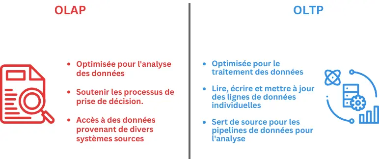

## Table des matières

1. [Introduction](#section-1)
2. [Modélisation des données](#section-2)
3. [Pipeline de données](#section-3)

## Introduction 

Ce cours permet d'approfondir les connaissances sur les systèmes de bases de données, notamment avec des notions ttelles que les data marts, lakes et warehouses et les processus ETL. Il complète la compréhension en examinant les cinq facteurs de performance des bases de données : la charge de travail, le débit, les ressources, l'optimisation et la contention. Enfin, il aide à développer les compétences en conception de requêtes efficaces pour exploiter pleinement les capacités d'un système.
À la fin du cours, j'aimerais avoir la capacité de construire des modèles de données répondant à des questions commerciales spécifiques, d'appliquer le processus ETL aux scénarios de travail, d'explorer divers outils ETL, et de construire des pipelines pour livrer efficacement les données nécessaires.

## Modélisation des données 

### Modèles de données et Schémas
Il existe différents aspects des bases de données et de leur influence sur le fonctionnement d'un système de Business Intelligence. Le cadre de la base de données, comprenant l'organisation des plateformes ainsi que le stockage et le traitement des données, affecte la manière dont les données sont utilisées. Par conséquent, comprendre les différentes technologies aide à prendre des décisions plus éclairées concernant les outils et les processus de BI. Cette lecture fournit une analyse détaillée des bases de données, y compris OLAP, OLTP, basées sur les lignes, en colonnes, distribuées, à hébergement unique, avec stockage et calcul séparés, et combinées.

Le traitement analytique en ligne (OLAP) et le traitement des transactions en ligne (OLTP) sont deux systèmes de traitement de données différents conçus à des fins différentes. OLAP est optimisé pour l'analyse de données complexes et les rapports, tandis qu'OLTP est optimisé pour le traitement transactionnel et les mises à jour en temps réel.



### Eléments clés des schémas de base de données

Le schéma de la base de données vous permet de valider les données entrantes fournies à votre base de données de destination afin d'éviter les erreurs et de garantir que les données sont immédiatement utiles aux utilisateurs. Il est donc important de s'assurer que tous les éléments existent dans le schéma.


**Pertinence des données**: Le schéma décrit la manière dont les données sont modélisées et façonnées dans la base de données et doit englober toutes les données décrites.

**Noms et types de données pour chaque colonne** : Inclure les noms et les types de données pour chaque colonne de chaque table de la base de données.

**Format cohérent** : Veillez à la cohérence du formatage de toutes les entrées de données. Chaque entrée est une instance du schéma, elle doit donc être cohérente.

**Clés uniques** : Le schéma doit utiliser des clés uniques pour chaque entrée de la base de données. Ces clés établissent des connexions entre les tables et permettent aux utilisateurs de combiner des données pertinentes provenant de l'ensemble de la base de données.


## Pipeline de données 
### ETL 
L'un des pipelines les plus utilisés dans les entreprise est l'ETL(Extract, Load, Transform). ETL permet de collecter des données de différentes sources, de les transformer selon les besoins spécifiques de l'entreprise ou du projet, et enfin de les charger dans une destination où elles peuvent être analysées et exploitées.



| Caractéristique                   | ETL                                                           | ELT                                                             |
|-----------------------------------|---------------------------------------------------------------|-----------------------------------------------------------------|
| **Ordre des opérations**          | Extraction, transformation, chargement                        | Extraction, chargement, transformation                         |
| **Localisation des transformations** | Transformations dans une zone de staging avant livraison       | Transformations dans le système de destination                  |
| **Ancienneté de la technologie**  | Plus de 20 ans, nombreux outils développés                     | Plus récente, moins d'outils de support intégrés                |
| **Accès aux données**             | Seules les données désignées sont transformées et chargées     | Toutes les données sont chargées, choix libre pour l'analyse    |
| **Calculs**                       | Remplacement ou révision des colonnes existantes               | Ajout direct de calculs au jeu de données existant              |
| **Systèmes de stockage compatibles** | Entrepôts de données relationnels structurés                    | Peut ingérer des données non structurées (ex. lacs de données)  |
| **Sécurité et conformité**        | Anonymisation avant chargement, protection des données         | Anonymisation après chargement, données potentiellement vulnérables |
| **Taille des données**            | Convient aux petits ensembles de données nécessitant des transformations complexes | Adapté aux grandes quantités de données structurées et non structurées |
| **Temps d'attente**               | Chargement plus long, analyse rapide                           | Chargement rapide, analyse plus lente                          |



### Stockage des données:

| Data warehouse                                                     | Data lake                                                           |
|--------------------------------------------------------------------|---------------------------------------------------------------------|
| Données déjà traitées et stockées dans un système relationnel      | Données brutes et non traitées jusqu'à leur analyse; peut aussi contenir une copie complète de la base de données relationnelle ou OLTP |
| La finalité des données est déjà assignée et elles sont en cours d'utilisation | La finalité des données n'est pas encore déterminée                 |
| Les modifications peuvent être compliquées et demander beaucoup de travail | Systèmes hautement accessibles et faciles à mettre à jour           |

### Qualité des données:

Vérifier la qualité des données implique de s'assurer que les données sont fiables avant d'atteindre leur destination. Il y a sept éléments qu'il faut prendre en compte :

- **Complétude** : Les données contiennent-elles tous les composants ou mesures souhaités ?

- **Consistance** : Les données sont-elles compatibles et en accord dans tous les systèmes ?

- **Conformité** : Les données correspondent-elles au format requis de la destination ?

- **Précision** : Les données correspondent-elles à l'entité réelle mesurée ou décrite ?

- **Redondance** : Seules les données nécessaires sont-elles déplacées, transformées et stockées pour utilisation ?

- **Actualité** : Les données sont-elles actuelles ?

- **Intégrité** : Les données sont-elles précises, complètes, cohérentes et fiables ? 


**Problèmes courants**
Il existe également quelques problèmes courants contre lesquels on peut se protéger au sein du système pour garantir que les données entrantes ne causent pas d'erreurs:

- Vérifier le mappage des données : Les données provenant de la source correspondent-elles aux données dans la base de données cible ?

- Vérifier les incohérences : Existe-t-il des incohérences entre le système source et le système cible ?

- Vérifier les données inexactes : Les données sont-elles correctes et reflètent-elles l'entité réelle mesurée ?

- Vérifier les données en double : Ces données existent-elles déjà dans le système cible ?
