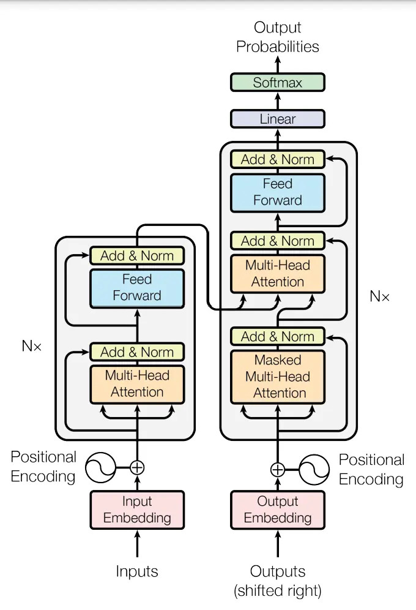

## Table des matières

1. [Introduction](#section-1)
2. [Transformateurs](#section-2)
3. [Pré-entraînement des LLM](#section-3)
4. [Conclusion](#section-4)
5. [Conclusion](#section-5)

## Introduction 
### Intelligence artificielle
L'IA est un terme général souvent utilisé pour décrire toutes sortes de systèmes informatiques avancés. Je préfère parler plus précisément de *Machine learning*. La majeure partie de ce que nous voyons aujourd'hui dans l'IA est en fait de l'apprentissage automatique : doter les systèmes informatiques de la capacité d'apprendre à partir d'exemples.
Les machines programmées pour apprendre à partir d'exemples sont appelées "réseaux neuronaux". L'une des principales méthodes d'apprentissage consiste à leur donner de nombreux exemples à partir desquels apprendre, par exemple en leur indiquant le contenu d'une image - c'est ce que nous appelons la classification. Si nous voulons apprendre à un réseau à reconnaître un éléphant, il faut qu'un humain lui présente de nombreux exemples de ce à quoi ressemble un éléphant et qu'il étiquette ces photos en conséquence. C'est ainsi que le modèle apprend à faire la distinction entre un éléphant et d'autres détails d'une image. Pour explorer tout cela, j'ai choisi de suivre le [cours de DeepLearning.AI](https://www.deeplearning.ai/courses/generative-ai-with-llms/)


**Fonctionnement des modèles linguistiques**
Les modèles de langage prédisent essentiellement le mot qui suit dans une séquence de mots. Nous entraînons ces modèles sur de grands volumes de texte afin qu'ils comprennent mieux quel mot est susceptible de venir ensuite. L'un des moyens - mais pas le seul - d'améliorer un modèle de langage consiste à lui donner plus de "lecture" ou à l'entraîner sur davantage de données, un peu comme nous apprenons à partir des documents que nous étudions. Si vous commencez à taper la phrase "Omar a frappé un...", un modèle de langage entraîné sur suffisamment de données pourrait prédire "Omar a frappé un ballon". S'il n'est pas suffisamment entraîné, il ne pourra prédire qu'un "objet rond" ou que sa couleur "jaune". Plus il y a de données dans l'entraînement du modèle de langage, plus celui-ci devient nuancé et plus il a de chances de savoir exactement ce que Marie a le plus probablement frappé.


### IA Générative
Un modèle génératif peut prendre ce qu'il a appris à partir des exemples qui lui ont été montrés et créer quelque chose d'entièrement nouveau sur la base de ces informations. D'où le mot "génératif". Les grands modèles de langage (LLM) sont un type d'IA générative puisqu'ils génèrent de nouvelles combinaisons de texte sous la forme d'un langage à consonance naturelle. Nous pouvons même construire des modèles de langage pour générer d'autres types de résultats, tels que de nouvelles images, du son et même de la vidéo, comme avec [Imagen](https://imagen.research.google/), [AudioLM](https://google-research.github.io/seanet/audiolm/examples/) et [Phenaki](https://sites.research.google/phenaki/).

## Transformateurs

Avant l'émergence des transformateurs, les modèles de langage génératifs utilisaient principalement des réseaux neuronaux récurrents (RNN). Cependant, malgré leur puissance à l'époque, les RNN étaient limités par leur capacité à traiter efficacement les dépendances à long terme dans les données textuelles, ainsi que par leur besoin de ressources computationnelles considérables pour gérer des tâches génératives complexes.
Prenons l'exemple d'une tâche simple de prédiction du prochain mot : les RNN peinaient à fournir des prédictions précises, même en ayant accès à plusieurs mots précédents dans la séquence. Cette limitation était principalement due à la nature séquentielle du traitement des données par les RNN, qui les empêchait de capturer efficacement les relations à long terme dans le texte.
L'arrivée de l'architecture des transformateurs a marqué un tournant majeur dans le domaine de l'IA générative. Basée sur le concept d'attention, cette approche novatrice a permis de surmonter les limitations des RNN en offrant une capacité d'apprentissage parallèle et une meilleure prise en compte du contexte global des données. Les transformateurs peuvent efficacement traiter des séquences de données de longueur variable et apprendre à prêter attention aux parties importantes du texte, ce qui leur permet de générer des résultats de meilleure qualité dans une variété de tâches génératives, telles que la traduction automatique et la génération de texte.

*[Attention is all you need](https://arxiv.org/pdf/1706.03762.pdf)

## Le cycle de vie d'un projet IA générative

- **Définition du périmètre du projet** : Clarifier les objectifs et les fonctionnalités attendues de l'application générée par l'IA.
- **Choix du modèle** : Décider d'utiliser un modèle existant ou de former un nouveau modèle en fonction des besoins spécifiques du projet.
- **Évaluation et entraînement du modèle**: Tester les performances du modèle et effectuer des ajustements si nécessaire pour améliorer sa précision.
- **Adaptation et alignement** : S'assurer que le modèle généré par l'IA est conforme aux préférences humaines et aux exigences de déploiement.
- **Déploiement et intégration** : Mettre en œuvre le modèle dans l'infrastructure de l'application et l'intégrer avec les autres composants du système.
- **Optimisation et considérations supplémentaires** : Optimiser le modèle pour le déploiement et prendre en compte toute infrastructure supplémentaire nécessaire pour surmonter les limitations potentielles des modèles génératifs.
Ce processus est itératif et nécessite une évaluation continue pour assurer le succès du projet IA générative.

## Pré-entraînement des LLM

Avant de commencer le processus, vous devez définir votre cas d'utilisation et choisir entre travailler avec un modèle existant ou en créer un nouveau. En général, on utilise un modèle existant. De nombreux modèles open-source sont disponibles via des plateformes telles que Hugging Face et PyTorch, avec des fiches descriptives pour chaque modèle. Ces modèles peuvent être classés en trois catégories : auto-encodeurs, modèles auto-régressifs et modèles séquence-séquence. Les auto-encodeurs sont entraînés à l'aide de la modélisation de langage masquée, les modèles auto-régressifs utilisent la modélisation de langage causale, tandis que les modèles séquence-séquence combinent les deux approches. Les modèles plus grands ont tendance à mieux fonctionner, mais leur entraînement est coûteux en ressources. Cette évolution vers des modèles plus grands a été soutenue par des avancées dans l'architecture des transformers, l'accès à de grandes quantités de données et l'amélioration des ressources informatiques.

## Défis calculatoires du training des LLM
L'un des problèmes les plus courants lors de l'entraînement de grands modèles de langage est de manquer de mémoire. Les GPUs Nvidia utilisent CUDA pour accélérer les opérations de deep learning, mais les modèles LLM nécessitent énormément de mémoire pour stocker tous leurs paramètres. Pour avoir une idée de l'échelle du problème, considérons qu'un seul paramètre est généralement représenté par un nombre flottant sur 32 bits, nécessitant 4 octets de mémoire. Pour stocker un milliard de paramètres, vous auriez besoin de 4 gigaoctets de mémoire GPU. Cependant, lors de l'entraînement, d'autres composants utilisent également la mémoire GPU, ce qui augmente considérablement les exigences. Par exemple, pour entraîner un modèle d'un milliard de paramètres, vous auriez besoin d'environ 24 gigaoctets de mémoire GPU.
Pour réduire la mémoire requise pour l'entraînement, une technique appelée quantification peut être utilisée. Elle réduit la précision des poids du modèle de 32 bits à 16 bits ou même à 8 bits. Par exemple, la quantification en FP16 réduit la mémoire requise de moitié, car un nombre en FP16 nécessite seulement 2 octets, tandis qu'en FP32, il en faut 4. BFLOAT16, développé par Google Brain, est devenu populaire car il maintient la gamme dynamique du FP32 tout en réduisant la mémoire de moitié.
Quant à l'entraînement de modèles sur plusieurs GPUs, cela devient essentiel lorsque les modèles dépassent quelques milliards de paramètres, car un seul GPU ne suffit plus. Cependant, cela nécessite un matériel coûteux et compliqué. En général, vous ne formerez pas votre propre modèle à partir de zéro, mais plutôt vous vous appuierez sur des modèles pré-entraînés que vous finirez par affiner pour votre cas d'utilisation spécifique.