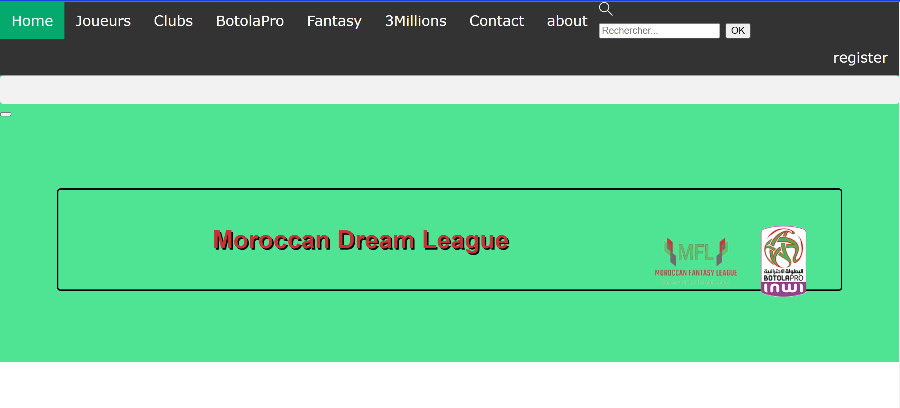
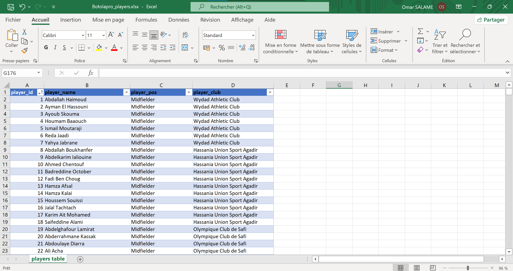
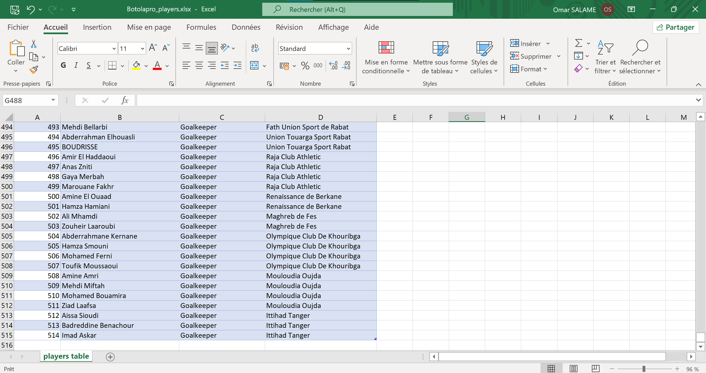
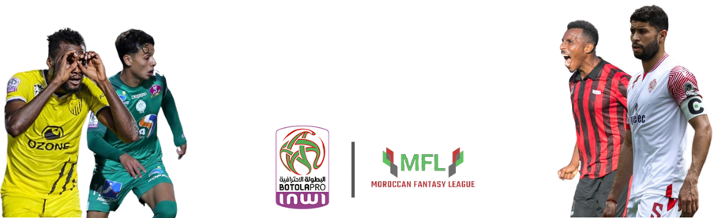
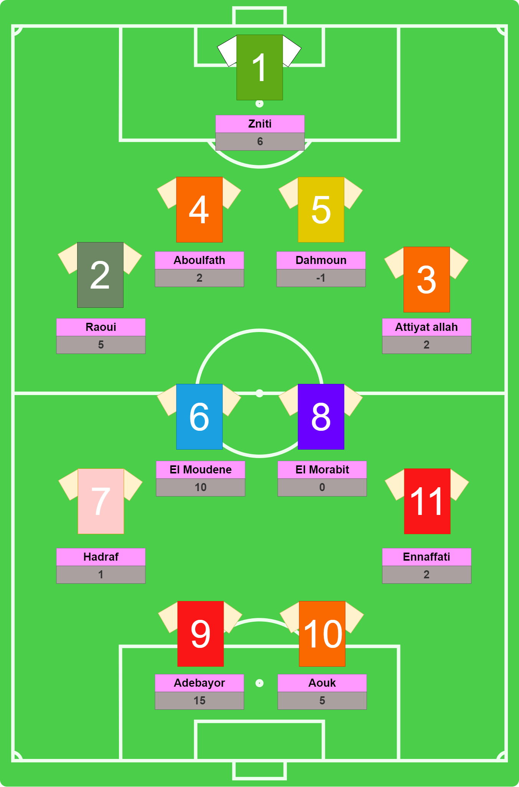
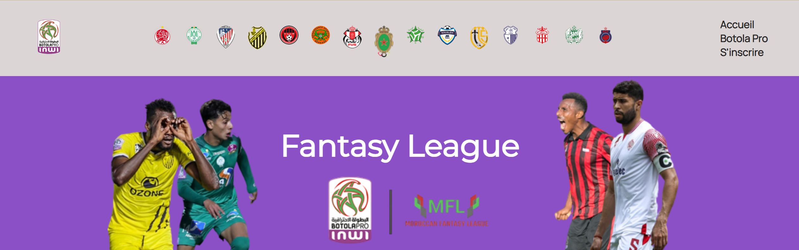
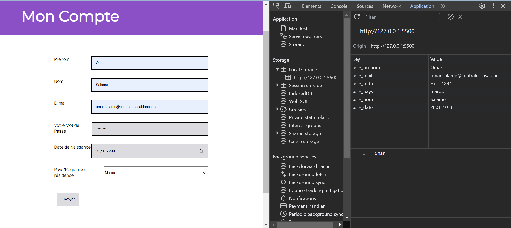

## Objectifs
- **Créer un site web interactif**: L'objectif principal est de développer un site web attrayant et interactif pour les fans de football fantasy.

- **Intégration de données en temps réel** : Intégrer des données en temps réel sur les joueurs, les équipes, les scores, etc., pour que les utilisateurs puissent suivre les performances de leurs équipes de fantasy en direct.

- **Gestion d'équipes** : Permettre aux utilisateurs de créer, gérer et personnaliser leurs équipes de fantasy.

- **Système de points** : Mettre en place un système de points pour noter les performances des joueurs de fantasy en fonction de leurs performances réelles sur le terrain.

## Plan d'action
1. **Conception** :
- Créer une maquette du site web pour planifier la disposition et l'apparence.()
- Définir la structure HTML de base pour chaque page.

2. **Développement Front-End**:
- Utiliser HTML pour créer la structure des pages.
- Appliquer le style à l'aide de CSS pour rendre votre site web attrayant.
- Utiliser JavaScript pour rendre votre site web interactif, notamment pour la gestion d'équipes et le système de points.

3. **Intégration de données** :
- Intégrer des données en temps réel, telles que les scores de matchs et les statistiques de joueurs, en utilisant des API ou des bases de données.

4. **Gestion d'utilisateurs** :
- Mettre en place un système d'authentification et de gestion des utilisateurs.

## Premier Sprint

- Création d'une base de données des équipes et joueurs de la Botola Pro.
- Initialisation à l HTML CSS

## Deuxième Sprint
J'ai fais un webscrapping pour collecter les données de la ligues(équipes, joueurs...). La difficulté que j'ai rencontré c'est que les données ne sont pas centralisées en un endroit. Donc j'ai utilisé differents site web pour la collecte des données.
:-------------------------:|:-------------------------:
 | 
J'ai travaillé sur le désigne de la page: 
- Création d'un poster pour la ligue

-Modélisation du terrain

- Restructuration de la page d'accueil

- L'ajout d'une page d'identification (les données sont stockées localement)

