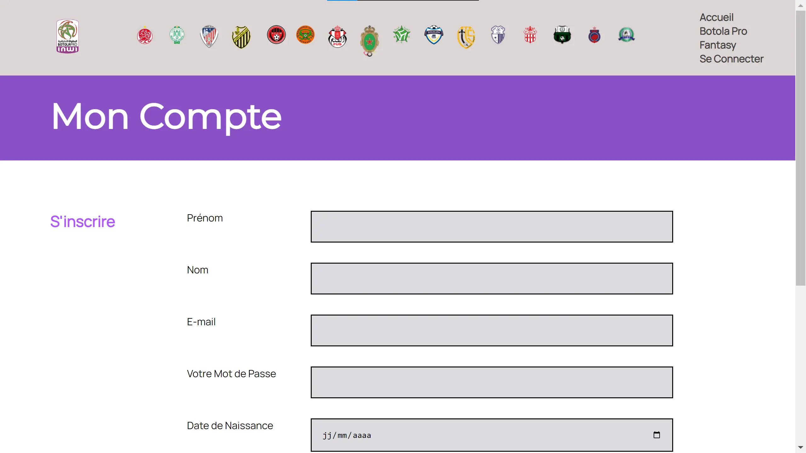
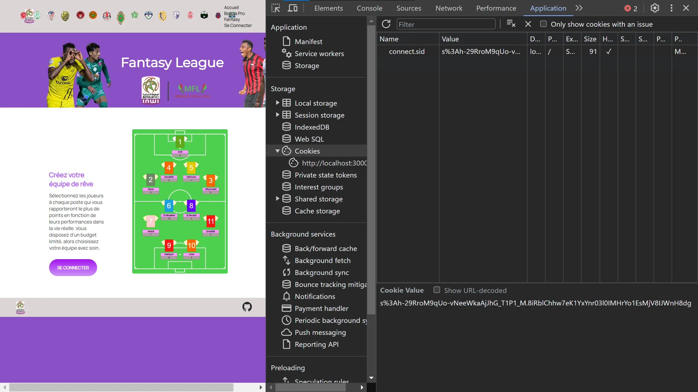


[Le Github du POK](https://github.com/Omar-Salame/football-fantasy)

## Sommaire

1. [Présentation du projet](#section-1)
2. [Objectifs](#section-2)
3. [Premier Sprint](#section-3)
4. [Deuxième Sprint](#section-4)
    - [Base de données](#subsection-1)
    - [Front](#subsection-2)
    - [Back](#subsection-3)
5. [Récapitulatif de l'avancement du projet et prochaines étapes](#section-5)

## Présentation du projet 
Le *fantasy football* est un jeu de gestion d'équipe virtuelle qui permet aux passionnés de football de créer leurs propres équipes imaginaires en sélectionnant des joueurs réels. Ces équipes virtuelles concourent en parallèle avec les performances réelles des joueurs sur le terrain. Les participants marquent des points en fonction des performances de leurs joueurs, notamment les buts marqués, les passes décisives, les clean sheets et d'autres statistiques de jeu. Le fantasy football ajoute une dimension stratégique et compétitive aux compétitions de football, permettant aux participants de gérer leur équipe, de faire des transferts de joueurs, et de rivaliser avec d'autres managers.

Dans le cas de mon POK, ce concept est appliqué spécifiquement à la ligue marocaine de football, la **INWI Botola Pro1**. Les fans de cette ligue auront la possibilité de créer leurs propres équipes virtuelles composées de joueurs de la INWI Botola Pro1, de participer à des ligues, de suivre en temps réel les performances des joueurs et de rivaliser pour le classement en fonction des performances réelles des joueurs dans la ligue. Cette plateforme offre une expérience immersive pour les amateurs de football marocain, combinant leur passion pour le sport avec des éléments de compétition et de gestion d'équipe.

## Objectifs 

1. **Conception** :
- Créer une maquette du site web pour planifier la disposition et l'apparence.
- Définir la structure HTML de base pour chaque page.

2. **Développement Front-End**:
- Utiliser HTML pour créer la structure des pages.
- Appliquer le style à l'aide de CSS pour rendre votre site web attrayant.
- Utiliser JavaScript pour rendre votre site web interactif, notamment pour la gestion d'équipes et le système de points.

3. **Intégration de données** :
- Intégrer des données en temps réel, telles que les scores de matchs et les statistiques de joueurs, en utilisant des API ou des bases de données.

4. **Gestion d'utilisateurs** :
- Mettre en place un système d'authentification et de gestion des utilisateurs.

## Premier Sprint 
- Initialisation à l HTML CSS
:-------------------------:|:-------------------------:
 | 

## Deuxième Sprint 

### Base de données
J'ai fais un webscrapping pour collecter les données de la ligues(équipes, joueurs...). La difficulté que j'ai rencontré c'est que les données ne sont pas centralisées en un endroit. Donc j'ai utilisé differents site web pour la collecte des données.
:-------------------------:|:-------------------------:
 | 

 ### Front 
J'ai travaillé sur la création d'un poster pour la ligue, la modélisation du terrain, puis la restructuration de la page d'accueil:
:-------------------------:|:-------------------------:
 | 

J'ai principalement utiliser du HTML et CSS pour le developpement du front:
:-------------------------:|:-------------------------:
|

|

Après avoir suivi une formation en JavaScript, j'ai implémenté une fonction d'authentification (pour l'instant locale):

Ensuite, j'ai ajouté la fonctionnalité de sélectionner les joueurs pour ton équipe. Jusqu'à ce stade, toutes les fonctionnalités sont purement visuelles et aucune n'est encore opérationnelle.

### Back 
Pour mon deuxieme MON, j'ai acquis des connaissances de base en utilisant Node.js, Express, et MongoDB. J'ai ensuite mis en pratique ces compétences pour développer la partie backend de mon site. Cela m'a permis de créer une structure solide pour gérer les données, les requêtes, et les fonctionnalités interactives de la plateforme, en assurant ainsi une expérience utilisateur complète et fonctionnelle.

J'ai initié le processus en établissant la première connexion avec MongoDB, en mettant en place une base de données login pour gérer les connexions et en créant une collection user.

Le problème réside dans le fait que, même si le formulaire de création de compte est associé à MongoDB, l'authentification reste impossible. Pour remédier à cela, il était nécessaire de mettre en place une session, d'où ma décision d'utiliser la méthode des sessions et des cookies.

## Récapitulatif de l'avancement du projet et prochaines étapes 

J'ai pu rassembler les bases de données, développer le frontend, ainsi que la fonctionnalité d'authentification pour le backend de mon projet. Il me reste encore à mettre en place la fonctionnalité de création d'équipe du côté backend, à concevoir un système de points, et éventuellement à permettre la comparaison des points entre les utilisateurs pour compléter l'ensemble des fonctionnalités souhaitées.

