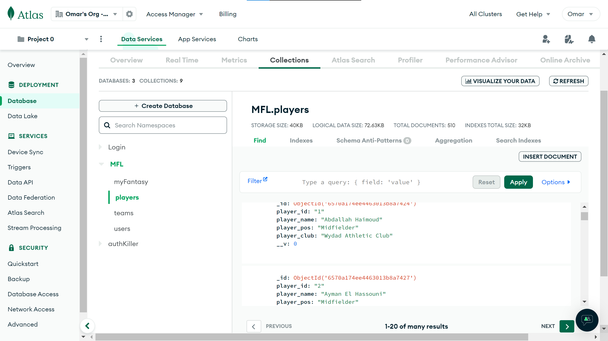
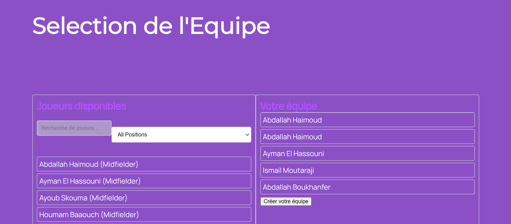
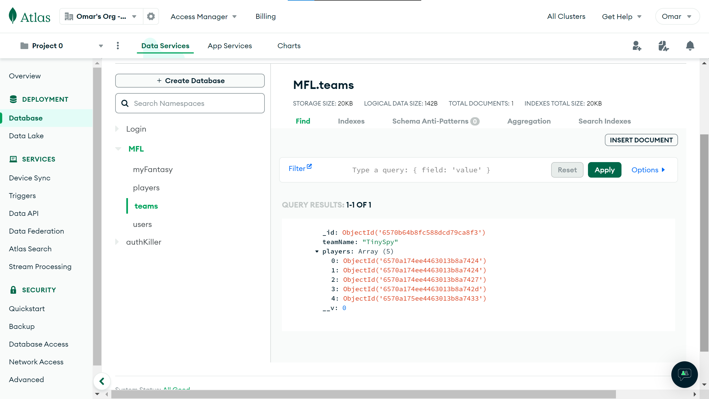


[Le Github du POK](https://github.com/Omar-Salame/football-fantasy)

## Sommaire

1. [Recap](#section-1)
2. [Sprint 1](#section-2)

## Recap<a id="section-1"></a>
Mon projet de fantasy football pour la ligue marocaine INWI Botola Pro1 a déjà accompli des étapes significatives. Jusqu'à présent, j'ai mis en place les fondations de la plateforme, en développant la structure HTML et CSS de base, en intégrant les données des joueurs et des équipes via un processus de webscraping, et en commençant à travailler sur des fonctionnalités backend telles que l'authentification des utilisateurs. J'ai également créé un design initial pour le site, y compris la modélisation du terrain et la page d'accueil. Alors que je me prépare à entamer la deuxième phase du projet, mon intention est de développer davantage la plateforme en ajoutant des fonctionnalités clés, en améliorant son esthétique et en rendant le site pleinement fonctionnel. Ce développement inclura l'implémentation d'un système de gestion d'équipes, d'un système de points basé sur les performances des joueurs, et d'une interface utilisateur améliorée pour une expérience plus immersive et compétitive pour les utilisateurs.
 
## 1er Sprint : Fonctionnalités de Base<a id="section-2"></a>
### Backlog
| Fonctionnalité                               | Description                                                                                   | Temps Estimé |
| -------------------------------------------- | --------------------------------------------------------------------------------------------- | ------------ |
| Intégration et Gestion des Données des Joueurs| Recherche et intégration d'une API appropriée pour les données des joueurs et de la ligue en temps réel. Conception et mise en œuvre de modèles/schémas de base pour stocker les données des joueurs. | 6 heures     |
| Création et Gestion d'Équipe                 | Développement de la fonctionnalité backend permettant aux utilisateurs de créer et de gérer des équipes. Mise en œuvre des opérations CRUD (Créer, Lire, Mettre à jour, Supprimer) pour la gestion d'équipe. | 8 heures     |
| Système de Points Basique pour les Joueurs   | Définition des règles et de la logique de scoring. Implémentation d'une version simple du système de points. | 4 heures     |

### Implémentation 
#### Intégration et Gestion des Données des Joueurs
Jusqu'à présent, j'ai pu avancer sur la fonctionnalité "Intégration et Gestion des Données des Joueurs". J'ai réussi à importer manuellement les données des joueurs dans la base de données MongoDB, comme une base de mon processus. Bien que l'automatisation complète ne soit pas encore mise en place, Cette étape initiale sert de fondement solide pour la suite du développement. Les prochaines étapes impliqueront la recherche et l'intégration d'une API appropriée pour garantir la mise à jour en temps réel des données des joueurs et de la ligue.
```js
const mongoose = require('mongoose');
const fs = require('fs');
const PlayerModel = require('./models/player'); 
const mongoURI = "mongodb+srv://TinySpy:@cluster0.guwuhmj.mongodb.net/MFL"
mongoose.connect(mongoURI, {
  useNewUrlParser: true,
  useUnifiedTopology: true,
});
const importPlayers = async () => {
  try {
    const data = fs.readFileSync('Botolapro_players.json');
    const players = JSON.parse(data);

    for (const playerData of players) {
      const player = new PlayerModel(playerData);
      await player.save();
    }

    console.log('Tous les joueurs ont été importés avec succès.');
  } catch (error) {
    console.error("Erreur d'importation des joueurs :", error);
  } finally {
    mongoose.disconnect();
  }
};
importPlayers();

```


#### Création et Gestion d'Équipe
J'ai fait des avancées solides dans le développement du backend pour permettre aux utilisateurs de créer et gérer leurs équipes. Maintenant, les utilisateurs peuvent créer une session sur le site et choisir les joueurs pour leur équipe. Ces choix sont enregistrés dans la base de données en stockant les id des joueurs, ce qui signifie que chaque fois qu'ils reviennent sur le site, leur équipe est là, avec les modifications qu'ils ont apportées. J'ai également implémenté les opérations CRUD (Créer, Lire, Mettre à jour, Supprimer) pour une gestion simple des équipes. En somme, la fonctionnalité backend avance comme prévu, offrant une expérience utilisateur pratique et facile d'utilisation.

:-------------------------:|:-------------------------:
|


