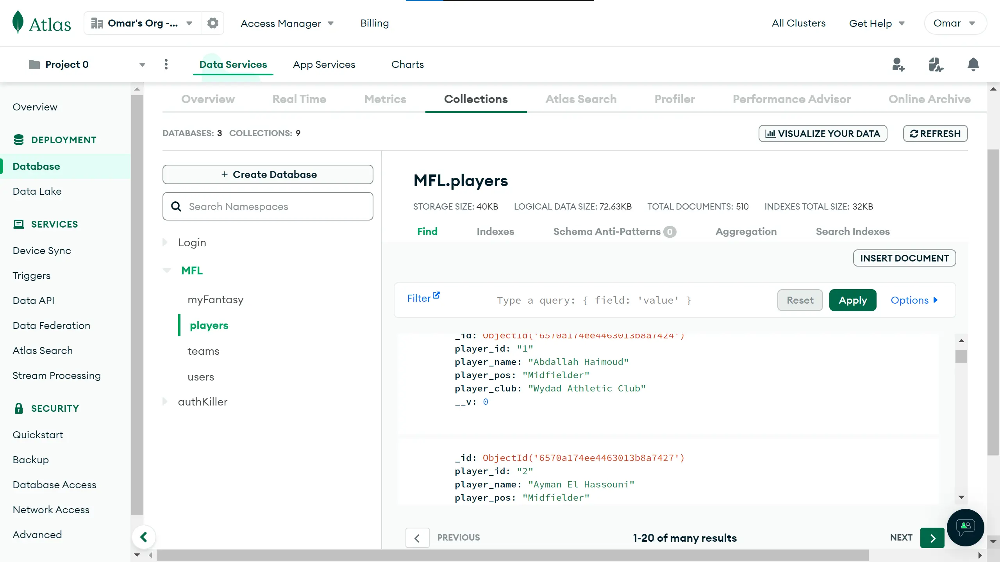
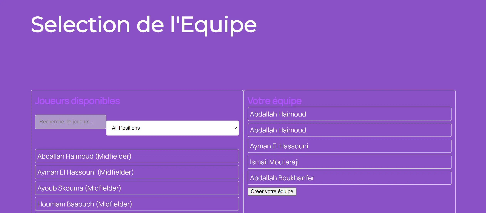
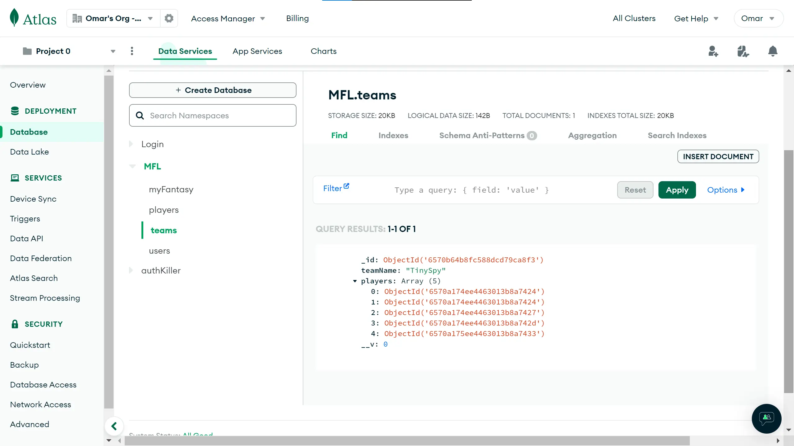
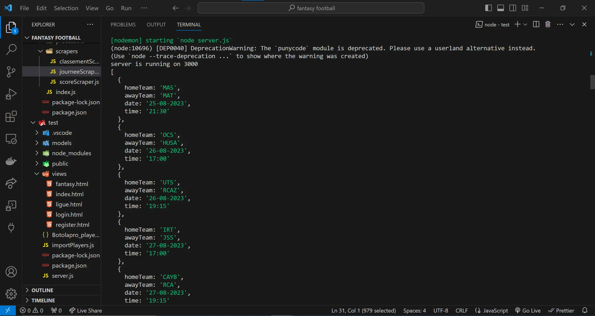
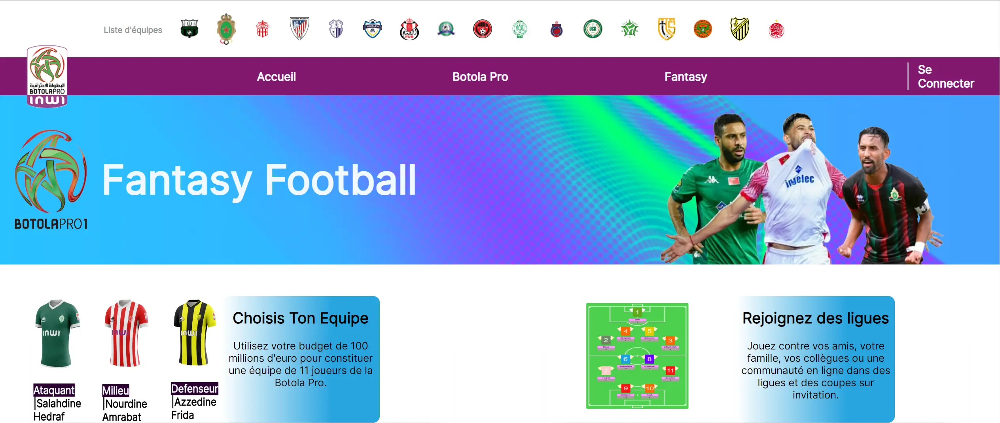
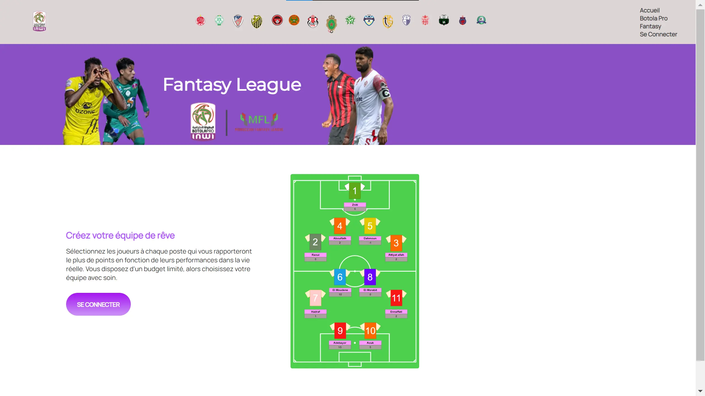
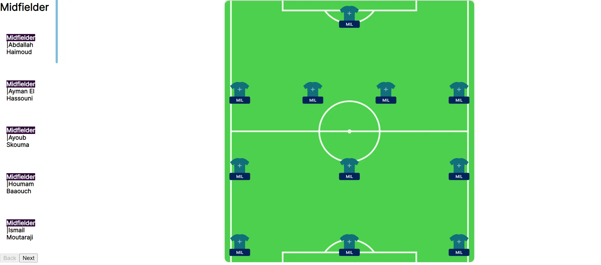
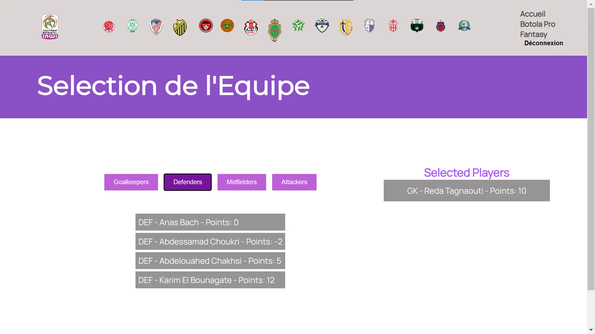
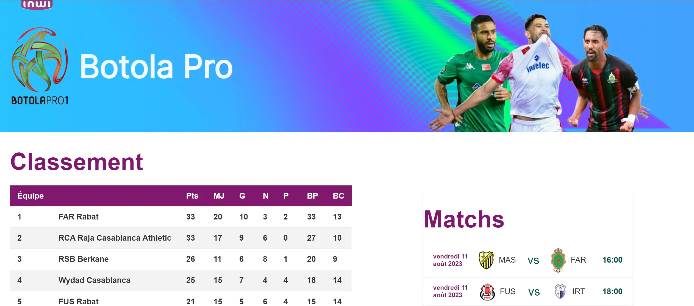


[Le Github du POK1](https://github.com/Omar-Salame/football-fantasy)
[Le Github du Front](https://github.com/Omar-Salame/football-fantasy-front)

## Sommaire

1. [Recap](#section-1)
2. [Sprint 1](#section-2)
3. [Sprint 2](#section-3)

## Recap<a id="section-1"></a>
Mon projet de fantasy football pour la ligue marocaine INWI Botola Pro1 a déjà accompli des étapes significatives. Jusqu'à présent, j'ai mis en place les fondations de la plateforme, en développant la structure HTML et CSS de base, en intégrant les données des joueurs et des équipes via un processus de webscraping, et en commençant à travailler sur des fonctionnalités backend telles que l'authentification des utilisateurs. J'ai également créé un design initial pour le site, y compris la modélisation du terrain et la page d'accueil. Alors que je me prépare à entamer la deuxième phase du projet, mon intention est de développer davantage la plateforme en ajoutant des fonctionnalités clés, en améliorant son esthétique et en rendant le site pleinement fonctionnel. Ce développement inclura l'implémentation d'un système de gestion d'équipes, d'un système de points basé sur les performances des joueurs, et d'une interface utilisateur améliorée pour une expérience plus immersive et compétitive pour les utilisateurs.
 
## 1er Sprint : Fonctionnalités de Base<a id="section-2"></a>
### Backlog
| Fonctionnalité                               | Description                                                                                   | Temps Estimé |
| -------------------------------------------- | --------------------------------------------------------------------------------------------- | ------------ |
| Intégration et Gestion des Données des Joueurs| Recherche et intégration d'une API appropriée pour les données des joueurs et de la ligue en temps réel. Conception et mise en œuvre de modèles/schémas de base pour stocker les données des joueurs. | 3 heures     |
| Création et Gestion d'Équipe                 | Développement de la fonctionnalité backend permettant aux utilisateurs de créer et de gérer des équipes. Mise en œuvre des opérations CRUD (Créer, Lire, Mettre à jour, Supprimer) pour la gestion d'équipe. | 6 heures     |
| Système de Points Basique pour les Joueurs   | Définition des règles et de la logique de scoring. Implémentation d'une version simple du système de points. | 1 heures     |

### Implémentation 
#### Intégration et Gestion des Données des Joueurs
Jusqu'à présent, j'ai pu avancer sur la fonctionnalité "Intégration et Gestion des Données des Joueurs". J'ai réussi à importer manuellement les données des joueurs dans la base de données MongoDB, comme une base de mon processus. Bien que l'automatisation complète ne soit pas encore mise en place, Cette étape initiale sert de fondement solide pour la suite du développement. Les prochaines étapes impliqueront la recherche et l'intégration d'une API appropriée pour garantir la mise à jour en temps réel des données des joueurs et de la ligue.
```js
const mongoose = require('mongoose');
const fs = require('fs');
const PlayerModel = require('./models/player'); 
const mongoURI = "mongodb+srv://TinySpy:@cluster0.guwuhmj.mongodb.net/MFL"
mongoose.connect(mongoURI, {
  useNewUrlParser: true,
  useUnifiedTopology: true,
});
const importPlayers = async () => {
  try {
    const data = fs.readFileSync('Botolapro_players.json');
    const players = JSON.parse(data);

    for (const playerData of players) {
      const player = new PlayerModel(playerData);
      await player.save();
    }

    console.log('Tous les joueurs ont été importés avec succès.');
  } catch (error) {
    console.error("Erreur d'importation des joueurs :", error);
  } finally {
    mongoose.disconnect();
  }
};
importPlayers();

```


#### Création et Gestion d'Équipe
J'ai fait des avancées solides dans le développement du backend pour permettre aux utilisateurs de créer et gérer leurs équipes. Maintenant, les utilisateurs peuvent créer une session sur le site et choisir les joueurs pour leur équipe. Ces choix sont enregistrés dans la base de données en stockant les id des joueurs, ce qui signifie que chaque fois qu'ils reviennent sur le site, leur équipe est là, avec les modifications qu'ils ont apportées. J'ai également implémenté les opérations CRUD (Créer, Lire, Mettre à jour, Supprimer) pour une gestion simple des équipes. En somme, la fonctionnalité backend avance comme prévu, offrant une expérience utilisateur pratique et facile d'utilisation.

:-------------------------:|:-------------------------:
|

#### Système de Points pour Fantasy League

Le tableau suivant décrit le système de points utilisé dans la fantasy league :

| Action du Joueur        | Points Attribués |
|-------------------------|------------------|
| But marqué              | 5 points         |
| Passe décisive          | 3 points         |
| Carton jaune            | -1 point         |
| Carton rouge            | -3 points        |
| But contre son camp     | -2 points        |
| Arrêt de pénalty        | 5 points         |
| Gardien - But encaissé  | -1 point par but |
| Défenseur - But encaissé | -0.5 point par but |
| Match sans encaisser de but (Défenseur/Gardien) | 4 points |
| Plus de 60 minutes jouées (Joueur) | 1 point  |
| Moins de 60 minutes jouées (Joueur) | 0 point |


- Les points sont attribués en fonction des performances des joueurs durant chaque match.
- Le total des points pour chaque joueur est calculé à la fin du match et ajouté à son score total dans la ligue.
- Les décisions de l'arbitre sur le terrain sont finales pour l'attribution des points liés aux cartons et aux buts.


#### Intégration et Gestion des Données de la Botola Pro
Pour l'intégration des données de la ligue, j'ai rencontré quelques difficultés car mon plan initial était de rechercher et d'intégrer une API appropriée pour les données en temps réel des joueurs et de la ligue. Cependant, la ligue marocaine n'est pas avancée dans ce domaine et l'accès à une API serait payant. Par conséquent, j'ai modifié ma méthode tout en conservant le même objectif. Je vais utiliser le web scraping pour extraire les données du site web, notamment les statistiques des joueurs et des équipes, ainsi que les scores et le classement de tous les matchs. J'ai utilisé le [site officiel de la Botola Pro](https://site.frmf.ma/fr/competitions/botola-d1/) pour obtenir toutes les données dont j'avais besoin:

```js
const axios = require('axios');
const cheerio = require('cheerio');

async function scrapeJournee(url) {
    try {
        const { data } = await axios.get(url);
        const $ = cheerio.load(data);
        const fixtures = [];

        $(".style-table-7.cs7-1 tr").each((index, element) => {
            if (index === 0) return; 

            const tds = $(element).find('td');
            const homeTeam = $(tds[0]).text().trim();
            const awayTeam = $(tds[3]).text().trim();
            const date = $(tds[4]).text().trim();
            const time = $(tds[5]).text().trim();

            fixtures.push({ homeTeam, awayTeam, date, time });
        });

        return fixtures;
    } catch (error) {
        console.error(`Error scraping fixtures: ${error}`);
        return [];
    }
}

const url = 'https://botolapro.gestfootball.com/fr/p4755/#1560926979862-d8bdd234-a3403';
scrapeJournee(url).then(fixtures => console.log(fixtures));
```


## 2eme Sprint: Développement Front<a id="section-3"></a>

### Backlog

| Tâche                                    | Sous-Tâches                                                                                   | Durée Estimée | Durée Réelle |
| -----------------------------------------| ----------------------------------------------------------------------------------------------| --------------|--------------|
| ~~Transition HTML vers React~~            | 1. Analyse des pages HTML/CSS existantes.<br>2. Création des composants React correspondants.<br>3. Intégration des composants dans l'architecture React. | 2 heures      |              |
| Création de Composants React             | 1. Conception de composants pour la navigation.<br>2. Développement de composants pour l'affichage des joueurs.<br>3. Création de composants pour la gestion d'équipe. | 2 heures      |  3 heures            |
| Mise en Page et Design                   | 1. Adaptation du design pour React.<br>2. Amélioration du responsive design.<br>3. Personnalisation des styles avec CSS. | 2 heures      |   2 heures           |
| Système de Sélection de Joueurs          | 1. Conception de l'interface de sélection des joueurs.<br>2. Implémentation de la logique de sélection/désélection.<br>3. Intégration avec la gestion d'équipe. | 2 heures      |   4 heures           |
| Intégration des Données avec React       | 1. ~~Configuration de l'API pour récupérer les données.~~<br>2. Mise en place de l'état des composants pour gérer les données.<br>3. Affichage des données dans les composants. | 1 heure       |  2 heures            |
| Styling des Composants                   | 1. Définition des styles de base pour les composants.<br>2. Adaptation des styles pour différents appareils.<br>3. Optimisation de l'expérience utilisateur. | 1 heure       |  30 min            |

### Apperçu du Front
:-------------------------:|:-------------------------:
|
|
|
