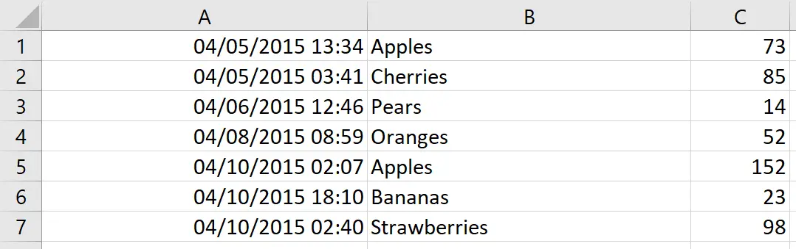
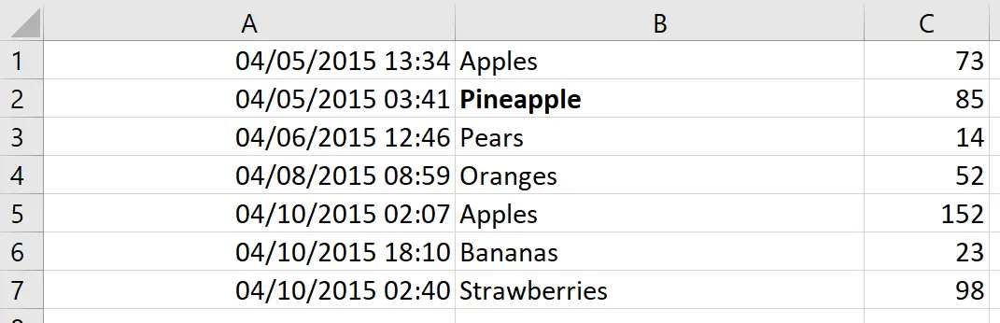
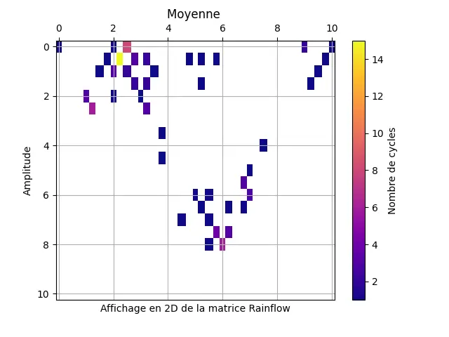
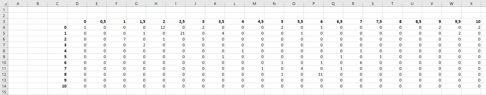
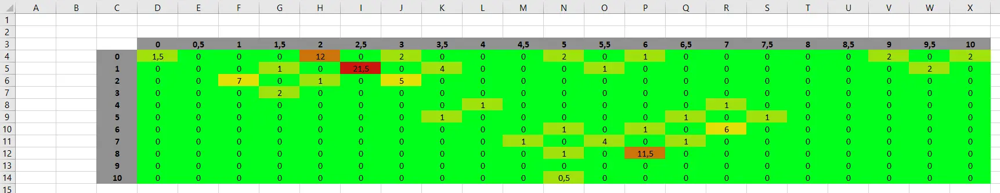

## Sommaire

I. Introduction

II. Présentation de *openpyxl*

III. Mise en pratique 

IV. Conclusion

## I. Introduction

Lors de ce deuxième MON de l'année j'ai suivi le chapitre 13 du livre **Automate the boring stuff with Python** pour travailler sur les documents Excel depuis Python grâce à la bibliothèque *openpyxl*.

Ce dernier est disponible [ici](https://automatetheboringstuff.com/2e/chapter13/).

J'ai voulu suivre cette formation car lors de mon stage 2A j'ai principalement travaillé sur un code Python pour étudier des cycles de pression dans des canalisations. Ces dernières étaient initialement stockées dans un tableau Excel, j'ai donc dû utiliser quelques fois la bibliothèque *openpyxl* mais uniquement quelques lignes, je n'ai pas eu le temps de rentrer en détail et de vraiment comprendre le fonctionnement et les bonnes habitudes à avoir pour optimiser son utilisation. 

## II. Présentation de *openpyxl*

La bibliothèque python *openpyxl* est utilisée pour la lecture et la modification des tableaux Excel, cette dernière facilite l'utilisation et donc l'automatisation de nombreuses tâches 

### Initialisation et lecture des données

*openpyxl* n'est initialement pas dans Python il faut donc commencer par l'installer.

```python
pip install openpyxl
```

Une fois installée et opérationnelle il faut écrire sur quel document Excel nous souhaitons travailler. Pour cela on utilise `openpyxl.load_workbook()` si le document existe déjà ou `openpyxl.Workbook()` pour en créer un. 

Pour travailler sur un document il faut comprendre comment Python visualise ce dernier. Les deux métohdes précédentes créent une donnée de type *worbook*, mais ce n'est pas celle-ci qui nous intéresse, elle sert uniquement à dire à Python où regarder et quel document lire/modifier. 

Un *workbook* est tout d'abord divisé en plusieurs *sheets* (feuilles). Et chaque *sheet* est divisé en de multiples *cells* (cellules). 

Une cellule est caractérisée par : 
- une valeur : **value** (texte, date, nombre,...)
- une ligne : **row** (1,2,3,...)
- une colonne : **column** (A,B,C,...)
- des coordonnées : [**column**+**row**] (A7,B12,...)

Tout comme pour le document, il faut indiquer à Python quelle feuille sélectionner. Un exemple de début de code sur *openpyxl* va avoir cette forme : 

```python
import openpyxl

table = openpyxl.load_workbook('mon_excel.xlsx')

feuille1 = classeur.active()
feuille2 = table['Sheet2']
```

Ici nous avons deux manières différentes de sélectionner une feuille dans le tableau. 
- `.active()` pour celle qui s'ouvre par défaut
- `nom_document['nom_sheet']` pour en sélectionner une précisément.

Cependant la deuxième méthode nécessite de connaître le nom des différentes feuilles et donc d'avoir le document sous les yeux ce qui est contraignant pour une optimisation. Pour contrer cela on peut utiliser `nom_document.sheetnames` qui renvoie une liste avec le nom de chaque feuille de `nom_document`.

Une fois bien initialisé nous pouvons enfin lire des cellules. Pour cela il faut utiliser `.value`.

```python
cell1 = feuille1['A7']
cell2 = feuille1.cell(row=7, column=1)

valeur1 = cell1.value
valeur2 = cell2.value
```
Les 2 façons précédentes permettent de lire et de stocker les valeurs d'une cellule. Ici on a évidemment *valeur1* = *valeur2*.



NB : Contrairement à de nombreuses données comme les listes, les *array* et les boucles *for*, les coordonnées d'une feuille commencent par 1 et non 0.




La seconde méthode est plus facile à utiliser avec des boucles car elle utilise uniquement des nombres et non des lettres, même si le problème est évitable grâce à `get_column_letter()` et `column_index_from_string()`. 

### Écriture et modification de données

Maintenant que nous savons comment lire efficacement un tableau Excel nous allons chercher à le modifier depuis Python. 

La modification de la valeur d'une cellule se fait très facilement à l'aide une nouvelle fois de `.value`. 

Pour l'exemple nous avons initialement ce tableau : 



Nous pouvons donc en utilisant la méthode précédent modifier une cellule en particulier comme par exemple la B2 et ainsi avoir : 



Cependant notre valeur est désormais écrite en gras, comment cela se fait-il ? 

En effet en plus de simplement modifier la valeur nous pouvons modifier le style. Le code utilisé pour passer d'un tableau à l'autre a ici été :

```python
import openpyxl
from openpyxl.styles import Font

wb = openpyxl.load_workbook('test1.xlsx')
sheet = wb.active
c1 = sheet.cell(row=2, column=2)

c1.value = "Pineapple"
c1.font = Font(bold=True)

wb.save('test1.xlsx')
```

L'importation de la classe **Font** issue de la bibliothèque *openpyxl.styles* permet de modifier le style de la police d'écriture. Le code modifie donc initialement la valeur de la cellule ***c1*** grâce à la ligne `c1.value = "Pineapple"` avant de la mettre en gras avec `c1.font = Font(bold=True)`. 

La dernière ligne du code quant à elle permet de sauvegarder les modifications. 



**Attention** cependant au nom de fichier utilisé pour la sauvegarde, ici le nouveau document va prendre la place de l'ancien ! Il est donc recommandé d'utiliser un nouveau nom pour ne pas écraser les données et revenir en arrière en cas de problème.



De nombreux paramètres sont modifiables grâce à *openpyxl.styles* comme la police, l'alignement, les couleurs,...
Il est également possible de fusionner des cellules et modifier leurs tailles. 


L'utilisation de Python pour automatiser les tableaux Excel peut être extrêmement utile mais il ne faut pas oublier que de nombreuses formules Excel existent déjà et rien ne sert d'écrire une fonction Python qui peut se faire directement depuis Excel. Par exemple si nous possédons une colonne de nombres et que nous souhaitons sommer ces derniers, il est plus rapide d'écrire une cellule avec `cellule_somme.value = '=SUM(A1:A12)'` que d'écrire :
```python
somme = 0
for i in range(1,12) :
  cell = sheet.cell(row=i, column=1)
  somme+=cell.value

cellule_somme.value = somme
```

## III. Mise en pratique 

Afin d'utiliser les différentes méthodes vues précédemment je vais reprendre le code sur lequel je travaillais lors de mon stage et pour lequel j'ai à peine utilisé *openpyxl*. 

Mon code sert à étudier des relevés de pression dans des canalisations, les données initiales que j'avais étaient donc un tableau Excel avec une colonne de dates et une autre de pressions. 

Après avoir importé les données dans Python et après de nombreux calculs j'obtenais un tableau correspondant à une matrice que j'affichais grâce à la bibliothèque *matplotlib.pyplot*. 



Le tableau derrière cette matrice est rangé sous forme d'*array* dans mon code mais il peut être utile de l'avoir en Excel pour visualiser et le manipuler plus facilement pour les clients. 



``` python
def convert_excel (matrice, chemin_fichier) :
    """ Permet d'enregistrer une matrice dans un tableau Excel.

        Paramètre
        ---------
        matrice : np.array
            Matrice Rainflow avec en première colonne
            et en première ligne les échelles.

        Return
        ------
        None
    """
    # Créer un nouveau classeur Excel :
    classeur = openpyxl.Workbook()
    feuille = classeur.active

    # Parcourir la matrice et insérer les valeurs dans les cellules :
    for i, ligne in enumerate(matrice):

        for j, valeur in enumerate(ligne):
            if i > 0 or j > 0 :
                cellule = feuille.cell(row=i+3, column=j+3)
                cellule.value = valeur
                if i == 0 or j == 0 :
                    cellule.font = Font(bold=True)
    classeur.save(chemin_fichier)
```


On obtient alors le tableau Excel suivant : 



Afin de le rendre plus visuel nous allons recréer une mise en page conditionnelle afin de recréer la matrice colorée obtenue sur Python. 



```python
def convert_excel (matrice,chemin_fichier) :
    """ Permet d'enregistrer une matrice dans un tableau Excel.

        Paramètre
        ---------
        matrice : np.array
            Matrice Rainflow 'Amplitude-Moyenne' avec en première colonne
            et en première ligne les échelles.

        Return
        ------
        None
    """
    # Créer un nouveau classeur Excel :
    classeur = openpyxl.Workbook()

    feuille = classeur.active
    liste_nbr_cycles = []
    # Parcourir la matrice et insérer les valeurs dans les cellules :
    for i, ligne in enumerate(matrice):

        for j, valeur in enumerate(ligne):
            if i > 0 or j > 0 :
                cellule = feuille.cell(row=i+3, column=j+3)
                cellule.value = valeur
                liste_nbr_cycles.append(valeur)
                if i == 0 or j == 0 :
                    cellule.font = Font(bold=True)
                    
                if valeur == 0 :
                    cellule.value = 0 
        
    max_nbr_cycles = max(liste_nbr_cycles)

    for i, ligne in enumerate(matrice):

        for j, valeur in enumerate(ligne):
            if i > 0 or j > 0 :
                cellule = feuille.cell(row=i+3, column=j+3)
                cellule.alignment = Alignment(horizontal = "center", vertical = "center")
                if valeur >= 0.9*max_nbr_cycles :
                    cellule.fill=PatternFill("solid", start_color="CC160C")
                elif valeur<0.9*max_nbr_cycles and valeur>=0.5*max_nbr_cycles :
                    cellule.fill=PatternFill("solid", start_color="CC730C")
                elif valeur<0.5*max_nbr_cycles and valeur>=0.2*max_nbr_cycles :
                    cellule.fill=PatternFill("solid", start_color="E3DF07")
                elif valeur<0.2*max_nbr_cycles and valeur>0 :
                    cellule.fill=PatternFill("solid", start_color="A1E00D")
                else :
                    cellule.fill=PatternFill("solid", start_color="00FF1B")
                    
                if i == 0 or j == 0 :
                    cellule.fill=PatternFill("solid", start_color="919191")

    classeur.save(chemin_fichier)              
```





## IV. Conclusion

A travers ce MON j'ai pu mieux comprendre la bibliothèque *openpyxl* de Python et ainsi être plus apte à utilier facilement ce langage pour automatiser les tableaux Excel qui sont extrêmement présents dans le monde professionel. 

J'en ai profité pour améliorer le code de mon précédent stage et plonger plus en détail dans l'affichage des résultats. 

### Sources 
- *OpenPyxl - a Python library to read/write Excel 2010 xLsx/xlsm files — OpenPyXl 3.1.2 documentation*. https://openpyxl.readthedocs.io/en/stable/
- *Automate the boring stuff with Python*. https://automatetheboringstuff.com/2e/chapter13/