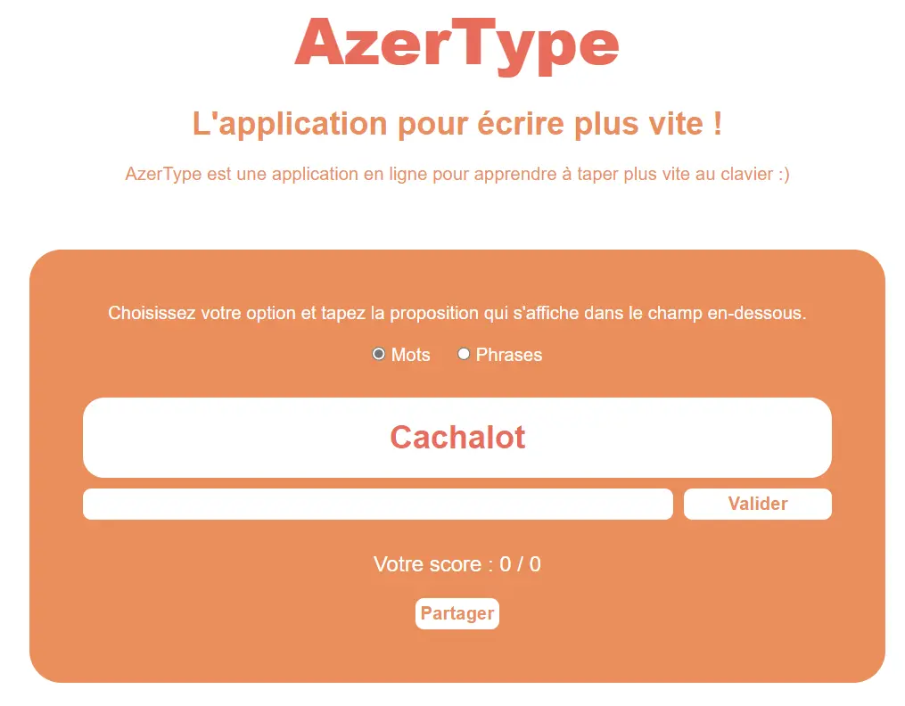
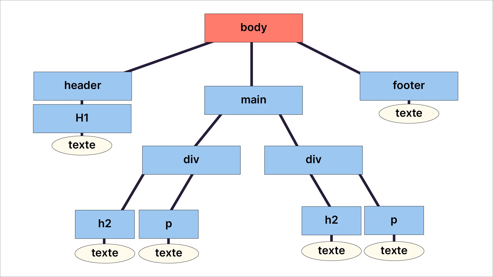

## Objectifs


Ce premier MON du temps 2 a pour objectif de m'initinier à la partie back d'un site Web pour m'aider dans la réalisation des sites web de mon POK et du projet 3A. 

Pour cela je vais suivre les cours de monsieur Brucker sur son site internet ainsi que les  sources qu'il recommande. 

## I. Initiation théorique à JavaScript


Pour bien utiliser Node.js je dois me mettre à niveau en JavaScript. Grâce au projet 3A et aux cours d'info de Do_It j'ai pu expérimenter quelques fois ce langage mais j'ai encore beaucoup trop de lacunes et trop peu de connaissances. Je vais donc tout d'abord revoir les bases de ce langage pour mieux appréhender Node.js et toute la partie back. 

JavaScript peut être utilisé en *front* et en *back* : 
- *front* : c'est le côté **client**, JS permet de rendre la page plus dynamique et de permettre à ce dernier d'interagir plus profondément avec le site
- *back* : c'est le côté **serveur**, JS permet de travailler avec des environnements comme Node.js afin de gérer tout ce qui est base de données par exemple. 

Tout comme Python, JS est un langage interprété et le code va donc s'exécuter de haut en bas en renvoyant le résultat immédiatement. Contrairement par exemple au C et au C++ qui sont compilés en langage assembleur pour ensuite être exécuté par l'ordinateur.

Le script JS se lie avec le code HTML grâce à cette ligne de code : 
``` html
<script src="script.js"></script>
```

Le fonctionnement et la syntaxe de JS sont globalement assez semblables à Python et c'est donc assez facile de prendre en main ces aspects du langage. On y retrouve de multiples similitudes : 

- l'utilisation de variables
```js 
let myVariable = 12 //déclaration de la variable
my variable = 14 //modification de la variable

const myConst = "Daniel" //déclaration d'une constante
```
- la programmation orientée objet
``` js
let monPC = {
  marque: "Dell",
  gamme: "XPS",
  couleur: "gris",
  annee: "2021"
}

let maMarque = monPC.marque //appel à une propriété
```

- les conditions et boucles
```js
if (condition){
  ...
}else{
  ...
}

for (let i = 0; i<5; i++){
  ...}

let i = 0
while(i<5){
  ...}
```

Le grand intérêt du JS est le lien avec les langages HTML et CSS. Il permet : 
- **d'ajouter des balises**
- **d'en supprimer**
- **de les modifier**

Pour cela il faut tout d'abord récupérer les éléments d'une page Web grâce aux diverses méthodes 

``` js
let baliseZone = document.getElementById("zone"); //pour récupérer un élément particulier

let baliseZoneSpan = document.querySelector("#zone span"); //pour récupérer seulement un type parmi un groupe parent (comme un div par exemple)

let listeInputRadio = document.querySelectorAll(".zoneChoix input"); //pour récupérer tous les inputs du groupe parent zoneChoix
```


Afin d'avoir une page plus dynamique il faut programmer de **manière événementielle**. Les événements peuvent être : un clic de la souris, une frappe d'un clavier, un bouton coché, ... 
Ces derniers sont écoutés grâce à *addEventListener* puis utilisés à l'aide d'une fonction *=>*

```js
monBouton.addEventListener("click", () => {
    console.log("Vous avez cliqué sur le bouton")
});
```

## II. La pratique

Afin de mettre en pratique ces différents aspects principaux du code, j'ai suivi l'exercice d'un cours OpenClassRoom pour mettre en place une application en ligne pour apprendre à taper des mots plus vite. 



Le cours proposait cette mise en page avec les codes HTML/CSS correspondant. J'ai décidé de le recréer moi-même afin de pratiquer ces langages et de m'améliorer.

Les objectifs principaux du script JS étaient de : 
- vérifier que le mot écrit est le bon et de faire augmenter le score
- faire fonctionner le bouton "Valider" pour changer de mot proposé et effacer la zone d'input
- changer entre une phrase et un mot proposé grâce aux boutons radio
- afficher un popup pour partager notre score

Début de la fonction pour lancer le jeu : 
```js
function lancerJeu() {
  initAddEventListenerPopup()
  let score = 0
  let i = 0
  let listeProposition = listeMots

  let btnValiderMot = document.getElementById("btnValiderMot")
  let inputEcriture = document.getElementById("inputEcriture")

  afficherProposition(listeProposition[i])

  // Gestion de l'événement click sur le bouton "valider"
  btnValiderMot.addEventListener("click", () => {
      if (inputEcriture.value === listeProposition[i]) {
          score++
      }
      i++
      afficherResultat(score, i)
      inputEcriture.value = ''
      if (listeProposition[i] === undefined) {
          afficherProposition("Le jeu est fini")
          btnValiderMot.disabled = true
      } else {
          afficherProposition(listeProposition[i])
      }
  })
```


En plus de cela j'ai effectué des exercices en ligne pour continuer d'améliorer mes réflexes en JS et apprendre plus de fonctionnalités. Les sites utilisés sont dans les sources après la conclusion. 

## III. Quelques principes importants pour le back


### Le JSON

Pour la manipulation de données et l'échange entre un serveur et un site web le **JSON** est le format le plus fréquemment utilisé. Il permet de représenter textuellement des objets, des tableaux ou encore des scalaires JS.

Les données en format texte sous JSON sont dites **sérialisées**. La fonction `JSON.stringify()` permet de sérialiser une donnée en chaine de caractère. 

### Le DOM

Les éléments HTML qui peuvent être récupérés par les méthodes vues précédemment représentent le **DOM** *(Document Object Model)*. L'arbre DOM est composé de **noeuds** reliés entre eux par des **branches**. Ce schéma provenant du cours sur OpenClassRoom résumer relativement bien la structure DOM : 



*image venant de : https://openclassrooms.com/fr/courses/7696886-apprenez-a-programmer-avec-javascript/8205925-recuperez-un-element-d-une-page-web*

### Les API

Les API *(Application Programming Interface)* sont des interfaces qui permettent de **récupérer** et **d'échanger** des données entre deux applications. 

### Le JavaScript asynchrone

Des fonctions longues et coûteuses en ressources de calcul peut totalement bloquer l'exécution du reste du site. Pour contrer cela la programmation asynchrone a été développée permettant d'**exécuter du code en parallèle.**

Les **fonctions de rappel** (ou *callback*) ont initié la mise en place de fonctions asynchrone en JS. Ces dernières représentent simplement *l'imbrication de fonctions*, c'est à dire quand une fonction est en argument d'une autre. Cette méthode rend cependant le code difficile à lire et facilement compréhensible. 

Les API asynchrones se basent donc désormais sur le système de ***promesse*** . 

Une **promesse** représente l'état de l'opération d'une fonction asynchrone. Il existe trois états différents : 

- *pending* : la fonction a été initiée mais pas encore terminée : la promesse est **en cours**
- *fulfilled* : la fonction a été terminée et s'est bien exécutée : la promesse est donc **validée**
- *rejected* : contrairement à *fulfilled*, cette fois-ci la fonction a échouée : la promesse est **rompue**. 

### L'API ``fetch()``

La fonction `fetch()` permet d'envoyer des **requêtes HTTP** et de **récupérer des données** sous forme d'une promesse. Elle prend comme argument un URL des ressources à récupérer et renvoie une promesse avec la réponse.

### Les réponses d'une promesse

Une fois une promesse faite il faut pouvoir l'interpréter. Pour cela on utilise deux méthodes : `then()` et `catch()`. 

La première permet de traiter les **promesses validées** tandis que la seconde est utilisées pour les **promesses rompues**.

## Conclusion 

Ce MON était initialement prévu pour faire du Node.js et du Express mais je me suis vite rendu compte que j'avais trop de lacunes sur de nombreux points majeurs de dev web et notamment en JavaScript. Je suis désormais bien plus à l'aise avec ce langage et avec les points précédemment présentés. Je n'ai pas pu énormément pratiquer ces derniers mais je compte le faire au début de mon prochain MON. 

### Sources

*La théorie :*
- https://developer.mozilla.org/fr/docs/Web/JavaScript
- https://francoisbrucker.github.io/cours_informatique/cours/web/javascript-bases/
- https://openclassrooms.com/fr/courses/7696886-apprenez-a-programmer-avec-javascript
- https://www.oracle.com/fr/database/what-is-json/#:~:text=Le%20JavaScript%20Object%20Notation%20

*Les exercices pratiqués pour le JS :*
- https://www.gchagnon.fr/cours/dhtml/exercices.html#t2
- https://aymeric-auberton.fr/academie/js/exercices 