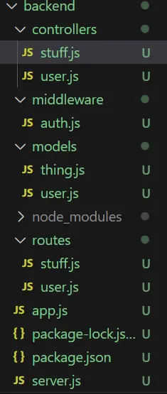

## Objectifs

Au cours du temps 2 j'ai souhaité me familiariser avec la structure **Back-end** d'un site internet. Mon premier MON aura tout d'abord été de me mettre à niveau en JavaScript et de découvrir quelques notions théoriques.

Mon second MON sera donc une manière de rentrer encore plus en détail dans ces notions et de les expérimenter. 

Pour cela j'ai suivi différents cours en ligne (les liens sont dans les sources en bas de la page).

## Définition

Le **back-end** représente tout le code s'occupant de la *partie invisible* d'un site internet, c'est-à-dire les aspects **serveur**, **gestion de données** ou encore la **sécurité**. 

Il existe différents manière de coder le back, de mon côté je vais utiliser **Node.js**, **Express** et **MongoDB** qui sont assez simples à prendre en main. 

Le langage utilisé est **JavaScript** que j'ai découvert et appris avec mon [MON 2.1](../temps-2.1/index.md) .


## Fonctionnement

Le lien entre l'utilisateur et le serveur se fait grâce à une **API** *(Application Programming Interface)* qui va nous permettre de jouer avec les données sur plusieurs critères : 
- **C**reate : *création de la donnée*
- **R**ead : *lecture de la donnée*
- **U**pdate : *mise à jour de la donnée*
- **D**elete : *suppression de la donnée*

Ce qui donne l'acronyme **CRUD** en anglais. 

Pour faire les modifications précédentes on utilise les méthodes suivantes : 
- `POST` : pour créer
- `GET` : pour lire
- `PUT` : pour mettre à jour
- `DELETE` : pour supprimer

## Création d'un serveur

Tout d'abord il faut bien ranger nos lignes de code dans deux dossiers différents : un pour le **front** et un pour le **back**. Les deux dossiers seront exécutés en parallèle pour visualiser le résultat. 

Afin de mettre en place notre premier serveur nous avons besoin de la ligne de code suivante qui va nous permettre d'importer le package ***http*** :

```js
const http = require('http'); 
```
La création de notre serveur se fait ensuite comme ceci : 

```js 
const app = http.createServer((request, response) => {
  response.end('Hello World')
})
```


Les mots *request* et *response* sont souvent raccourcis en *req* et *res*


La visualisation des résultats de nos lignes de code peut se faire en démarrant notre serveur ainsi que notre front-end en parallèle. Cependant avec Node.js on est contraints de redémarrer le serveur à chaque modification pour observer les changements.

Pour contrer cela on peut utiliser ***nodemon*** et la commande ``nodemon server`` qui redémarre le serveur automatiquement à chaque mise à jour. 

## Express

**Express** est un *framework* de Node.js conçu pour construire des applications en facilitant la gestion des routes et des échanges avec le serveur. Comme pour la création du serveur il nous faut un fichier **app.js** possédant les lignes : 
```js 
const express = require('express');

const app = express();
..


module.exports = app;
```

Notre serveur doit être lié à notre application grâce à ces quelques lignes que nous rajoutons dans le fichier **server.js** : 
```js 
const app = require('./app');

app.set('port', process.env.PORT || 3000);
const server = http.createServer(app);

server.listen(process.env.PORT || 3000);
```
La première ligne permet d'importer l'app Express tandis que la seconde précise le port sur lequel elle va être utilisée. 

### Middleware

**Express** repose principalement sur des ***middleware***. Ces derniers sont des *fonctions* qui traitent les objets *req* et *res* évoqués précédemment. 

Voici un exemple de syntaxe de middleware : 
```js
app.use((req, res, next) => {
  res.json({ message: 'Votre requête a bien été reçue !' });
  next();
});
```

La présence de la méthode ***next()*** permet de passer au middleware suivant car ces derniers sont exécutés dans l'ordre où elles sont prises en charge par la méthode *use* de l'objet serveur express.


## La base de donnée

Pour créer une base de donnée on utilise ici **MongoDB** qui est NoSQL, contrairement aux bases de données relationnelles traditionnelles, MongoDB ne conserve pas les données dans des tables, mais  dans des documents au format JSON.

Grâce à cela on peut configurer notre premier schéma de données : 
```js 
//models/thing.js
const mongoose = require('mongoose');

const objetSchema = mongoose.Schema({
  title: { type: String, required: true },
  description: { type: String, required: true },
  imageUrl: { type: String, required: true },
  userId: { type: String, required: true },
  price: { type: Number, required: true },
});

module.exports = mongoose.model('Objet', thingSchema);
```

On a ici créé un *model* correspondant à un objet à vendre sur un site. Il est ensuite possible d'intéragir avec chaque objet créé avec ce *model* : 
- ``save()``  – enregistre un objet ;
- ``find()``  – retourne tous les objets ;
- ``findOne()``  – retourne un seul objet basé sur la fonction de comparaison qu'on lui passe (souvent pour récupérer un Thing par son identifiant unique).
- ``updateOne()`` - met à jour un objet
- ``delete()`` - supprime un objet


Exemple pour modifier un paramètre d'un objet : 
```js 
exports.modifObjet = (req, res, next) => {
  const objet = new Objet({
    _id: req.params.id,
    title: req.body.title,
    description: req.body.description,
    imageUrl: req.body.imageUrl,
    price: req.body.price,
    userId: req.body.userId
  });
  Objet.updateOne({_id: req.params.id}, objet).then(
    () => {
      res.status(201).json({
        message: 'Objet modifié!'
      });
    }
  ).catch(
    (error) => {
      res.status(400).json({
        error: error
      });
    }
  );
};
```

## Structure du back

La partie back nécessite de nombreuses lignes de code qui doivent être bien organisées pour ne pas se perdre. Il est donc recommandé d'optimiser cette structure et de créer plusieurs dossiers et fichiers afin de ne pas avoir un seul documents beaucoup trop long et illisible. 




## Sources 
- https://openclassrooms.com/fr/courses/6390246-passez-au-full-stack-avec-node-js-express-et-mongodb
- https://francoisbrucker.github.io/cours_informatique/cours/web/
- https://fullstackopen.com/en/ 
