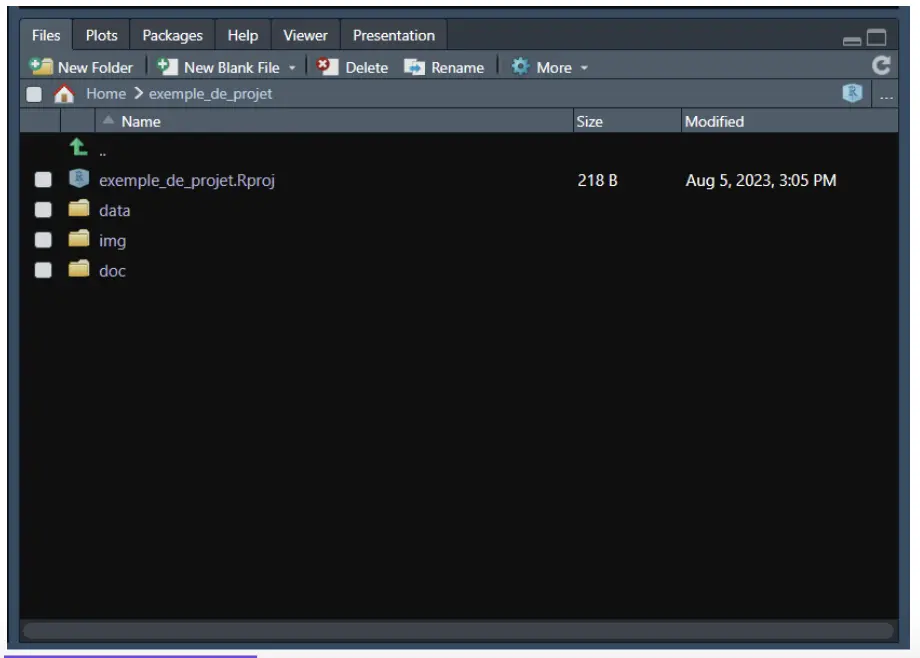
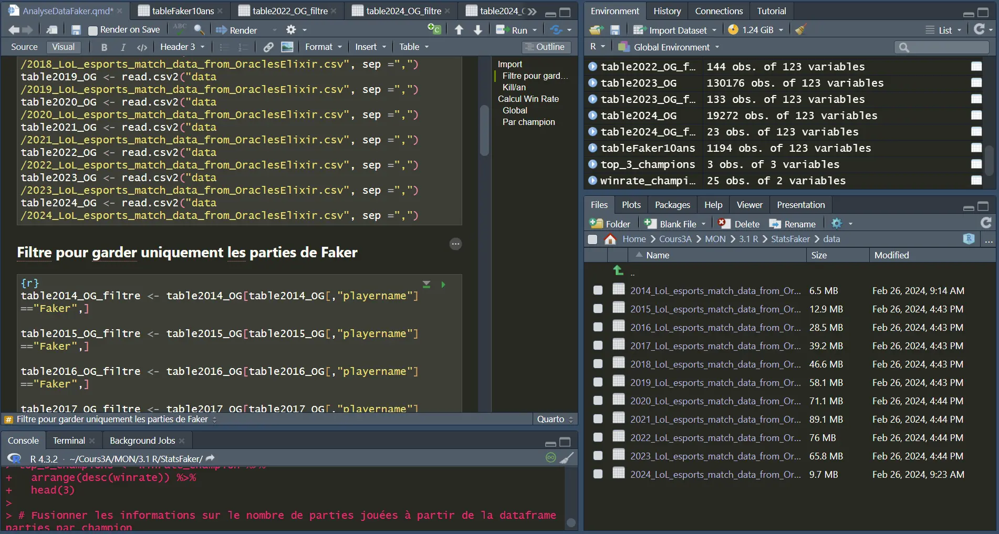
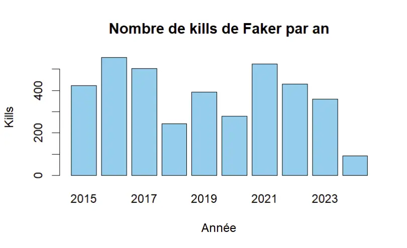
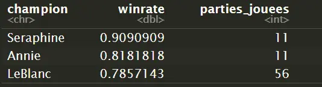

## Objectifs 
A travers ce MON je vais m'initier au langage R pour l'analyse de données. Pour cela je vais tout d'abord voir la théorie à travers des cours en ligne pour ensuite l'appliquer à un exemple précis afin de manipuler moi même.


## Initiation théorique à R 

R est un langage informatique **orienté objet** et **interprété** principalement conçu pour le traitement et l'analyse de données. Son utilisation peut également être plus poussée et permettre  de réaliser du machin learning.

Le langage est associé à un IDE (*Integrated Development Environment*) : **RStudio** pour faciliter son utilisation. 


### Syntaxe 

Pour stocker une variable on utilise le symbole `<-` : 
```r
x <- 1000
```

La manipulation mathématique d'une variable se fait ensuite traditionnellement comme en python : 
```r
x <- x + 5
y <- x*3
z <- sqrt(y)
```
Il est également possible de créer des fonctions :
```r
calculer_moyenne <- function(liste) {
  somme <- sum(liste)
  nombre_elements <- length(liste)
  moyenne <- somme / nombre_elements
  return(moyenne)
}

moyenne_resultat <- calculer_moyenne(c(4, 7, 9, 12, 5))
print(moyenne_resultat)
```

Une autre façon d'écrire les opérations existe avec l'opérateur `|>` : 

```r
12 |> log(base = 10) |> sqrt() |> exp()
# = exp(sqrt(log(12, base = 10)))
```


#### Les vecteurs et matrices 
Une liste, ou vecteur, s'écrit à l'aide de la fonction `c()` : 

```r
noms <- c("Benjamin", "Daniel", "Emma", "Romuald", "Tom", "Bastien", "Alice", "Martin", "Léa", "Dimitri")
``` 
Des opérations peuvent être effectuées directement sur les vecteurs (concaténation, opérations mathématiques, conversion, comparaison,...)

Par prolongement on peut utiliser des matrices avec la syntaxe suivante : 
```r
# Création d'une matrice
matrice_exemple <- matrix(c(10, 20, 30, 40, 50, 60), nrow = 3, ncol = 2, byrow = TRUE)
```
```css
     [,1] [,2]
[1,]   10   20
[2,]   30   40
[3,]   50   60
```
### Organisation d'un projet

Les projets d'analyse de données reposent sur plusieurs documents : 
- le code
- la documentation
- la data
- les images
- ...

On structure donc un projet sous forme de  ***Working directory***. Cela permet de communiquer avec d'autres fichiers plus facilement sans avoir à préciser les emplacements complets de ces derniers. De plus cela permet de lier un projet R avec ***Github*** plus facilement car il ne va pas dépendre de l'ordinateur utilisé. 



*from* https://openclassrooms.com/fr/courses/8248096-initiez-vous-a-r-pour-lanalyse-de-donnees/8309117-creez-votre-premier-projet-dans-r

- **data**  et éventuellement  **data_raw**  . Les données d’origine seront enregistrées dans le sous-dossier  **data_raw**  . Il ne faut jamais réenregistrer dessus, les données doivent être conservées telles quelles. Les données modifiées seront enregistrées dans le sous-dossier  **data**  .

- **img**  permet d’enregistrer au même endroit tous les graphiques ou images générés.

- **doc**  pour conserver la documentation, les rapports générés…

### Utilisation d'un fichier externe 

Le plus important pour traiter des données est de pouvoir les extraire et les analyser à partir d'un fichier externe. Pour cela il faut tout d'abord importer 

####  CSV
On utilise la fonction `read.csv()` : 
```r
table <- read.csv("table.csv", sep = ";") 
#ou
table <- read.csv2("table.csv") 
# .csv2 utilise par défaut un séparateur ";"
```

#### Excel
Pour un fichier qui n'est pas texte il faut tout d'abord importer le type de fichier, par exemple ici ***readxl*** :
```r
library(readxl)

salaire <- read_excel("data_raw/salaire.xlsx", sheet = "T1", range="B10:F352", col_names = c("SSOC 2020",	"Occupation",	"Number Covered",	"Basic  Wage", "Gross  Wage"
))
```
Ici on rentre plus de paramètres : 
- *sheet* : pour sélectionner la feuille sur laquelle on travaille 
- *range* : pour sélectionner seulement la partie des données qui nous intéressent
- *col_names* : pour insérer des titres aux colonnes (l'argument doit être un vecteur)

Une fois la table importée on lit et on modifie les données avec : 
```r
table[65, 1] <- 65
table[65, "tri"] <- 65
table$tri[65] <- 65
``` 
Ici les trois écritures permettent d'écrire la valeur 65 à la ligne 65 de la colonne 1 dont le titre est "tri". Le $ permet de descendre d’un niveau et les tableaux sont traités comme des assemblages de colonnes. 

De la même manière, on peut sélectionner toutes les lignes de plusieurs colonnes en ne mettant rien avant la virgule, et les colonnes d’intérêt listées après.
```r
# avec le nom des colonnes
mixite_groupe_edf_fr <- mixite_groupe_edf[, c("tri", "annee", "perimetre_juridique", "perimetre_spatial", "indicateur", "valeur_de_l_indicateur", "unite", "methode_de_consolidation")]

# ou la position des colonnes
mixite_groupe_edf_fr <- mixite_groupe_edf[, c(1:3, 5, 7, 9, 10, 12)]
```
### Les graphiques

Il est possible de créer un très grand nombre de graphes différents grâce à R : 
- *plot()* : la **fonction générique** qui s'adapte avec ses arguments
- *barplot()* : pour un graphique à barre 
- *pie()* : pour un graphique camembert
- *hist()* : pour un histogramme 
- ... 

## Application

A travers les cours j'ai suivi des petits exemples et exercice mais j'ai voulu appliquer la théorie à un autre groupe de données pour manipuler moi même. J'ai donc choisi de travailler sur un sujet que j'apprécie particulièrement : l'esport de *League of Legends* et plus particulièrement le plus grand joueur au monde **Faker**. 

J'ai ainsi trouvé en ligne une data base *csv* qui regroupait toutes les parties professionnelles qui ont été jouées depuis 2014 à travers les ligues et tournois principaux. 



Il y avait un *data frame* par an, je les ai donc tous importés puis filtrés pour ne garder que les parties du joueur qui m'intéresse avant de concaténer les *data frames* filtrées en un seul. 

A partir de là j'ai pu manipuler les data et afficher moi-même diverses statistiques comme le taux de victoire, l'avantage en or, ... 

Je met ici quelques exemples sans trop m'attarder dans les détails et les explications. 

### Kill par an

```r
#Calcul kill par an 
kill_year <- aggregate(kills ~ year, data = tableFaker10ans, sum)

#Création graphique à barres
barplot(kill_year$kills, names.arg = kill_year$year, 
        col = "skyblue", main = "Nombre de kills de Faker par an", 
        xlab = "Année", ylab = "Kills")
```



### K/D/A global et par champion



K/D/A = kill/deats/assists (les statistiques principales d'une joueur dans une partie)



#### Global
```r
taux_victoire <- mean(tableFaker10ans$result)
KDA <- (sum(tableFaker10ans$kills) + sum(tableFaker10ans$assists))/(sum(tableFaker10ans$deaths))
```
```r
sprintf("%.2f%%", taux_victoire * 100)
  [1] "66.75%"

print(KDA)
  [1] 4.17038
```
#### Par champion (joués minimum 10 fois)

```r
library(dplyr)

# Nombre de parties jouées par champion
games_champion <- tableFaker10ans %>%
  group_by(champion) %>%
  summarize(parties_jouees = n())

# Champions joués 10 fois ou plus
champion_10plus <- games_champion %>%
  filter(parties_jouees >= 10)

# Taux de victoire pour chaque champion
winrate_champion <- tableFaker10ans %>%
  filter(champion %in% champion_10plus$champion) %>%
  group_by(champion) %>%
  summarize(winrate = mean(result))

# Affichage top 3
top_3_champions <- winrate_champion %>%
  arrange(desc(winrate)) %>%
  head(3)

top_3_champions <- merge(top_3_champions, games_champion, by = "champion", all.x = TRUE)%>%
  arrange(desc(winrate))

print(top_3_champions)
```




## Conclusion 

R est un très bon outil pour l'analyse de data en très grand nombre, pour l'appication aux matchs compétitifs de *League of Legends* les data en *csv* s'étendaient sur des dizaines de milliers de lignes et pourtant les calculs et l'affichage de résultats se sont fait très rapidement.

La prise en main est également assez facile si on a déjà des bases en python car je trouve que les langages se ressemblent beaucoup. 

### Sources

Cours théoriques suivis :
- https://bookdown.org/ael/rexplor/chap1.html
- https://openclassrooms.com/fr/courses/8248096-initiez-vous-a-r-pour-lanalyse-de-donnees
- MON de Benoit Béguier également sur R sans GalèR juste [ici](https://francoisbrucker.github.io/do-it/promos/2023-2024/Beguier-Benoit/mon/temps-1.1/)

Data LoL : 
- https://oracleselixir.com/tools/downloads
- https://gol.gg/players/player-stats/48/season-ALL/split-ALL/tournament-ALL/
