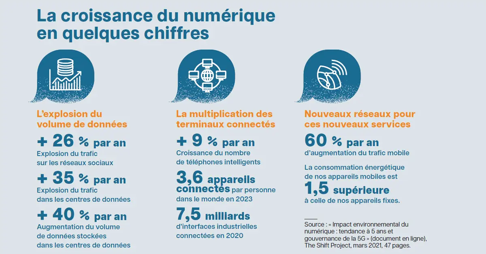
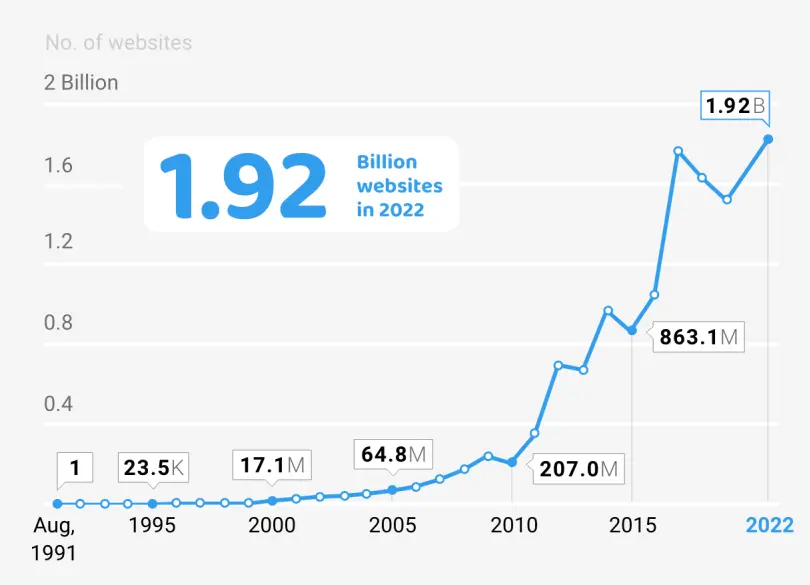
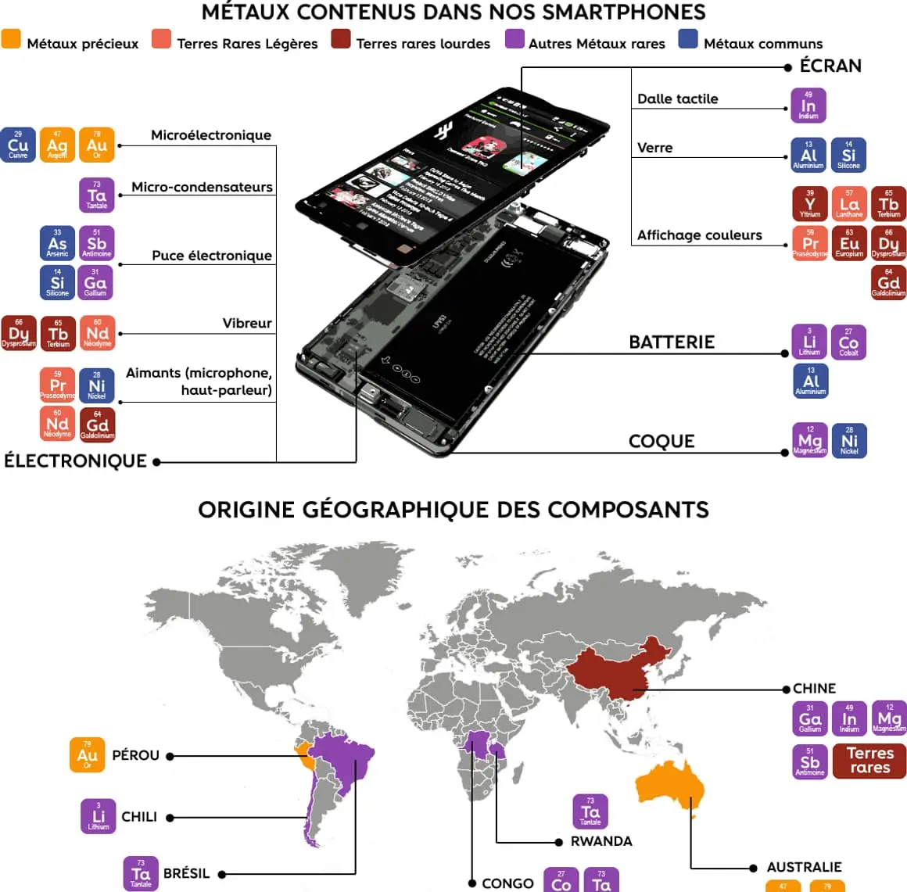
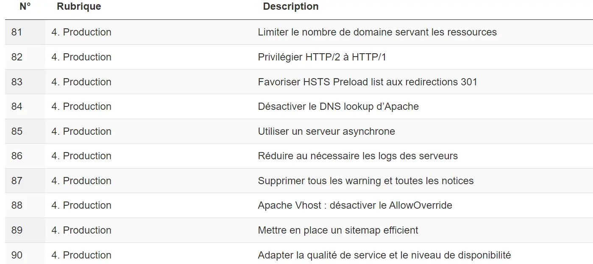

Au cours de cette année de Do-It on a beaucoup parlé du secteur numérique, que ce soit les aspects techniques, de gestion de projet et de management mais jamais l'aspect écologique. Je vais donc essayer de dresser un petit portrait du monde numérique du point de vue environnemental. Cela n'est évidemment pas complet, je m'arrête uniquement sur certains points et cet écrit n'est pas là pour critiquer et blamer telle ou telle entreprise ou pratique, mais uniquement pour pousser à la reflexion sur cet aspect de la "digitalisation" permanante qui est trop souvent oublié.

Quelques articles que j'ai utilisés sont dans les sources en bas de la page, je vous invite à en lire quelques uns si le sujet vous intéresse.

## L'obésité numérique

Sans refaire toute l'histoire, le tout premier ordinateur entièrement électronique, l'ENIAC (***Electronic Numerical Integrator And Computer***), a vu le jour en 1945. Un ordinateur pesait alors à cette époque près de 27 tonnes et nécessitant une alimentation de **150kW**. 

Au fil du temps cette puissance d'alimentation n'a cessé de diminuer : **des dizaines de kW dans les années 60** et **seulement quelques dizaines de Watt aujourd'hui.**

On pourrait alors se dire naïvement qu'une si grande diminution de la puissance nécessaire pourrait contrer l'augmentation du nombre d'appareil et ainsi permettre une stabilité énergétique du numérique. Mais la réalité en est bien loin et pour une raison : **l'obésité numérique**. 

> " En 1969 la Nasa envoyait Apollo 11 sur la lune avec à bord un ordinateur d’une capacité de 70 Ko. Le poids d’un simple mail actuel !"   
Frédérique Bordage dans Ouest France le 30/09/2019

Avec la surcharge d'informations (aussi appelée ***infobésité***) que nous vivons (Réseaux sociaux, pub, mails, notifications, ...), l'impact environnemental du numérique ne cesse d'augmenter. Le stockage et la diffusion de tout ce contenu n'est plus négligeable dans la lutte contre le dérèglement climatique. Les données sont toujours plus nombreuses et plus lourdes à cause de leur complexité technologique grandissante. 

##### Pourquoi un alourdissement des données ?

L'évolution fulgurante des technologies numérique ouvre constamment la porte à de nouvelles fonctionnalités plus ou moins utiles. Pour rendre son site plus esthétique et pousser l'utilisateur à rester dessus le plus longtemps possible, le développeur va ajouter une multitude de services, ces derniers étant signes de qualité et de confiance.    
La peur de la lassitude et de la fuite des utilisateurs force également le développeur à continuellement mettre à jour le site et à rajouter des *features*.

*from https://www.revuegestion.ca/souffre-t-on-dobesite-numerique*

Le virage numérique que prend le monde depuis deux décennies n'épargne aucun secteur. Même un simple restaurant de campagne DOIT avoir un site ou au minimum être répertorié sur Google. 

*from https://www.sales-hacking.com/post/evolution-nombre-de-sites-web*

En 10 ans (donc depuis 2014, ce n'est pas si loin que ça) le nombre de site Web a doublé dans le monde, passant de presque 1 milliard à presque 2 milliards de sites en ligne. De plus parmi ce nombre colossal, on estime que **moins de 200 millions d'entre eux sont réellement actifs**. 

## L'état de l'art de l'empreinte environnemental du numérique

Aujourd'hui le numérique dans son ensemble représente presque **5% des émissions de Gaz à effet de serre dans le monde.** Ce nombre qui peut sembler dans un premier temps pas très important est à comparer avec d'autres secteurs :

- Le transport aérien : environ 4%
- Le secteur des déchets : environ 3,7%

Cet impact environnemental non négligeable du numérique provient principalement de 3 aspects majeurs : 
- **Les outils** : environ 79% de l'empreinte carbone
- **Les Data Centers** : environ 16%
- **Les réseaux et services** : environ 5%

C'est donc la fabrication des équipements qui représente une très grande partie des émissions de GES. Comme dit précédemment le nombre d'objets connectés ne cesse d'augmenter, on parle donc d'une estimation de 7% de l'empreinte carbone mondial d'ici 2040 pour le numérique (voir même plus de 10% dans certains scenarii).

##### La face cachée des smartphones et des ordinateurs

La conception d'un ordinateur ou d'un smartphone est une horreur environnementale. Comme énormément d'objets produits dans le monde actuellement, lors de sa production un smartphone parcourt des dizaines de milliers de km.   
En plus de cela les composants, **dont plus de 50 métaux rares**, proviennent d'extraction reposant exclusivement sur l'énergie fossile. Je ne m'attarde malheureusement pas sur l'aspect social et les conditions d'extractions de ces métaux mais cela n'est bien évidemment pas négligeable. 

 Pour la conception d'un ordinateur portable de quelques kg, près de 600kg de matières premières sont utilisées. 

Les chiffres de l’ADEME (Agence de la transition écologique) montrent ainsi qu’un ordinateur de 2 kg génère en moyenne sur toute sa durée de vie 169 kg de CO2, dont 124 kg au cours de sa seule production.

> Voilà un des paradoxes du numérique, une industrie qui dématérialise en masse mais qui a besoin d’énormément de matière.  

Je me permets de reprendre cette phrase de Mathieu Brand, Journaliste indépendant spécialisé dans la transition écologique, que je trouve très représentative de cette problématique environnementale.

##### Les Data Centers, ces gros gourmands

En plus des matériaux utilisés dans la conception des outils numériques comme vu précédemment, les data centers consomment une quantité astronomique d'électricité pour faire fonctionner les serveurs mais également les refroidir sans interruption. **Les data centers chinois représentent par exemple près de 2,5% de la consommation totale d'électricité du pays.** 

Or en fonction du pays cette électricité consommée est loin d'être verte. Actuellement, les centres de données en Chine utilisent un mélange énergétique composé de 73% de charbon, 23% d'énergies renouvelables et 4% d'énergie nucléaire.

En plus de leur consommation d'électricité, les data centers sont extrêmement gourmands en eau pour refroidir les machines. 

Amazon Web Services (AWS), qui héberge un grand nombre des sites les plus visités au monde (Netflix, Spotify,...) utilise à plus de 50% de l'énergie fossile. Malgré de nombreuses promesses des GAFA de viser une neutralité carbone pour leurs data center, les problématiques environnementales sont loin d'être prioritaires. 

##### Amazon et Google faire du greenwashing ???

La neutralité carbone souhaitée par les GAFA repose principalement sur la merveilleuse **compensation carbone**. Les multinationales participent à de la "reforestation" et achètent des *crédits carbone* afin de compenser leur empreinte carbone. Comme très souvent on ne corrige pas le problème, on cherche à le cacher sous des bonnes actions et des normes qui ne veulent rien dire. 

De plus les Amazon, Google, Microsoft et autres se vantent d'acheter de l'électricité verte mais absolument rien ne peut garantir que cette dernière est bien celle consommée par leurs infrastructures. 

## Orienter le numérique vers la sobriété ? 

Il y a un an et demi, le président français nous poussait à la sobriété énergétique suite à la guerre en Ukraine. Cette sobriété doit également s'étendre au secteur numérique. Une **eco-conception du Web** qui offre des solutions informatiques plus légères et contenant moins de "features inutiles". 

Une bonne partie des étudiants de Do-It vont travailler dans la conception Web, je vous fais donc un petit top des meilleures astuces pour rendre vos sites un peu plus eco-friendly :

- Eviter les fonctionnalités et animations inutiles
- Optimiser le parcours utilisateur
- Valoriser un hébergement vert (il en existe plusieurs mais par manque de connaissances je ne vais pas en recommander ici, je vous laisse vous faire votre propre avis)

Le collectif GreenIt a listé **115 bonnes pratiques** pour eco-concevoir le plus possible un site : https://collectif.greenit.fr/ecoconception-web/115-bonnes-pratiques-eco-conception_web.html

Pour les futurs développeurs je vous laisse aller regarder cela peut être intéressant, j'espère que vous comprendrez mieux que moi les termes. 

## Conclusion

Le monde doit s'adapter aux enjeux environnementaux si nous voulons un avenir pour nous et nos potentiels enfants, et pour cela tous les secteurs doivent s'adapter y compris le numérique. Avec la "digitalisation" que nous vivons depuis 20 ans, il est nécessaire de se poser des questions écologiques sur ce nouveau monde numériques qui ne cesse de prendre de plus en plus de place dans l'empreinte carbone mondiale.   
En tant que futurs ingénieurs et surtout futurs ingénieurs travaillant dans l'IT pour une bonne partie d'entre nous, il est de notre devoir de participer à une diminution des émissions de GES provenant du numérique. 

Je ne vais pas écrire le discours classique disant qu'en s'y mettant tous au quotidien on peut faire changer les choses, mais il est vrai qu'il faut penser en continu à notre impact en tant qu'individu même lorsqu'on parle d'un monde immatériel. 

 Pensez tout de même aux classiques : vider ses mails, réparer le matériel plutôt qu'en racheter, fermer les onglets inutiles, ... 

### Sources

##### Impact du numérique 
- https://www.hellocarbo.com/blog/calculer/impact-du-numerique-sur-l-environnement/#:~:text=Qu'est%2Dce%20qui%20pollue%20le%20plus%20dans%20le%20num%C3%A9rique,qui%20constitue%20un%20chiffre%20important  
- https://jancovici.com/publications-et-co/articles-de-presse/obesite-numerique/#:~:text=Et%20non%20seulement%20le%20num%C3%A9rique,p%C3%A8sent%206%25%20des%20%C3%A9missions%20mondiales%E2%80%A6

- https://www.telecom-sudparis.eu/actualite/objets-connectes-50-milliards-demetteurs-de-co2/
-https://www.vie-publique.fr/en-bref/288490-empreinte-environnementale-du-numerique-quelle-evolution-dici-2050#:~:text=L'empreinte%20environnementale%20du%20num%C3%A9rique%20aujourd'hui&text=L'empreinte%20carbone%20du%20num%C3%A9rique,pour%205%25%20des%20r%C3%A9seaux. 

##### Infobésité et Obésité numérique 
- https://lebondigital.com/de-linfobesite-a-lobesiciel-comment-le-numerique-surcharge/
- https://www.revuegestion.ca/souffre-t-on-dobesite-numerique

##### Les data centers
- https://www.cnews.fr/monde/2019-09-13/en-un-les-data-centers-chinois-polluent-autant-que-21-millions-de-voitures-878894
- https://ekwateur.fr/blog/enjeux-environnementaux/data-center-neutralite-carbone/
- https://greenly.earth/fr-fr/blog/actualites-ecologie/quelle-est-l-empreinte-carbone-d-un-data-center

##### Greenwashing des GAFA 
- https://www.lesechos.fr/idees-debats/cercle/opinion-en-finir-avec-le-greenwashing-1781434
- https://blog.qarnot.com/article/indicateurs-environnementaux-datacenters-la-fausse-route-de-l-approche-monocritere
- https://www.carbone4.com/analyse-empreinte-carbone-du-cloud

##### Pourcentage d'emissions de C02 
- https://www.statistiques.developpement-durable.gouv.fr/edition-numerique/chiffres-cles-du-climat-2022/7-repartition-sectorielle-des-emissions-de#:~:text=En%202019%2C%20la%20production%20d,%2C%20y%20compris%20la%20construction
- https://www.hellocarbo.com/blog/calculer/empreinte-carbone-par-secteur/#:~:text=En%20France%2C%20le%20secteur%20qui,gaz%20%C3%A0%20effet%20de%20serre.

##### Eco-conception du Web
- https://thecodingmachine.com/eco-conception-web-20-bonnes-pratiques/
- https://collectif.greenit.fr/ecoconception-web/115-bonnes-pratiques-eco-conception_web.html
- https://www.useweb.fr/actualites-blog/les-bonnes-pratiques-pour-eco-concevoir-un-site-web/