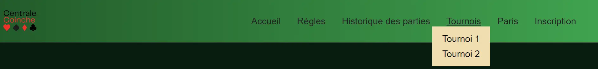
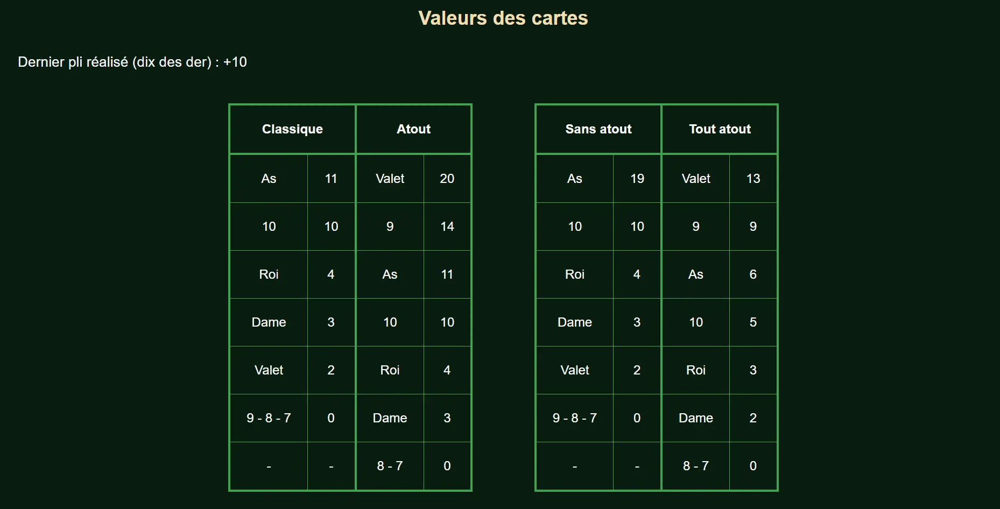
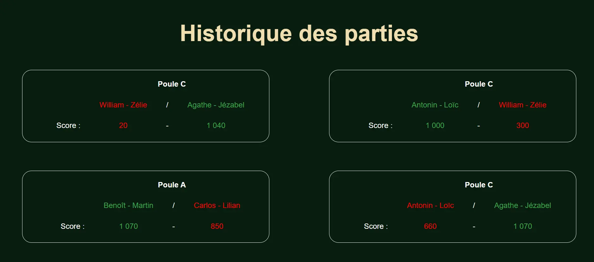
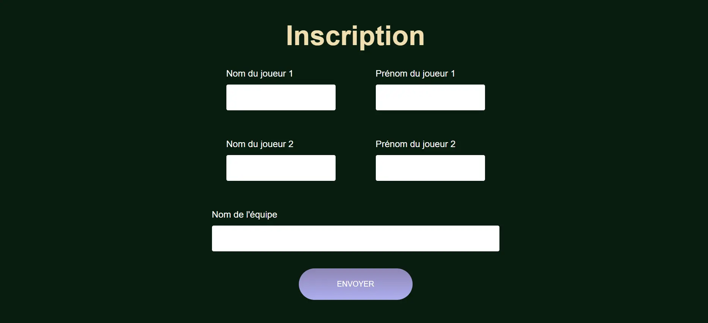

Je n'ai jamais pratiqué le developpement Web je cherche donc à travers ce POK à : 
- Apprendre les bases du HTML
- Apprendre les base du CSS
- Les mettre en pratique en codant mon premier site
- Aider mes confrères centraliens fan de Coinche

L'ensemble de mon code est disponible sur mon GitHub [ici](https://github.com/NicolasOuzoulias/Centrale-Coinche).

## Sommaire

I. Le Front pour les nuls

II. Mon petit site Web à moi : Centrale Coinche

III. Prochaines avancées

IV. Conclusion

## I. Le Front pour les nuls

Tout d'abord pourquoi deux langages séparés et pas un seul ? 
Les deux fonctionnent de paire, le HTML permet de créer et de structurer le contenu tandis que le CSS s'occupe de la mise en forme visuelle. 

Le développement Web est divisé en 2 parties : 
- Le **front** : c'est la partie apparente du site (l'interface, les boutons, les menus, ...), c'est le lien direct avec l'utilisateur
- Le **back** : c'est les composantes cachées du site (les bases de données, les serveurs, l'infrastructure,...)

### Le HTML 

**Exemple de code HTML** 
```html 
<!DOCTYPE html>  <!--Indispensable en début de code car indique qu'il s'agit d'une page HTML-->
<html lang="fr">

<head>
    <meta charset="utf-8"> <!--Pour afficher les caractères spéciaux-->
    <title> Ceci est un titre </title>
</head>

<body>
    <!-- Le corps du site -->
     <!-- Balise orpheline -->
</body>

</html>
```
Il existe ensuite de multiples **balises** pour organiser le texte et insérer des éléments comme par exemple : 
- `<p></p>`  pour les paragraphes
- `<br>` pour les sauts de ligne
- `<h1></h1>` jusqu'à 6 pour les niveaux de titres
- `` pour insérer une image
- `<a>` pour les liens web
- `<ul></ul>` et `<ol></ol>` pour lister en mettant `<li> </li>` à chaque élément

### Le CSS

 Le CSS étant un complément au HTML, il faut demander à ce dernier de l'appeler, pour cela on rentre la commande :

``` html
<head> <!-- Cela doit obligatoirement dans <head> -->
  <link href="style.css" rel="stylesheet">
</head>
```

Ce langage permet de rendre plus esthétique un code HTML en modifiant de multiples paramètres visuels des balises comme la couleur, la taille, la disposition, ... 

``` css
p,
li {
  font-size: 1.1em;
  color: #f9f8ff;
  margin-bottom: 20px;
  text-align: justify;
  line-height: 1.2;
}
```

Ici par exemple je modifie la taille et la couleur de la police, la marge inférieure et l'interligne des balises `<p>` et `<li>`.

## II. Mon petit site Web à moi : Centrale Coinche

Centrale est actuellement le lieu d'un tournoi déchainé de Coinche entre une cinquantaine d'étudiants, n'étant pas spécialement un grand fan du jeu j'ai tout de même décidé de profiter de ce POK pour réaliser un site servant à regrouper les informations utiles pour ce tournoi. 

### Fonctionnalités du site

L'idée du site m'est venu en parlant avec mes amis coincheurs de paris sur les prochains matchs du tournoi à venir. Je me suis alors dit que je pouvais orienter mon site pour le POK autours de cette idée de créer un système de **paris sportifs** de coinche centralienne.

En plus de l'objectif de paris sportifs, le site doit servir de référence pour suivre **l'avancé du tournoi en cours**, visualiser **les règles** et les **résultats** des précédents tournois ou encore pour **s'inscrire**.

### Structure du site

Mon site est organisé avec plusieurs onglets afin de classer les diverses informations. Le `<header> </header>` permet d'afficher les liens de navigation entre les différentes pages. 




``` html
    <header> 
        <nav> 
            
            <div>
                <a href="index.html">Accueil</a>
                <a href="regles.html">Règles</a>
                <a href="histo.html">Historique des parties</a>
                <div class="develop">
                    <a href="tournois.html">Tournois</a>
                    <div class="sous-menu">
                        <a href="tournoi1.html">Tournoi 1</a>
                        <a href="tournoi2.html">Tournoi 2</a>
                    </div>
                <a href="paris.html">Paris</a>
                <a href="inscription.html">Inscription</a>
            </div>
        </nav>
    </header>
```



``` css
nav{
    background: linear-gradient(to left, #0da352, #0b5b2c);
    display: flex;
    flex-direction: row;
    align-items: center;
    justify-content: space-between;
    padding-right: 50px;
}

nav a{
    margin-left: 30px;
    font-size: larger;
}

header{
    border-bottom: 1px solid black;
    margin-bottom: 10px;
}

a:hover {
    text-decoration: underline;
  }

.develop {
  display: inline-block;
  position: relative;
}

.sous-menu {
  position: absolute;
  width: 40%;
  align-items: center;
  background-color: wheat;
  padding-top: 10px;
  padding-bottom: 10px;

  display: none;
}

.sous-menu a {
  display: block;
  text-decoration: none;
  color: black;
  margin: auto;

  padding: 5px;
  text-align: center;
}

.sous-menu a:hover{
  text-decoration: underline;
}

.develop:hover .sous-menu {
  display: block;
}
```





Le pied de page quant à lui sert de zone de contact pour l'utilisateur. 


```html
    <footer>
        <div class="footer-contenu"> 
            <div class="gauche">
                <h3>Contact site : </h3>
                <ul>
                    <li> Nicolas Ouzoulias</li>
                    <li> nicolas.ouzoulias@centrale-marseille.fr </li>
                    <a href="https://www.facebook.com/nicolas.ouzoulias/"> 
                            </a>
                </ul>
            </div>

            <div class="droite">
                <h3>Contact tournoi : </h3>
                <ul>
                    <li> Guillaume Villard</li>
                    <li> guillaume.villard@centrale-marseille.fr </li>
                    <a href="https://www.facebook.com/guillaume.villard17"> 
                            </a>
            </div>
        </div>
    </footer>
```



``` css
footer{
    background: linear-gradient(to left, #0da352, #0b5b2c);
    display: flex;
    flex-direction: row;
    align-items: center;
    justify-content: space-between;
    padding-right: 50px;

.footer-contenu{
  padding-top: 10px;
    display: flex;
    gap: 50px;
    flex-direction: row;
    justify-content: space-between;
    margin-left: 30px;
}

footer p, footer li{
  margin-bottom: 0px;
}

}
```



### Pages de présentation

Les pages d'accueil, d'explication des règles et d'historique des parties sont des pages d'affichage uniquement. A travers ces dernières j'ai pu utiliser diverses balises HTML et apprendre à les manipuler en CSS pour afficher correctement ce que je souhaite.

Par exemple dans l'onglet "Règles" je présente tout d'abord quelques règles d'une partie avant de faire un rappel des différentes valeurs des cartes sous forme de tableau.



``` html
<section class="valeurs">
            <h2>Valeurs des cartes</h2>
            <p> Dernier pli réalisé (dix des der) : +10 </p>
            <section class="tableaux">
                <table>
                    <thead>
                        <th colspan="2">Classique</th>
                        <th colspan="2">Atout</th>
                    </thead>
                    <tr>
                        <td>As</td>
                        <td>11</td>
                        <td class="middle">Valet</td>
                        <td>20</td>
                    </tr>
                    <tr>
                        <td>10</td>
                        <td>10</td>
                        <td class="middle">9</td>
                        <td>14</td>
                    </tr>
                    <tr>
                        <td>Roi</td>
                        <td>4</td>
                        <td class="middle">As</td>
                        <td>11</td>
                    </tr>
                    <tr>
                        <td>Dame</td>
                        <td>3</td>
                        <td class="middle">10</td>
                        <td>10</td>
                    </tr>
                    <tr>
                        <td>Valet</td>
                        <td>2</td>
                        <td class="middle">Roi</td>
                        <td>4</td>
                    </tr>
                    <tr>
                        <td>9 - 8 - 7</td>
                        <td>0</td>
                        <td class="middle">Dame</td>
                        <td>3</td>
                    </tr>
                    <tr>
                        <td>-</td>
                        <td>-</td>
                        <td class="middle">8 - 7</td>
                        <td>0</td>
                    </tr>
    
                </table>
    
                <table>
                    <thead>
                        <th colspan="2">Sans atout</th>
                        <th colspan="2">Tout atout</th>
                    </thead>
                    <tr>
                        <td>As</td>
                        <td>19</td>
                        <td class="middle">Valet</td>
                        <td>13</td>
                    </tr>
                    <tr>
                        <td>10</td>
                        <td>10</td>
                        <td class="middle">9</td>
                        <td>9</td>
                    </tr>
                    <tr>
                        <td>Roi</td>
                        <td>4</td>
                        <td class="middle">As</td>
                        <td>6</td>
                    </tr>
                    <tr>
                        <td>Dame</td>
                        <td>3</td>
                        <td class="middle">10</td>
                        <td>5</td>
                    </tr>
                    <tr>
                        <td>Valet</td>
                        <td>2</td>
                        <td class="middle">Roi</td>
                        <td>3</td>
                    </tr>
                    <tr>
                        <td>9 - 8 - 7</td>
                        <td>0</td>
                        <td class="middle">Dame</td>
                        <td>2</td>
                    </tr>
                    <tr>
                        <td>-</td>
                        <td>-</td>
                        <td class="middle">8 - 7</td>
                        <td>0</td>
                    </tr>
                </table>
            </section>
        </section>
```





``` css
.tableaux{
    display: flex;
    width: 60%;
    flex-direction: row;
    align-items: center;
    justify-content: space-around;
    margin: auto;
    margin-bottom: 60px;
}

table, td {
    border: 1px solid #0da352 ;
}

table,th {
    border : 3px solid #0da352;
}

.middle{
    border-left : 3px solid #0da352;
}
```







``` html
<main>
    <h1> Historique des parties</h1>    
    <section class="results">
        <div>
            <div class="recap-match">
                <table>
                    <thead>
                        <th></th>
                        <th colspan="3"> Poule C</th>
                    </thead>
                    <tr>
                        <td> </td>
                        <td class="def"> William - Zélie</td>
                        <td> / </td>    
                        <td class="vic"> Agathe - Jézabel</td>
                    </tr>
                    <tr>
                        <td> Score : </td>
                        <td class="def"> 20 </td>
                        <td> - </td>
                        <td class="vic"> 1 040 </td>
                    </tr>
                </table>
            </div>
            <div class="recap-match">
                <table>
                    <thead>
                        <th></th>
                        <th colspan="3"> Poule D</th>
                    </thead>
                    <tr>
                        <td> </td>
                        <td class="vic"> Antonin - Loïc</td>
                        <td> / </td>
                        <td class="def"> William - Zélie</td>
                    </tr>
                    <tr>
                        <td> Score : </td>
                        <td class="vic"> 1 000 </td>
                        <td> - </td>
                        <td class="def"> 300 </td>
                    </tr>
                </table>
            </div>
        </div>
        <div>
            <div class="recap-match">
                <table>
                    <thead>
                        <th></th>
                        <th colspan="3"> Poule A</th>
                    </thead>
                    <tr>
                        <td> </td>
                        <td class="vic"> Benoît - Martin</td>
                        <td> / </td>
                        <td class="def"> Carlos - Lilian</td>
                    </tr>
                    <tr>
                        <td> Score : </td>
                        <td class="vic"> 1 070 </td>
                        <td> - </td>
                        <td class="def"> 850 </td>
                    </tr>
                </table>
            </div>
            <div class="recap-match">
                <table>
                    <thead>
                        <th></th>
                        <th colspan="3"> Poule C</th>
                    </thead>
                    <tr>
                        <td> </td>
                        <td class="def"> Antonin - Loïc</td>
                        <td> / </td>
                        <td class="vic"> Agathe - Jézabel</td>
                    </tr>
                    <tr>
                        <td> Score : </td>
                        <td class="def"> 660 </td>
                        <td> - </td>
                        <td class="vic"> 1 070 </td>
                    </tr>
                </table>
            </div>
        </div>
    </section>
</main>
```





``` css
.results div{
    display: flex;
    flex-direction: row;
    justify-content: center;
    gap: 10%;
    margin-bottom: 30px;
}

.recap-match{
    border: 1px white solid;
    border-radius: 20px;
    padding-bottom: 20px;
    padding-left: 20px;
    width: 500px;
}

.recap-match p{
    margin-left: 10px;
    margin-top: 10px;
    text-align: center;
}

.vic{
    color: #0da352;
}

.def{
    color: red;
}
```




Ces onglets m'ont permis de bien pratiquer l'utilisation des balises HTML ainsi que leurs paramètres CSS associées. J'ai notamment pu manipuler les *flexboxs* ainsi que les *tables* pour mieux positioner mes éléments sur la pages. 

Ces 2 pages permettent de visualiser rapidement des informations pratiques sur le tournoi comme par exemple les dernières victoires et défaites pour savoir quel équipe est particulièrement bien préparée ou non. 

(*Petit rappel*, le nombre de point nécessaire pour la victoire est de 1 000 points, cela permet de bien comprendre l'état de forme de l'équipe de William par exemple)

### Page d'inscription

En plus de cela je souhaite que mon site serve de lieu d'inscription pour les futurs tournois, j'utilise pour cela des balises `<input>`.



```html
<section class="formulaire">
            <h1>Inscription</h1>
            <form method="get" action="">
                <div class="form-noms">
                    <div class="form-column">
                        <label for="nom1">Nom du joueur 1</label>
                        <input type="text" name="nom1" id="nom1">
                    </div>
                    <div class="form-column">
                        <label for="prenom1">Prénom du joueur 1</label>
                        <input type="text" name="prenom1" id="prenom1">
                    </div>
                </div>
                <div class="form-noms">
                    <div class="form-column">
                        <label for="nom2">Nom du joueur 2</label>
                        <input type="text" name="nom1" id="nom1">
                    </div>
                    <div class="form-column">
                        <label for="prenom2">Prénom du joueur 2</label>
                        <input type="text" name="prenom2" id="prenom2">
                    </div>
                </div>
                    <label for="nom-equipe"> Nom de l'équipe </label>
                    <input type="text" name="nom-equipe" id="nom-equipe">
                    <input type="submit" value="ENVOYER" class="cta" />
            </form>
        </section>
```




```css
h1{
    padding-top: 30px;
}

form {
    display: flex;
    flex-direction: column;
    width: 40%;
    margin: auto;
    color: white;
    margin-bottom: 50px;
  }
  
  .form-noms {
    display: flex;
    flex-direction: row;
    gap: 20px;
  }
  
  .form-column {
    display: flex;
    flex-direction: column;
    margin: auto;
    margin-bottom: 50px;

  }
  
  input,
  textarea {
    padding: 15px;
    border-radius: 3px;
    border: none;
  }
  
  label {
    margin-bottom: 10px;
  }
  
  input[type='submit'] {
    width: 200px;
    margin: auto;
    margin-top: 30px;
  }
  
  .cta {
    display: inline-block;
    background: linear-gradient(#8e86b5, #acaeed);
    color: white;
    border-radius: 50px;
    padding: 20px 30px;
  }

  .cta:hover {
    background: linear-gradient(#696484, #8788ba);
    text-decoration: none;
  }
```





## III. Prochaines avancées

N'ayant initialement aucune connaissance en développement web je n'ai eu le temps de faire que du *front* lors de ce premier POK de l'année. En effet parmi les 20h de ce dernier, de nombreuses ont été utiles pour apprendre le fonctionnement des deux langages ainsi que la multitude de fonctionnalités.

L'objectif principal de faire un site de paris de coinche n'a pas pu être abouti mais je pense me pencher dessus pour le prochain POK afin de manipuler le *back* du site. 

Je souhaite également mettre en place un système de mise à jour automatique de l'historique des parties ainsi que de finir l'inscription et l'onglet pour récapituler les avancées des tournois. 

## IV. Conclusion

J'ai beaucoup aimé découvrir le développement Front à travers ce POK même si cela a été un peu chaotique et long au début car je n'avais vraiment aucune notion et j'étais donc très lent pour la prise en main des langages. 

Une fois ces derniers un peu plus maîtrisés, la réalisation de mon premier site Web s'est très bien passé et j'ai pu testé de nombreuses fonctionnalités HTML et CSS. 

Je n'ai pas pu incorporer les fonctionnalités principales que je souhaitais au départ par manque de temps et car c'est finalement sur tout le Back du site qu'il faut travailler pour cela, mais je pense orienter mon deuxième POK pour effectuer cela. 

### Sources 

- *Créez votre site web avec HTML5 et CSS3.* OpenClassrooms. https://openclassrooms.com/fr/courses/1603881-creez-votre-site-web-avec-html5-et-css3