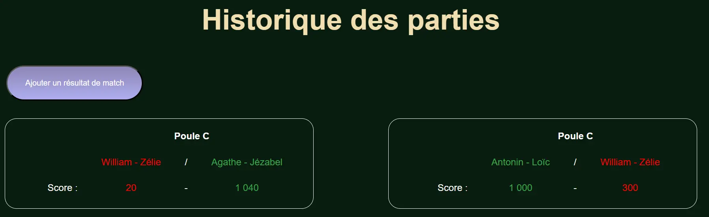
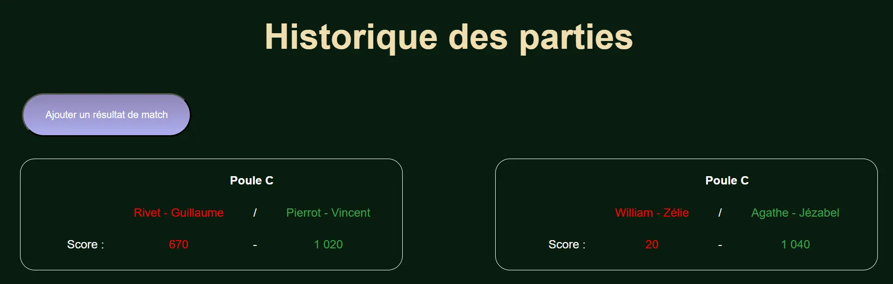

## Objectifs

Suite à mon premier POK de l'année qui avait pour objectif initial de réaliser un site de paris sportif pour le tournoi de coinche à Centrale, je me suis confronté à un mur : créer un site internet prend plus de temps que prévu pour un novice comme moi. 

Lors du premier POK j'ai donc uniquement eu le temps de réaliser la partie Front de Centrale Coinche. Ce second POK va donc me permettre de réaliser le Back du site. Pour cela mon premier MON du temps 2 va me permette de plonger dans la théorie de Node.js et de Express. 

### Sprint 1

Réaliser une page du site pour permettre au participant du tournoi de rentrer les résultats de ses matchs (victoire/défaite, score, adversaires) et faire en sorte que l'historique et le suivi du tournoi se mettent à jour automatiquement

### Sprint 2

Réaliser une page pour les paris sportifs si le sprint 1 s'est déroulé sans accroc.

## Premier Sprint 

- Reprise de quelques éléments de Front 
- Rajout d'un bouton et d'une page pour ajouter des résultats
- Structure de la base de données en JS et JSON pour automatiser la mise à jour du site 




### Prochaines fonctionnalités pour le site

- Travailler le côté serveur pour que les mises à jour apportées par l'utilisateur restent
- Système de connexion
- Système de paris sportifs
- Continuer et finir l'affichage des résultats (notamment les phases finales)

**Objectifs sprint deux :**
- Finir la mise à jour des pages de résultats après l'ajout d'un match par l'utilisateur (*environ 1h*)  
- Côté serveur avec Node.js (*sûrement 7h*)
- Continuer et finir l'affichage des résultats (notamment les phases finales) (*environ 2h*)

## Sprint 2 

Le second sprint du POK s'est déroulé bien plus difficilement que ce qui était attendu. Une bonne partie de ce que j'avais fait au temps 1 ne fonctionnait finalement pas suffisament bien et j'ai donc dû quasiment tout reprendre à 0. 

### Initialisation du back

Pour bien démarrer le **backend** il faut bien l'initialiser. Comme je n'ai suivi que des tutos guidés pour mon [MON 2.2](../../mon/temps-2.2/index.md) et que je ne l'ai jamais fait totalement moi même je me suis un peu perdu dans toute la syntaxe et le système de routes etc... 

```js
const http = require('http')
const app = require('./app')

const port = 4000;

const server = http.createServer((req, res) => {
    res.end('Réponse du serveur')
});

server.listen(port)
```

### Ajout des match

Mon form initial a tout d'abord été repris pour véritablement bien fonctionner avec le back. 


```html
 <form method="post" action="/ajouter-resultat">
            <div class="form-noms">
                <div class="form-column">
                    <h3> Equipe 1 </h3>
                </div>
                <div class="form-column">
                    <label for="nom11">Joueur 1</label>
                    <input type="text" name="nom11" id="nom11">
                </div>
                <div class="form-column">
                    <label for="nom12">Joueur 2</label>
                    <input type="text" name="nom12" id="nom12">
                </div>
                <div class="form-column">
                    <label for="score1">Score</label>
                    <input type="text" name="Score1" id="score1">
                </div>
            </div>
            <div class="form-noms">
                <div class="form-column">
                    <h3> Equipe 2 </h3>
                </div>
                <div class="form-column">
                    <label for="nom21">Joueur 1</label>
                    <input type="text" name="nom21" id="nom21">
                </div>
                <div class="form-column">
                    <label for="nom22">Joueur 2</label>
                    <input type="text" name="nom22" id="nom22">
                </div>
                <div class="form-column">
                    <label for="score2">Score</label>
                    <input type="text" name="Score2" id="score2">
                </div>
            </div>

                <input type="submit" value="ENVOYER" class="cta" />
        </form>
```

Une fois le form bien créé il faut pouvoir récupérer les données : 

```js
const express = require('express')
const mongoose = require('mongoose')
const Match = require('./models/match')

app.post('/ajouter-resultat', (req, res) => {
    //Récupération des données du formulaire
      const { nom11, nom12, Score1, nom21, nom22, Score2 } = req.body

    //Création d'un match
      const nouveauMatch = new Match({
        equipe1: { joueur1: nom11, joueur2: nom12 },
        equipe2: { joueur1: nom21, joueur2: nom22 },
        score: { equipe1: parseInt(Score1), equipe2: parseInt(Score2) }
    })
 try {
        // Sauvegarde du nouveau match dans la base de données
        const resultat = await nouveauMatch.save();
        console.log('Résultat ajouté avec succès:', resultat);

        res.send('Résultat ajouté avec succès !');
    } catch (error) {
        console.error("Erreur lors de l'ajout du résultat:", error);
        res.status(500).send("Erreur lors de l'ajout du résultat");
    }
})
```

Ces dernières sont basées sur un model MongoDB qui me sert de base de données.

```js
const mongoose = require('mongoose')

const matchSchema = mongoose.Schema({
    equipe1: {
        joueur1: String,
        joueur2: String
    },
    equipe2: {
        joueur1: String,
        joueur2: String
    },
    score: {
        equipe1: Number,
        equipe2: Number
    },
})

const Match = mongoose.model('Match', matchSchema);

module.exports = Match;

```

Une fois dans la base de donnée il est possible de modifier la page `histo.html` pour afficher les nouveaux résultats.




## Conclusion

Ce POK a été extrêmement chaotique et compliqué pour moi, j'ai eu énormément de mal a bien appréhender toutes les notions techniques du back et surtout le lien avec le front. 

Je devais faire bien plus que le peu que j'ai réussi à réaliser car cela s'est avéré bien plus difficile. Je n'ai réussi qu'à mettre en place l'ajout de partie par les utilisateur sans pouvoir commencer mon système de paris sportif. 

Une des raisons à cela est mon manque de pratique et d'efficacité en JavaScript ainsi que le fait que mon premier sprint n'a quasiment servi à rien car j'ai dû presque tout reprendre à 0. J'avais commencé à programmer des scripts pour créer les matchs et mettre à jour ma page `histo.html` mais l'ajout de la base de donnée, du serveur Node et de l'application Express a finalement tout changé. 

L'expérience m'a néanmoins appris beaucoup de chose. Là où les MON m'ont fait découvrir la théorie ainsi que quelques exemples, ce POK m'a fait un peu plus comprendre le fonctionnement global d'un site avec le backend. 

Au moins je sais maintenant que le développement Web ce n'est pas totalement fait pour moi. 