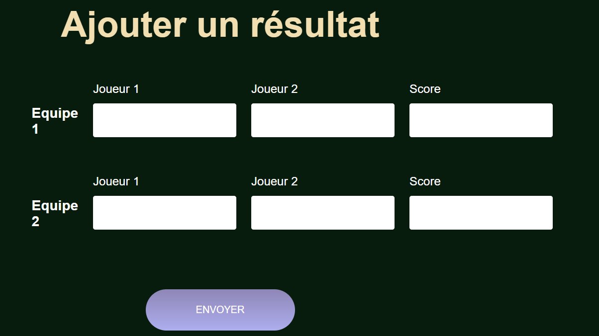

## Objectifs

Suite à mon premier POK de l'année qui avait pour objectif initial de réaliser un site de paris sportif pour le tournoi de coinche à Centrale, je me suis confronté à un mur : créer un site internet prend plus de temps que prévu pour un novice comme moi. 

Lors du premier POK j'ai donc uniquement eu le temps de réaliser la partie Front de Centrale Coinche. Ce second POK va donc me permettre de réaliser le Back du site. Pour cela mon premier MON du temps 2 va me permette de plonger dans la théorie de Node.js et de Express. 

### Sprint 1

Réaliser une page du site pour permettre au participant du tournoi de rentrer les résultats de ses matchs (victoire/défaite, score, adversaires) et faire en sorte que l'historique et le suivi du tournoi se mettent à jour automatiquement

### Sprint 2

Réaliser une page pour les paris sportifs si le sprint 1 s'est déroulé sans accroc.

## Premier Sprint 

- Reprise de quelques éléments de Front 
- Rajout d'un bouton et d'une page pour ajouter des résultats
- Structure de la base de données en JS et JSON pour automatiser la mise à jour du site 

### Prochaines missions 

- Travailler le côté serveur pour que les mises à jour apportées par l'utilisateur restent
- Système de connexion
- Système de paris sportifs
- Continuer et finir l'affichage des résultats (notamment les phases finales)