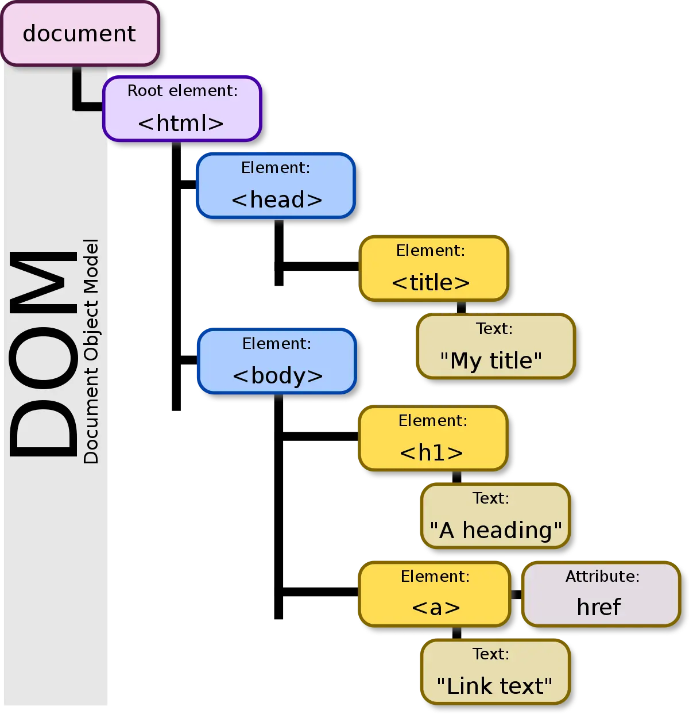
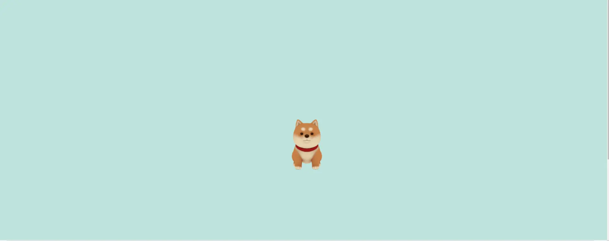


**Notions abordées** : HTML, CSS, Javascript, Three.js
**Niveau** : Débutant


## Mes objectifs

Mes objectifs pour ce MON sont :

* Reprendre en main les fondamentaux d'HTML et CSS
* Comprendre comment le javascript intéragit avec le code HTML pour rendre un site dynamique
* Me former à Three.js, une bibliothèque javascript pour ajouter des modèles 3d à notre site web
* Aller plus loin avec des animations

## Les fondamentaux d'HTML et CSS

Pour me remettre à niveau avec ces langages, j'ai suivi, comme beaucoup d'entre nous, le tutoriel [Créez votre site web avec HTML5 et CSS3](https://openclassrooms.com/fr/courses/1603881-creez-votre-site-web-avec-html5-et-css3) sur OpenClassroom.
Ce tutoriel traîte dans les grandes lignes de :
* Organisation de sa page HTML (texte, bloc, image)
* Appliquer un style à ses balises
* L'affichage Grid et Flexbox
* Quelques fonctionnalités en plus  (ajout d'un formulaire, ajout d'un bouton)

Comme j'avais déjà quelques notions en HTML/CSS, j'ai plutôt survolé ce tutoriel pour me concentrer sur d'autres aspects que je ne connaissais pas. 

## Ajouter du JavaScipt

Pour mon [POK 1](../../pok/temps-1/), j'avais besoin de comprendre comment fonctionnait les scripts Javascript.
Pour ce faire, j'ai suivi la première partie du tutoriel [Créez des pages web dynamiques avec JavaScript](https://openclassrooms.com/fr/courses/7697016-creez-des-pages-web-dynamiques-avec-javascript). 
L'objectif de ce tutoriel est de nous apprendre à rendre une page web dynamique en accédant à des données se trouvant dans des fichiers JSON.

Un fichier JSON (JavaScript Object Notation) est un format de données utilisé pour stocker et échanger des informations structurées entre des systèmes informatiques. t

L'objectif de la première partie de ce tutoriel est de modifier la structure HTML de notre projet pour y afficher différents produits. Ce tutoriel est une bonne introduction pour appréhender une notion importante en Javascript : **Le DOM**.

Le DOM (Document Object Model) est une façon pour les navigateurs web de représenter une page web. Il organise la page en une structure d'arbre, où chaque élément de la page (comme du texte, des images, des boutons) est un nœud dans cet arbre.

Pour plus d'information sur le DOM, vous pouvez visiter ce [site](https://la-cascade.io/articles/le-dom-cest-quoi-exactement) 

## Three.js

Il y a une fonctionnalité que je voulais implémenter dans mon [POK 1](../../pok/temps-1/) qui me tenait à coeur : La visualisation de modèle 3D.
J'ai donc utilisé le temps du MON pour me former sur Three.js


Three.js est une bibliothèque JavaScript qui permet de créer facilement des graphiques 3D interactifs dans un sites web. Elle simplifie la création d'objets 3D, de scènes et d'animations, ce qui rend la programmation 3D plus accessible même pour ceux qui ne sont pas des experts en graphisme ou en programmation 3D.


Pour commencer à utiliser Three.js, j'ai tout simplement suivi la [documentation](https://threejs.org/docs/index.html#manual/en/introduction/Creating-a-scene).
Pour l'insatallation de cette bibliothèque, il faut faire attention d'avoir un environnement de developpement adapté. La documentation conseille d'utiliser **vite** pour notre projet.
Après quelques lignes de code, on peut arriver rapidement à manipuler des objets 3D dans un site web.

Pour comprendre le fonctionnement de cette bibliothèque, ce [site](https://gayerie.dev/docs/js/threejs/objets_et_scene.html) est intêressant. Il explique comment manipuler un objet dans une scène. On peut apprendre comment déplacer un objet dans l'espace et comment creer des animations simples.

Je voulais ensuite importer des modèles 3D. Pour cela, j'ai suivi un [tutoriel Youtube](https://www.youtube.com/watch?v=WBe3xrV4CPM&t=233s). 
Cela m'a permis d'importer un petit chien sur un site web :

## Aller plus loin avec des animations

Pour aller plus loin avec CSS et HTML, je voulais me concentrer sur la gestion des animations avec CSS. Je me suis dit que la meilleure solution était d'étudier un code existant pour comprendre les différentes mécaniques. Pour cela, j'ai utilisé le site [Code Pen](https://codepen.io) qui est un site de partage de code accès sur le developpement web. J'ai donc essayé de comprendre cette [animation](https://codepen.io/lamchang/pen/PQGQyR) qui me semblait assez complète. On y apprend comment transformer un style quand la souris passe sur un élement, comment déplacer des élements, zoomer, changer la couleur ...

## Conclusion

Ce MON a été pour moi l'occasion d'explorer différents aspects du développement Front-end. Je me suis beaucoup attardé sur la manipulation de la bibliothèque Three.js. En effet, j'ai été surpris de voir la simplicité d'utilisation de cette bibliothèque pour réaliser des choses qui semblent compliquées.